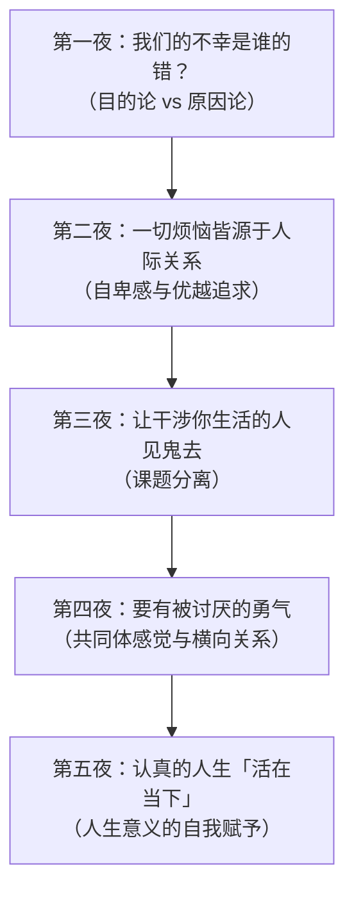
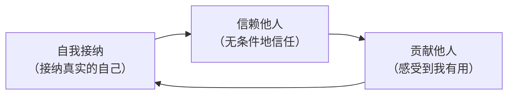

# 《被讨厌的勇气》深度拆解

## 一、学科坐标定位（400字）

《被讨厌的勇气》（日文原名：嫌われる勇気）是日本哲学家岸见一郎与自由撰稿人古贺史健于2013年合著的对话体心理学通俗读物。本书以"青年与哲人的对话"为叙事形式，系统阐释了阿尔弗雷德·阿德勒（Alfred Adler）的个体心理学（Individual Psychology）核心思想。

在心理学的学科版图中，阿德勒与弗洛伊德、荣格并称为==心理学三大巨头==。但三者的路径截然不同：弗洛伊德聚焦于过去的创伤与潜意识驱力，荣格探索集体无意识与原型，而阿德勒则将目光投向==目的论==——你现在的行为不是被过去决定的，而是由你当下选择的目的所驱动的。这个分野是理解本书的第一把钥匙。

本书在学科中的坐标可以这样定位：它不是一本严格的学术著作，而是一部==将阿德勒心理学核心命题进行哲学化重述==的作品。它的独特价值在于，将阿德勒散落在多部著作中的思想——自卑与超越、生活风格、共同体感觉、课题分离——整合为一套具有内在逻辑的完整体系，并通过苏格拉底式的对话让读者身临其境地经历认知冲击。

与[[《梦的解析》]]中弗洛伊德对潜意识的深度挖掘不同，阿德勒心理学更关注"此刻你可以做什么"。与[[《思考，快与慢》]]关注认知偏差的路径也有本质区别——本书不是在描述人类认知的系统性错误，而是在提供一套==重新定义人生意义==的哲学框架。

## 二、理论框架地图（500字）

全书以五个夜晚的对话为结构，层层递进，构成一个完整的思想闭环：

**核心命题**：你之所以不幸福，不是因为过去发生了什么，不是因为环境如何，不是因为别人怎么对你——而是因为==你自己选择了不幸福==。这个选择的深层动力是：你害怕被讨厌、害怕被否定、害怕在人际关系中受伤。阿德勒心理学的解药是：通过课题分离划清自己与他人的边界，通过共同体感觉找到归属，通过"此时此刻"的认真活法，不再将人生视为一条通往某个终点的线，而是视为==一连串完整的刹那==。

> [!abstract] 五夜逻辑链
> 第一夜打破"我是受害者"的叙事 → 第二夜揭示烦恼的真正源头是人际关系 → 第三夜给出核心工具"课题分离" → 第四夜构建积极的人际关系新模型 → 第五夜重新定义何为幸福的人生。每一夜都在回答青年的反驳，形成螺旋式上升的认知突破。

## 三、逐章深度拆解（5000字）

### 第一夜：「我们的不幸是谁的错？——目的论的根本颠覆」

> [!abstract] 这一夜的核心任务：彻底动摇你"过去决定现在"的信念

**【核心论点】**

这一夜的对话围绕一个根本性的哲学分歧展开：==原因论与目的论==。青年坚信人是被过去的经历所决定的——如果一个人童年遭受创伤，那他现在的不幸就是那段创伤的必然结果。哲人则提出阿德勒的目的论：你不是因为过去的经历而变成了现在的样子，而是你==先选择了一个目的==，然后为这个目的去寻找或制造"原因"。

**【详细拆解】**

哲人举了一个关键案例：一位年轻人多年足不出户、闭门不出。按照原因论的解释，是因为他过去遭受了某种伤害，所以产生了恐惧和焦虑，因而无法外出。但阿德勒的目的论换了一个方向来看：这个年轻人是==先有了"不出门"这个目的==——因为不出门可以获得父母的关注和担心，可以避免在外面的世界中遭遇挫败——然后他的身体"配合"地产生了不安和恐惧的情绪。换句话说，不安和恐惧不是原因，而是==手段==。

这个翻转极其激进。它意味着：你此刻的所有情绪状态——焦虑、愤怒、悲伤——都不是简单地"发生在你身上"的事情，而是你为了达到某个目的而（无意识地）"制造"出来的。

书中还讨论了"愤怒"的例子。哲人提到：如果你正在对孩子大发雷霆，这时电话突然响了，你接起电话后语气立刻变得礼貌平和。这说明什么？说明愤怒不是一种不可控的爆发，而是一种==你可以收放自如的工具==。你对孩子发怒，不是因为你"控制不住"，而是因为你选择用愤怒来让对方服从。

> [!warning] 这里需要注意
> 目的论并不否认过去经历的"存在"，它否认的是过去经历对你的"决定权"。阿德勒承认经历是真实的，但他认为==你赋予经历什么意义==才是关键。同一段痛苦的经历，一个人可以将其解读为"我因此变得更坚强"，另一个人可以将其解读为"我因此被毁掉了"。决定你命运的不是经历本身，而是你对经历的解读方式。

**【费曼式解读】**

想象你的人生是一部电影。原因论认为剧本在你出生时就写好了——你只是在按剧本演。但目的论说：不，你是这部电影的==导演==，剧本是你一边拍一边写的。你之所以觉得自己在"按剧本演"，是因为承认自己是导演意味着你必须为所有糟糕的情节负责——这比当一个"受害者"要可怕得多。

**【DIKW四层提炼】**

> [!tip] DIKW金字塔映射
> - **Data（数据）**：闭门不出的年轻人案例；接电话时愤怒瞬间消失的现象
> - **Information（信息）**：情绪和行为可以被目的所驱动，而非仅由过去原因所决定
> - **Knowledge（知识）**：目的论——人的行为服务于当下的目的，过去的经历只是被选择性地用来支撑这个目的
> - **Wisdom（智慧）**：当你感到"我无法改变"时，问自己：我从"无法改变"中获得了什么好处？那个好处就是你真正的目的

**【反脆弱验证】**

目的论在极端情境中是否成立？对于严重的精神疾病或PTSD，纯粹的目的论解释可能过于简化——这是本书需要批判性看待的地方。但对于日常生活中的大部分"我做不到""我改不了"的叙事，目的论是一个极其有力的破框工具。它的反脆弱特性在于：==越是在你感到无力的时刻，它越是能提供重新掌控的可能性==。

---

### 第二夜：「一切烦恼皆源于人际关系——自卑感的正体」

> [!abstract] 这一夜的核心任务：看清自卑感的双面性

**【核心论点】**

阿德勒提出一个大胆命题：==一切烦恼都是人际关系的烦恼==。如果这个宇宙中只有你一个人，你不会有任何烦恼。你的自卑、你的焦虑、你的愤怒，全部是在与他人的比较和关系中产生的。

**【详细拆解】**

阿德勒区分了两个容易混淆的概念：==自卑感==（Minderwertigkeitsgefuhl）和==自卑情结==（Minderwertigkeitskomplex）。自卑感本身是中性的、甚至是健康的——每个人都有"我还不够好"的感觉，而这种感觉可以成为你努力成长的动力。阿德勒本人身体矮小、童年多病，但他将这种自卑感转化为了学术上的卓越追求。

但当自卑感被当作借口使用时，它就异化为了==自卑情结==。"我因为学历低所以不能成功"——这不是单纯的自卑感，而是你在用自卑作为不去行动的挡箭牌。自卑情结的本质是一种==因果关系的虚假建构==：你把一个现实条件（学历低）当作了必然导致失败的原因，从而免除了自己尝试和冒险的责任。

与自卑情结相对的是==优越情结==（Uberlegenheitskomplex）。有些人通过炫耀权力、学历、财富、人脉来表现自己的"优越"，但阿德勒指出，这种过度的优越表现恰恰暴露了深层的自卑——真正自信的人不需要通过贬低他人来确认自己的价值。

书中还讨论了一个重要观点：人的烦恼归根结底可以追溯到"在人际关系中害怕被否定"。你不敢发言，是因为害怕被嘲笑；你不敢追求目标，是因为害怕失败后被看不起；你不敢做真实的自己，是因为害怕被排斥。

**【费曼式解读】**

自卑感就像汽车的引擎警告灯——它亮了，说明有地方需要你关注和改进，这是有用的信号。但如果你把警告灯当作"这辆车报废了"的证据，直接把车停到路边不开了，那就是自卑情结。灯亮了不代表车坏了，它只是在提醒你该做点什么。

**【DIKW四层提炼】**

> [!tip] DIKW金字塔映射
> - **Data（数据）**：自卑感、自卑情结、优越情结三个概念的区分
> - **Information（信息）**：自卑感是动力，自卑情结是借口，优越情结是面具
> - **Knowledge（知识）**：一切烦恼的根源是人际关系中的比较与恐惧
> - **Wisdom（智慧）**：当你发现自己在说"因为A所以我不能B"时，检查一下——A真的是原因，还是你在用A来逃避B？

**【反脆弱验证】**

"一切烦恼皆源于人际关系"这个命题是否过于绝对？独处时的存在焦虑算不算烦恼？严格来说，阿德勒的论证框架认为，即使是独处时的焦虑，其根源也可以追溯到某种人际关系的投射——你担心自己在社会中的位置、担心没人在乎你。这个论证有相当的说服力，但在面对纯粹的存在主义焦虑时，它的解释力可能到达边界。

---

### 第三夜：「让干涉你生活的人见鬼去——课题分离」

> [!abstract] 这一夜提供了全书最具操作性的核心工具

**【核心论点】**

阿德勒心理学中最具实践性的概念登场了：==课题分离==。判断某件事是谁的课题，只需要一个标准——==这件事的最终后果由谁来承受==？如果后果由你承受，那就是你的课题；如果后果由别人承受，那就是别人的课题。而阿德勒的核心主张是：==不要干涉别人的课题，也不要让别人干涉你的课题==。

**【详细拆解】**

书中最经典的例子是孩子不愿学习的场景。父母认为"让孩子学习"是自己的责任，于是催促、威胁、奖惩。但从课题分离的角度来看：学不学习是==孩子的课题==，因为学习的最终后果——学到知识或者荒废时间——是由孩子自己来承受的。父母可以做的是"把马带到水边"，但不能强迫马喝水。强迫马喝水不仅无效，还会破坏亲子关系。

这并不意味着对孩子放任不管。课题分离不等于冷漠，它意味着在充分表达关心和提供帮助的前提下，==尊重对方的最终选择权==。你可以告诉孩子"如果你需要帮助，我随时都在"，但最终按不按下行动的按钮，是孩子自己的事。

书中哲人进一步指出：人际关系中的绝大部分摩擦，都是因为==课题的越界==。你替别人操心别人的事（干涉别人的课题），或者你把自己的价值感建立在别人的评价上（把自己的课题交给别人）。前者让你变成控制者，后者让你变成讨好者。

关于"被讨厌"的问题，哲人的论述是：别人是否喜欢你，是==别人的课题==。你无法控制别人喜不喜欢你，你也不应该试图去控制。你能做的只是做出你认为正确的选择，然后接受别人可能因此讨厌你的事实。这就是"被讨厌的勇气"的含义——不是故意去惹人厌，而是==不再把"被所有人喜欢"当作人生的目标==。

> [!warning] 常见误读
> 课题分离经常被误读为"别人的死活跟我无关"。但书中明确指出，课题分离是人际关系的==出发点==而非终点。分离课题之后，你还需要建立一种基于信任和尊重的==横向关系==（第四夜的主题）。课题分离是"解毒"，不是"断交"。

**【费曼式解读】**

想象每个人面前都有一条属于自己的跑道。你的跑道上有你要跨越的障碍，别人的跑道上有别人要跨越的障碍。课题分离就是告诉你：==跑好你自己的道，不要跑到别人的跑道上去替人家跨栏==。你可以在旁边加油、提供水壶，但不能替人家跑。同样，你也不应该因为观众席上有人在嘘你就停下来——那些嘘声是观众的课题，你跑步是你的课题。

**【DIKW四层提炼】**

> [!tip] DIKW金字塔映射
> - **Data（数据）**：孩子学习的案例、被讨厌的场景
> - **Information（信息）**：判断课题归属的标准是"最终后果由谁承受"
> - **Knowledge（知识）**：人际痛苦的根源在于课题越界——要么你在干涉别人，要么你在让别人干涉你
> - **Wisdom（智慧）**：在每一次人际冲突中先问一个问题："这到底是谁的课题？"——仅这一个问题就能化解你80%的人际焦虑

**【反脆弱验证】**

课题分离在紧密的亲密关系中（如婚姻、亲子）是否适用？这是它的压力测试。答案是：适用，但需要更细腻的操作。在亲密关系中，课题的边界往往不像工作关系那样清晰。书中并没有对这种灰色地带做充分的讨论，这是读者需要自行延伸思考的地方。但原则不变：即使在最亲密的关系中，==尊重对方作为独立个体的选择权==仍然是健康关系的基石。

---

### 第四夜：「要有被讨厌的勇气——共同体感觉与横向关系」

> [!abstract] 这一夜构建了阿德勒心理学的正面愿景

**【核心论点】**

课题分离告诉你"不做什么"，第四夜则告诉你"做什么"——建立==共同体感觉==（Gemeinschaftsgefuhl）。阿德勒认为，人的幸福感来源于"我对共同体有用"的感受，而这种感受的前提是==将所有人际关系从纵向（上下级）转变为横向（平等）==。

**【详细拆解】**

阿德勒所说的"共同体"范围极其广泛——从家庭、学校、公司，一直扩展到国家、人类、甚至整个宇宙。他认为一个人的心理健康程度，可以通过他的"共同体感觉"的大小来衡量：如果你只关心自己的小家庭，你的共同体感觉就比较狭窄；如果你能将关怀扩展到更大的范围，你的心理就越健康。

但这里有一个关键转折：共同体感觉的建立，前提是==从纵向关系转向横向关系==。什么是纵向关系？就是上下高低之分——我比你优秀，你比他差劲，老板比员工高一等，父母比孩子高一等。阿德勒认为，==一切人际关系本质上都应该是横向的、平等的==。

这里的"平等"不是指能力上的平等——一个大人和一个小孩在能力上当然不平等——而是指==存在的价值上的平等==。每个人，无论能力高低、成就大小，作为一个存在的个体，其价值是平等的。

由此引出了一个重要的实践区分：==表扬与鼓励的区别==。表扬（"你做得真好！"）本质上是纵向关系的产物——只有处于上位的人才会"表扬"下位的人。而鼓励（"谢谢你，这对我很有帮助"）则是横向关系的表达——它承认对方的贡献，而不是从高处给出评价。

书中哲人指出：当你因为不被表扬就不行动时，你已经陷入了一种"赏罚教育"的思维模式。你把自己的行为动力交给了别人的评价——这正是课题分离的反面。

关于"自我接纳"、"信赖他人"和"贡献他人"这三个概念的关系，书中构建了一个闭环：

==自我接纳==不是自我肯定——自我肯定是"我虽然做不到但我告诉自己我能行"，自我接纳是"我承认做不到的事实，然后思考在这个基础上我能做什么"。==信赖他人==是无条件的信任，不附加"如果你背叛我就怎样"的条件。==贡献他人==不是自我牺牲，而是在横向关系中感受到"我的存在对他人有价值"。

**【费曼式解读】**

想象一个乐队。纵向关系的乐队里，指挥是老大，首席小提琴是二把手，打鼓的在最底层。每个人都在想"我要往上爬"或"我不能被看不起"。横向关系的乐队里，每个人都知道：指挥负责统筹，小提琴负责旋律，鼓手负责节奏——==职能不同，但没有谁比谁更重要==。你不需要成为指挥才能感到自己有价值，你只需要把鼓打好，知道这首曲子因为你的节奏而完整。

**【DIKW四层提炼】**

> [!tip] DIKW金字塔映射
> - **Data（数据）**：表扬与鼓励的对比；自我接纳、信赖他人、贡献他人三角关系
> - **Information（信息）**：纵向关系产生竞争与控制，横向关系产生平等与合作
> - **Knowledge（知识）**：共同体感觉是幸福的来源，而它只能在横向关系中生长
> - **Wisdom（智慧）**：在每一段关系中问自己：我现在是在"评价"对方（纵向），还是在"感谢"对方（横向）？

**【反脆弱验证】**

"无条件信赖他人"在现实中是否天真？书中承认，无条件信赖确实可能导致被利用和背叛。但哲人的论证是：如果你因为害怕背叛而设置条件、保持距离，你永远无法建立真正深厚的关系。被背叛是"对方的课题"，你选择信赖是"你的课题"。这个论证逻辑自洽，但确实是全书中最考验读者接受度的观点之一。

---

### 第五夜：「认真的人生"活在当下"——人生的意义」

> [!abstract] 这一夜是全书的终点，也是起点

**【核心论点】**

阿德勒心理学最终指向的核心命题是：==人生没有普遍意义，人生的意义由你自己赋予==。而赋予意义的方式不是设定一个宏大的远方目标然后朝它冲刺，而是==认真地活在每一个当下的刹那==。

**【详细拆解】**

书中用了一个重要的隐喻来区分两种人生观。一种是把人生视为==登山==——你设定一个山顶（目标），然后一步步往上爬，到达山顶才算成功，中途都是"尚未完成"的状态。另一种是把人生视为==跳舞==——跳舞没有终点，你不是为了跳到舞台的某个角落而跳舞，跳舞本身就是目的。每一个舞步都是完整的。

阿德勒倡导的是后者。他认为把人生视为一条通往终点的线（他称之为"实现论"）会带来一个严重的问题：你永远活在"将来时态"中——"等我升职了就幸福了""等我结婚了就幸福了""等我退休了就幸福了"——而当下的每一刻都沦为了通往那个"幸福终点"的工具和牺牲品。

哲人提出了一个替代框架：==刹那主义==。人生是一连串的刹那，每一个刹那都是完结的。你不需要用"未来会怎样"来为"现在做的事"赋予意义。如果你此刻在认真地阅读这段文字，那么这个阅读行为本身就是完整的——它不需要"未来我会因此变得更好"来作为它的正当理由。

关于"人生的意义"这个终极问题，书中给出了阿德勒的回答：==人生没有被给予的普遍意义==。这听起来像虚无主义，但阿德勒的结论恰恰相反——正因为人生没有被预设的意义，你才拥有==自由地赋予它意义的权力==。而阿德勒认为，一个人能够赋予人生的最好的意义就是"对他人的贡献"——不是自我牺牲式的奉献，而是在横向关系中感受到"我的存在对这个共同体有价值"。

书中最后一段对话中，哲人说：==世界很简单，人生也是一样==。这不是说世界没有复杂性和痛苦，而是说——当你停止用过去的创伤来为现在的不行动辩护，当你停止用别人的评价来定义自己的价值，当你认真活在此刻——世界就会呈现出它的简单面貌。

> [!note] 这里值得细品
> "世界很简单"不是一个事实判断，而是一个==视角选择==。阿德勒心理学的全部努力，就是邀请你切换到这个视角——不是因为这个视角"更正确"，而是因为这个视角能让你更自由、更有勇气地生活。

**【费曼式解读】**

很多人把人生当作一次导航——打开地图，设定目的地，然后全程盯着"剩余距离"。你开了五年、十年，不断看"还差多远"，一路上的风景全部被忽略。阿德勒说：把导航关掉。不是说你不能有方向感，而是说==你此刻路过的每一片风景本身就是旅行的全部意义==。你不需要"到达"哪里，因为你已经在路上了。

**【DIKW四层提炼】**

> [!tip] DIKW金字塔映射
> - **Data（数据）**：登山隐喻与跳舞隐喻的对比
> - **Information（信息）**：人生视为"线"会让你永远活在将来，人生视为"点的集合"让你活在当下
> - **Knowledge（知识）**：刹那主义——每一刻都是完结的，人生的意义在每一个认真活过的当下中自行显现
> - **Wisdom（智慧）**：如果此刻你正在做的事情需要"将来的回报"才有意义，那你可能正在浪费此刻

**【反脆弱验证】**

"活在当下"是否与合理的规划矛盾？这是最常见的质疑。严格来说，阿德勒并非反对规划，而是反对将规划变成焦虑的来源。你可以设定方向，但不要让"尚未到达"成为你此刻不快乐的理由。在极端压力下，"活在当下"恰恰展现出反脆弱特性——因为它切断了对过去的反刍和对未来的焦虑，让你把全部能量集中在你唯一能控制的东西：此刻的行动。

---

## 四、认知偏差/效应清单（800字）

本书虽然不以认知偏差为主题，但其讨论直接触及了多种心理学效应和思维陷阱：

| 认知偏差/效应 | 书中对应概念 | 具体表现 | 阿德勒的解法 |
|:---|:---|:---|:---|
| **自我设障（Self-handicapping）** | 自卑情结 | 在行动前先给自己找借口（"我学历低所以不行"），这样失败了就不用面对"能力不足"的真相 | 识别借口背后的目的——你不是"因为不行所以不做"，而是"因为不想做所以说自己不行" |
| **外部归因偏差** | 原因论思维 | 习惯性地将自己的不幸归因于外部因素（原生家庭、社会环境、他人行为） | 目的论的视角转换——即使外部因素真实存在，你仍然拥有选择如何回应的自由 |
| **认同需求（Need for approval）** | 课题未分离 | 将自我价值完全建立在他人的认可和表扬之上 | 课题分离——别人是否认可你是别人的课题 |
| **社会比较效应** | 纵向关系思维 | 不断与他人比较，产生嫉妒或优越感 | 从纵向关系转为横向关系，将竞争替换为合作 |
| **损失厌恶的变体** | 害怕被讨厌 | 宁可放弃真实的自我表达，也不愿承受"被人讨厌"的风险 | 被讨厌的勇气——选择自由就意味着接受不被所有人喜欢 |
| **现状偏见** | "不改变"的目的 | 维持不幸但熟悉的状态，因为改变带来不确定性 | 认识到"不变"本身也是一种选择，你在从"不变"中获得某种安全感 |
| **虚假共识效应** | 对"正常"的执念 | 认为"所有人都应该这样做"，用社会规范来要求自己和他人 | 每个人的人生课题不同，没有统一的"应该" |
| **目标梯度效应的陷阱** | 实现论人生观 | 越接近目标越焦虑，达成目标后感到空虚 | 从实现论转为刹那主义，价值在过程中而非终点 |

> [!note] 一个有趣的观察
> 阿德勒心理学本身可以被视为一种==元认知工具==——它不是在告诉你哪个具体的认知偏差在影响你，而是在一个更根本的层面上告诉你：你感知到的所有"限制"，可能都是你自己为了某个目的而（无意识地）建构出来的。这比识别单个认知偏差更加激进。

## 五、自我诊断工具（500字）

以下是根据本书核心概念设计的自我诊断问题，你可以用它们来检测自己在阿德勒框架下的心理状态：

**第一组：目的论检测**
1. 你最近一次说"我做不到是因为......"是什么时候？那个"因为"后面的内容，是真正的障碍，还是你用来避免行动的借口？
2. 如果那个障碍明天奇迹般地消失了，你是否真的会立刻去做那件事？如果答案是犹豫的，那"障碍"可能不是真正的问题。

**第二组：课题分离检测**
3. 列出你此刻最烦恼的三件事。对每件事问：这件事的最终后果由谁承受？如果不是你，你可能正在干涉别人的课题。
4. 你上一次因为"担心别人怎么看"而放弃了自己真实想法，是什么时候？别人怎么看你，是你的课题还是别人的课题？

**第三组：关系模式检测**
5. 你与最亲近的三个人的关系，是纵向的（有优劣高低之分）还是横向的（平等合作）？
6. 你习惯"表扬"别人还是"感谢"别人？你是否在无意中把自己放在了"评价者"的位置上？

**第四组：人生态度检测**
7. 你现在做的事情，如果永远不会带来任何"回报"（金钱、名声、认可），你还愿意做吗？如果不愿意，你可能正在用"实现论"的方式过日子。
8. 你是否经常有"等到......就好了"的想法？如果是，你可能正在牺牲当下去购买一个不确定的未来。

> [!tip] 使用建议
> 不要试图一次回答所有问题。选择最触动你的一个问题，用至少一周的时间去观察自己的日常行为。观察本身就是改变的开始。

## 六、批判性审视（600字）

任何一本好书都值得被认真质疑。以下是对《被讨厌的勇气》中核心论点的批判性审视：

**1. 目的论的适用边界**

阿德勒的目的论在解释日常心理现象时极其有力，但它对严重心理疾病（如临床抑郁症、创伤后应激障碍、人格障碍等）的适用性存在争议。将所有心理痛苦都归结为"你选择了这种状态"可能对严重精神疾病患者造成二次伤害。书中并没有对这一边界做出充分的讨论。负责任的阅读方式是：目的论是一个强大的思维工具，但它==不能替代专业的心理治疗和医学干预==。

**2. "一切烦恼皆源于人际关系"的全称判断**

这个命题是否过于绝对？对死亡的恐惧、对存在意义的困惑、纯粹的生理性焦虑——这些烦恼是否都能被还原为"人际关系的烦恼"？阿德勒学派的回答是肯定的，但存在主义心理学（如罗洛·梅、欧文·亚隆）可能会提出不同看法。读者不必在两者间二选一，而是可以将阿德勒的视角作为==一个有力的分析透镜==，同时保持对其他维度的开放。

**3. 无条件信赖的现实性**

书中关于"无条件信赖他人"的论述，在逻辑上自洽但在实践中可能存在风险。在特定的文化和社会环境中（比如存在严重的欺骗和利用行为时），无条件信赖可能导致实际的伤害。这里需要区分"原则层面的信赖"和"操作层面的审慎"——你可以在心态上保持对人性的基本信任，同时在具体行动中保持合理的判断力。

**4. 对话体的优势与局限**

苏格拉底式的对话让复杂的概念变得生动易懂，但也意味着许多论证是通过修辞说服力而非严格的逻辑证明来推进的。哲人有时对青年的反驳处理得过于干脆，一些灰色地带被清晰的对话结构所掩盖。读者需要意识到：==被说服和被论证是两回事==。

**5. 文化语境的考量**

本书诞生于日本文化语境，在这个高度重视社会和谐与集体归属的社会中，"被讨厌的勇气"具有特别强烈的解放意义。在个人主义文化更浓厚的社会中，这本书的某些论述的冲击力可能有所不同。

## 七、行动改变指南（500字）

基于全书核心概念，以下是可以立即开始实践的行动指南：

**第一步：目的论觉察练习（第1-2周）**

每当你发现自己说出或想到"我不能......因为......"的句式时，暂停一下，把这个句子翻转成目的论版本："我选择不去......，因为这样做可以让我（避免某种风险/维持某种舒适）。"你不需要立刻改变行为，只需要==看见这个翻转==。看见本身就是改变的起点。

**第二步：课题分离日记（第3-4周）**

每天晚上花五分钟，回顾当天让你感到烦恼或焦虑的一件事。写下两个问题的答案：（1）这件事的最终后果由谁承受？（2）我是否在干涉别人的课题，或者让别人干涉了我的课题？不需要做任何改变，只需要==记录和观察==。

**第三步：从表扬到感谢的转换（第5-6周）**

有意识地将你的语言从"评价性表达"转换为"感谢性表达"。将"你做得真好"替换为"谢谢你，你的帮助对我很重要"。将"你真聪明"替换为"你的这个想法让我学到了很多"。观察这种转换如何影响你与他人的互动质量。

**第四步：刹那主义体验（持续）**

每天选择一件你正在做的事——吃饭、走路、阅读、工作——用十分钟完全投入其中，不去想"这件事的意义是什么""这件事会带来什么回报"。只是==做这件事本身==。观察在这种状态下，你的内心感受有什么变化。

**第五步：勇气实验（当你准备好时）**

选择一件你一直想做但因为"害怕被讨厌"或"害怕失败"而没有做的小事。在充分进行课题分离后——确认"别人怎么看是别人的课题"——去做这件事。不需要是什么惊天动地的大事，可以是在会议上表达一个不同意见，可以是拒绝一个你不想参加的社交活动。

## 八、费曼终极检验（400字）

如果你需要向一个从未接触过心理学的朋友用五分钟解释这本书，你可以这样说：

你有没有过这种感觉——觉得自己的不幸是别人造成的，是过去造成的，是环境造成的？阿德勒说：不，你现在的状态是你自己选的。听起来很刺耳，但仔细想想：如果你的不幸真的是被过去决定的、无法改变的，那你岂不是永远没有希望了？目的论反而给了你希望——因为如果是你选的，你就可以重新选。

然后你会问：那我为什么选择不幸？因为不幸虽然痛苦，但它是安全的——你不需要冒被拒绝、被讨厌的风险。你的一切烦恼，归根结底都跟"人际关系"有关：你害怕被否定，害怕被看不起，害怕被排斥。

怎么办？阿德勒给了一个核心工具：课题分离。简单说就是——==你的事你负责，别人的事别人负责，别搅在一起==。别人是否喜欢你是别人的事，你怎么活是你的事。这不是冷漠，这是自由。

在此基础上，去建立平等的、横向的关系——不是比谁更优秀，而是每个人在各自的位置上为共同体做贡献。当你感受到"我的存在对他人有价值"时，幸福就自然出现了。

最后一点：不要把人生当登山，要把人生当跳舞。==每一步都是完整的。现在这一刻就是全部。==

---

## 延伸阅读路线图（300字）

**阿德勒原典**
- [[《自卑与超越》]]（阿德勒）——阿德勒本人最重要的著作，直接阅读原典可以获得比本书更完整的理论图景
- 《理解人性》（阿德勒）——阿德勒对人格理论的系统阐述

**本书续作**
- [[《幸福的勇气》]]（岸见一郎/古贺史健）——本书的续篇，深入讨论了教育与爱的课题

**互补阅读**
- [[《梦的解析》]]（弗洛伊德）——理解阿德勒"反对"了什么，需要先理解弗洛伊德的原因论框架
- 《存在主义心理治疗》（欧文·亚隆）——对"人生意义"问题的另一种深度探讨，与阿德勒形成有益对话
- [[《活着》]]（余华）——用文学的方式呈现"人在极端苦难中如何赋予生命意义"的问题

**延伸方向**
- 《非暴力沟通》（马歇尔·卢森堡）——课题分离在沟通层面的实践延伸
- [[《思考，快与慢》]]（卡尼曼）——从认知科学角度理解为什么我们容易陷入本书指出的那些心理陷阱
- 《心流》（米哈里·契克森米哈赖）——"活在当下"在积极心理学中的科学版本