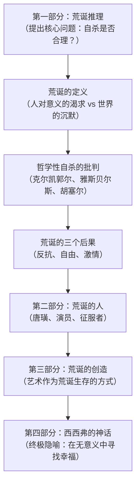
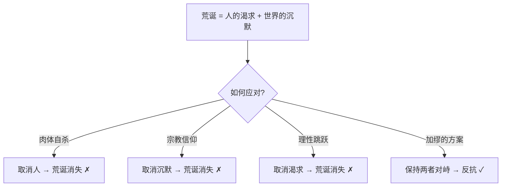
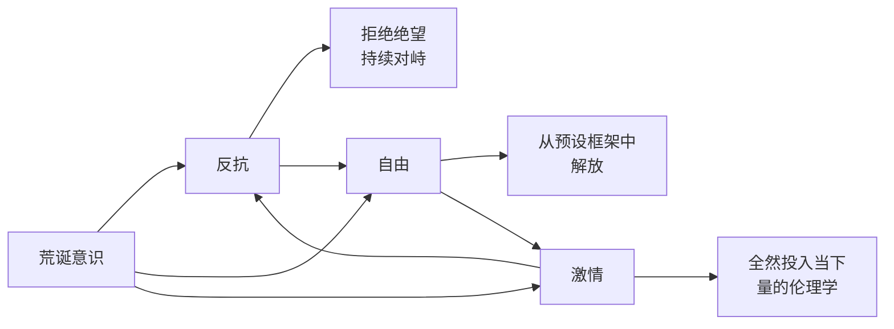
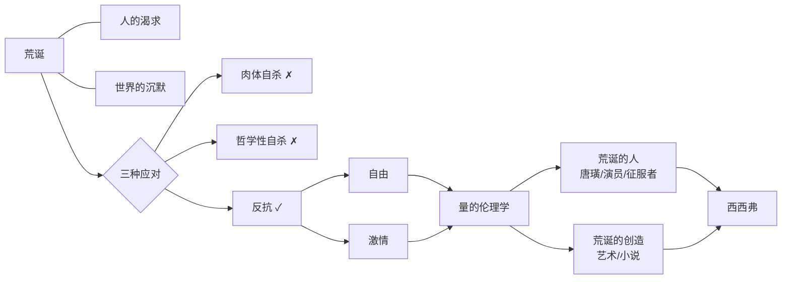

# 《西西弗神话》深度拆解

## 一、元信息速览

> [!abstract] 哲学坐标定位
> 《西西弗神话》（*Le Mythe de Sisyphe*）是法国哲学家阿尔贝·加缪于1942年出版的哲学随笔集。副标题为"论荒诞"（*Essai sur l'absurde*）。这不是一部小说，而是一部系统性的哲学论证——加缪在书中试图回答他所认为的"哲学的根本问题"：==人在认清生命没有终极意义之后，是否应该自杀？==

加缪写作本书时年仅28岁，正处于二战初期被占领的法国。同年他还出版了小说《局外人》（*L'Étranger*），两部作品共同构成了加缪"荒诞系列"的核心。《西西弗神话》是理论基础，《局外人》是文学表达——前者给出哲学论证，后者给出一个活在荒诞中的人物形象。

本书的核心主张可以用一句话概括：==生命没有终极意义，但这不是绝望的理由，而是自由的起点。你必须想象西西弗是幸福的。==

**历史背景**：1942年的欧洲正处于纳粹占领的黑暗之中。传统的宗教信仰和理性主义哲学都无法解释眼前的恐怖。加缪面对的不是一个抽象的哲学问题，而是一个迫在眉睫的生存危机：当你亲眼看到世界的疯狂和残忍，当上帝沉默、理性失效，你凭什么继续活下去？

> [!note] 哲学谱系定位
> 加缪通常被归入"存在主义"阵营，但他本人明确拒绝这个标签。他与萨特的根本分歧在于：萨特认为人可以通过"自由选择"赋予生命意义（"存在先于本质"），而加缪认为==意义的缺失是一个不可解决的事实，你不能通过任何哲学操作来消除它——你只能在承认它的前提下活着==。加缪更接近尼采的"上帝已死"之后的生存追问，但他拒绝了尼采的"超人"方案。他也与陀思妥耶夫斯基的宗教焦虑形成对话，但拒绝了"信仰飞跃"。

---

## 二、全书逻辑地图

《西西弗神话》不是线性叙述，而是一个由论证、批判和隐喻构成的哲学论证体系。全书可以分为四个主要板块：

**第一性原理分析**：

- **第一性原理**（First Principle）：加缪整个论证的出发点是一个不可再分解的基础命题——==人渴望意义，但宇宙不提供意义==。这是他整个哲学大厦的地基。所有后续论证都从这一对矛盾中推导出来。
- **Why**（为什么写这本书）：加缪面对的是一个被战争、虚无和信仰崩塌包围的时代。他需要回答一个不能回避的问题——如果生命真的没有意义，自杀是否是唯一诚实的选择？
- **How**（如何论证）：通过严格的否定法——逐一检验所有试图"解决"荒诞的方案（宗教、理性哲学、存在主义），证明它们都是逃避，最终论证唯一诚实的态度是在荒诞中继续活着
- **What**（具体内容）：四个板块，从荒诞的定义到荒诞的人物形象，最终以西西弗的神话作为总结性隐喻

==核心论证链：荒诞不可消除 → 自杀和信仰都是逃避 → 唯一诚实的态度是反抗 → 反抗意味着在明知无意义的前提下全力以赴地活 → 西西弗推石上山，石头滚落，他走下山去重新开始——他是幸福的。==

---

## 三、核心哲学概念拆解

> [!important] 阅读本节的方法
> 以下每个哲学概念，先给出其在哲学史中的原始含义，再给出加缪的特定用法，最后给出通俗解释。这是理解全书的概念基础。

### 概念1：荒诞（L'Absurde）

**哲学原始含义**：在哲学史中，"荒诞"（absurd）一词来自拉丁语 *absurdus*，原意为"不和谐的、刺耳的"。在逻辑学中指"与理性相矛盾的"。克尔凯郭尔最早将其引入存在主义语境，用来描述信仰的非理性本质——亚伯拉罕愿意献祭儿子以撒，这在理性上是"荒诞的"，但信仰恰恰始于理性的尽头。

**加缪的特定用法**：加缪赋予"荒诞"一个极为精确的定义——==荒诞不是世界本身的属性，也不是人本身的属性，而是人与世界之间的关系==。具体来说：

- 人有一种根深蒂固的渴望：渴望世界是有意义的、可理解的、有秩序的
- 世界本身是沉默的、冷漠的、无意义的
- 这两者之间的==碰撞==就是荒诞

加缪反复强调：荒诞既不在人之中，也不在世界之中，而在两者的==对峙==之中。消灭了任何一方，荒诞就不存在了——如果人不再渴望意义（但人做不到），或者世界突然变得有意义（但世界做不到），荒诞就消失了。

**通俗解释**：你走进一间空旷的大厅，对着空气大声喊"你好"，期待有人回应。但只有回声。你再喊一次，更大声。还是回声。你知道没有人会回答，但你停不下来——因为你是一个"需要被回应"的存在。这种"你明知没有回应却停不下来呼唤"的处境，就是加缪说的荒诞。荒诞不是大厅的空旷（世界本身不荒诞），也不是你的呼喊（人本身不荒诞），而是"你在一个永远不会回应你的空间里不断呼喊"这个==关系==本身。

### 概念2：哲学性自杀（Le Suicide Philosophique）

**哲学原始含义**：这是加缪自己创造的术语，在他之前的哲学传统中没有这个概念。

**加缪的特定用法**：加缪用"哲学性自杀"来描述一类特定的哲学操作——==当哲学家面对荒诞时，不是正面承认它，而是通过某种思维跳跃来"消解"它==。加缪认为这等同于理智上的自杀——你杀死了自己的理性诚实，以换取一个虚假的安慰。

他点名批判的"哲学性自杀"案例包括：

1. **克尔凯郭尔的信仰飞跃**：面对荒诞，克尔凯郭尔说"正因为荒诞，所以我信仰"——加缪认为这是用信仰来取消荒诞，是一种逃避
2. **雅斯贝尔斯的超越**：面对理性的局限，雅斯贝尔斯求助于"超越者"（Transcendence）——加缪认为这和宗教信仰本质上没有区别
3. **胡塞尔的现象学还原**：胡塞尔试图通过"回到事物本身"来重建意义——加缪认为这是用理性的工具来重新赋予世界以理性秩序，是一种循环论证
4. **舍斯托夫的非理性主义**：舍斯托夫拥抱非理性本身——加缪认为这等于放弃了理性，也是一种自杀

**通俗解释**：你正在做一道数学题，算了半天发现这道题无解。这时你有几种选择：（1）承认它无解，接受这个事实，然后继续用无解的方程式来做别的事情；（2）偷偷改变题目条件，让它变得有解——比如假设某个常数存在，即使没有证据；（3）宣布"数学不重要"，扔掉整道题。加缪认为选项（2）和（3）都是"哲学性自杀"——你没有面对问题，你只是用不同的方式逃避了问题。唯一诚实的选择是（1）。

### 概念3：反抗（La Révolte）

**哲学原始含义**：在政治哲学中，"反抗"通常指对压迫的抵抗。在加缪之前，尼采的"对虚无主义的克服"和马克思的"阶级反抗"是两个主要的反抗传统。

**加缪的特定用法**：加缪的"反抗"不是政治行动，而是一种==存在态度==。它指的是：在充分认识到生命没有终极意义的前提下，拒绝自杀，拒绝信仰飞跃，拒绝任何形式的逃避，坚持==在荒诞中活着==。这种反抗的对象不是某个具体的压迫者，而是荒诞本身——或者更准确地说，是"荒诞要求你放弃"这一诱惑。

反抗的核心特征是：==它不试图解决荒诞，而是持续地与荒诞对峙==。反抗者不寄希望于未来会变好，不相信死后有天堂，不期待任何形式的救赎——他只是在此时此刻、在这一天、在这一个动作中全力以赴地活着。

**通俗解释**：你被困在一个永远走不出去的迷宫里。你知道没有出口。你可以坐在地上等死（自杀），你可以假装某面墙后面有出口（信仰飞跃），或者你可以继续走——不是因为你相信能走出去，而是因为==走路本身==就是你的回答。你用你的脚步对迷宫说："你困不住我的意志。"这就是加缪的反抗。

### 概念4：荒诞的自由（La Liberté Absurde）

**哲学原始含义**：自由是哲学史上最核心的概念之一。从亚里士多德的"自愿行动"到康德的"道德自律"，再到萨特的"绝对自由"，自由的含义不断演变。

**加缪的特定用法**：加缪的"荒诞的自由"是一种特殊的、建立在意义崩塌之上的自由。他的论证是：==当你不再相信有终极意义、永恒价值或来世奖惩时，你反而获得了一种前所未有的自由==。

传统的自由总是在某个价值框架内运作——你可以自由选择做好事或坏事，但"好"和"坏"的标准是预设的。加缪的荒诞自由打破了这个框架：既然没有终极标准来判定什么是"值得"的，那么==一切体验都同等有价值==。当皇帝和当渔夫，写诗和搬砖，环游世界和坐在自家门口——在荒诞的视角下，它们没有高低之分。

但这不意味着"什么都无所谓"。加缪的关键区分是：==荒诞的自由不是虚无主义的放弃，而是从虚假等级制度中的解放==。你不再需要按照社会、宗教或传统哲学预设的"有意义的人生"模板来活——你可以按照你自己当下的激情来活。

**通俗解释**：你一直以为人生是一场考试——有标准答案、有分数、有排名。你为了考高分而焦虑、内卷、放弃自己真正想做的事。然后有一天你发现：这场考试根本没有判卷人。没有标准答案，没有分数，没有排名。你的第一反应可能是恐慌——如果没有标准，我该怎么活？但加缪说：恰恰是因为没有标准，你才终于可以不被任何标准绑架，去做你此刻真正想做的事。

### 概念5：激情/量的伦理学（La Passion / L'Éthique de la Quantité）

**哲学原始含义**：传统伦理学（从亚里士多德到康德）关注的是"质"——什么是好的生活、什么是道德的行为。这是"质的伦理学"。

**加缪的特定用法**：加缪提出了一个颠覆性的概念——==在荒诞的框架下，伦理学的标准从"质"转向"量"==。既然没有终极标准来判定哪种生活"更好"，那么衡量人生的标准就不是"你活得多有意义"，而是"你活得多充分"。不是深度，而是==广度和强度==。

这就是"激情"的含义——它不是指浪漫化的情感冲动，而是指对每一个当下体验的全然投入。荒诞的人不追问"这件事有什么意义"，他只追问"我是否在此刻全力以赴地活着"。

**通俗解释**：传统哲学问"你的人生值不值得活"，加缪把这个问题改写为"你的人生活得够不够充分"。前者需要一个外在标准来判定"值得"，后者只需要你自己来感受"充分"。就像吃一顿饭——你可以问"这顿饭有营养吗"（质），也可以问"我有没有认真品尝每一口"（量/强度）。加缪选择后者。

---

## 四、逐章深度拆解

### 主题1：「荒诞与自杀——哲学的唯一严肃问题」

> [!tip] 开篇定调：加缪把自杀提升为哲学的第一问题，所有其他问题都是次要的

**【核心论点】**

全书第一句话就是一个炸弹："真正严肃的哲学问题只有一个，那就是自杀。"加缪认为，判断人生是否值得活，等于回答了哲学的根本问题。==所有其他哲学问题——世界有几个维度、精神有几个范畴——都是次要的。你得先回答"是否值得活着"，然后才有资格讨论其他一切。==

**【详细拆解】**

加缪的开篇策略是极其精准的——他直接攻击了整个西方哲学传统的议程设置。从柏拉图到黑格尔，西方哲学花了两千年讨论存在的本质、知识的可能性、道德的基础，但几乎没有正面回答过"你为什么不去死"这个问题。加缪认为这是哲学史上最大的回避。

他的论证起点是一个日常观察：很多人在某一天突然发现，自己的生活已经变成了一种无意识的重复——==起床、电车、四小时办公、吃饭、电车、四小时工作、吃饭、睡觉，周一、周二、周三、周四、周五，同样的节奏==。大多数时候，人们不去想这件事。但偶尔，在某个疲惫的午后，"为什么"这个问题会突然冒出来。这一刻，意识觉醒了——你第一次从生活的惯性中抬起头来，问自己："这一切是为了什么？"

加缪说，==这个"为什么"就是一切的开始。一旦你问出了这个问题，你就再也无法假装没问过==。你可以忽略它、压抑它、用忙碌来淹没它，但它不会消失。最终你必须面对它：如果生命没有终极意义，那么活着是否只是一种习惯？如果只是习惯，那么打破这个习惯——自杀——是否才是唯一理性的选择？

但加缪的目的不是论证自杀的合理性——恰恰相反。他要做的是：==先把问题推到极端，然后证明即使在最极端的处境下，活着仍然是可能的、甚至是可取的==。

**【苏格拉底追问】**

| 层级 | 追问 | 加缪的回答 |
|------|------|-----------|
| 第一层 | 自杀是哲学问题还是心理问题？ | 加缪承认大多数自杀有复杂的心理和社会原因，但他关注的是"逻辑性自杀"——纯粹出于对生命无意义性的哲学判断 |
| 第二层 | 如果生命无意义，为什么不自杀？ | 因为自杀并不"解决"荒诞——它只是取消了荒诞的一方（人），荒诞本身并未被回答 |
| 第三层 | 那活着就是在"忍受"荒诞？ | 不是忍受，而是反抗。活着是对荒诞的积极回应，不是被动承受 |

**【费曼式解读】**

一个人走进剧院，发现舞台上空无一物，没有剧本、没有演员、没有导演。他可以起身离开（自杀），可以闭上眼睛假装有一出好戏在上演（信仰飞跃），也可以——走上空旷的舞台，在没有剧本的情况下即兴表演。加缪选择的是第三种：你知道没有剧本，但你仍然表演，而且全力以赴地表演。不是为了观众，不是为了评分，只是因为你在舞台上的每一秒都是真实的。

---

### 主题2：「荒诞的墙——意识觉醒的几个时刻」

> [!warning] 荒诞不是一个理论推导的结论，而是你在日常生活中突然"撞上"的东西

**【核心论点】**

加缪详细描述了荒诞意识觉醒的几个典型时刻——不是通过哲学思辨，而是通过日常生活中的突然"脱节"。这些时刻包括：对时间流逝的突然恐惧、对重复生活的突然厌倦、对他人不可理解性的突然感知、对自然界冷漠的突然体验、以及对死亡的深层恐惧。

**【详细拆解】**

加缪列举了几种荒诞"撞上"你的方式：

**1. 时间的裂缝**：你在日常节奏中突然意识到时间在流逝——==你25岁、30岁、40岁，每一天都在把你推向死亡，而你之前一直在假装时间是无限的==。这个觉醒不是平静的领悟，而是一种近乎肉体性的惊恐。

**2. 世界的陌生化**：某一天，你熟悉的世界突然变得陌生——==树木、房屋、行人，一切都失去了你赋予它们的意义外衣，显露出赤裸的、冷漠的物质性==。一块石头就是一块石头，不是"大地的骨骼"或任何诗意化的解读。这种突然的"去意义化"就是荒诞的降临。

**3. 他人的不透明性**：你与一个你"认识"了十年的人交谈，突然意识到你完全不理解这个人。你甚至不理解你自己。==人与人之间的理解是一种幻觉，建立在语言和习惯的基础上。一旦你穿透了这层幻觉，你面对的是一堵不透明的墙==。

**4. 自然的冷漠**：你站在一片壮丽的风景前——群山、大海、星空——你被美震撼了。但下一秒你意识到：==这些美与你无关。大海不是为你而壮丽的，星空不是为你而存在的。自然的美恰恰反衬了自然对人的彻底冷漠==。

**5. 死亡的确定性**：不是对某个人的死亡的恐惧，而是对"你一定会死"这个事实的深层理解。==死亡使一切努力都变成了暂时的，使一切意义都变成了临时的。没有什么能够抵抗死亡的终极否定==。

加缪认为，这些时刻不是病态的——它们是意识的觉醒。大多数人在经历了这些时刻之后会迅速"恢复正常"——用忙碌、娱乐、习惯或信仰来重新覆盖那个裸露的真相。但少数人会停留在那个裂缝里，直面它。加缪的书就是写给这些人的。

**【费曼式解读】**

你每天走同一条路回家，走了十年，闭着眼睛都能走。然后有一天，你走到一半突然停下来——你看着路边的一棵树，心想："这棵树在这里干什么？"你又看了看路面、看了看天空、看了看自己的手。一切都变得陌生了，好像你第一次见到这些东西。你知道你还在你熟悉的路上，但你的感觉是——你从来不认识这条路。这种"在熟悉中突然感到陌生"的体验，就是加缪说的荒诞意识的觉醒。

---

### 主题3：「对"哲学性自杀"的批判——你不能通过作弊来逃避荒诞」

> [!note] 加缪逐一检验了存在主义先驱们的方案，认为他们全都在荒诞面前"作弊"了

**【核心论点】**

加缪用了全书最长的篇幅来批判那些试图"解决"荒诞的哲学家——克尔凯郭尔、雅斯贝尔斯、舍斯托夫、胡塞尔、海德格尔。他的核心指控是：==这些哲学家都正确地诊断了荒诞，但在面对它的时候退缩了。他们通过某种形式的"信仰飞跃"——无论是宗教信仰还是理性信仰——来取消荒诞，这等同于理智上的自杀==。

**【详细拆解】**

**对克尔凯郭尔的批判**：

克尔凯郭尔（Kierkegaard）是第一个系统使用"荒诞"概念的哲学家。他认为理性无法抵达终极真理，信仰恰恰始于理性的尽头——亚伯拉罕愿意献祭以撒，这在理性上是荒诞的，但正因如此，它是信仰的最高表达。"因为荒诞，所以我相信"（*Credo quia absurdum*）。

加缪承认克尔凯郭尔对荒诞的诊断是精准的，但拒绝他的药方。加缪的论证是：==克尔凯郭尔面对荒诞时做了一个跳跃——从"理性无法解释世界"跳到"所以一定有一个超越理性的上帝"。但这个跳跃本身是没有根据的。你不能因为看不到桥，就假设有一座隐形的桥==。

**对雅斯贝尔斯的批判**：

雅斯贝尔斯（Jaspers）提出了"极限处境"（Grenzsituation）的概念——死亡、苦难、罪过和不确定性是人无法逃避的终极处境。面对这些极限处境，雅斯贝尔斯转向了"超越者"（Transzendenz）——一种不可言说的终极存在。

加缪认为，==雅斯贝尔斯的"超越者"本质上和上帝没有区别——它只是换了一个更学术化的名字。你把上帝叫做"超越者"，不会改变你在本质上做了一个信仰飞跃的事实==。

**对胡塞尔的批判**：

胡塞尔（Husserl）的现象学试图"回到事物本身"——通过悬置一切预设，直接描述意识的结构。加缪认为胡塞尔的初衷是好的，但最终他背叛了自己——==胡塞尔从"描述意识"滑向了"赋予意识以超时间的本质"，从而重新偷渡了理性秩序和永恒意义==。

**对舍斯托夫的批判**：

舍斯托夫（Chestov）是最激进的非理性主义者——他直接宣布理性是人的敌人，拥抱一切非理性的东西。加缪认为这也是一种逃避：==你不能通过抛弃理性来解决荒诞，因为荒诞恰恰产生于理性（人的渴求）和非理性（世界的沉默）之间。抛弃了理性，你也就取消了荒诞的一方==。

**【核心论证框架】**

加缪的标准非常严格：==任何试图消除荒诞的方案都是不诚实的。唯一诚实的态度是同时保持两方的张力——既不放弃你对意义的渴求，也不假装世界提供了意义。在这种永恒的张力中活着，就是反抗==。

**【费曼式解读】**

你在下棋，走到一半发现不可能赢了——对手的局面无懈可击。你有几种选择：（1）掀翻棋盘不玩了（肉体自杀）；（2）偷偷在棋盘上多放几颗棋子，假装规则改了（信仰飞跃）；（3）假装你看不到对手的优势，继续下你的（理性逃避）；（4）清楚地看到你不可能赢，然后继续下——把每一步都走到最好，不是为了赢，而是为了下棋本身的过程。加缪选择（4）。

---

### 主题4：「荒诞的三个后果——反抗、自由、激情」

> [!abstract] 荒诞不是绝望的终点，而是三种力量的起点

**【核心论点】**

在排除了自杀和哲学性自杀之后，加缪推导出荒诞意识的三个积极后果。这三个后果不是理论推演，而是荒诞的人在日常生活中自然获得的存在状态：

1. **反抗**（La Révolte）：==对荒诞的持续对峙，拒绝屈服==
2. **自由**（La Liberté）：==从一切虚假意义框架中的解放==
3. **激情**（La Passion）：==对当下体验的全然投入==

**【详细拆解】**

**反抗**——不是一次性的行为，而是一种持续的姿态。加缪特别强调"持续"这个词：反抗不是在某个英勇时刻说一次"不"，而是每一天、每一小时都在说"不"。==反抗的对象不是命运（命运是中性的），而是绝望——你拒绝让荒诞把你推向放弃==。

反抗还有一个重要特征：它==不追求胜利==。荒诞的反抗者不期望有朝一日能"战胜"荒诞——因为荒诞是人类处境的永恒结构。反抗是没有终点的，这恰恰是它的力量所在：如果反抗有一个终点（比如"找到意义"），那它就只是通向某个目标的手段。但加缪的反抗是自足的——==反抗本身就是目的==。

**自由**——当传统的价值框架崩塌之后，你获得了一种此前不可能拥有的自由。这种自由不是"想做什么就做什么"的放纵，而是一种更深层的解放：你不再被"你的人生应该是什么样子"的预设所束缚。

加缪举了一个关键的例子：==一个普通人在知道自己只剩下30年可活的情况下，和一个被判处死刑、知道自己可能明天就死的人，他们的自由是不同的。后者反而更自由——因为他不再需要为一个不确定的未来做规划，他完全活在当下==。这个例子极端，但加缪的论点是：荒诞意识给了你一种类似于死刑犯的清醒——你知道一切都是暂时的，所以你不再被永恒的幻觉所奴役。

**激情**——这是前两者的自然延伸。当你既不追求终极意义（反抗），也不被任何框架束缚（自由），你的全部能量就自然流向了当下的体验。==加缪用"量"来替代"质"：重要的不是你的体验有多"深刻"或多"有意义"，而是你的体验有多"充分"和多"多样"==。

**【概念网络】**

三者形成一个自我强化的循环：反抗使你从绝望中解放（获得自由），自由使你能够全然投入当下（激发激情），激情使你的每一天都成为对荒诞的回应（强化反抗）。

**【费曼式解读】**

想象你在一条没有终点的跑道上跑步。没有终点线，没有计时牌，没有奖牌。大多数人会停下来——跑步如果没有终点，还有什么意义？但加缪说：看看你的身体在移动，感受风吹过你的皮肤，听你自己的心跳。你不是在"为了"什么而跑，你就是在跑。这种纯粹的运动——没有目的、没有终点、只有此刻的全力以赴——就是反抗、自由和激情的统一。

---

### 主题5：「荒诞的人——唐璜、演员、征服者」

> [!tip] 加缪为荒诞的生活方式提供了三个具体的人物原型

**【核心论点】**

在完成了理论论证之后，加缪转向具体的人物形象——他选择了三个"荒诞的人"来展示荒诞的生活在实践中是什么样子的：唐璜（Don Juan）、演员（Le Comédien）和征服者（Le Conquérant）。==这三个人物不是道德榜样，而是荒诞生存方式的示范==。

**【详细拆解】**

**唐璜——量的伦理学的化身**

唐璜是西方文学中的经典人物——一个不断追逐女人的诱惑者。传统的道德判断认为唐璜是一个堕落的、不负责任的人。但加缪的解读完全不同：

唐璜不是在"寻找真爱"——他知道真爱不存在。他也不是在"逃避空虚"——他完全清楚自己行为的本质。==唐璜是一个彻底放弃了"永恒之爱"这个幻觉的人==。他知道每一段关系都是暂时的，每一次激情都会消退，但他不因此而放弃——他全力以赴地投入每一段关系，然后平静地离开，走向下一段。

加缪强调：==唐璜不是因为自私才这样做，而是因为诚实==。他拒绝对任何一个女人说"我永远爱你"，因为他知道"永远"是一个谎言。他能给出的只有"此刻"——但他的"此刻"是全然投入的。

**演员——在虚构中触及真实**

演员的存在本身就是一个荒诞的隐喻：他在舞台上扮演各种角色，今天是国王，明天是乞丐，后天是杀人犯。每一个角色都不是"他自己"，但每一个角色他都全力以赴地投入。==演员用他的身体和声音穷尽了人类经验的多样性——他在三小时内活出了别人一辈子的体验==。

加缪认为演员是荒诞意识的完美体现：他知道一切都是虚构的（舞台上的一切都是假的），但他在虚构中的投入是完全真实的。==明知是假的，仍然全力以赴——这恰恰是荒诞的人面对生活的态度==。

**征服者——在行动中穷尽自我**

征服者不是亚历山大或拿破仑式的帝国建设者——加缪的征服者更接近革命者。他投身于改变世界的行动，不是因为他相信世界可以被永久地改变，而是因为==行动本身就是对荒诞的回应==。

征服者知道他的一切成就最终都会消散——帝国会崩塌，革命会被背叛，历史会遗忘他。但他不因此而停止行动。他的选择是：==在明知一切终将消散的前提下，把自己的全部能量投入到此刻的行动中==。

**【苏格拉底追问】**

| 追问 | 加缪的回答 |
|------|-----------|
| 唐璜不是在伤害别人吗？ | 加缪没有正面回答这个道德问题。他关注的是唐璜的存在姿态，而非道德评判。这是本书的一个争议点 |
| 演员的生活不是虚假的吗？ | 恰恰相反——演员是最"真实"的，因为他从不假装自己的角色是永恒的。我们才是在日常生活中"演戏"而不自知 |
| 征服者的暴力可以被正当化吗？ | 加缪后来在《反抗者》中对这个问题做了更深入的讨论，给暴力设定了严格的伦理限制 |

---

### 主题6：「荒诞的创造——艺术作为荒诞生存的最高形式」

> [!note] 创作不是为了不朽，而是为了穷尽当下的体验

**【核心论点】**

加缪认为，艺术创造是荒诞生存方式中最自觉、最充分的形式。但他立即澄清：==荒诞的创作者不是为了创造"不朽的作品"或表达"永恒的真理"——他是为了在创作的过程中穷尽自己的体验==。

**【详细拆解】**

加缪的艺术观与传统的浪漫主义艺术观截然对立。浪漫主义认为艺术是"灵魂的表达"或"永恒美的捕捉"。加缪说：==不。荒诞的艺术家知道他的作品不会永存，知道他的作品不表达任何终极真理。他创作，只是因为创作是他能找到的最充分地穷尽自己体验的方式==。

加缪特别讨论了小说这种形式。他认为，小说是"一个带有图像的哲学"——==伟大的小说不是在"说教"，而是在"展示"。它不给你一个现成的世界观，而是把一个活生生的世界放在你面前，让你自己去看、去感受、去判断==。

他以陀思妥耶夫斯基为例：陀思妥耶夫斯基的小说充满了荒诞的意识——《卡拉马佐夫兄弟》中伊万对上帝的质问、《地下室手记》中地下人的极端自我意识——但陀思妥耶夫斯基本人最终选择了信仰飞跃。==加缪欣赏陀思妥耶夫斯基的诊断，但拒绝他的药方==。

关于创作者的态度，加缪提出了一个关键区分：

- **传统创作者**：相信自己的作品能表达某种永恒真理，期望作品不朽
- **荒诞创作者**：知道自己的作品只是对当下体验的一次穷尽，不期望任何永恒价值

==这两种创作者的作品可能看起来一样，但他们的内在姿态完全不同==。荒诞的创作者更自由——因为他不被"要创作伟大作品"的压力所束缚。他只是在创作，一部接一部，就像西西弗一次次推石上山。

**【费曼式解读】**

一个人在沙滩上用沙子堆城堡。他知道潮水一来，城堡就会被冲走。那他为什么还要堆？因为堆的过程本身是有趣的——沙子在手指间的触感、城堡慢慢成形的满足感、阳光照在湿沙上的光泽。==他不是为了城堡而堆沙子，他是为了"堆沙子"而堆沙子==。荒诞的创作者就是这个在沙滩上堆城堡的人。

---

### 主题7：「西西弗的神话——终极隐喻」

> [!abstract] 全书的高潮：在无尽的重复中发现幸福

**【核心论点】**

全书的最后一章回到了标题所指的希腊神话。西西弗（Sisyphus）因为得罪了众神，被罚在冥界将一块巨石推上山顶，但每次快到山顶时，巨石就会滚落山脚，他必须重新走下山去推。这个惩罚是永恒的——没有终点、没有目的、没有意义。加缪说：=="我们必须想象西西弗是幸福的。"==（*Il faut imaginer Sisyphe heureux.*）

**【详细拆解】**

加缪选择西西弗作为全书的总结性隐喻，绝非偶然。西西弗的处境精确地对应了加缪对人类处境的诊断：

1. **无意义的重复**：推石上山、石头滚落、走下山去——这与"起床、工作、睡觉、起床、工作、睡觉"的日常节奏完全同构
2. **没有终点**：西西弗永远不会完成他的任务，就像人永远不会找到终极意义
3. **清醒的意识**：西西弗知道石头会滚落，就像荒诞的人知道生命没有终极目的
4. **持续的行动**：尽管知道一切终将归零，西西弗仍然推石上山

但加缪把最关键的时刻放在了一个出人意料的地方——==不是推石上山的过程（那是劳动），而是石头滚落之后、西西弗走下山的那段路==。

加缪写道：在西西弗走下山的那段路上，他是自由的。他的手暂时空了出来，巨石还在山脚等着他，但他还没有开始推。这是一段==纯粹的间隙==，在这个间隙里，西西弗可以思考、可以感受、可以面对自己的命运。

加缪说，正是在这段下山的路上，西西弗超越了他的命运。怎么超越的？不是通过逃避（他不能逃离冥界），不是通过信仰（没有任何神会来拯救他），而是通过==意识==。他清楚地知道自己的命运是什么，他不否认它、不逃避它、不美化它——他只是看着它，然后继续走。

==这种"看着荒诞的脸然后继续走"的态度，就是加缪所说的反抗==。

"我们必须想象西西弗是幸福的"——这句话是全书最具争议性的结论。它不是在说苦难是好的，不是在说重复劳动是令人愉快的，更不是在说"只要你换个心态就能快乐"。加缪的意思是：

==西西弗的幸福来自于他与命运之间的关系——他是他自己命运的主人，不是因为他能改变命运，而是因为他能面对命运。巨石是他的，山坡是他的，这个永恒的任务是他的。当他接受了这一切——不是认命式的屈服，而是清醒的承认——他就不再是一个被惩罚的囚徒，而是一个在自己的领域中行动的人==。

加缪还做了一个微妙但重要的补充：西西弗的幸福不是一种永恒的状态，而是一种在特定时刻闪现的东西。在他走下山的那段路上，在他的手触碰到巨石的那一刻，在他的肌肉开始发力的那一瞬间——幸福在这些具体的、肉身性的时刻中闪现。==它不是一种抽象的"内心平静"，而是一种与此刻的全然联结==。

**【与全书论证的关系】**

西西弗的神话是全书所有论证的具象化：

| 全书论点 | 西西弗的对应 |
|----------|------------|
| 荒诞 = 人的渴求 vs 世界的沉默 | 西西弗想把石头推上山顶 vs 石头总会滚落 |
| 拒绝自杀 | 西西弗没有在山脚躺下不起来 |
| 拒绝信仰飞跃 | 西西弗没有幻想有一天石头不会滚落 |
| 反抗 | 西西弗每次都重新走下山去推 |
| 自由 | 下山的那段路——手是空的，意识是清醒的 |
| 激情 | 推石时肌肉的紧张、汗水、呼吸 |
| 幸福 | "我们必须想象西西弗是幸福的" |

**【费曼式解读】**

每天早上你的闹钟响了。你知道今天和昨天基本一样——起床、刷牙、上班、吃饭、回家、睡觉。明天还是一样。后天也是。你可以在被窝里赖着不起来（放弃），你可以告诉自己"我在为退休后的美好生活奋斗"（信仰飞跃），或者——你可以接受这一天就是你拥有的全部，然后全力以赴地过这一天。不是为了明天，不是为了意义，只是因为这一天是真实的、是你的、是此刻正在发生的。加缪说，如果你能做到这一点，你就是一个幸福的西西弗。

---

## 五、核心框架提炼

### 概念网络

全书的核心概念构成一张紧密相连的网络：

**核心论证链**（第一性原理推导）：

1. ==前提：人渴望意义，但宇宙不提供意义==（不可再分解的基础事实）
2. 这种矛盾产生"荒诞"（定义）
3. 面对荒诞，肉体自杀取消了矛盾的一方（人），但没有回答问题（排除）
4. 面对荒诞，哲学性自杀取消了矛盾的另一方（世界的沉默），也没有回答问题（排除）
5. 唯一诚实的态度是保持矛盾的两方同时存在（反抗）
6. 反抗带来自由（从虚假意义框架中解放）和激情（对当下的全然投入）
7. 由此产生"量的伦理学"——衡量生活的标准从"有没有意义"变为"有没有充分活过"
8. 西西弗是这种生活方式的终极象征——在永恒的重复中全力以赴，==必须想象他是幸福的==

### 苏格拉底追问总链

| 层级 | 追问 | 加缪的回答 |
|------|------|-----------|
| 第一层 | 生命有意义吗？ | 没有终极意义。宇宙不回应人的追问 |
| 第二层 | 那是否应该自杀？ | 不。自杀是对荒诞的逃避，不是回答 |
| 第三层 | 能否通过信仰找到意义？ | 不能。信仰飞跃是理智上的自杀 |
| 第四层 | 能否通过理性找到意义？ | 不能。理性本身揭示了意义的缺失 |
| 第五层 | 那怎么办？ | 在荒诞中反抗——不寻求解决，而是与荒诞对峙 |
| 第六层 | 反抗能带来什么？ | 自由和激情——从虚假框架中解放，全然投入当下 |
| 第七层 | 这算幸福吗？ | 是的——必须想象西西弗是幸福的 |
| 第八层 | 凭什么？ | 因为他是自己命运的主人——不是因为能改变命运，而是因为能面对命运 |

---

## 六、批判性思考

### 1. "荒诞"的前提是否成立？

加缪把"人渴望意义"作为不可再分解的事实，但这值得追问。==真的所有人都渴望终极意义吗？== 很多人对"生命的终极意义"完全无感——他们只关心吃饭、睡觉、照顾家人，从未感到需要宇宙来回应他们的追问。加缪的"荒诞"可能只对一种特定的人——受过教育的、有反思习惯的知识分子——才有效。对于一个从未问过"为什么"的人来说，荒诞可能根本不存在。

### 2. "量的伦理学"的道德风险

加缪主张用"体验的丰富性"来替代"道德的正确性"作为衡量生活的标准。但这带来了一个严重的问题：==一个全力以赴地犯罪的人，是否也算"荒诞的英雄"？== 加缪用唐璜做例子，但唐璜至少不是暴力犯罪者。如果一个杀人犯声称他在"充分体验生命"，加缪的框架能否有效地反驳他？

加缪在后来的著作《反抗者》（*L'Homme révolté*，1951年）中试图解决这个问题——他给反抗设定了伦理边界："我反抗，故我们存在"（*Je me révolte, donc nous sommes*），将个人反抗与人类团结联系起来。但在《西西弗神话》中，这个伦理缺口是存在的。

### 3. 加缪与萨特的分歧

萨特在《存在与虚无》中提出"存在先于本质"——人没有预设的本质，你通过自由选择来创造自己的本质。这听起来与加缪的"荒诞的自由"相似，但有根本分歧：

- ==萨特认为人可以通过选择赋予生命意义==——虽然没有预设的意义，但你可以"创造"意义
- ==加缪认为意义的缺失是不可弥补的==——你不能"创造"意义，你只能在没有意义的前提下活着

这个分歧最终导致了两人在政治上的决裂。萨特认为革命行动可以创造新的意义（这使他同情苏联），加缪则认为以"创造意义"为名的革命往往走向暴政（这使他拒绝斯大林主义）。

### 4. "必须想象西西弗是幸福的"——这是论证还是信仰？

加缪全书最核心的结论——"必须想象西西弗是幸福的"——用的是"必须想象"（*il faut imaginer*）而不是"西西弗是幸福的"。==这个"想象"是否本身就是一种信仰飞跃？== 如果你需要"想象"幸福，那幸福是否真的存在？还是说，这只是加缪版本的"信仰飞跃"——他批判克尔凯郭尔用信仰来逃避荒诞，但自己用"想象"来逃避绝望？

这是对加缪最深层的哲学批评。你可以论证"想象"和"信仰"的区别：信仰声称某种超越性存在是"真的"，而想象只是一种主观的态度选择，不涉及真假判断。但这种区分是否足够有力，是一个开放的问题。

### 5. 历史局限性

加缪写作于1942年，他面对的是一个特定的历史处境——被占领的法国、纳粹的恐怖、传统价值的崩塌。他的荒诞哲学可能带有那个特定时代的印记。==在一个物质丰裕、信息爆炸、科技发达的当代社会里，"荒诞"的面貌可能已经变化了==——当代人面对的可能不是"意义的缺失"，而是"意义的过剩"（太多声音在告诉你什么是有意义的），或者"注意力的碎片化"（你甚至没有足够的安静来体验荒诞）。

---

## 七、与其他哲学体系的对话

### 加缪 vs 尼采

| 维度 | 尼采 | 加缪 |
|------|------|------|
| 对虚无主义的诊断 | "上帝已死"——传统价值崩塌 | "荒诞"——人与世界的断裂 |
| 解决方案 | "超人"——创造新价值、"永恒轮回" | "荒诞的人"——不创造新价值，在无价值中活着 |
| 对"重复"的态度 | 永恒轮回的amor fati（命运之爱） | 西西弗的反抗——不是爱命运，而是面对命运 |
| 伦理立场 | "超越善恶" | 保留基本伦理（后来在《反抗者》中更明确） |

### 加缪 vs 陀思妥耶夫斯基

加缪在书中大量引用了陀思妥耶夫斯基，尤其是《卡拉马佐夫兄弟》中伊万的名言："如果上帝不存在，一切都是允许的。"加缪接受了这个前提，但拒绝了陀思妥耶夫斯基的结论。

陀思妥耶夫斯基的论证是：既然没有上帝就没有道德，而没有道德是不可接受的，所以上帝必须存在。这是一个逆向推理——从"后果不可接受"推向"前提必须为假"。

==加缪的回应是：后果是否"可接受"不改变前提的真假。如果上帝不存在，那就是不存在——你不能因为不喜欢这个结论就假装它不成立。你必须学会在没有上帝的世界里建立生活。==

### 加缪 vs 佛教

一个有趣的跨文化比较：佛教同样认为生命充满苦（*dukkha*），原因之一是人对事物有执着（*upādāna*）。但佛教的解决方案是通过修行消除执着，从而消除苦。

==加缪会认为这是另一种形式的"哲学性自杀"——你通过消除人对意义的渴求来消除荒诞。但加缪坚持：你不应该消除渴求，你应该保持渴求，同时保持清醒==。荒诞恰恰需要两方的持续对峙。

---

## 八、行动清单

1. **"为什么"练习**：选择你日常生活中一个完全自动化的行为（比如上班），问自己五次"为什么"——"我为什么上班？""我为什么需要钱？""我为什么需要安全感？"不要寻找"正确答案"，只是观察当你追问到底时会碰到什么
2. **荒诞日记**：每天记录一个"陌生化"时刻——一个你突然觉得日常世界变得陌生的瞬间。可能是看着一个词看到它失去意义，可能是在人群中突然觉得所有人都是陌生人
3. **"此刻"训练**：每天花10分钟做一件事，完全不考虑它"有什么用"。散步不是为了健康，读书不是为了知识，吃饭不是为了营养——只是纯粹地做这件事本身。感受加缪所说的"量的体验"
4. **西西弗时刻**：当你面对一项重复性的、看似无意义的任务时（洗碗、开会、通勤），试着用西西弗的视角来看待它——这不是"不得不做的苦差事"，这是你的巨石、你的山坡。问自己："我能在这个过程中全力以赴吗？"
5. **"不逃避"练习**：下次当你感到生活的荒诞——无聊、空虚、"这一切有什么意义"——不要急着用手机、社交媒体或任何其他方式来转移注意力。停留在那个感觉里五分钟，观察它。加缪说，这种时刻是意识觉醒的入口

---

## 九、延伸阅读路线图

- [[《局外人》]] —— 加缪同年出版的小说，《西西弗神话》的文学化表达。默尔索就是一个"荒诞的人"——他拒绝虚伪的情感表达，最终被社会处死
- [[《鼠疫》]] —— 加缪的"反抗系列"核心作品。从荒诞走向团结，医生里厄在无意义的疫病中坚持救人
- [[《反抗者》]] —— 加缪的政治哲学著作，试图为"荒诞的反抗"设定伦理边界。这本书直接导致了他与萨特的决裂
- [[《存在与虚无》]] —— 萨特的哲学巨著，提供了与加缪截然不同的存在主义方案。对比阅读可以帮助你理解存在主义内部的根本分歧
- [[《存在与时间》]] —— 海德格尔的本体论巨著，"向死而生"的概念与加缪的死亡意识分析有深层对话
- [[《恐惧与颤栗》]] —— 克尔凯郭尔关于亚伯拉罕献祭的著作，加缪所批判的"信仰飞跃"的原始文本
- [[《查拉图斯特拉如是说》]] —— 尼采的"永恒轮回"与加缪的"西西弗"形成直接对话
- [[《卡拉马佐夫兄弟》]] —— 陀思妥耶夫斯基的巅峰之作，伊万的"宗教大法官"章节是加缪荒诞思想的重要对话文本
- [[《活着》]] —— 余华的小说，提供了一种东方式的"荒诞生存"视角——福贵从不追问意义，他只是活着

---

## 十、费曼终极检验

加缪28岁时写了一本哲学书，上来就问了一个所有人都在回避的问题："如果生命没有意义，你为什么不去死？"

他先定义了问题的根源：人天生渴望世界有意义——你希望你的努力有回报、你的痛苦有解释、你的存在有目的。但宇宙对你的渴望完全无动于衷。你喊"为什么"，宇宙不回答。这种"你的渴望"和"宇宙的沉默"之间的碰撞，加缪叫它"荒诞"。

然后他检验了所有试图解决荒诞的方案。自杀？不行——你消灭了自己，但没有回答问题。信上帝？不行——你只是假装宇宙有回应，但它没有。用哲学来证明意义存在？不行——那是自欺欺人。所有这些方案都是在逃避问题，不是在面对问题。

加缪的答案是：==别试图解决荒诞，面对它==。承认生命没有终极意义，然后继续活着——不是忍耐式地活着，而是全力以赴地活着。既然没有什么是"更有意义"的，那你就自由了——去做你此刻想做的事，全力以赴。这叫"反抗"。

最后他用了一个希腊神话来做总结：西西弗被罚永远推石头上山，石头到了山顶又滚下来，他走下山去重新推。这个惩罚永远不会结束。但加缪说：注意看西西弗走下山的那段路——那是他唯一自由的时刻。他的手是空的，他知道石头在山脚等着他，但他现在是清醒的、自由的。他面对自己的命运，没有逃避、没有幻想。

然后加缪说了全书最有名的一句话：=="我们必须想象西西弗是幸福的。"==

全书就一个意思：==生命没有意义，但你仍然可以全力以赴地活——不是为了意义，而是为了活着本身。你不需要找到意义才能幸福，你只需要面对你的巨石、你的山坡、你的每一天。==
