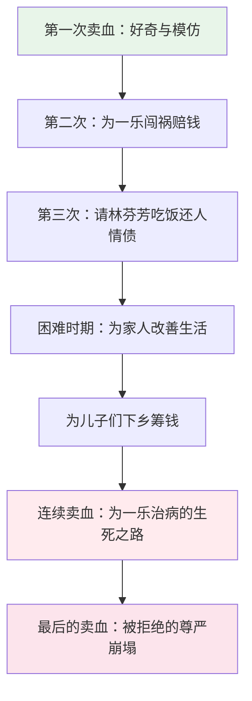
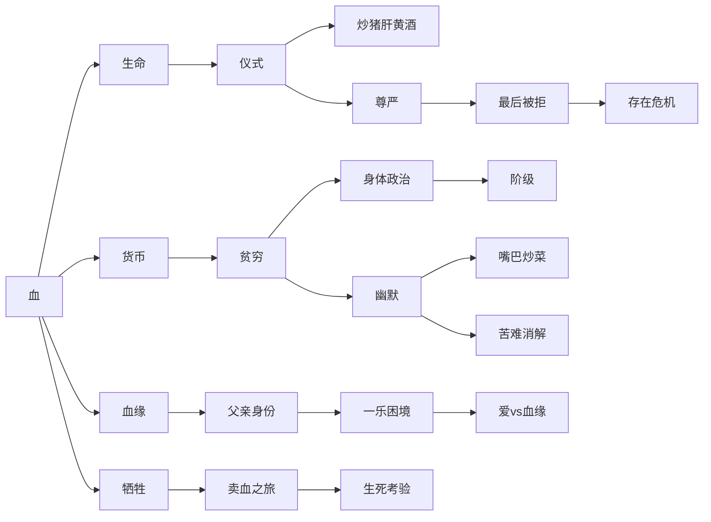

## 一、文学坐标定位

> [!abstract] 速览
> 《许三观卖血记》是余华创作于1995年的长篇小说，紧随[[《活着》 - 余华|《活着》]]之后，构成了余华"民间苦难叙事"的双璧。小说以第三人称讲述了丝厂送茧工许三观在数十年间反复卖血求生的故事——从1950年代到改革开放之后，许三观每逢人生困境就去医院卖血，用自己身体里的血液换来金钱，抵御一次又一次的灾难。

余华在完成《活着》之后，继续深入中国底层民众的生存经验，但写作策略发生了重要变化。如果说《活着》是一部"减法小说"——通过不断删除亲人来凸显存在的重量，那么《许三观卖血记》则是一部==重复与变奏的小说==——通过许三观一次又一次卖血这个核心动作的反复出现，构建出一种音乐般的叙事节奏。每一次卖血的动机不同、背景不同、情感重量不同，但动作本身的重复创造了一种仪式感，使卖血从生理行为上升为一种==生存的隐喻==。

在余华的创作谱系中，《许三观卖血记》的语言比《活着》更为口语化和喜剧化。余华自己说过，写这部小说时他感到了一种前所未有的轻松和快乐——尽管故事本身依然充满苦难。这种"苦难中的幽默"正是本书最独特的文学品质。在世界文学脉络中，这部作品可以与狄更斯的底层叙事、契诃夫的悲喜剧、马尔克斯的民间叙事风格形成对话，但余华的声音始终是中国的、民间的、带着南方小城气息的。

---

## 二、叙事结构解析

> [!note] 重复与变奏的叙事引擎
> 小说的核心结构是"卖血"这一动作的反复出现。全书大约可以梳理出十二次卖血（或试图卖血），每一次都是许三观应对人生困境的方式。

你需要注意，这种重复不是简单的复制粘贴，而是一种音乐式的==主题与变奏==。每一次卖血，余华都会写到许三观走向医院的路、喝水撑饱身体、伸出手臂、血液流出、拿到钱、然后去吃一盘炒猪肝喝二两黄酒。这些程式化的细节构成了一个"卖血仪式"的固定框架，但框架之内的情感内容每次都在变化——从最初的好奇和轻松，到中间的无奈和悲壮，到最后的绝望和疯狂，再到尾声的荒诞与悲凉。

**为什么这样写**：余华选择重复结构而非线性递进结构，有深刻的叙事考量。第一，重复本身就是底层生活的本质——穷人的困境不是一次性的灾难，而是反复出现的困窘，每一次刚喘过气来就迎来下一次打击。第二，重复创造了一种==积累效应==——当你读到许三观第十次走向医院时，前面九次的记忆都叠加在这一次上，情感重量是累积的。第三，重复使卖血这个动作从具体事件升华为象征——它不再只是"去医院换钱"，而是代表了一种面对苦难的态度：==当你除了自己的身体什么都没有的时候，你就卖自己的血==。

> [!tip] 黄金圈拆解：叙事结构
> - **Why**：为什么用重复结构？因为底层的苦难就是重复的——不是一次毁灭性的打击，而是无尽的、周期性的困窘。
> - **How**：通过"卖血"这个核心动作的变奏，让每次重复都带来新的情感维度，同时保持仪式化的叙事节奏。
> - **What**：十二次卖血构成了许三观的人生编年史，每一次都是他用身体与命运交换的记录。

小说的时间跨度从1950年代延伸到改革开放之后，覆盖了==大跃进、文化大革命、改革开放==等重大历史时期。但与《活着》不同，《许三观卖血记》中的历史背景更加隐晦——余华不直接描写历史事件，而是让历史作为生活成本的变化、人际关系的紧张、生存压力的加剧等间接形式渗透到许三观的日常生活中。

---

## 三、主题与意象网络

### 主题一：血——生命的货币

> [!tip] 黄金圈拆解
> - **Why**：余华为什么选择"卖血"作为核心意象？因为血是人体中最具象征意义的物质——它同时指向生命、牺牲、血缘、亲情。当一个人把自己的血卖出去换钱时，他实际上是在用自己的生命力去交换生存的资源。
> - **How**：通过卖血的重复与变奏，让"血"从一种生理物质逐渐变成一种隐喻系统——血是货币、是亲情的证明、是男性气概的标志、是底层生存的最后资本。
> - **What**：许三观一次次走进医院，伸出手臂，看着自己的血流进瓶子，拿到钱，去吃炒猪肝喝黄酒补身体。

**文本细读**：小说开篇，许三观去卖血并非出于经济需要，而是出于一种朴素的好奇和跟风——他的同乡根龙和阿方都去卖过血，告诉他卖一次血可以赚三十五块钱。许三观第一次卖血时，心态是轻松甚至兴奋的。他用卖血的钱娶了许玉兰，开始了自己的家庭生活。这第一次卖血的意义在于：它建立了一个==因果链==——卖血等于解决问题。从此以后，每当许三观遇到困境，他的本能反应就是去卖血。

**概念网络**：血在小说中至少有四重含义交织在一起——

1. **生理之血**：一种可以被抽取、可以再生的身体液体。余华反复书写卖血前喝大量水来"稀释"血液的细节，以及卖血后吃炒猪肝喝黄酒"补血"的仪式。这些生理细节赋予了卖血行为一种粗粝的物质感。

2. **经济之血**：血被折算为货币（三十五块钱一次），成为许三观唯一的"资产"。当他没有田地、没有积蓄、没有技术、没有社会关系时，他的血就是他全部的资本。这是对底层生存处境的极致隐喻：==你除了自己的身体，一无所有==。

3. **血缘之血**：小说中最大的戏剧冲突之一是"一乐是不是许三观的亲生儿子"。全城都说一乐长得像何小勇，暗示许玉兰在婚前与何小勇有过关系。许三观对一乐的态度因此反复摇摆——他一方面把一乐当自己的儿子养大，另一方面又在每次生气时拿"你不是我亲生的"来伤害一乐。血缘关系的不确定性成为许三观内心最大的伤口。

4. **牺牲之血**：许三观最后为一乐治病而连续卖血，在从家乡到上海的路上一站站卖血，几乎把命搭进去。这时候的血已经不再是"货币"，而是父亲为儿子献出的生命本身——==尤其讽刺的是，他可能不是一乐的生父==。

**苏格拉底追问**：卖血究竟是一种主动行为还是被动行为？表面上看，许三观每次都是"主动"去卖血的——没有人强迫他。但实际上，他的"主动"是在没有任何其他选择的前提下做出的——他不是在"选择"卖血，而是在"别无选择"的情况下做出了唯一可行的行动。这就像一个溺水的人"主动"抓住了救命稻草——你能说他是在自由选择吗？余华通过许三观的卖血，展示了底层民众所谓"自由意志"的实质：==在极端贫困中，自由只是生存本能的另一个名字==。

---

### 主题二：父亲——不被承认的爱

> [!tip] 黄金圈拆解
> - **Why**：余华为什么要设置"一乐可能不是亲生儿子"这条线索？因为它制造了全书最深刻的伦理困境：一个父亲对非亲生儿子的爱，是否需要血缘关系来验证？
> - **How**：通过许三观对一乐态度的反复摇摆——接纳、排斥、再接纳——展示了人性中理性与情感的拉锯。
> - **What**：许三观一方面恨一乐（因为一乐的存在提醒他妻子的"不忠"），一方面爱一乐（因为他养大了这个孩子），最终在一乐生命垂危时用连续卖血证明了爱。

**文本细读**：许三观与一乐的关系是全书最复杂的情感线索。当一乐打伤了方铁匠的儿子、需要赔医药费时，许三观去卖血筹钱，但他心里想的是："凭什么要我出钱？他又不是我亲生的。"这种想法每次在许三观遇到困难时都会冒出来——"不是亲生的"成为他拒绝承担责任的心理防线。

但余华在不动声色中展示了另一面：每一次许三观在心里划清界限之后，他最终还是承担了责任。他骂骂咧咧地去卖血，嘴上说着"凭什么"，但血还是卖了，钱还是付了。到了一乐得了肝炎、需要到上海去治病的时候，许三观做出了全书最壮烈的决定——一路卖血，从家乡到上海，每到一个城镇就去医院卖一次血。他几乎因为过度失血而死在路上。

> [!warning] 核心悖论
> 许三观用可能"不属于自己的血"去拯救"可能不是自己亲生的儿子"。血缘关系的不确定性不但没有削弱这个行为的力量，反而使其更加动人——因为它证明了==爱可以超越血缘，养育之恩可以大于生育之恩==。

**概念网络**：父亲身份在小说中与"面子""尊严""男性气概"紧密关联。许三观无法接受一乐不是亲生儿子，不仅仅是因为情感上的背叛，更是因为在他生活的小城社会中，"戴绿帽子"是对男人最大的羞辱。他对一乐的排斥，与其说是不爱一乐，不如说是他在社会压力下的自我保护。而他最终为一乐拼命卖血的行为，正是冲破了这层社会面具，回归了人性的本真。

**苏格拉底追问**：许三观为一乐卖血，是出于"父爱"还是"责任感"？还是两者的区分本身就是虚假的？余华似乎在暗示：在长年累月的共同生活中，养育本身就创造了一种不亚于血缘的联结。许三观不需要DNA检测来确认自己是不是一乐的父亲——他喂了一乐二十年的饭、操了二十年的心、卖了好几次血来解决一乐的问题，这些行为本身就是父亲的定义。

---

### 主题三：许玉兰——被审判与自我辩护的女性

> [!tip] 黄金圈拆解
> - **Why**：余华为什么要塑造许玉兰这个角色？因为她代表了中国底层女性在道德审判、婚姻困境和生存压力中的复杂处境。
> - **How**：通过许玉兰从"泼辣的年轻女人"到"街头被批斗的罪人"再到"坚韧的母亲和妻子"的角色变迁，展示了一个女性在时代碾压下的完整生命轨迹。
> - **What**：许玉兰嫁给许三观之前可能与何小勇有过关系，因此一乐的血统成疑。这个"污点"像影子一样跟随了她一生。

**文本细读**：许玉兰是小说中最被低估的角色之一。她被反复提起的"不忠"行为，在文本中其实是模糊的——余华从未给出确切答案，一乐到底是不是许三观的儿子。但在小城的舆论场中，"许玉兰和何小勇有过关系"已经被当作事实。许三观每次与许玉兰吵架时都会提起这件事，把它当作道德优势来压制妻子。

但许玉兰不是一个被动的受害者。她有自己的生命力和应对策略。她在家里泼辣、强势，和许三观的吵架场景往往充满了底层生活的粗俗幽默。文革期间她被拉出去批斗，许三观给她送饭——这个细节极为动人：在公共场域中她是"罪人"，但在家庭空间中她仍然是妻子和母亲，许三观用送饭这个行为无声地表达了一种朴素的忠诚。

**苏格拉底追问**：许玉兰的"不忠"（如果确实发生过）在多大程度上应该被追究？余华没有给出道德判断，但他呈现了一种现实：在那个年代的小城中，一个女人婚前的性行为足以成为她一辈子的枷锁。许三观不断提起此事，既是出于真实的痛苦，也是出于一种权力需要——它让他在婚姻关系中始终占据道德高地。余华通过这个设置，不动声色地揭示了==两性关系中的权力结构==。

---

### 主题四：仪式——卖血前后的固定程式

> [!tip] 黄金圈拆解
> - **Why**：余华为什么要反复书写卖血前喝水、卖血后吃炒猪肝喝黄酒的细节？因为这些细节构成了一种「仪式」，而仪式是人在面对不可控力量时为自己创造的一种秩序感。
> - **How**：每次卖血前后的固定程序被写成几乎相同的句式，形成一种文学上的"固定旋律"，强化了叙事的节奏感和象征性。
> - **What**：喝水、卖血、炒猪肝、黄酒——这四个步骤构成了许三观的"卖血仪式"。

**文本细读**：许三观每次去卖血前都要喝大量的水——据说这样可以让血液变"稀"，显得血量更多。这个民间智慧的真实性值得怀疑，但它在叙事中的功能是明确的：它是许三观能够掌控的唯一环节。他无法控制命运给他的打击，无法控制血液的价格，无法控制自己的身体什么时候撑不住，但他可以控制自己喝多少水。这种==微小的控制感==是底层民众面对无常命运时的心理支撑。

卖血之后的炒猪肝和黄酒同样意味深长。许三观每次卖完血，无论多么窘迫，都要去饭馆吃一盘炒猪肝、喝二两温黄酒。这不仅是"补血"的民间方法，更是一种==自我犒赏的仪式==——他刚刚用身体换了钱，现在他要用一小部分钱来犒劳自己的身体。这个循环（卖血—花钱—补血）构成了一个闭合的生存回路。

**概念网络**：仪式感在本书中与"尊严"主题紧密相连。许三观是一个没有任何社会资源的底层工人，他没有权力、没有财富、没有文化，但他通过卖血的仪式维持了一种微小的尊严感：我不是在乞讨，我是在用自己的东西（血）进行一场公平交易。这种尊严感在小说最后被彻底击碎——当年老的许三观想再卖一次血时，血头告诉他："你的血没人要了。"这意味着他最后的"资产"也失去了价值，他的身体不再是可以交换的资源了。这是全书最悲伤的时刻之一。

---

### 主题五：苦难中的幽默——余华的叙事伦理

> [!tip] 黄金圈拆解
> - **Why**：余华为什么在苦难叙事中注入大量幽默？因为幽默是中国底层民众真正的生存策略——用笑来消解痛苦，用荒诞来解构悲剧。
> - **How**：通过人物对话的喜剧性、情节的荒诞性、叙述语调的轻松感，在苦难叙事中创造一种独特的"含泪的笑"。
> - **What**：许三观与许玉兰的吵架、许三观教训一乐的方式、许三观在困境中的自我安慰，都充满了令人啼笑皆非的幽默。

**文本细读**：许三观是一个天生的"幽默家"——不是因为他聪明或机智，而是因为他有一种底层民众特有的==混不吝==的生活态度。当他发现一乐可能不是自己亲生儿子时，他没有暴怒或崩溃，而是在街上逢人就说，把自己的屈辱变成一种公共叙事。这种行为在表面上看是"丢人现眼"，但在深层结构上是一种自我治疗——通过反复讲述屈辱来消解屈辱的力量。

最具代表性的幽默场景之一是许三观在困难时期用"嘴巴炒菜"——家里什么吃的都没有，他让三个儿子躺在床上，用嘴巴描述炒菜的过程：先放油、再放肉、翻炒几下、加盐、出锅……三个儿子听得口水直流，仿佛真的在吃一顿大餐。这个场景是全书最经典的段落之一，它同时是==喜剧和悲剧==——喜剧在于那种荒诞的想象力，悲剧在于他们真的穷到只能用语言来充饥。

> [!important] 叙事伦理
> 余华在《许三观卖血记》中实践的叙事伦理是：==不用悲剧的语调讲述悲剧==。他选择让苦难以一种幽默的、甚至滑稽的面貌出现，不是为了削弱苦难的重量，而是为了呈现苦难的真实质地。真正的苦难不总是哭天抢地的——更多的时候，它是在一顿想象中的饭菜、一次咬牙的卖血、一句"日子还要过"的自我安慰中被消化掉的。

**苏格拉底追问**：幽默是在消解苦难，还是在遮蔽苦难？这个问题直指余华叙事策略的核心。批评者可能认为，过多的幽默会让读者忘记苦难的严重性，使苦难变得"可爱"甚至"可接受"。但余华的回答似乎是：苦难的严重性不需要通过沉重的叙事来证明——相反，==当你看到一个人在最绝望的处境中还能笑出来，你感受到的苦难反而更深==。因为你知道，那个笑容背后是多么巨大的承受力。

---

### 主题六：身体政治——底层的最后资源

> [!tip] 黄金圈拆解
> - **Why**：余华通过许三观的身体，探讨了一个根本性的政治经济学问题：当一个人被剥夺了所有社会资源后，他的身体就成了最后的、也是唯一的交换物。
> - **How**：卖血作为一种身体交易，将底层生存的残酷性具象化——你的血液就是你的货币，你的身体就是你的银行。
> - **What**：许三观用血液换取了妻子、换取了家庭的存续、换取了儿子的生命。

**文本细读**：卖血在小说中的经济学逻辑是清晰的：三十五块钱一次（后来涨价），每次需要间隔数月以恢复身体。这意味着许三观的"存款"是有限的，他不能无限制地提取。当他为一乐治病而连续卖血时，他实际上是在透支自己的"账户"——每次卖血之间的间隔越来越短，身体越来越虚弱，他在拿命去赌。

**概念网络**：身体政治这个主题与"阶级"密切相关。有钱人不需要卖血——他们有其他资源可以调用。卖血者都是底层民众，他们用体力劳动赚取日常生计，用血液应对紧急危机。这形成了一种残酷的等级制度：==你在社会阶层中的位置，决定了你在多大程度上需要用自己的身体去交换生存的权利==。

**苏格拉底追问**：卖血与卖劳力有什么本质区别？从纯经济学的角度看，两者都是出售身体的功能来换取报酬。但在象征层面上，卖血更具侵入性——劳动使用的是身体的外部功能（力气、技能），而卖血则是抽取身体的内部物质（血液）。这种区别意味着卖血是一种更深层的自我消耗：==你不是在使用身体，你是在消耗身体==。余华通过这个区别，暗示了底层生存的终极困境：当你把自己都用完了，你还剩下什么？

---

## 四、人物分析

### 许三观

许三观是余华笔下最鲜活的人物之一。与福贵的沉默和忍耐不同，许三观是一个==爱说话、爱抱怨、爱折腾的普通人==。他不是圣人，不是英雄，他是一个有很多缺点的丈夫和父亲——他对一乐的态度反复无常，他在困难时期偷偷带二乐和三乐去吃面却把一乐丢在家里，他对许玉兰的"不忠"耿耿于怀几十年。

但正是这些缺点使许三观成为一个真实可信的人。他的伟大不在于道德上的完美，而在于他在自己的不完美中展现出来的==生命力和韧性==。每一次生活把他击倒，他都能从地上爬起来，骂骂咧咧地走向医院，卷起袖子，伸出手臂。他的力量不是英雄的力量，而是==普通人的力量==——一种不需要信念支撑、不需要哲学指引、只凭本能和习惯就能维持下去的生存意志。

许三观的人物弧光在小说最后达到了高潮。当他年老体衰、想再卖一次血时，被告知他的血已经没人要了。他坐在街边哭泣——这是全书中许三观唯一一次真正崩溃的时刻。他之前承受了那么多苦难都没有崩溃，但"你的血没人要了"这句话击溃了他。为什么？因为卖血是他最后的身份认同——==我是一个还能卖血的人==，这意味着==我还有用，我还能保护家人，我还有最后的资源==。当这个身份被否定时，他感到的不是经济上的恐慌，而是存在意义上的虚无。

### 许玉兰

许玉兰不是一个"贤妻良母"式的传统女性——她泼辣、强硬、嗓门大、爱吵架。但她也不是一个"坏女人"——她忠实于自己的家庭（至少在婚后），辛辛苦苦地操持家务，在困难时期用各种方式维持家庭的运转。

许玉兰最动人的时刻是在文革期间被批斗的场景。她被剃了阴阳头、挂了牌子，站在街上被人指指点点。许三观给她送饭，站在人群外面看着她。这个时刻的许玉兰不再是那个泼辣的女人，而是一个被时代碾压的、无助的、但仍然要吃饭活下去的普通人。余华在这里展示了他一贯的叙事哲学：==尊严可以被剥夺，但生存本能不会被消灭==。被批斗的许玉兰仍然要吃饭，就像卖血后的许三观仍然要吃炒猪肝喝黄酒。

### 一乐、二乐、三乐

三个儿子在小说中主要作为许三观"父亲身份"的映射而存在。一乐因为血统问题而成为许三观内心冲突的核心；二乐和三乐则是"确定的亲生儿子"，在许三观的情感天平上享受着不同的待遇。但余华巧妙地安排了一个反转：最需要许三观拯救的、最终激发出许三观最深沉父爱的，恰恰是那个"可能不是亲生的"一乐。

一乐的角色设定揭示了一个深刻的主题：==亲情不是天生的本能，而是后天建构的产物==。许三观对一乐的爱不是基于血缘的"本能"之爱，而是在二十年共同生活中一点一点积累起来的、夹杂着怨恨和心疼的复杂情感。这种爱比纯粹的血缘之爱更脆弱，但也更珍贵。

### 根龙与阿方

根龙和阿方是许三观的卖血"师父"——是他们带许三观第一次去卖血的。这两个次要角色在小说中具有重要的结构功能：他们是许三观的"影子人物"，展示了同样走上卖血之路的人可能面对的其他命运。根龙后来因为卖血过多而死——他的死是一个警告，暗示了许三观连续卖血的潜在后果。

---

## 五、风格与语言

> [!note] 口语化的叙事革命
> 《许三观卖血记》的语言可能是中国当代文学中最接近"说书人"传统的叙事声音之一。余华采用了一种极度口语化、重复性强、节奏感明显的语言风格。

**为什么这样写**：余华选择口语化语言有多重考量。首先，它与小说的主人公匹配——许三观是一个底层工人，他的世界是由口语建构的，用文学性的语言来讲述他的故事会产生一种虚假感。其次，口语化语言具有天然的节奏感和重复性，这与小说的重复结构形成了呼应。第三，口语化语言拉近了读者与人物的距离——你感觉不是在"阅读"许三观的故事，而是在"听"他讲述自己的生活。

余华在这部小说中大量使用了==平行句式和排比结构==。例如，当许三观在饥荒时期用语言"做菜"时，他的叙述是一连串平行的、类似说书人口吻的句子。这种句式创造了一种口头文学的韵律，使小说在某些段落中具有了民间叙事的质感。

**与《活着》的风格比较**：如果说《活着》的语言是"克制的"——用最少的词说最重的事，那么《许三观卖血记》的语言则是"丰沛的"——用大量的重复、对话、日常细节来堆叠出生活的质感。两部小说的共同点在于：==都拒绝使用知识分子的语言来描写底层生活==。余华不从上往下看他的人物，他平视他们，用他们自己的语言来讲述他们的故事。

---

## 六、关键场景深度细读

### 场景一：嘴巴炒菜

> [!quote] 核心段落
> 困难时期，许三观一家揭不开锅。许三观让三个儿子躺在床上，开始用嘴巴"做菜"——他描述红烧肉的每一个烹饪步骤，三个儿子听得垂涎三尺。

**为什么这个场景如此重要**：这是全书最具象征意义的场景之一。它同时在三个层面上运作——

1. **现实层面**：一个父亲在无法给孩子食物的情况下，用语言来替代食物。这是贫穷的极致表达。
2. **幽默层面**：这个场景是荒诞的、滑稽的，它让你忍不住想笑——但笑过之后是深深的心酸。
3. **隐喻层面**：语言替代物质，想象替代现实——这其实也是文学本身的运作方式。余华通过这个场景，无意中触及了一个元叙事的问题：==当现实无法满足我们的需要时，叙事（语言、想象、故事）是否可以成为一种替代性的满足？==

### 场景二：许三观为一乐送面

许三观在困难时期带二乐和三乐去吃面条，却故意把一乐留在家里——因为"他不是我亲生的"。一乐一个人在家哭泣，后来自己跑出去找亲生父亲何小勇，却被何小勇拒之门外。一乐在街头游荡，许三观最终把他找回来，带他也去吃了一碗面。

**为什么这个场景如此重要**：这是许三观内心冲突的最完整展示。他的行为逻辑是：一乐不是亲生的，所以他没有义务平等对待一乐。但他的情感逻辑是：一乐是他养大的，他看不得一乐受苦。这两种逻辑在这个场景中产生了最尖锐的冲突——他先按照行为逻辑行事（排除一乐），然后被情感逻辑拉回来（最终带一乐去吃面）。

这个场景还揭示了一个残酷的事实：一乐在生父和养父之间两头落空——何小勇不认他，许三观也不真心接纳他。他是一个==在血缘关系的缝隙中坠落的孩子==。

### 场景三：连续卖血的生死之旅

一乐得了肝炎，需要到上海的大医院治疗。许三观没有钱，于是决定一路卖血去上海。他从家乡出发，每到一个城镇就去医院卖一次血，拿了钱继续赶路，到下一个城镇再卖。由于卖血间隔太短，他的身体越来越虚弱，在某一次卖血后几乎昏死过去。

**为什么这个场景如此重要**：这是全书的高潮，也是许三观作为父亲的终极考验。他在用生命赌生命——用自己可能流尽的血液去换取儿子活下来的机会。这里的叙事张力达到了最大值：

1. **物理层面的紧张**：许三观的身体能否撑住？每次卖血后的虚弱描写越来越触目惊心。
2. **道德层面的升华**：许三观不再纠结一乐是不是亲生的——在生死面前，那个问题变得毫不重要。
3. **重复结构的极致运用**：此前所有的卖血都是单次的、间歇的，现在变成了连续的、密集的。这种节奏的骤然加速，将全书积累的情感能量集中释放。

> [!important] 叙事高潮的结构意义
> 余华将最密集的卖血安排在小说的最后三分之一，是一个精妙的结构设计。前面十几次卖血建立了"卖血=解决问题"的模式，读者已经习惯了这个模式。但当卖血变成连续的、要命的行为时，这个熟悉的模式被推向了极端，读者此前积累的所有情感——对许三观的同情、对一乐的担忧、对卖血仪式的熟悉——都在这个高潮中爆发。

### 场景四：最后的卖血——被拒绝

改革开放后，许三观的生活已经好转。有一天他路过医院，突然想再卖一次血。这一次不是因为缺钱，而是出于一种说不清的冲动——也许是怀念，也许是想确认自己"还行"。但血头看了看他，说了一句改变一切的话：你的血只能卖给油漆匠刷漆用。

**为什么这个场景如此重要**：这是全书最具存在主义意味的时刻。许三观不是因为贫穷而崩溃，而是因为==丧失了自我定义的能力==而崩溃。卖血是他数十年来应对世界的方式，是他的身份认同、他的生存策略、他的尊严所在。当这个能力被否定时，他感到的是一种根本性的==存在危机==：如果我不能卖血了，那我是谁？如果遇到困难我该怎么办？

许三观坐在街边哭泣的画面，与小说开头那个兴冲冲去卖血的年轻人形成了首尾呼应。时间把一个充满活力的身体变成了一个无用的老躯壳，而许三观的全部人生就在这两个端点之间展开。

---

## 七、概念网络：核心概念关系图

---

## 八、文学批评多视角

**存在主义视角**：许三观与[[《活着》 - 余华|福贵]]的核心区别在于——福贵是被动承受命运的，而许三观是主动应对命运的（尽管他的"主动"选择极为有限）。每次卖血都是许三观的一次"行动"，一次用自己的身体向命运讨价还价的尝试。在存在主义框架下，许三观比福贵更接近萨特意义上的"自由人"——他在极端受限的条件下仍然做出选择，尽管选择只有一种：卖血。

**马克思主义视角**：卖血是劳动价值论的极端案例——当劳动者除了劳动力本身之外一无所有时，他甚至需要出售自己的身体物质来换取生存。许三观的故事可以被读作对底层劳动者处境的深刻隐喻：你不拥有生产资料，你不拥有社会资本，你甚至不拥有自己的血液——因为它随时可能被需要，被抽取，被折算为三十五块钱。

**女性主义视角**：许玉兰的遭遇揭示了父权社会中女性的双重困境。她因为可能的婚前性行为而被终身道德审判——这个审判不来自法律或制度，而来自家庭和社区的舆论。许三观每次用"一乐不是我的"来攻击许玉兰时，他行使的是一种==道德暴力==——用一个无法证实也无法证伪的指控来维持自己在婚姻中的权力优势。余华没有明确批判许三观，但他通过叙事的呈现让读者看到了这种权力结构的运作方式。

**身体政治学视角**：福柯意义上的"生命权力"（biopower）在这部小说中有了一种中国式的表达。国家通过政治运动控制人民的生活（大跃进、文革），而底层民众唯一能够自主处置的就是自己的身体。卖血是许三观对自己身体的一种"自治"行为——在一个他无法控制任何事情的世界里，他至少可以决定什么时候卖自己的血。

---

## 九、与《活着》的互文对读

> [!note] 双峰互照
> 《许三观卖血记》与[[《活着》 - 余华|《活着》]]构成了余华"民间苦难叙事"的双壁，但两部作品在多个维度上形成了对照。

| 维度 | 《活着》 | 《许三观卖血记》 |
|------|---------|----------------|
| 叙事人称 | 第一人称（嵌套叙事） | 第三人称 |
| 核心动作 | 失去（亲人一个个死去） | 卖血（反复应对困境） |
| 主人公性格 | 沉默、忍耐 | 活泼、爱说话、爱抱怨 |
| 苦难的质感 | 沉重、压抑 | 幽默、荒诞 |
| 时间结构 | 线性递减（不断失去） | 循环往复（反复卖血） |
| 终极主题 | 活着本身就是意义 | 身体是最后的资源 |
| 结尾情绪 | 平静的虚无 | 悲伤的荒诞 |

两部小说的共同点是更为根本的：它们都关注的是==普通中国人如何在极端困境中存活下来==。余华不关心宏大叙事、不关心历史评判、不关心道德说教——他只关心一个问题：一个人被逼到绝境之后，他是怎么活过来的？

---

## 十、跨时空共鸣

《许三观卖血记》在今天依然具有强烈的现实共鸣。虽然当代中国人不再需要卖血来维持生存，但"用身体换取生存资源"的逻辑并没有消失——996工作制、过度加班、以健康换取收入，这些当代现象与许三观的卖血之间存在着结构性的相似。

更深层的共鸣在于：许三观面对的核心困境——==当你除了自己的身体什么都没有的时候，你该怎么办？==——在任何时代、任何社会中都是成立的。无论你是一个1960年代的中国底层工人，还是一个2020年代的打工人，当你被剥夺了所有外部资源后，你最终只能依靠自己的身体——你的体力、你的精力、你的时间、你的健康。许三观卖的是血液，你卖的是什么？

---

## 十一、费曼终极检验

> [!abstract] 用最简单的话概括
> 如果你要向一个没读过《许三观卖血记》的朋友解释这本书，可以这样说：

有一个叫许三观的普通工人，他一辈子遇到什么过不去的坎儿，就去医院卖血。儿子闯祸了——卖血赔钱。家里揭不开锅了——卖血买吃的。儿子得了重病——一路卖血去上海治病，差点把自己的命搭进去。

这本书有意思的地方在于，它明明写的是一个很苦的故事，但你读着读着会笑出来。许三观这个人特别有意思——他爱发牢骚、爱占小便宜、对可能不是亲生的大儿子又爱又恨。他不是什么了不起的人，他就是==你身边那种最普通的中国男人==——遇事就抱怨两句，抱怨完该干什么还干什么。

但是到了最后，许三观老了，他去医院想再卖一次血，人家告诉他：你的血没人要了。他坐在街边哭了。这个时候你才意识到：卖血这件事对他来说不只是赚钱的方式，而是他活着的方式，是他证明自己还有用的方式。==当一个人连卖血的资格都没有了，他会觉得自己什么都不是了==。

这本书最厉害的地方在于：余华让你笑着笑着就哭了，而且你说不清自己到底是在笑还是在哭。

---

## 延伸阅读路线图

> [!note] 推荐阅读路径

- [[《活着》 - 余华]] — 余华的另一座高峰，与本书构成"民间苦难叙事"的双壁
- [[《兄弟》]] — 余华更宏大的长篇，展示了中国从文革到改革开放的社会裂变
- [[《第七天》]] — 余华的争议之作，以亡灵视角审视当代中国的荒诞
- [[《老人与海》]] — 海明威的硬汉主义与许三观的卖血精神形成有趣对照
- [[《局外人》]] — 加缪的存在主义经典，可与许三观最后的存在危机对照阅读
- [[《骆驼祥子》]] — 老舍对底层劳动者命运的经典书写，与本书主题高度呼应
- [[《平凡的世界》]] — 路遥的现实主义巨著，提供了对中国底层生存的另一种叙事视角
