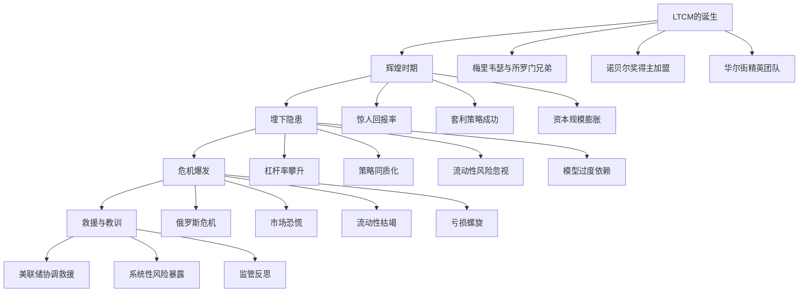
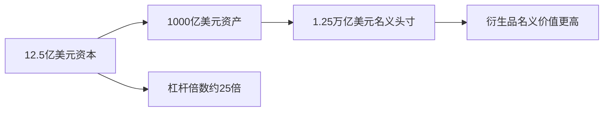
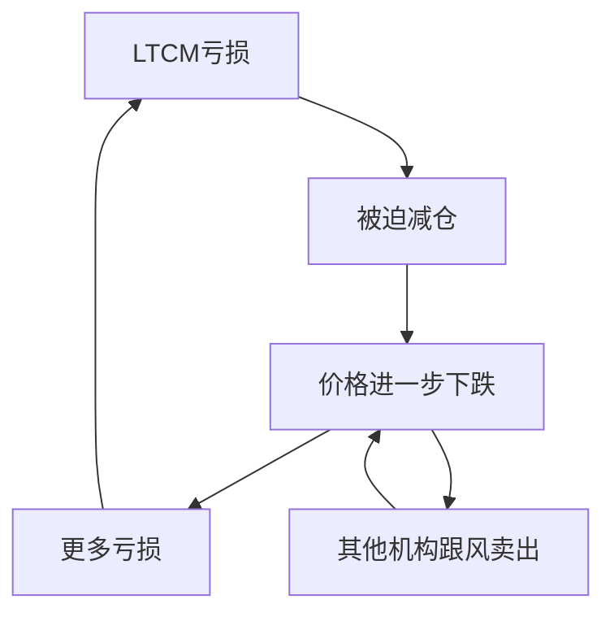
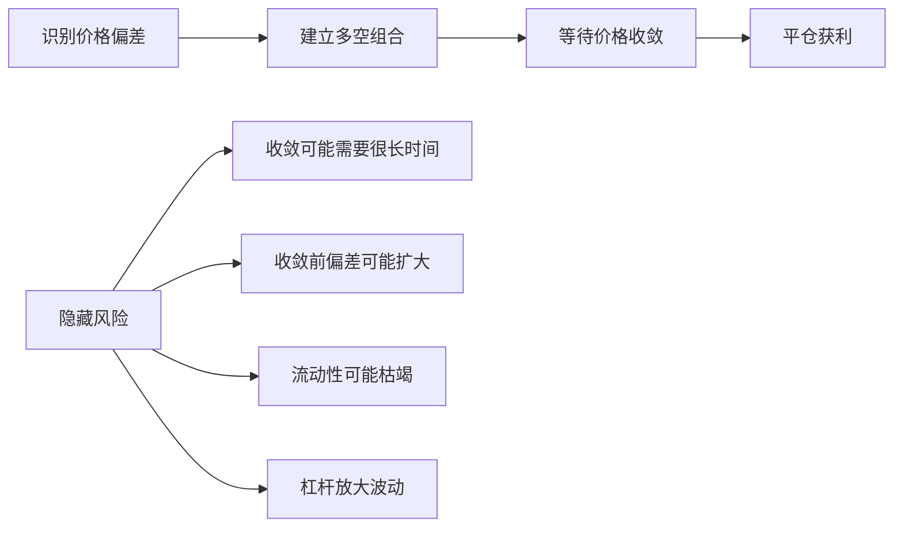

# 《赌金者》深度读书笔记

## 一、元信息/坐标定位

### 作者背景
罗杰·洛温斯坦（Roger Lowenstein）是美国著名财经作家和记者，曾任《华尔街日报》资深记者和专栏作家。他以深入、细致的金融调查报道闻名，著有多部畅销财经书籍，包括关于巴菲特的传记《巴菲特：一个美国资本家的成长》。洛温斯坦的写作特点是==将复杂的金融概念转化为引人入胜的叙事==，同时保持分析的深度和严谨。

### 写作时代背景
本书出版于2000年，距离长期资本管理公司（LTCM）崩溃仅两年。这一时期，全球金融市场刚刚从1997年亚洲金融危机和1998年俄罗斯债务违约的冲击中恢复，LTCM的崩溃差点引发全球金融系统的连锁崩溃。洛温斯坦的这本书是对这一事件的==第一部系统性记录和分析==。

### 学科定位
本书处于金融史、风险管理和行为金融学的交汇处。它不仅仅是一个企业兴衰的故事，更是对==现代金融理论在实践中的压力测试==。书中涉及的期权定价理论、风险价值模型、市场有效性假说等，都是现代金融学的核心内容。

### 核心问题
本书试图回答一个令人困惑的问题：==为什么聚集了华尔街最聪明头脑的公司会以如此灾难性的方式失败？==诺贝尔经济学奖得主、顶级交易员、最先进的数学模型——这一切为何无法阻止崩溃的到来？

## 二、全书逻辑地图

全书按==时间线==展开，但在叙事中穿插了大量对金融理论、交易策略和人物性格的分析：

**第一阶段：起源**（第1-3章）
追溯约翰·梅里韦瑟在所罗门兄弟的崛起，以及他如何集结了包括诺贝尔奖得主在内的顶级团队创立LTCM。

**第二阶段：辉煌**（第4-6章）
记录LTCM早期的惊人成功，解释其核心策略——收敛交易和相对价值套利。

**第三阶段：傲慢与危机**（第7-9章）
分析LTCM如何因成功而傲慢，不断加大杠杆，同时市场环境开始恶化。

**第四阶段：崩溃与救援**（第10-12章）
详细描述1998年8月至9月的危机全过程，以及美联储主导的史无前例的私人救援行动。

## 三、核心主题/逐章深度拆解

### 第一部分：天才的集结

> [!abstract] 核心洞见
> LTCM的创立代表了华尔街历史上智力资本的最高密度集聚，但这种智力的集中也埋下了灾难的种子。

**约翰·梅里韦瑟：债券套利之父**

梅里韦瑟（John Meriwether）在所罗门兄弟公司创建了传奇的套利部门。他的特点是：

- ==数学天赋==与交易直觉的罕见结合
- 对团队建设的重视——他更像"教练"而非独立交易员
- 极度的冷静和风险偏好

1991年，所罗门兄弟的国债丑闻导致梅里韦瑟离职，但他很快筹集到12.5亿美元创立LTCM，这在当时是==对冲基金史上最大的首发资金==。

**诺贝尔奖得主的光环**

LTCM的核心智力资产是两位诺贝尔经济学奖得主：

1. **罗伯特·默顿（Robert Merton）**：期权定价理论的奠基人之一，将连续时间金融学发展为严密的数学体系。

2. **迈伦·斯科尔斯（Myron Scholes）**：与费舍尔·布莱克共同发明Black-Scholes期权定价公式。

> [!tip] 关键洞见
> 默顿和斯科尔斯的加盟不仅带来了智力声望，更带来了一种==对数学模型近乎宗教性的信仰==。这种信仰后来被证明是致命的。

**"套利"的哲学**

LTCM的核心策略基于一个==看似无懈可击的逻辑==：

市场中存在价格错误（mispricing），这些错误终将被纠正。通过识别相关证券之间的价格偏差，同时做多被低估的、做空被高估的，无论市场涨跌，只要价格收敛，就能获利。

这被称为==收敛交易（convergence trade）==或==相对价值套利==。

### 第二部分：辉煌岁月

> [!note] 业绩记录
> LTCM在1994-1997年的表现堪称传奇：
> - 1994年：28%（扣除费用后20%）
> - 1995年：59%（扣除费用后43%）
> - 1996年：57%（扣除费用后41%）
> - 1997年：25%（扣除费用后17%）

**典型策略解析**

1. **国债期货套利**
   美国国债与国债期货之间的价格应该保持特定关系。当偏差出现时，LTCM会买入便宜的、卖出贵的，等待价格收敛。

2. **新旧国债套利**
   最新发行的"当期国债"（on-the-run）通常比旧国债贵，因为流动性更好。LTCM做空当期国债、做多旧国债，赚取利差收敛的利润。

3. **掉期利差交易**
   利率掉期与国债之间的利差通常在一定范围内波动。LTCM在利差异常时建仓，等待回归均值。

**杠杆的诱惑**

单笔套利交易的利润很小——可能只有几个基点。为了获得可观的回报，LTCM必须使用==巨大的杠杆==。

> [!warning] 隐患初现
> 高杠杆意味着小幅价格波动会被放大为巨额盈亏。LTCM的模型假设市场波动在可控范围内，但这一假设从未被真正检验过。

**费用结构的傲慢**

LTCM收取==2%管理费和25%利润分成==，高于行业标准。更令人惊讶的是：

- 最低投资门槛1000万美元
- 三年锁定期
- 投资者几乎无法获得投资组合信息

投资者接受这些苛刻条件，是因为LTCM的业绩和声望。但这种==信息不对称==也意味着没有人真正了解LTCM在做什么。

### 第三部分：傲慢的积累

> [!abstract] 核心矛盾
> 成功带来了资本的涌入，但有限的套利机会无法吸收这么多资本。LTCM面临一个悖论：要保持高回报，要么降低资本，要么承担更多风险。

**被迫退回资本**

1997年底，LTCM做出一个令投资者震惊的决定：==退回27亿美元给投资者==。表面上这是因为"机会有限"，实际上是为了维持高回报率。

但讽刺的是，退回资本后，LTCM用更高的杠杆弥补了资本基础的缩小。风险并未降低，反而更加集中。

**策略的漂移**

随着传统套利机会减少，LTCM开始涉足：

- ==股票波动率交易==：卖出期权，收取权利金
- ==新兴市场债券==：俄罗斯、巴西等高风险市场
- ==并购套利==：押注公司并购能否完成

这些新策略偏离了LTCM的核心能力——==从相对价值套利转向了方向性押注==。

> [!warning] 模型的局限
> LTCM的风险模型（VaR，风险价值模型）基于历史数据。但历史数据无法预测"黑天鹅"事件。更危险的是，模型假设不同头寸之间的相关性是稳定的——这在危机中被证明是完全错误的。

**流动性幻觉**

LTCM的另一个致命假设是：==他们总是能够以合理价格平仓==。

在正常市场中，这是成立的。但LTCM的头寸如此之大，以至于：
- 他们自己就是市场的重要组成部分
- 他们的卖出会压低价格，买入会推高价格
- 在恐慌时期，可能根本找不到交易对手

**同质化的危险**

LTCM的策略并非独有。许多模仿者采用类似策略：

- 华尔街投行的自营交易部门
- 其他对冲基金
- 大学捐赠基金

当所有人持有类似头寸时，一旦有人被迫平仓，就会引发==连锁反应==——每个人都想在同一时间卖出同样的东西。

### 第四部分：灾难降临

> [!abstract] 时间线
> 1998年8月17日，俄罗斯宣布债务违约和卢布贬值，引发全球金融市场剧震。在随后的几周内，LTCM经历了从自信到恐慌的全过程。

**8月：危机爆发**

俄罗斯危机本身对LTCM的直接影响有限（他们的俄罗斯头寸规模不大），但它引发了==全球性的风险厌恶==：

- 投资者从风险资产逃向安全资产
- 流动性从所有市场抽离
- 相关性假设崩溃——所有资产同时下跌

LTCM在8月损失了==19亿美元==，资本从47亿美元降至28亿美元。

**9月：螺旋下坠**

这是经典的==死亡螺旋==：

- 9月1日：资本23亿美元
- 9月10日：资本15亿美元
- 9月21日：资本6亿美元

LTCM的模型告诉他们，亏损这么多的概率是"几百年一遇"。但现实证明，==模型错了==。

> [!tip] 关键教训
> 风险模型基于"正常"市场条件。但危机就是"不正常"的条件。在你最需要模型的时候，模型最不可靠。

**恐惧的蔓延**

LTCM的问题很快不再只是LTCM的问题：

- LTCM与16家主要银行有交易关系
- 如果LTCM被迫清算，会冲击整个金融市场
- 这些银行自己也持有类似头寸

美联储主席格林斯潘意识到，这不是一家基金的问题，而是==系统性风险==的问题。

### 第五部分：救援与反思

> [!abstract] 核心矛盾
> 美联储协调的救援引发了巨大争议：是否应该用政策影响力救助一家私人基金？这是否会制造道德风险？

**救援的过程**

1998年9月23日，在纽约联邦储备银行的协调下，14家银行和证券公司组成==救援联盟==，向LTCM注入36.25亿美元，获得90%股份。

救援的逻辑是：
- LTCM无序清算会引发市场灾难
- 有序解决比市场崩溃代价更小
- 这不是"bailout"（政府买单），而是私人救援

> [!warning] 道德风险
> 批评者认为，这次救援向华尔街传递了错误信号：==如果你足够大、关联足够多，你就不会被允许失败==。这种"大而不能倒"的逻辑在2008年金融危机中被进一步强化。

**失败的根源分析**

洛温斯坦在书中总结了LTCM失败的多重原因：

1. **杠杆过高**
   25倍以上的杠杆使得任何意外都可能是致命的。

2. **流动性风险被忽视**
   模型没有考虑在危机中无法以合理价格平仓的情况。

3. **相关性假设错误**
   危机中，所有资产的相关性趋向于1——所有东西一起下跌。

4. **模型过度自信**
   团队相信数学模型胜过市场直觉，忽视了"尾部风险"。

5. **傲慢与封闭**
   不愿与外界分享信息，错过了提前预警的机会。

6. **策略同质化**
   太多人采用类似策略，放大了市场冲击。

**历史的回响**

> [!note] 2008年的预演
> LTCM的故事在2008年金融危机中几乎原样重演：
> - 高杠杆金融机构
> - 复杂衍生品
> - 模型失灵
> - 系统性风险
> - 政府救援

LTCM是一次预警，但华尔街没有真正吸取教训。

## 四、核心框架提炼

### 框架一：收敛交易的逻辑与局限

==收敛交易理论上无风险，但实践中充满风险==。关键在于：你能否撑到收敛发生的那一天？

### 框架二：风险管理的层次

| 层次 | LTCM的做法 | 问题 |
|-----|-----------|-----|
| 单笔交易风险 | 严格控制 | 做得不错 |
| 组合风险 | VaR模型 | 相关性假设错误 |
| 流动性风险 | 基本忽视 | 致命失误 |
| 系统性风险 | 完全忽视 | 不在视野内 |
| 模型风险 | 过度自信 | 没有Plan B |

### 框架三：傲慢周期

成功的对冲基金往往遵循一个==傲慢周期==：

1. **早期成功**：策略有效，业绩出色
2. **资本涌入**：声望带来更多资金
3. **机会稀缺**：策略收益下降
4. **风险提升**：用更高杠杆或更大风险维持回报
5. **危机触发**：外部冲击暴露隐藏风险
6. **崩溃**：杠杆放大亏损，资本消失

### 框架四：系统性风险的构成

LTCM事件揭示了系统性风险的几个维度：

- ==规模==：头寸太大，无法有序退出
- ==关联==：与太多交易对手有关联
- ==同质==：太多机构持有类似头寸
- ==杠杆==：小波动被放大为大危机
- ==不透明==：没人知道整体风险有多大

## 五、批判性思考

### 对金融理论的反思

> [!warning] 市场有效性的局限
> LTCM的策略基于市场会纠正错误定价的假设。但==市场可以保持"错误"的时间，可能比你保持偿付能力的时间更长==。凯恩斯说得好："市场保持非理性的时间可能比你保持偿付能力的时间更长。"

**模型的本质局限**

金融模型基于几个根本性假设，这些假设在危机中往往崩溃：

1. **分布假设**：收益率服从正态分布？实际上尾部事件远比正态分布预测的频繁。

2. **相关性假设**：资产相关性稳定？实际上危机中相关性会突然升高。

3. **流动性假设**：总能以市场价格交易？实际上流动性可能瞬间消失。

4. **历史假设**：未来像过去？实际上"这次不一样"往往真的不一样。

### 人性因素

洛温斯坦没有将失败简单归咎于模型，而是深入探讨了==人性因素==：

- **过度自信**：聪明人更容易相信自己不会犯错
- **群体思维**：精英团队反而缺乏异见
- **锚定效应**：对自己策略的执着超越了对风险的敏感
- **渐进正常化**：逐渐习惯高杠杆，失去警觉

### 监管的困境

LTCM事件暴露了监管的根本困境：

1. **信息不对称**：监管者不知道对冲基金在做什么
2. **管辖权分散**：谁有权监管全球性基金？
3. **事后反应**：监管总是在危机后才加强
4. **道德风险**：救援会鼓励更冒险的行为

### 对"天才"的反思

==最聪明的人聚在一起，为什么会失败得如此彻底？==

可能的解释：
- 智力可以识别已知风险，但对未知风险无能为力
- 成功会削弱警觉性
- 相似的人聚在一起，盲点会叠加而非互补
- 理论和实践之间永远存在鸿沟

## 六、行动清单

### 投资者检查清单
- [ ] 任何投资前，问自己："如果我错了，最坏会怎样？"
- [ ] 了解你投资的基金使用多少杠杆
- [ ] 警惕持续的高收益——问问收益来自哪里
- [ ] 要求透明度，对"黑箱"策略保持怀疑
- [ ] 分散投资，不要把所有钱交给一个"天才"

### 风险管理原则
- [ ] 永远为最坏情况预留资本缓冲
- [ ] 不要只看VaR，要做压力测试
- [ ] 流动性风险和市场风险同样重要
- [ ] 定期审视相关性假设是否还成立
- [ ] 建立"如果模型错了"的应急计划

### 组织治理
- [ ] 鼓励异见，警惕"天才文化"
- [ ] 信息透明，让更多人了解风险
- [ ] 独立风险管理，不受业绩压力影响
- [ ] 定期复盘：哪些风险是我们没有考虑到的？

### 心智模型升级
- [ ] 接受"我可能是错的"这个可能性
- [ ] 历史不会重复，但会押韵——学习历史教训
- [ ] 区分"不太可能发生"和"不会发生"
- [ ] 记住：市场可以保持非理性的时间比你想象的长

## 七、延伸阅读路线图

### 金融危机深化
- [[《大而不倒》 - 安德鲁·罗斯·索尔金]]：2008年金融危机的全景记录
- [[《金融炼金术》 - 乔治·索罗斯]]：另一位对冲基金传奇的投资哲学
- [[《非理性繁荣》 - 罗伯特·席勒]]：资产泡沫的心理学分析

### 风险管理
- [[《黑天鹅》 - 纳西姆·塔勒布]]：极端事件的哲学与应对
- [[《随机漫步的傻瓜》 - 纳西姆·塔勒布]]：运气与技能的区分
- [[《对冲基金奇才》 - 杰克·施瓦格]]：多位顶级基金经理的智慧

### 行为金融
- [[《思考，快与慢》 - 丹尼尔·卡尼曼]]：认知偏差的系统分析
- [[《魔鬼经济学》 - 史蒂芬·列维特]]：经济学思维的应用
- [[《动物精神》 - 阿克洛夫&席勒]]：非理性如何主导经济

### 金融史
- [[《伟大的博弈》 - 约翰·戈登]]：华尔街的历史
- [[《1929年大崩盘》 - 约翰·肯尼斯·加尔布雷思]]：历史上的金融危机
- [[《这次不一样》 - 莱因哈特&罗格夫]]：800年金融危机史

## 八、费曼终极检验

**如果要向一个完全不懂金融的朋友解释这本书，我会这样说：**

想象有一群世界上最聪明的人——包括诺贝尔奖得主——创办了一个投资公司。他们发明了复杂的数学公式，用电脑找到市场中细微的价格差异，然后赚取这些差异带来的利润。

问题在于，这些价格差异太小了。如果你投入100块钱，可能只能赚1块钱。怎么办呢？他们借了很多钱。==投入100块钱自己的钱，再借2500块钱别人的钱，这样1%的收益就变成了25%的收益==。

最初几年，他们赚了很多钱。太多人想投资，他们甚至把一部分钱退回去。但为了保持高收益，他们借了更多的钱，承担了更大的风险。

然后，1998年，俄罗斯说"我不还债了"。全球投资者都慌了，所有人都想把风险资产换成安全资产。这家公司持有的东西突然变得不值钱了。

记住他们借了很多钱。==如果你只用自己的钱，亏10%不过是亏10%。但如果你借了25倍的钱，亏10%意味着你本金全没了还不够==。

更糟糕的是，他们想卖掉手中的东西止损，却发现没人买。他们的东西太多了，自己卖就会把价格砸得更低。这就像一场大火中，所有人都想从同一个门逃出去，结果谁也出不去。

几周之内，这家公司就从世界之巅跌入深渊。美联储不得不协调十几家大银行来救他们，因为如果他们倒了，整个金融系统都可能崩溃。

这个故事告诉我们几件事：

第一，==再聪明的人也会犯错==。而且聪明人可能犯更大的错，因为他们太相信自己。

第二，==数学模型不是水晶球==。模型基于过去的数据，但未来总会有模型没见过的情况。

第三，==借太多钱是危险的==。杠杆放大收益，也放大亏损。市场保持"错误"的时间可能比你能撑住的时间更长。

第四，==金融系统是相互关联的==。一家公司的问题可能变成所有人的问题。

这本书写的是1998年的事，但2008年的金融危机几乎是同一个故事的重演。华尔街似乎从不真正吸取教训。或者说，==贪婪总是比记忆更持久==。
