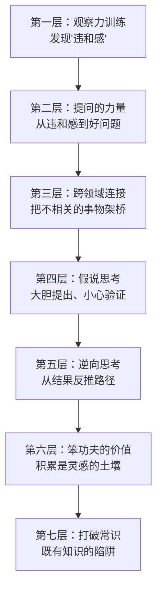
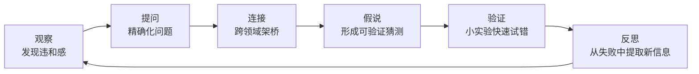

# 《逻辑创新思维法》深度拆解

## 一、元信息速览

《逻辑创新思维法》是日本农学家、科学家篠原信（Shinohara Makoto）的方法论著作。篠原信的本业是农业科学研究，他在长年的科研实践中发现：==创新不是天才的专利，而是一套可以训练的逻辑操作==。本书的日文原名暗示着"通过连接来产生灵感"的思路，核心主张是——把看似无关的事物建立新连接，就是创新的本质动作。

本书处于思维方法论与科学研究方法的交叉地带。它不是抽象的创造力鸡汤，而是一位实验科学家从自己的研究经历中提炼出的可操作思维工具箱。与[[《穷查理宝典》]]强调的多元思维模型有相似之处，但篠原信更聚焦于"从观察到假说到验证"的完整链条；与[[《第一性原理》]]的"回到基本事实"不同，篠原信强调的是"连接不同事实"。如果说第一性原理是纵向深挖，那逻辑创新思维就是横向架桥。

本书适合所有希望提升创造性解题能力的人——不限于科研人员，产品经理、创业者、教育工作者都能从中获得可迁移的思维工具。

## 二、全书逻辑地图

全书逻辑可提炼为==七步递进结构==，从感知层到行动层逐步深入：

**核心命题**：大多数人以为创新需要天赋或灵光一闪，篠原信用自己的科研实践证明——==创新是"观察 → 提问 → 连接 → 假说 → 验证"这条逻辑链的产物==。每一步都可以刻意训练，每一步都有具体方法。所谓灵感，不过是长期积累和系统思考在某个瞬间的集中释放。

## 三、逐章深度拆解

### 第一章：「观察力训练——发现"违和感"是创新的起点」

> [!tip] 创新的第一步不是想，而是看

**【核心论点】**

篠原信认为，==创新始于"违和感"——你注意到某件事情不对劲、不协调、不符合预期==。这种细微的不适感，正是绝大多数人忽略但创新者捕捉住的信号。科学史上许多重大发现都始于一个微小的"咦？这里好像不太对"。

**【详细拆解】**

篠原信区分了两种观察状态：

- **被动观察**：你看到了，但没有"看见"。你的大脑用已有的框架自动解释了一切，让一切显得"正常"。比如你每天走同一条路上班，路边的树叶颜色变化你根本不会注意到。
- **主动观察**：你带着"这里有什么不寻常？"的问题去看。你不急于用已有知识解释，而是允许自己停留在"不确定"的状态。

篠原信以自己在农业研究中的经历为例。他在观察农田时，注意到某些植物在相同条件下表现出不同的生长模式。大多数人会用"品种差异"一笔带过，但他停下来追问：条件真的完全相同吗？有没有我没注意到的变量？这种对"违和感"的敏锐捕捉，后来引导他发现了新的研究方向。

训练违和感的方法：

1. **慢下来**：快节奏生活让你的大脑默认开启"自动驾驶"模式，跳过一切异常信号。刻意放慢观察速度，你才能注意到那些被忽略的细节。
2. **记录异常**：看到任何让你觉得"有点奇怪"的事情，立刻记下来。不需要当场解释，先记录再说。
3. **抵抗"正常化"冲动**：大脑天然倾向于把异常解释为正常（"大概是因为……吧"）。创新者的特质是==能忍受"不知道为什么"的不适感，并让这种不适感驱动进一步探索==。
4. **多角度观察**：同一个现象，从不同的角度、不同的时间、不同的尺度去看，往往能发现单一视角下隐藏的信息。

**【费曼式解读】**

想象你是一个侦探，走进一个犯罪现场。普通人看到一间乱糟糟的房间会想"被打劫了"。但你注意到：桌上的咖啡杯还是热的、窗户从里面锁着、地上的脚印只有一种鞋码——这些"违和感"告诉你，事情没那么简单。篠原信说的"观察力训练"就是把你从"普通路人"训练成"侦探"——不是更聪明，而是更会看。

**【金句/关键概念】**

> ==大多数人不是缺乏创新能力，而是缺乏发现"不对劲"的能力。创新的起点不是答案，而是那个让你停下来皱眉的瞬间。==

---

### 第二章：「提问的力量——好问题比好答案重要一百倍」

> [!note] 问题的质量决定了思考的方向和深度

**【核心论点】**

发现违和感之后，下一步不是急着找答案，而是==把违和感转化为一个精确的问题==。篠原信强调，问题的质量决定了你能走多远。一个模糊的问题（"为什么这个不行？"）只能带来模糊的答案；一个精确的问题（"在温度和湿度都相同的条件下，为什么A区域的植物比B区域矮了20%？"）才能引导你走向真正的发现。

**【详细拆解】**

篠原信提出了一套"提问升级"方法：

- **第一级：描述性问题**——"发生了什么？"这是最基础的，把现象精确描述出来。
- **第二级：比较性问题**——"为什么A和B不同？"通过比较来缩小问题范围。
- **第三级：因果性问题**——"什么导致了这个差异？"开始触及机制层面。
- **第四级：条件性问题**——"在什么条件下这个因果关系成立/不成立？"探索边界条件。
- **第五级：可能性问题**——"如果改变X，会发生什么？"这就进入了假说领域。

篠原信指出，大多数人在第一级就停下了——看到现象，直接跳到自以为的答案。而优秀的思考者会沿着这个阶梯一步步攀升，每升一级，思考的精度和深度都在提高。

他还强调了一个重要原则：==不要害怕"笨问题"==。在科学研究中，那些看起来最天真的问题（"为什么苹果往下掉而不是往上飞？"）往往指向最深刻的发现。成年人不敢问"笨问题"是因为怕丢脸，但正是这种社会压力扼杀了创新思考。

**【费曼式解读】**

你去医院看病。一个普通医生问你"哪里不舒服？"——你说"头疼"——他给你开止痛药。一个好医生会追问："什么时候开始的？持续多久？哪个部位？伴随什么其他症状？什么情况下加重？什么情况下缓解？"——同样的头疼，经过精确提问，可能指向完全不同的诊断：偏头痛、颈椎问题、或者血压异常。篠原信说的"提问的力量"就是：==你问的问题有多精确，你的发现就有多深刻==。

**【金句/关键概念】**

> ==创新者和普通人的真正区别，不在于谁能想出更好的答案，而在于谁能提出更好的问题。答案是有保质期的，但一个好问题可以持续产生新的洞察。==

---

### 第三章：「跨领域连接——创新的核心动作是"架桥"」

> [!tip] 创新 = 把已有元素建立新连接

**【核心论点】**

这是全书的核心章节。篠原信主张：==创新的本质不是"从无到有"，而是"把已有的东西以新的方式连接起来"==。他用"连接"（つなげる）这个词来定义创新的核心动作——你不需要发明全新的零件，你需要的是把不同领域、不同学科、不同经验中的已有元素架起一座新的桥梁。

**【详细拆解】**

篠原信把"连接"分为三个层次：

1. **同领域内的连接**：把同一学科内被分别研究的两个现象联系起来。这是最基础的连接，通常产生"改进"而非"突破"。
2. **跨领域的连接**：把A领域的原理应用到B领域。篠原信认为这是创新最肥沃的土壤。他以自己的经历为例——他把某些生态学的观察方法引入到农业研究中，产生了传统农学研究者不会想到的视角。
3. **跨层次的连接**：把微观现象和宏观规律联系起来，或者把具体经验和抽象原理联系起来。这种连接往往产生理论级别的突破。

为什么跨领域连接能产生创新？篠原信给出了一个精妙的解释：==每个领域都有自己的"盲区"——从业者习以为常、不再追问的假设==。当一个外行人带着其他领域的视角进入时，他恰好能看到这些盲区，因为那些"常识"在他看来并不理所当然。

训练连接能力的方法：

- **广泛阅读不同领域的内容**：不是为了成为专家，而是为了积累"连接素材"。你知道的领域越多，可供连接的节点就越多。
- **用类比思考**："这个问题在其他领域有没有类似的情况？他们是怎么解决的？"
- **维护一个"异领域灵感库"**：读到有趣的概念时记下来，定期翻看，看看有没有能和自己的问题连接的地方。
- **和不同领域的人交流**：跨领域对话往往是连接诞生的催化剂。

**【费曼式解读】**

乐高积木。每一块乐高积木——红色的、蓝色的、长条的、方块的——都不新奇。但当你把它们以新的方式拼在一起，就能造出汽车、城堡、宇宙飞船。创新就是这样——素材都是旧的，组合方式是新的。篠原信说的"连接"就是这种乐高式的思维：==你不需要发明新的积木块，你需要的是新的拼法==。而你见过的积木种类越多（跨领域知识），你能想到的拼法就越多。

**【金句/关键概念】**

> ==所有的创新都是旧元素的新组合。你的知识面越广、经验越多样，你能建立的连接就越丰富。创新不是一种天赋，而是一种连接密度。==

---

### 第四章：「假说思考——大胆猜测，小心验证」

> [!abstract] 科学方法的核心循环

**【核心论点】**

建立连接之后，你需要把这种连接转化为一个==可验证的假说==。篠原信强调，假说不是结论，而是一种"有方向的猜测"。好的假说具备三个特征：它能解释已有的观察、它能做出新的预测、它能被验证或证伪。

**【详细拆解】**

篠原信描述了假说思考的完整流程：

1. **从连接到假说**：你在跨领域连接中发现了一种可能性——"如果A领域的原理也适用于B领域，那么应该能观察到X现象"。这就是一个假说。
2. **假说的精炼**：初步假说通常很粗糙，需要反复追问——"这个假说能解释所有观察到的现象吗？有没有反例？如果成立，还能推出什么？"通过不断精炼，假说变得越来越精确。
3. **设计验证**：想出最小成本、最快速度的方式来检验假说。篠原信特别强调"小实验"的思路——不要一上来就搞大工程，先用最简单的方式看看方向对不对。
4. **从失败中学习**：大部分假说最终会被证伪。但篠原信认为，==一个被证伪的假说并非毫无价值——它排除了一条错误的路径，缩小了搜索空间，并且在验证过程中可能暴露出新的违和感，引导你提出新的问题==。

篠原信以自己的农业研究为例，展示了一个假说如何经历"提出 → 初步验证 → 发现反例 → 修正 → 再验证"的迭代过程。他坦言，很多有意义的发现并非来自最初那个假说被验证，而是来自验证过程中意料之外的副产品。

他还提出了一个重要的心态原则：==要像爱自己的假说一样去攻击它==。如果你只寻找支持证据而忽视反面证据，你不是在做科学，你是在做自我欺骗。好的研究者对自己的假说最苛刻。

**【费曼式解读】**

你在厨房里做菜，发现一道新的调味组合可能很好吃——比如把酱油和蜂蜜混在一起（这就是一种"连接"）。你不会直接给一百人做这道菜，而是先做一小份尝尝（假说验证的最小实验）。尝完发现还行但太甜了，你就调整比例再试（假说修正）。如果味道彻底不行，你就换一种思路——但在这个失败中你可能发现蜂蜜和柠檬汁很配（意外发现）。篠原信的假说思考就是这种"厨房实验"精神——==大胆调配，快速品尝，从失败中发现新的可能==。

**【金句/关键概念】**

> ==假说的价值不在于它是否正确，而在于它让你有了一个方向去行动、去验证、去在行动中发现真正的答案。不行动的正确想法，不如一个可以验证的错误猜测。==

---

### 第五章：「逆向思考——从终点反推起点」

> [!warning] 正向想不通的时候，试试倒过来想

**【核心论点】**

篠原信提出，当正向推理遇到瓶颈时，==逆向思考往往能打开新的通道==。所谓逆向思考，就是不从原因推结果，而是从结果反推原因；不从起点找路径，而是从终点反推路径。

**【详细拆解】**

逆向思考有几种具体形式：

1. **从结果反推原因**：你看到了一个现象（结果），与其顺着已知的因果链去找原因，不如倒过来问——"如果这个结果是真的，什么条件必须成立？"然后逐一检验这些条件。
2. **从目标反推路径**：你知道自己要去哪里（目标），与其从现在的位置出发摸索，不如从目标开始倒推——"达到这个目标的最后一步是什么？倒数第二步呢？"
3. **反面思考**：不问"怎样能成功"，而问"怎样一定会失败？"然后避开所有失败条件。这种方法在面对复杂问题时特别有效，因为==成功的路径有无数条，但失败的模式往往集中在几个关键点上==。
4. **假设对立面为真**：暂时假设你的结论是错的，看看在这种情况下世界会是什么样子。如果"错误假设"下的世界同样能自洽，说明你的原始结论并不稳固。

篠原信在农业研究中经常使用逆向思考。比如，他观察到某个实验结果与预期不符，与其继续在原有假设框架内寻找解释，他会问："如果我的基础假设就是错的呢？在什么情况下，这个'异常'结果反而是'正常'的？"这种思维翻转经常带来突破性的重新理解。

**【费曼式解读】**

你在迷宫里走路。正向思维是从入口出发，每到一个岔路口就试一条路，走不通再回来换一条。逆向思维是先看迷宫的出口在哪里，然后从出口往回走——你会发现，从出口看回去，很多在入口看来难以选择的岔路口，答案一目了然。篠原信的逆向思考就是==先飞到迷宫上空看一眼出口，然后再回到地面走路==。

**【金句/关键概念】**

> ==当你在一条路上越走越困难时，不要更努力地走，试试转身180度。很多时候，答案就在你背后。==

---

### 第六章：「笨功夫的价值——灵感的土壤是大量积累」

> [!note] "灵光一闪"的背后是一万小时的积累

**【核心论点】**

篠原信在这一章破除了一个流行迷思：创新是灵光一闪的产物。他用自己的经验反复说明——==所谓灵感，只不过是大量积累在某个瞬间的集中释放==。没有前期的"笨功夫"，就不会有后来的"灵光一闪"。

**【详细拆解】**

篠原信所说的"笨功夫"包括几个层面：

1. **大量观察和记录**：不带预设地收集信息。很多数据在收集时看起来毫无用处，但日后回顾时可能成为关键的拼图碎片。篠原信自己有长期记录实验笔记的习惯，很多突破性的想法都是在翻看旧笔记时突然产生的连接。
2. **反复试错**：创新不是一次成功，而是九十九次失败后的第一百次尝试。篠原信坦言，他在农业研究中尝试过大量不成功的实验方向，但每一次失败都在无形中缩小了搜索空间、积累了对问题的理解。
3. **持续学习不同领域的知识**：这和第三章"跨领域连接"相呼应——你的知识储备越丰富、越多样，未来某一天产生跨领域连接的概率就越大。但这种学习在当时看来往往"没用"，效果要很久以后才显现。
4. **忍受"没有进展"的时期**：创新过程中有大量看似停滞的阶段。篠原信强调，这些停滞期并非真的无所进展——==你的大脑在后台处理信息、建立连接，只是还没有到达那个临界点==。

**【费曼式解读】**

你见过爆米花的制作过程吗？玉米粒在锅里加热，前几分钟什么都不发生——安静、无聊、看不到任何变化。然后突然，"砰！砰！砰！"——玉米粒一个接一个爆开。那些安静的几分钟并非"什么都没发生"，热量一直在累积，只是还没到爆开的温度。篠原信说的"笨功夫"就是加热过程——你在积累知识、记录观察、反复试错。灵感就是那声"砰"——==它不是从天而降的，而是积累到了引爆点的必然结果==。

**【金句/关键概念】**

> ==创新不属于最聪明的人，属于最愿意下笨功夫的人。灵感偏爱有准备的头脑——而"准备"就是那些看似无用的大量积累。==

---

### 第七章：「常识的陷阱——你知道的可能正在阻碍你」

> [!warning] 知识是双刃剑：既能帮你，也能困住你

**【核心论点】**

全书最后，篠原信提出了一个深刻的警告：==既有知识和"正确答案"有时恰恰是创新最大的障碍==。当你"知道"答案时，你就不再追问了。当整个领域都"知道"某个常识时，没有人会质疑它——而被所有人接受的假设，恰恰是最危险的，因为一旦它是错的，所有人都在同一个方向上犯错。

**【详细拆解】**

篠原信把"常识的陷阱"分为几个层次：

1. **知识固化**：你学到了一个知识，它成了你看世界的"滤镜"。所有新信息都被你用这个知识去解释——于是你只能看到知识框架内的东西，框架外的被自动过滤掉。这就是为什么==专家有时反而不如新手能发现创新方向==——专家的知识太完善了，完善到没有缝隙让新想法钻进来。
2. **"正确答案"的诅咒**：在教育体系中，我们被训练去寻找"正确答案"。一旦找到了，思考就停止了。但现实问题往往没有唯一正确的答案，强行套用"正确答案"的思维模式会让你错过其他可能性。
3. **群体共识的惰性**：当一个领域里所有人都相信同一件事时，质疑它需要巨大的勇气。篠原信指出，科学史上很多突破都来自于有人敢于质疑"所有人都知道"的事情——从哥白尼到达尔文，从幽门螺杆菌到大陆漂移说。
4. **"理解"的幻觉**：你以为你理解了一个概念，但你只是记住了它的定义。真正的理解应该是能用它解决新问题、能发现它的局限、能在它和其他概念之间建立连接。

篠原信提出了对抗常识陷阱的方法：

- **定期审视你的"理所当然"清单**：哪些事情你从不质疑？为什么不质疑？这些假设有没有过期？
- **刻意和"异端"接触**：寻找那些持不同意见的人，听听他们的逻辑，不是为了被说服，而是为了检验你自己的假设。
- **用"初学者心态"重新审视熟悉的领域**：假装你第一次接触这个领域，哪些事情会让你觉得"奇怪"？
- **允许自己说"我不知道"**：==承认无知不是软弱，而是保持思维开放性的前提==。

**【费曼式解读】**

你有一副很好的太阳镜，深灰色的镜片。戴上它在阳光下非常舒适，一切看起来都很清晰。但如果有人在你面前放一朵深灰色的花，你根本看不到——因为你的镜片把那个颜色完全过滤掉了。篠原信说的"常识的陷阱"就像这副太阳镜——==你的知识让你看清了很多东西，但同时也让你对某些东西彻底失明==。创新要求你偶尔摘下眼镜，用"裸眼"看世界。

**【金句/关键概念】**

> ==最危险的不是你不知道的事情，而是你"知道"但实际上是错的事情。知识是工具而非真理——好的工匠知道什么时候该放下锤子，换一把螺丝刀。==

---

## 四、核心框架提炼

全书的核心方法论可以整合为一个==创新思维循环系统==：

这个循环的关键特征：

| 环节 | 核心动作 | 常见陷阱 | 对抗方法 |
|------|---------|---------|---------|
| 观察 | 捕捉违和感 | 自动化解释、视而不见 | 慢下来、记录异常 |
| 提问 | 逐级深入追问 | 停在表面问题 | 五级提问法 |
| 连接 | 跨领域类比迁移 | 只在自己领域内找答案 | 广泛阅读、跨界交流 |
| 假说 | 把连接转化为可验证猜测 | 只找支持证据 | 主动攻击自己的假说 |
| 验证 | 最小成本试错 | 完美主义、大工程思维 | 小实验、快迭代 |
| 反思 | 从结果提取新信息 | 只看成功/失败的二元结果 | 关注意外发现 |

贯穿整个循环的两条底线原则：

1. **"笨功夫"原则**：每一个环节都需要时间和积累，没有捷径。
2. **"反常识"原则**：在每一个环节都要警惕既有知识的遮蔽效应。

篠原信的独特贡献在于：他不像很多创新方法论那样过度强调"发散思维"或"自由联想"，而是==把创新锚定在一个严谨的逻辑链条上==——从观察到提问到假说到验证，每一步都有方法，每一步都有纪律。这使得创新从一种不可捉摸的灵感变成了一种可以训练的技能。

## 五、批判性思考

> [!warning] 方法论的边界在哪里？

1. **样本偏差**：篠原信的案例几乎全部来自他自己的农业科学研究领域。这套方法在自然科学中的有效性是清晰的，但在商业创新、艺术创作、社会问题解决等领域是否同样适用，书中并未充分论证。读者在迁移这套方法时需要自行判断适用边界。

2. **"连接"的非系统性**：虽然篠原信强调跨领域连接是创新的核心，但他给出的训练方法（广泛阅读、跨界交流）更像是增加概率的策略，而非保证结果的系统。什么样的连接能产生有价值的创新、什么样的连接只是牵强附会——这个区分标准书中讨论不足。

3. **个体经验的普适性**：篠原信的很多建议基于他个人的研究风格和习惯（如长期记笔记、慢节奏观察）。不同个性、不同工作节奏的人是否需要调整这些方法以适应自己的特点，值得思考。

4. **对"灵感"的矫枉过正**：篠原信为了强调"创新可以训练"，可能过度弱化了直觉、美感、情感驱动在创新中的作用。特别是在艺术和人文领域，创新往往不完全遵循"观察 → 假说 → 验证"的逻辑链。

5. **执行层面的空白**：书中提出了很好的思维框架，但在如何将这些思维方法嵌入日常工作流程、如何在团队层面推广创新思维方面，着墨较少。从"知道"到"做到"之间的鸿沟，本书填补得还不够。

6. **时代语境**：篠原信的写作背景是日本学术研究环境，其中对"常识"和"权威"的服从程度可能高于其他文化。"打破常识"的建议在不同文化语境下的迫切性和实操难度是不同的。

## 六、行动清单

你读完这本书后可以立即开始做的事：

1. **建立"违和感日志"**：每天记录1-3个让你觉得"有点奇怪"或"不太对劲"的观察，不需要解释，只需记录。坚持一个月后回顾，你会发现很多有价值的线索。

2. **练习"五级提问法"**：下次遇到一个问题，强迫自己至少问到第三级（因果性问题）。用纸笔写下来，而不是在脑子里想——写的过程会迫使你更精确。

3. **每周读一篇自己领域之外的文章**：不需要读懂所有细节，关注"这个领域解决问题的思路是什么？有没有可以借鉴到我的工作中的？"

4. **对每一个重要假设做"逆向检验"**：问自己"这个假设在什么情况下会是错的？"如果你想不出任何情况，说明你对这个假设的理解还不够深。

5. **启动一个"小实验"**：把你最近的一个想法转化为一个可以在一周内完成的最小验证。不追求完美，只追求快速获得反馈。

6. **列出你的"理所当然"清单**：在你的专业领域里，有哪些事情你从来不质疑？把它们写下来，然后逐一追问——"这真的是这样吗？有没有反例？"

7. **找一个"异领域伙伴"**：定期和一个完全不同行业或专业的朋友聊你的工作问题。他们的"外行提问"可能恰好戳中你的盲区。

## 七、延伸阅读路线图

- [[《穷查理宝典》]]——查理·芒格的"多元思维模型"与篠原信的"跨领域连接"高度共鸣，芒格从投资角度阐述了同样的道理
- [[《科学革命的结构》]]——库恩的"范式转换"理论是理解"常识的陷阱"的学术框架
- 《创造力：心流与创新心理学》——米哈里·契克森米哈赖从心理学角度研究创造力的产生机制，可与篠原信的逻辑方法论互补
- 《赖声川的创意学》——从戏剧创作角度谈创意，展示了"连接"在艺术领域的面貌
- [[《第一性原理》]]——张磊的"第一性原理"思维可视为篠原信"逆向思考"和"打破常识"的商业版本
- 《思考，快与慢》——丹尼尔·卡尼曼关于系统1和系统2的研究，帮助理解为什么人的大脑会落入"常识陷阱"

## 八、费曼终极检验

如果你要用一段话向一个完全没读过这本书的朋友解释它的核心思想，你可以这样说：

大多数人以为创新需要天赋——要么你脑子灵光，要么你就是普通人。篠原信说不是这样的。==创新是一套可以训练的操作==。第一步，练习"看见"——不是用眼睛看，而是注意到那些让你觉得"不太对"的细微信号。第二步，把那个"不对劲"变成一个精确的问题。第三步，去其他领域找灵感——因为创新的本质不是发明新东西，而是把旧东西以新的方式连接起来。第四步，把你的想法变成一个可以快速验证的小实验。第五步，从结果中学习，不管成功还是失败。然后重复这个循环。整个过程中有两件事要警惕：一是偷懒——灵感不会从天上掉下来，它是大量积累到临界点后的必然产物；二是你以为自己"知道"的东西——你的知识在帮你的同时也在限制你，定期清理那些"理所当然"的假设，你才能看到新的可能性。
