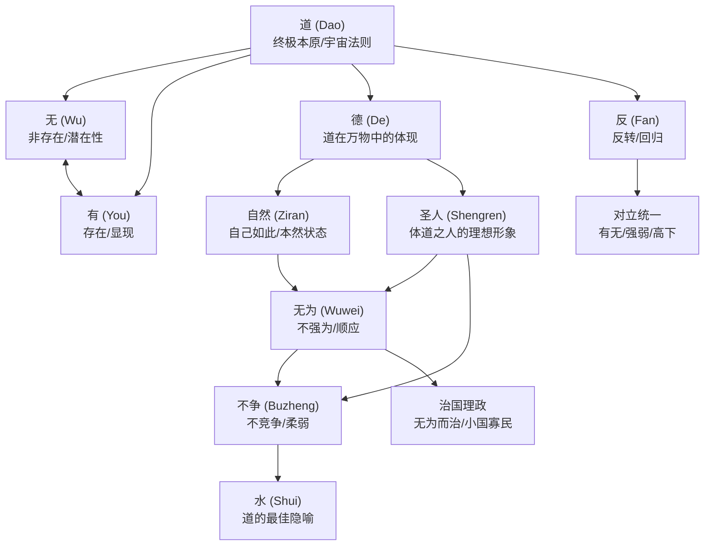
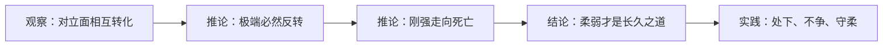
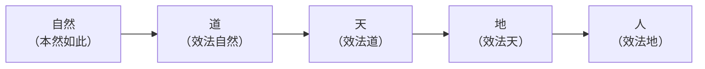
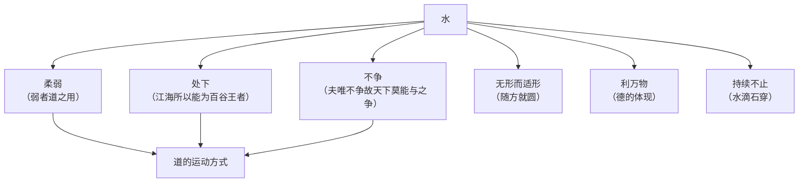
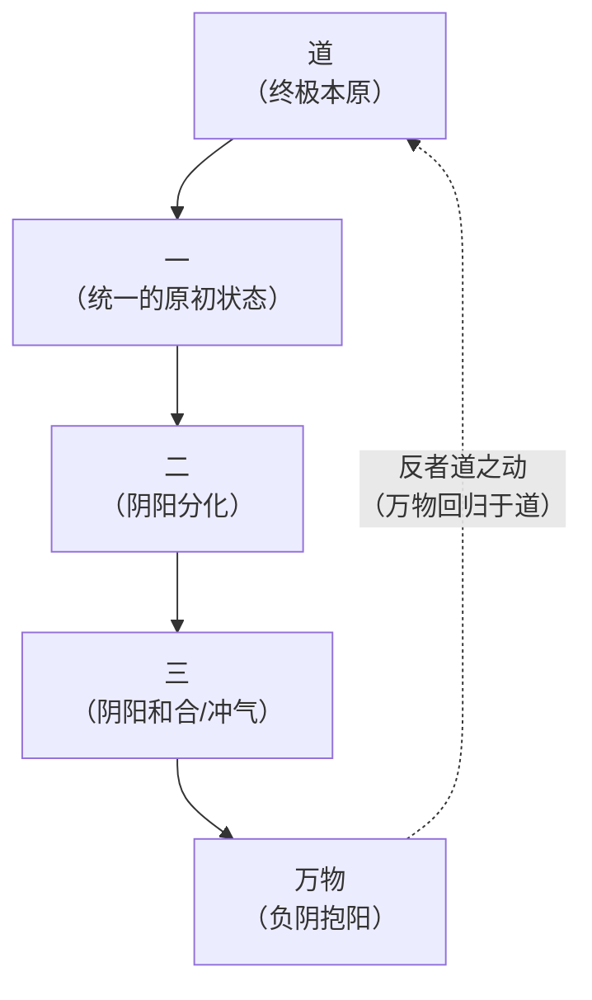
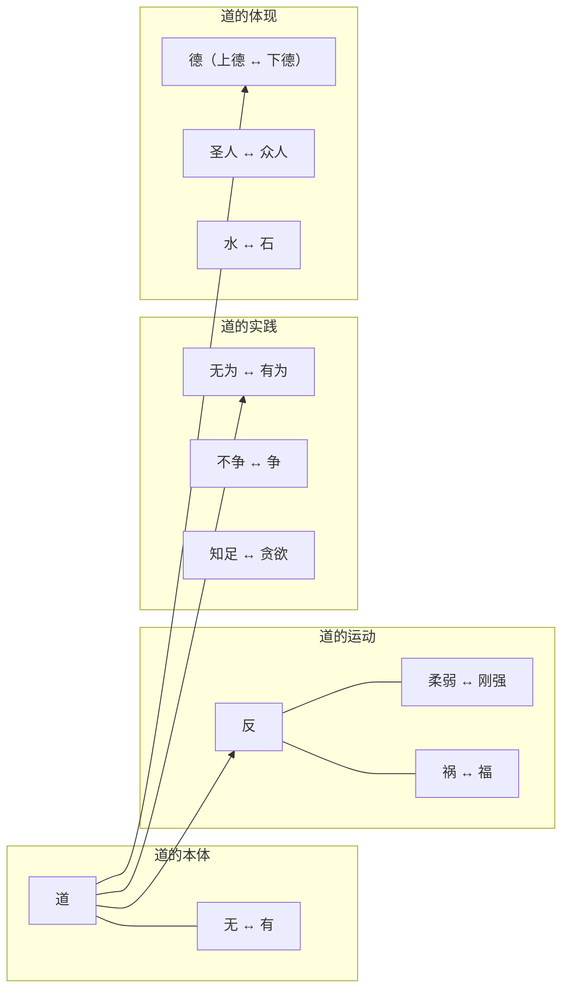

# 《道德经》深度拆解

## 一、哲学坐标定位

《道德经》是中国哲学史上最具原创性的文本之一，传统署名作者为春秋时期的老子（李耳），约成书于公元前6世纪至前4世纪之间。全书仅五千余字，分为上篇"道经"（第1-37章）和下篇"德经"（第38-81章），共八十一章。它是道家哲学的奠基之作，也是人类轴心时代最重要的思想结晶之一。

你需要先理解这部作品的定位：它不是一部宗教经典，不是一本修仙手册，而是一部==严肃的哲学著作==，试图回答人类思想中最根本的三个问题：

1. **本体论问题**：世界的终极本原是什么？（道）
2. **认识论问题**：你能否认识这个终极本原？如何认识？（无为、观）
3. **实践论问题**：认识到终极本原之后，你应该如何行动？（德、无为而治）

在哲学谱系上，《道德经》与古希腊赫拉克利特的"逻各斯"思想有惊人的相似性——两者都关注变化中的永恒法则、对立面的统一、以及语言表达终极真理的困境。与同时期的[[《论语》]]相比，孔子关注的是人际伦理的"应然"，老子关注的是宇宙运行的"实然"——==老子不是在告诉你应该做什么，而是在描述万物实际上是如何运作的，然后建议你顺应这个运作方式==。

> [!important] 版本说明
> 《道德经》流传版本众多。本笔记主要基于通行的王弼本（三国时期王弼注本），同时参考1973年出土的马王堆帛书本和1993年出土的郭店楚简本。三个版本在文字上有差异，但核心思想一致。

## 二、核心概念网络

在进入逐章拆解之前，你必须先建立《道德经》的核心概念网络。这些概念彼此交织，构成一个完整的哲学体系：

> [!tip] 阅读路径建议
> 如果你是第一次接触《道德经》，建议按照这个顺序理解核心概念：**道 → 无与有 → 反（对立统一） → 自然 → 无为 → 德 → 水的隐喻 → 圣人 → 治国论**。这个顺序是从本体论到认识论再到实践论的逻辑递进。

## 三、逐层深度拆解

### 主题一：「道——万物的终极本原」

> [!abstract] 第一性原理追问：如果你要为整个宇宙找到一个最基本的"第一因"，它应该具有什么性质？

**【核心论点】**

"道"是《道德经》最核心的概念。老子用"道"来指称宇宙万物的终极本原和运行法则。但"道"的特殊之处在于：==它是不可被语言完全定义的==。

**【原始含义】**

"道"在先秦汉语中有三层基本含义：（1）道路，物理意义上的路；（2）言说，即"说"的意思（如"说道"）；（3）方法、法则。老子将这个日常词汇提升为哲学概念，赋予它第四层含义：==宇宙万物的终极本原和运行法则==。

**【通俗解释】**

你可以把"道"暂时理解为：让一切事物之所以成为那个事物、让一切运动之所以那样运动的"那个东西"。它不是任何具体的东西，却是所有具体事物背后的根据。就像万有引力不是任何一个苹果，但每一个苹果落地都遵循它。

**【详细拆解】**

《道德经》第一章开篇即是：

> ==道可道，非常道。名可名，非常名。==

这两句话是整部《道德经》的哲学基石。逐字拆解：

- 第一个"道"：指终极本原之"道"
- "可道"：可以用语言说出来的
- "非常道"：就不是那个恒常不变的终极之道

老子在这里提出了一个深刻的==认识论困境==：语言是有限的，而道是无限的；语言是分别性的（给事物贴标签、做区分），而道是整全性的（包含一切、不做区分）。当你试图用语言去定义道的时候，你已经把道缩小了——你用一个有限的容器去装无限的内容，必然会溢出。

这与维特根斯坦在《逻辑哲学论》中的论断惊人地相似："凡是可以说的，都可以清楚地说；凡是不可说的，就应该保持沉默。"但老子并没有因此沉默——他用了五千字来"指向"那个不可说的东西。这正是《道德经》的方法论特色：==不是直接定义道，而是通过否定、隐喻和悖论来迂回地指示道==。

第二十五章对道的描述更加具体：

> ==有物混成，先天地生。寂兮寥兮，独立而不改，周行而不殆，可以为天下母。吾不知其名，强字之曰道，强为之名曰大。==

这段话提供了道的几个关键属性：

1. **先天地生**——道在时间上先于天地万物。这不是说道在某个时间点"出现"，然后再创造天地，而是说道在逻辑上先于天地——天地依赖道而存在，道不依赖天地而存在。
2. **独立而不改**——道不依赖于任何其他事物，也不会改变。万物都在变化，但让万物变化的那个法则本身不变。
3. **周行而不殆**——道循环运行，永不停息。这里暗含了道的"反"（返归、循环）的运动方式。
4. **强字之曰道**——"道"这个名称只是勉强给它起的，不是它的真实名字。老子清醒地意识到，给终极本原命名本身就是一种妥协。

**【苏格拉底式追问】**

- 追问1：如果道不可言说，老子为什么还要写五千字来说它？
  - 回应：老子的文字不是"定义"道，而是"指向"道。就像你用手指月亮——手指不是月亮，但你需要手指来引导别人看到月亮。《道德经》全文就是那根手指。
- 追问2：道和西方哲学中的"上帝"有什么区别？
  - 回应：根本区别在于：上帝（尤其是亚伯拉罕宗教中的上帝）是有意志、有人格的创造者，他按照自己的意志创造世界。而道是==无意志、无人格的自然法则==——它"生"万物，但不是有目的地"创造"万物。"天地不仁，以万物为刍狗"（第五章）——天地对万物没有偏爱，一切自然运行。
- 追问3：如果道不可认识，研究它有什么意义？
  - 回应：老子没有说道完全不可认识，他说的是道不可用语言完全定义。你可以通过"观"（静观、体悟）来==体验==道，虽然你无法将这种体验完整地翻译成语言。这类似于你知道什么是"红色"——你体验过红色，但你无法向一个天生失明的人完整地描述红色。

**【金句/关键概念】**

> ==道可道，非常道。名可名，非常名。无名天地之始，有名万物之母。（第一章）==

---

### 主题二：「无与有——存在的两个面向」

> [!abstract] 第一性原理追问：一个杯子的功用来自杯壁（有），还是来自杯中的空间（无）？

**【核心论点】**

"无"和"有"是《道德经》中仅次于"道"的核心概念对。老子认为，==无与有不是对立的，而是道的两个面向，它们共同构成了万物生成的基础==。

**【原始含义】**

- "无"（無）：在先秦哲学中，不是简单的"什么都没有"（绝对虚无），而是指==尚未显现、尚未分化的潜在状态==。
- "有"：不是简单的"存在某个东西"，而是指==已经显现、已经分化的具体状态==。

**【通俗解释】**

你可以把"无"想象成一块尚未雕刻的石头中潜在的所有雕像——所有可能性都在里面，但还没有哪一个显现出来。当雕刻师凿出一座特定的雕像时，一种可能性从"无"进入了"有"，但同时其他所有可能性就被排除了。"无"是无限可能，"有"是确定现实。

**【详细拆解】**

第一章的下半段：

> ==无名天地之始，有名万物之母。故常无欲以观其妙，常有欲以观其徼。此两者同出而异名，同谓之玄。==

逐层拆解：

1. **"无名天地之始"**——在天地尚未形成之前的那个状态，是无法命名的（无名）。这对应道的"无"的面向：纯粹的潜在性，没有任何分化和区分。
2. **"有名万物之母"**——当"名"（区分、分化）出现时，万物才开始被"生出"。这对应道的"有"的面向：潜在性开始显现为具体事物。
3. **"此两者同出而异名"**——无和有来自同一个源头（道），只是名称不同。它们不是两个独立的东西，而是==同一个过程的两个面向==。

第十一章用了三个精妙的日常隐喻来说明"无"的功用：

> ==三十辐共一毂，当其无，有车之用。埏埴以为器，当其无，有器之用。凿户牖以为室，当其无，有室之用。故有之以为利，无之以为用。==

翻译：三十根辐条汇聚到一个车毂，==正是车毂中间的空（无）==，才使车轮能转动。揉捏黏土做成器皿，正是器皿中间的空（无），才使器皿能盛东西。开凿门窗建成房屋，正是房屋中间的空（无），才使房屋能住人。所以，"有"提供条件，"无"提供功用。

这个论证极其精彩。在日常思维中，你习惯性地认为"有"才有价值——杯壁、墙壁、车轮的辐条。但老子指出，==真正让事物发挥功能的恰恰是"无"——杯中的空间、房间的空间、车轴的空洞==。没有"无"，"有"就失去了意义。

这个洞见的哲学深度远超日常生活的比喻。它指向一个本体论层面的命题：==存在（有）依赖于非存在（无），显现依赖于隐藏，确定依赖于不确定==。世界不是由"有"单独构成的，而是由"有"与"无"的交织构成的。

**【苏格拉底式追问】**

- 追问1：老子的"无"和佛教的"空"（sunyata）是同一个概念吗？
  - 回应：不完全相同。佛教的"空"强调的是一切事物缺乏自性（自体存在），是对"实有"的否定。老子的"无"不是对"有"的否定，而是"有"的另一面——==无与有共生，不是有被否定后的结果==。佛教的空更接近"解构"，老子的无更接近"未分化的潜在性"。
- 追问2："无"是绝对的虚无吗？
  - 回应：不是。老子的"无"不是"什么都没有"的绝对虚无（nihil absolutum），而是一种==充满潜在性的"无"==——它之所以"无"，是因为它还没有分化为任何确定的"有"，但它包含了一切成为"有"的可能性。这更接近量子力学中"叠加态"的概念——在观测之前，粒子处于所有可能状态的叠加之中。

**【金句/关键概念】**

> ==有之以为利，无之以为用。（第十一章）==

---

### 主题三：「反——对立统一与循环回归」

> [!abstract] 第一性原理追问：事物发展到极端之后，会发生什么？

**【核心论点】**

"反"是《道德经》中描述道之运动方式的核心概念。它有两层含义：（1）==反转==——事物发展到极端后会向反面转化；（2）==返归==——万物最终都会回归到道。老子用一个字概括了道的运动规律：

> ==反者道之动。弱者道之用。（第四十章）==

**【原始含义】**

"反"在先秦汉语中同时包含"相反"和"返回"两个意思。老子同时利用了这两个含义：道的运动方式就是向相反方向转化，同时也是返回到自身。

**【通俗解释】**

想象一个钟摆——它摆到最左边之后，必然开始向右摆；摆到最右边之后，又必然向左回归。任何事物走到极端，都会开始向反面转化。这就是"物极必反"——这个成语正来自老子的思想。

**【详细拆解】**

"反者道之动"——道的运动方式是"反"。这意味着：

1. **对立面会相互转化**：祸与福、强与弱、生与死、有与无——一切对立面都不是固定的，而是在不断地相互转化。第五十八章说："==祸兮福之所倚，福兮祸之所伏=="——灾祸中潜伏着幸福的种子，幸福中暗藏着灾祸的隐患。这不是心灵鸡汤式的安慰，而是对事物运动规律的==客观描述==。

2. **极端状态不可持续**：第三十章说"物壮则老"——事物强壮到极致就会开始衰老。第九章说"持而盈之，不如其已；揣而锐之，不可长保"——把容器装到满溢不如停下来；把刀刃磨到极锋利就无法长久保持。

3. **柔弱胜刚强**："弱者道之用"——道的作用方式是柔弱的。这是《道德经》最反直觉的命题之一。老子观察到：==刚强的事物接近死亡，柔弱的事物接近生命==。第七十六章说："人之生也柔弱，其死也坚强。草木之生也柔脆，其死也枯槁。故坚强者死之徒，柔弱者生之徒。"——活着的人身体柔软，死了的人身体僵硬；活着的草木柔嫩，枯死的草木僵硬。所以刚强属于死亡的一边，柔弱属于生命的一边。

这个论证的逻辑结构是：

**与赫拉克利特的比较**——古希腊哲学家赫拉克利特也提出了"对立面的统一"（unity of opposites）思想："上坡路和下坡路是同一条路""疾病使健康成为愉快的事"。两者的相似性令人惊叹，但也有区别：赫拉克利特强调的是对立面的"斗争"（战争是万物之父），而老子强调的是对立面的"转化"和"和谐"。老子更关心你应该如何利用这个规律——==站在柔弱的一边，因为柔弱正在走向强大==。

**【苏格拉底式追问】**

- 追问1："柔弱胜刚强"在现实中总是成立吗？
  - 回应：老子说的不是短期结果，而是长期趋势。一根柔韧的树枝可以在暴风雪中存活，一根刚硬的树枝会折断。一个灵活的企业可以适应市场变化，一个僵化的巨头会被淘汰。"柔弱"在老子这里不是软弱无能，而是==灵活、适应性强、不与环境硬抗==。
- 追问2：如果一切都会反转，那努力有什么意义？
  - 回应：老子不是宿命论者。他不是说"一切都会反转所以不要努力"，而是说"==因为一切都会反转，所以你不应该走极端=="。保持在中间状态、不走极端、不过度用力——这恰恰需要高超的智慧和自制力。

**【金句/关键概念】**

> ==反者道之动。弱者道之用。天下万物生于有，有生于无。（第四十章）==

---

### 主题四：「自然与无为——道的实践法则」

> [!abstract] 第一性原理追问：什么是最好的行动方式？是"做更多"还是"做更少"？

**【核心论点】**

"自然"和"无为"是《道德经》从本体论通向实践论的桥梁。"自然"描述万物的本然状态，"无为"描述你应该采取的行动原则。==无为不是"不做任何事"，而是"不做违背事物本性的事"==。

**【原始含义】**

- **自然**：先秦汉语中，"自然"不是现代意义上的"大自然"（nature），而是"自-然"，即"自己如此""本来如此"。它描述的是事物未受外力干预时的本然状态。
- **无为**："无-为"，字面意思是"没有（刻意的、强制性的）作为"。"无"不是绝对的否定，而是对"妄为""强为""过度干预"的否定。

**【通俗解释】**

"自然"就是事物本来的样子——水往低处流，种子发芽生长，婴儿饿了就哭。没有人教它们这样做，它们自己就是这样的。

"无为"就是：你不要去对抗事物本来的样子。水要往低处流，你不要硬把它推到高处（除非有特别的理由和合适的方法）。种子在春天发芽，你不要拔苗助长。==顺应事物的本性去行动，而不是用你的主观意愿去强行改变事物==。

**【详细拆解】**

第二十五章：

> ==人法地，地法天，天法道，道法自然。==

这是整部《道德经》最重要的句子之一。"法"意为"效法、遵循"。人效法地，地效法天，天效法道，道效法"自然"。这里的"自然"不是说道之上还有一个更高的"自然"——而是说==道所效法的就是它自身的本然状态==。"道法自然"意为"道以自己的本然状态为法则"，即道的运行不需要任何外在的理由或推动力，它自己就是这样的。

这构成了一个完整的效法链条：

对你的启示是：你作为人，最终应该效法的是"自然"——让自己回到本然状态，不要过度人为。

关于"无为"，第四十八章说：

> ==为学日益，为道日损。损之又损，以至于无为。无为而无不为。==

这段话的逻辑极为精妙：

- "为学日益"——学习知识是不断增加的过程，你学得越多知道得越多。
- "为道日损"——体悟道却是不断减少的过程，你需要不断去掉你的成见、欲望、执念。
- "损之又损，以至于无为"——减到最后，达到无为的境界。
- "无为而无不为"——==当你不再强行干预时，反而没有什么做不到的==。

这里有一个关键的区分：**无为 ≠ 无所作为**。老子不是在鼓吹躺平。"无为"的精确含义是：==不做多余的事、不做违背本性的事、不做过度干预的事==。该做的事仍然要做，但做的方式是顺应而非强制。

一个现代的例子：好的父母"无为"——他们不替孩子做所有决定，不把自己的理想强加给孩子，而是为孩子提供一个安全的环境，让孩子的天性自然展开。这不是"不管孩子"，而是"不过度管孩子"。坏的父母则是"有为"——他们用自己的焦虑、期望和控制欲去塑造孩子，结果往往适得其反。

第十七章把治理者分为四个层次：

> ==太上，不知有之。其次，亲而誉之。其次，畏之。其次，侮之。==

最好的领导者，人们甚至不知道他的存在（"无为"到了极致）。其次，人们亲近和赞美他。再次，人们害怕他。最差的，人们蔑视他。==最高境界的管理是让系统自行运转，管理者的痕迹几乎不可见==。

**【苏格拉底式追问】**

- 追问1："无为"和"懒惰"的区别在哪里？
  - 回应：懒惰是该做的事不做；无为是不该做的事不做。懒惰的人什么都不做是因为他缺乏动力；无为的人看似不做是因为他==清楚地知道什么是多余的干预，并有意识地克制自己不去做多余的事==。无为需要极高的智慧和自制力，而懒惰不需要任何智慧。
- 追问2：在竞争激烈的现代社会，"无为"是否意味着被淘汰？
  - 回应：老子可能会反问你：竞争激烈本身是不是一种"过度有为"的结果？每个人都在过度竞争、过度内卷，结果所有人都精疲力竭。如果你能找到一个==不需要和别人硬拼的独特位置==（"不争"），你反而可能活得更好、更久。水不与万物竞争，但它无处不在。

**【金句/关键概念】**

> ==道法自然。（第二十五章）==
> ==无为而无不为。（第四十八章）==

---

### 主题五：「水——道的终极隐喻」

> [!abstract] 第一性原理追问：在自然界中，什么东西最接近"道"的品质？

**【核心论点】**

老子在所有的自然物中选择"水"作为道的最佳隐喻。==水集中体现了道的所有核心特征：柔弱、处下、不争、无形而适形、利万物而不争功==。

**【详细拆解】**

第八章是《道德经》中最著名的章节之一：

> ==上善若水。水善利万物而不争，处众人之所恶，故几于道。居善地，心善渊，与善仁，言善信，正善治，事善能，动善时。夫唯不争，故无尤。==

逐层分析水的品质：

1. **"善利万物而不争"**——水滋养万物（没有水就没有生命），但不与万物争功。它给予一切，不索取回报。这对应"道"的品质：道生万物，但不占有万物。

2. **"处众人之所恶"**——水总是流向最低处——那些人人厌恶的、肮脏的、卑下的地方。但正因为水处于最低处，==所有的水最终都会流向它==。这是"处下"哲学的核心：不是因为你在低处就吃亏了，而是因为你在低处，所以你成为了汇聚点。

3. **"居善地，心善渊，与善仁，言善信，正善治，事善能，动善时"**——水在七个方面展示了完美的智慧：居住选择低处（谦卑）；心像深渊一样沉静（深邃）；给予如同仁爱（慷慨）；映照万物如同诚信（真实）；平息纷争如同善治（公平）；随形而变如同善能（灵活）；应时而动如同善时（把握时机）。

4. **"夫唯不争，故无尤"**——正因为水不与任何事物竞争，所以没有什么能怪罪它、反对它。==不争不是因为争不过，而是因为不需要争——你已经在所有人需要你的地方了==。

第七十八章进一步阐发水的哲学：

> ==天下莫柔弱于水，而攻坚强者莫之能胜，以其无以易之。弱之胜强，柔之胜刚，天下莫不知，莫能行。==

天下没有比水更柔弱的东西，但攻克坚硬之物，没有什么能胜过水。水滴石穿——不是因为水有多硬，而是因为水==持续、柔韧、永不放弃==。柔弱胜过刚强、柔软胜过坚硬，这个道理天下没有人不知道，却没有人能真正做到。

**【概念网络中的位置】**

水的隐喻将《道德经》的多个核心概念串联起来：

**【苏格拉底式追问】**

- 追问1：老子是在说你应该做一个"老好人"吗？
  - 回应：不是。水不是"老好人"——洪水可以摧毁一切。老子说的是一种==战略性的柔弱==：在大多数情况下保持柔软和灵活，但在需要的时候，水可以冲垮任何堤坝。关键不在于你永远柔弱，而在于你==有能力刚强，但选择柔弱==。

**【金句/关键概念】**

> ==上善若水。水善利万物而不争，处众人之所恶，故几于道。（第八章）==

---

### 主题六：「德——道在万物中的显现」

> [!abstract] 第一性原理追问：如果"道"是万物的总法则，那么每一个具体事物身上的"道"该叫什么？

**【核心论点】**

"德"是道在每一个具体事物中的体现。==如果道是太阳，德就是阳光照射到每一个具体事物上形成的光影==。每一个事物都从道那里获得了属于自己的"德"——那个使它成为它自身的内在本性。

**【原始含义】**

"德"在先秦汉语中的原始含义是"得"——获得、得到。一个事物从道那里"得到"的那个东西，就是它的"德"。后来"德"逐渐演变为"品德、道德"的含义，但在《道德经》中，它的核心含义仍然是==事物从道那里获得的内在本性==。

**【通俗解释】**

每一粒种子里都包含了让它长成那种植物的全部信息——这就是这粒种子的"德"。橡树的"德"让橡果长成橡树而不是松树；你的"德"让你成为你而不是别人。"德"就是每个事物的"出厂设置"——它从道那里获得的、属于自己的天性。

**【详细拆解】**

第五十一章是关于"德"的最系统阐述：

> ==道生之，德畜之，物形之，势成之。是以万物莫不尊道而贵德。道之尊，德之贵，夫莫之命而常自然。==

翻译：道生成万物，德养育万物，物质给予万物形体，环境使万物成长。因此万物没有不尊崇道、珍贵德的。道之所以被尊崇、德之所以被珍贵，是因为==它们不发号施令，而是让万物自然而然==。

这里老子描述了万物生成的四个层次：

1. **道生之**——道是万物的终极本原
2. **德畜之**——德滋养和维持万物（每个事物的内在本性引导它的生长方向）
3. **物形之**——物质条件给予万物具体形体
4. **势成之**——环境和时势使万物最终成形

第三十八章区分了"上德"与"下德"：

> ==上德不德，是以有德。下德不失德，是以无德。上德无为而无以为，下德为之而有以为。==

这段话极其精妙：

- **上德不德**——最高的"德"不刻意表现为"有德"，所以它真正有德。==真正按照自己本性行事的人，不会刻意表演自己的品德==——他做好事是因为那就是他的本性，而不是因为他想被认为是好人。
- **下德不失德**——低层次的"德"刻意保持"有德"的外表，所以它反而没有真正的德。这种人做好事是为了维护形象，一旦没有人看着，他就不做了。

这个区分对应了一个深刻的伦理学问题：==道德行为的价值在于行为本身，还是在于行为者的动机？==老子的回答是：真正的德是自然流露的，不需要刻意维持。当你需要"努力做一个好人"的时候，你其实还没有成为一个好人。

**【苏格拉底式追问】**

- 追问1："德"和儒家的"仁"有什么关系？
  - 回应：第三十八章后半段直接回答了这个问题："失道而后德，失德而后仁，失仁而后义，失义而后礼。"在老子看来，仁、义、礼都是"德"丧失之后的==替代品==。当人们自然地按本性行事（德）时，不需要"仁"的教导；当"德"丧失后，才需要用"仁"来规范行为；仁也做不到了，就用"义"；义也做不到了，就用"礼"——礼是最表层、最形式化的约束，也是道德衰退的最后阶段。

**【金句/关键概念】**

> ==上德不德，是以有德。下德不失德，是以无德。（第三十八章）==

---

### 主题七：「圣人——体道之人的画像」

> [!abstract] 第一性原理追问：一个真正理解了"道"的人，在日常生活中是什么样子？

**【核心论点】**

《道德经》中的"圣人"不是宗教意义上的圣徒，不是道德完美的人，而是==完全体悟了道并按照道的方式行事的人==。圣人是老子为你描绘的一幅"理想人格画像"。

**【详细拆解】**

圣人在《道德经》中出现了三十多次，老子从多个角度描绘了这个理想形象：

**1. 圣人的认知方式——"不出户，知天下"（第四十七章）**

> ==不出户，知天下。不窥牖，见天道。其出弥远，其知弥少。是以圣人不行而知，不见而明，不为而成。==

这不是说圣人有神通，而是说：==当你深刻理解了道的运行法则，你就不需要逐一考察每件事——因为万事万物都遵循同样的法则==。了解了水往低处流的法则，你不需要去每一条河流实地考察。圣人通过把握"一"（道的法则）来理解"万"（万事万物）。

**2. 圣人的行动方式——"处无为之事，行不言之教"（第二章）**

> ==是以圣人处无为之事，行不言之教。万物作焉而不辞，生而不有，为而不恃，功成而弗居。夫唯弗居，是以不去。==

圣人以"无为"的方式做事，以不需要言语的方式教化。万物生长运作，他不推辞不干预；生成了万物却不占有；做了事情却不自恃其功；功业完成了也不居功。==正因为不居功，功绩反而永远不会消失==。

**3. 圣人的自我定位——"后其身而身先，外其身而身存"（第七章）**

> ==天长地久。天地所以能长且久者，以其不自生，故能长生。是以圣人后其身而身先，外其身而身存。非以其无私邪？故能成其私。==

天地之所以能长久，是因为它们不为自己而存在（"不自生"）。圣人效法天地：把自己放在后面，反而走在前面；把自己置于度外，反而得到保全。==这不正是因为他的"无私"，反而成就了他的"私"吗？==

这个论证的逻辑结构极其有趣：它看似自相矛盾（用无私来成就私），实际上揭示了一个深层规律——==过度追求自我利益的人反而失去自我利益，因为他的贪婪会招致所有人的反对==。而那个真正不为自己打算的人，反而会获得所有人的支持和拥戴。

**4. 圣人与"婴儿"意象**

老子多次用婴儿来比喻圣人的理想状态（第十章、第二十章、第二十八章、第五十五章）。第五十五章：

> ==含德之厚，比于赤子。==

德行深厚的人，就像新生的婴儿。婴儿不知道什么是欲望、什么是恐惧、什么是社会规范——他完全按照本性行事，这正是"自然"的极致体现。圣人不是要"变回"婴儿（那是退化），而是要==在拥有了成人的智慧之后，恢复婴儿那种没有造作的本真状态==。这是一种"否定之否定"——从无知的天真，经过知识的复杂，到达智慧的单纯。

**【苏格拉底式追问】**

- 追问1：老子描述的"圣人"在历史上真的存在过吗？
  - 回应：老子的"圣人"是一个==理想型==（ideal type），类似于柏拉图的"哲学王"。它不需要在历史上真的有一个完美对应的人——它是一个方向，指示你应该朝什么方向去修养自己。
- 追问2：圣人的"无私"是真的无私，还是一种高级的自私？
  - 回应：这正是老子的深刻之处。他不回避这个问题——"非以其无私邪？故能成其私。"老子承认，无私最终"成就了私"。但关键在于：==如果你因为"无私能成就私"才去无私，那你已经不是无私了==。真正的无私是自然而然的，它"成就了私"只是一个客观结果，不是主观目的。

**【金句/关键概念】**

> ==圣人后其身而身先，外其身而身存。非以其无私邪？故能成其私。（第七章）==

---

### 主题八：「治国论——无为而治的政治哲学」

> [!abstract] 第一性原理追问：最好的统治是什么样的？

**【核心论点】**

《道德经》不仅是形而上学和个人修养的文本，它还包含了一套完整的==政治哲学==。老子的政治理想可以概括为"无为而治"——==最好的治理是让社会自行运转，统治者的干预越少越好==。

**【详细拆解】**

**1. 政治理想：小国寡民**

第八十章描绘了老子心目中的理想社会：

> ==小国寡民。使有什伯之器而不用。使民重死而不远徙。虽有舟舆，无所乘之。虽有甲兵，无所陈之。使民复结绳而用之。甘其食，美其服，安其居，乐其俗。邻国相望，鸡犬之声相闻，民至老死不相往来。==

一个小的国家，少量的人民。即使有各种器具也不使用，人民珍重生命不愿远行。虽然有船和车，却没有乘坐的需要；虽然有武器铠甲，却没有陈列的机会。人民回到结绳记事的简朴生活。他们觉得自己的食物甘美、衣服漂亮、居所安适、风俗可乐。邻国相互看得见，鸡鸣狗吠相互听得到，但人民直到老死也不相往来。

这段描述常被批评为"开倒车"或"反文明"。但你需要理解老子的深层意图：==他不是在主张回到原始社会，而是在批判他所处时代的政治乱象==。春秋时期战乱频繁、统治者穷奢极欲、百姓苦不堪言——老子描绘的"小国寡民"是对这种状况的==反面理想==。它的核心诉求不是"回到原始"，而是"==减少统治者对人民生活的过度干预=="。

**2. 治理原则：以正治国**

第五十七章：

> ==以正治国，以奇用兵，以无事取天下。==

用"正"（正当、端正）来治国，用"奇"（出奇制胜）来用兵，用"无事"（不搞事、不折腾）来取天下。"无事"是"无为"在政治领域的具体体现——==最好的政策是不折腾，让人民安居乐业==。

紧接着老子给出了论证：

> ==天下多忌讳，而民弥贫。民多利器，国家滋昏。人多伎巧，奇物滋起。法令滋彰，盗贼多有。==

禁令越多，人民越贫穷。武器越多，国家越混乱。技巧越多，怪事越多。法令越严明，盗贼反而越多。这是对==过度治理==的深刻批判：你越是想用更多的规则、更多的控制来解决问题，反而会制造更多的问题。

这个观察与现代经济学和政治学的某些洞见不谋而合。过度监管扼杀市场活力，过度立法导致更多的钻空子——==问题往往不是管得太少，而是管得太多==。

**3. 愚民政策？——一个需要澄清的争议**

第三章：

> ==不尚贤，使民不争。不贵难得之货，使民不为盗。不见可欲，使民心不乱。是以圣人之治，虚其心，实其腹，弱其志，强其骨。常使民无知无欲。==

这段话表面上看像是在主张"愚民政策"。但需要注意：老子的语境是春秋时期统治者利用"尚贤""贵货"来操纵民心的政治现实。老子说的"无知无欲"==不是让人民变蠢，而是不要用虚假的价值标准（名利、稀有物品）去撩拨人民的欲望==。"虚其心"是去除杂念，"实其腹"是保障温饱——先让人吃饱，再让人心安。这与其说是"愚民"，不如说是==反对消费主义和名利场的操纵==。

**【苏格拉底式追问】**

- 追问1："无为而治"在现代社会可行吗？
  - 回应：完全不干预在现代复杂社会中不可行。但"无为而治"的核心洞见——==最好的管理是创造条件让系统自组织，而不是事无巨细地控制==——在现代管理学中得到了广泛验证。从亚当·斯密的"看不见的手"到互联网的去中心化架构，都体现了这个原则。

**【金句/关键概念】**

> ==治大国若烹小鲜。（第六十章）==

这句话的意思是：治理大国就像煎小鱼——==不要老是翻动它，否则会碎掉==。这可能是人类政治哲学史上最精炼的治理格言。

---

### 主题九：「道生万物——宇宙论的展开」

> [!abstract] 第一性原理追问：万物是如何从"道"中产生出来的？

**【核心论点】**

《道德经》不仅提出了"道"作为终极本原的概念，还描述了从道到万物的==生成过程==。

**【详细拆解】**

第四十二章是《道德经》宇宙论的核心：

> ==道生一，一生二，二生三，三生万物。万物负阴而抱阳，冲气以为和。==

这是中国哲学史上最著名的宇宙生成模式之一。逐层解读：

1. **道生一**——道生出"一"。"一"是什么？历代注家有不同解释。最合理的理解是："一"代表==统一的、未分化的原初状态==——道从"无名"的状态开始有了第一次显现。
2. **一生二**——"一"分化为"二"，即==阴和阳==。阴阳是中国哲学对宇宙中一切对立面的总概括：天/地、明/暗、刚/柔、热/冷、动/静。
3. **二生三**——阴阳交感产生"三"。"三"是什么？最常见的解释是"冲气"——阴阳二气交融形成的和合之气，它是万物生成的直接动力。也有解释为"阴、阳、和"三者共存的状态。
4. **三生万物**——从这个阴阳和合的状态中，万事万物不断地分化、生长、演化出来。

这个宇宙论模型的核心特征：

- **生成性而非创造性**：道不是一个工匠在制造产品（这是柏拉图在《蒂迈欧》中的"造物主"模型），而是像种子自然地生长为大树——==万物是从道中"生长"出来的，不是被"制造"出来的==。
- **连续性**：从道到万物是一个连续的、渐进的过程，不存在一个"无中生有"的断裂点。
- **全息性**："万物负阴而抱阳"——每一个具体事物都同时包含阴和阳两个方面，都是道的完整体现（而非道的碎片）。

**【与其他宇宙论的比较】**

| 体系 | 本原 | 生成方式 | 目的性 |
|------|------|---------|--------|
| 《道德经》 | 道 | 自然生成 | 无目的 |
| 《圣经·创世记》 | 上帝 | 有意创造 | 有目的 |
| 古希腊（赫拉克利特） | 逻各斯/火 | 对立转化 | 无目的 |
| 印度教（奥义书） | 梵 | 梵的展开 | 梵的游戏 |

**【金句/关键概念】**

> ==道生一，一生二，二生三，三生万物。万物负阴而抱阳，冲气以为和。（第四十二章）==

---

### 主题十：「知足与知止——欲望的哲学」

> [!abstract] 第一性原理追问：欲望的边界在哪里？什么时候应该停下来？

**【核心论点】**

老子对欲望的态度不是彻底否定（那是禁欲主义），而是==知道什么时候够了==。"知足"和"知止"是老子提出的两个关于欲望的核心原则。

**【详细拆解】**

第四十四章：

> ==名与身孰亲？身与货孰多？得与亡孰病？甚爱必大费，多藏必厚亡。故知足不辱，知止不殆，可以长久。==

名声和生命哪个更亲近你？生命和财货哪个更重要？得到和失去哪个更有害？==过度地爱惜（名利）必然付出巨大的代价，过度地囤积必然遭受惨重的损失==。所以，知道满足就不会受辱，知道停止就不会危险，这样才能长久。

第四十六章：

> ==天下有道，却走马以粪。天下无道，戎马生于郊。祸莫大于不知足，咎莫大于欲得。故知足之足，常足矣。==

当天下有道的时候，战马被退回去种田。天下无道的时候，怀孕的母马都被赶上战场。==最大的灾祸莫过于不知满足，最大的过错莫过于贪得无厌==。所以，懂得满足所带来的满足，才是永恒的满足。

"知足之足，常足矣"这句话值得深思：普通的"满足"依赖于外在条件（有了A才满足），这种满足是不稳定的，因为外在条件随时会变。而"知足之足"是一种==内在的、不依赖外在条件的满足感==——你不是因为拥有了足够多而满足，而是因为你知道什么是"够了"而满足。前者是被动的、有条件的；后者是主动的、无条件的。

第十二章对感官欲望的批判：

> ==五色令人目盲，五音令人耳聋，五味令人口爽，驰骋畋猎令人心发狂，难得之货令人行妨。是以圣人为腹不为目，故去彼取此。==

过度的色彩使眼睛失明，过度的声音使耳朵失聪，过度的味道使舌头麻木，纵情打猎使心灵发狂，稀有的物品使人行为不端。所以圣人满足肚腹（基本需求）而不追求感官刺激。

这不是反对一切感官享受，而是指出==过度刺激会导致感官钝化==——这与现代心理学中"享乐适应"（hedonic adaptation）的研究完全一致。你追求越来越强的刺激，阈值越来越高，最终什么都无法让你满足了。

**【金句/关键概念】**

> ==知足不辱，知止不殆，可以长久。（第四十四章）==
> ==知足之足，常足矣。（第四十六章）==

---

## 四、全书核心命题总结

经过十个主题的拆解，你可以将《道德经》的思想体系提炼为以下核心命题：

> [!important] 五大核心命题

1. **本体论命题**：宇宙存在一个终极本原（道），它是不可被语言完全定义的、先于天地万物的、自然而然运行的法则。
2. **运动论命题**：道的运动方式是"反"——一切事物走到极端都会向反面转化，最终回归于道。柔弱是道的作用方式。
3. **认识论命题**：道不可通过语言和概念完全把握，只能通过"损"（去掉成见和欲望）和"观"（静观体悟）来接近。
4. **伦理论命题**：最高的德是自然流露的（上德不德），刻意追求的道德反而不是真道德。理想的行为方式是"无为"——顺应事物的本性而不强行干预。
5. **政治论命题**：最好的治理是"无为而治"——减少干预，让社会自行运转。过度的法令和控制只会制造更多问题。

## 五、概念对立统一总图

## 六、《道德经》的现代回响

> [!note] 跨时代的思想回响

你可能会惊讶地发现，《道德经》的许多洞见在现代科学和思想中得到了回响：

| 《道德经》概念 | 现代对应 | 关联说明 |
|---------------|---------|---------|
| 反者道之动 | 热力学第二定律/系统论中的负反馈 | 极端状态不可持续，系统会自我调节 |
| 无与有的共生 | 量子力学的波粒二象性 | 事物同时具有两种看似矛盾的性质 |
| 无为而治 | 亚当·斯密的"看不见的手"/自组织理论 | 复杂系统不需要中央控制也能自发产生秩序 |
| 道生一，一生二 | 宇宙大爆炸理论 | 从统一状态到分化状态的演化过程 |
| 柔弱胜刚强 | 进化论中的"适应性优势" | 灵活适应环境的物种比刚强的物种更容易存活 |
| 知足之足 | 享乐适应理论（hedonic treadmill） | 外在条件的改善不能持久地提高幸福感 |
| 道可道非常道 | 哥德尔不完备定理 | 一个系统无法完全描述自身 |

这些对应不是说老子"预见"了现代科学，而是说：==对宇宙运行法则的深刻洞察，不论从哪个起点出发，往往会汇聚到相似的结论==。

## 七、苏格拉底式终极追问

在结束之前，你需要面对关于《道德经》的几个终极问题：

> [!question] 终极追问

**追问1：如果"道可道，非常道"，那么老子自己写的五千字不也是"可道"的、因此"非常道"的吗？**

这是《道德经》最根本的自我悖论。老子完全意识到这一点——他在第一句话就承认了自己即将进行的工作的局限性。但他选择了一种折中方案：==用语言来指向语言之外的东西==。《道德经》不是道本身，而是一张指向道的地图。地图不是领土，但没有地图你找不到领土。

**追问2：老子和孔子谁是对的？**

这是一个错误的二选一。老子关注的是"实然"（世界实际上如何运行），孔子关注的是"应然"（人应该如何行为）。一个在描述物理法则，一个在建立伦理规范。==它们不是互相排斥的，而是互相补充的==。中国哲学史上"儒道互补"的传统正是基于这一认识。

**追问3：读完《道德经》之后，你应该做什么？**

老子可能会说：==什么都不需要特别地去做。只需要减少那些你不需要做的事==。停止过度追求、停止过度干预、停止过度焦虑。让自己回到本然的状态——像水一样柔软、像婴儿一样本真、像道一样自然。这不是一个需要"到达"的目的地，而是一个需要"回归"的起点。

---

> [!quote] 收尾
> ==天下之至柔，驰骋天下之至坚。无有入无间。（第四十三章）==
> 天下最柔软的东西，可以驱驰天下最坚硬的东西。没有形体的力量，可以穿透没有缝隙的事物。
>
> 这就是道——无形、柔弱、不可定义，却是万物最深处的力量。

---

*相关笔记：[[《论语》]]、[[《庄子》]]、[[《易经》]]、[[《悉达多》 - 赫尔曼·黑塞]]*
