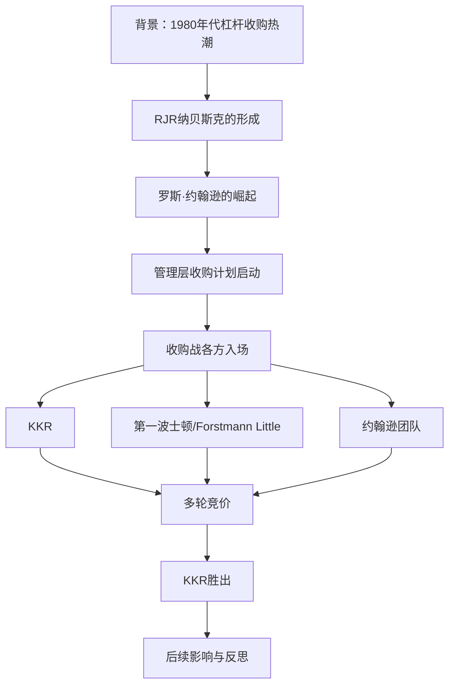
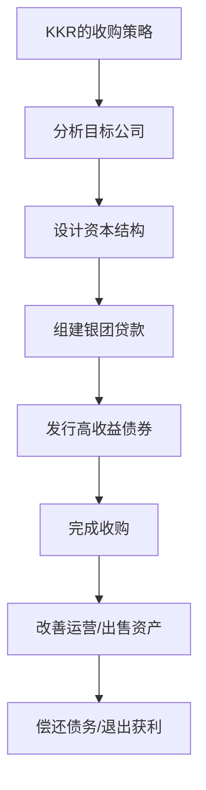
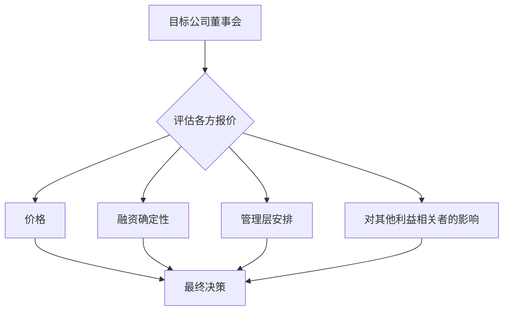

# 《门口的野蛮人》深度读书笔记

## 一、元信息/坐标定位

### 作者背景

布赖恩·伯勒（Bryan Burrough）和约翰·希利亚尔（John Helyar）均为《华尔街日报》记者。伯勒后来加入《名利场》杂志，撰写了多本商业畅销书。两位作者凭借深厚的新闻功底，通过大量采访和调查，还原了这场20世纪最大规模杠杆收购战的全貌。本书出版于1989年，距离事件发生仅一年，保证了信息的鲜活性和可靠性。

### 事件背景

1988年，美国烟草和食品巨头RJR纳贝斯克（RJR Nabisco）成为华尔街历史上最大规模杠杆收购战的战场。这场收购战的参与者包括：
- ==RJR纳贝斯克CEO罗斯·约翰逊（Ross Johnson）==：发起管理层收购
- ==KKR（Kohlberg Kravis Roberts）==：最终的收购赢家
- 多家投资银行和收购基金

最终收购价格达到==250亿美元==，创下当时的历史纪录。这场收购战揭示了1980年代华尔街杠杆收购狂潮的繁荣与疯狂。

### 本书定位

在商业书籍谱系中，《门口的野蛮人》是==商业叙事非虚构写作的典范==。它不是一本教科书，而是一部商业史诗，通过细致入微的人物刻画和戏剧性的叙事，让读者身临其境地感受华尔街的权力游戏。与[[大空头]]聚焦2008年金融危机不同，本书聚焦于1980年代的杠杆收购热潮，但两者都揭示了华尔街的贪婪与人性。

### 核心价值主张

> [!abstract] 核心观点
> ==当贪婪遇上廉价资本，华尔街就会上演一场场权力与金钱的角逐。== 《门口的野蛮人》不仅记录了一场收购战，更揭示了商业世界的本质：在巨额利益面前，忠诚、友谊、原则都可能被抛弃。

---

## 二、全书逻辑地图

全书的叙事线索清晰：

1. **铺垫**：杠杆收购的兴起、RJR纳贝斯克的形成、关键人物的背景
2. **导火索**：罗斯·约翰逊决定发起管理层收购
3. **主战场**：各方势力的角逐、多轮竞价
4. **高潮**：最终竞标与KKR胜出
5. **尾声**：收购后的整合与各方命运

---

## 三、核心主题/逐章深度拆解

### 第一部分：舞台与演员

#### 杠杆收购的兴起

> [!note] 什么是杠杆收购（LBO）
> ==杠杆收购是指用大量借债来收购公司，然后用被收购公司的现金流来偿还债务。== 这就像你用100万首付买了一套1000万的房子，然后用租金来还贷款。

1980年代杠杆收购兴起的原因：
1. **垃圾债券的发明**：迈克尔·米尔肯（Michael Milken）在德崇证券（Drexel Burnham Lambert）创造了高收益债券市场，为收购提供了廉价资金
2. **税收优惠**：债务利息可以抵税，使得高杠杆结构更有吸引力
3. **股东价值理论**：认为管理层应该为股东创造价值，而收购可以"释放价值"
4. **经济繁荣**：里根时代的经济扩张提供了良好的宏观环境

#### RJR纳贝斯克的形成

RJR纳贝斯克是两家公司合并的产物：
- **RJ雷诺烟草公司（R.J. Reynolds）**：美国第二大烟草公司，拥有骆驼、云丝顿等品牌
- **纳贝斯克（Nabisco）**：食品巨头，拥有奥利奥饼干、乐事薯片等品牌

> [!warning] 烟草公司的困境
> 到1980年代，烟草行业面临巨大压力：健康诉讼、政府监管、社会舆论。==烟草公司现金流充裕但增长受限，成为收购的完美目标。==

#### 罗斯·约翰逊的崛起

> [!note] 关键人物
> 罗斯·约翰逊（Ross Johnson），加拿大人，通过一系列公司政治斗争，从Standard Brands到纳贝斯克，最终成为RJR纳贝斯克的CEO。

约翰逊的特点：
1. **魅力型领导**：极具个人魅力，善于社交
2. **挥霍无度**：公司飞机、高尔夫度假、明星代言
3. **短期导向**：追求股价表现而非长期价值
4. **对股东漠视**：把公司当作自己的提款机

> [!tip] 书中的讽刺描写
> 约翰逊拥有一支公司飞机机队（被戏称为"RJR空军"），还签下体育明星代言（被称为"约翰逊的运动员团队"，简称"Team Nabisco"）。==这些支出对股东几乎没有任何价值，但满足了约翰逊的虚荣心。==

### 第二部分：收购战的导火索

#### 约翰逊的困境

到1988年，约翰逊面临几个问题：

1. **股价低迷**：RJR纳贝斯克股价长期在低位徘徊
2. **无烟香烟失败**：公司投入巨资研发的"Premier"无烟香烟遭遇惨败
3. **董事会压力**：董事们开始质疑约翰逊的管理
4. **个人利益**：约翰逊担心自己的地位不保

> [!abstract] 关键决策
> 约翰逊决定发起==管理层收购（MBO）==：由管理层联合私募股权基金收购公司，将其私有化。这样做的好处是：管理层获得巨额财富，同时摆脱公众股东的监督。

#### 约翰逊的合作伙伴

约翰逊选择的合作伙伴是==希尔森·莱曼·赫顿（Shearson Lehman Hutton）==，当时美国运通旗下的投资银行。

> [!warning] 致命错误
> 约翰逊在宣布收购计划时，给自己和管理层设计了过于优厚的条款——管理层将获得公司约20%的股权。这引发了==公众的愤怒和董事会的不满==，也招来了其他竞标者。

### 第三部分：各方入场

#### KKR的加入

> [!note] KKR简介
> ==KKR（Kohlberg Kravis Roberts）==是当时最顶尖的杠杆收购公司，由亨利·克拉维斯（Henry Kravis）和乔治·罗伯茨（George Roberts）等人创立。KKR以"友好收购"著称，但在必要时也会发起敌意收购。

KKR加入收购战的原因：
1. RJR纳贝斯克是一个"完美标的"——稳定现金流、可分拆资产
2. 约翰逊的报价太低，存在"捡便宜"的机会
3. 这是展示KKR实力的绝佳舞台

#### 其他竞标者

**第一波士顿（First Boston）**
- 组建了一个竞标团队，但内部协调困难
- 最终因为资金问题退出

**福斯特曼·利特尔（Forstmann Little）**
- 由泰德·福斯特曼（Ted Forstmann）领导
- 是KKR的主要竞争对手
- 以"不用垃圾债券"自居，但这也限制了他们的出价能力

### 第四部分：竞价大战

#### 多轮竞价

> [!abstract] 竞价过程
> 董事会设定了一个正式的竞标流程，要求各方在指定日期提交密封报价。

**第一轮（10月）：**
- 约翰逊团队：每股75美元
- KKR：每股90美元

> [!warning] 约翰逊的失误
> 约翰逊的首次报价太低，暴露了他想"捡便宜"收购公司的意图。这进一步损害了他在董事会的信誉。

**第二轮（11月）：**
- 约翰逊团队：每股100美元（后提高到101美元）
- KKR：每股94美元
- 第一波士顿联盟：每股105美元（但条件复杂）

**最终轮（11月底）：**
- 约翰逊团队：每股112美元
- KKR：每股109美元

> [!tip] 戏剧性转折
> 虽然约翰逊团队的报价更高，但==董事会最终选择了KKR==。原因包括：
> 1. KKR的融资更确定
> 2. 约翰逊的管理层条款仍然过于优厚
> 3. 董事会对约翰逊的信任已经丧失

#### 决定性因素

> [!abstract] 为什么KKR获胜
> 1. **更可靠的融资**：KKR的银团贷款和债券发行更有把握
> 2. **更好的声誉**：KKR被视为更有信誉的合作伙伴
> 3. **约翰逊自毁长城**：他的贪婪和傲慢疏远了董事会
> 4. **时机把握**：KKR在最后时刻提高了报价条件

### 第五部分：后续与反思

#### 收购后的RJR纳贝斯克

KKR以==约250亿美元==完成收购，创下历史纪录。但这笔交易的后续并不顺利：

1. **债务负担沉重**：公司需要大量出售资产来偿债
2. **经营承压**：为了节省成本，削减了研发和营销
3. **最终结果一般**：KKR在这笔交易上的回报低于预期

> [!warning] 这笔交易的教训
> ==当价格被推高到极限时，即使是最好的收购者也很难获得满意回报。== 这场竞价大战让所有人都付出了代价。

#### 主要人物的命运

**罗斯·约翰逊**
- 收购完成后立即离开公司
- 获得了丰厚的离职补偿（约5300万美元）
- 但名誉扫地，成为贪婪CEO的代名词

**KKR**
- 完成了历史上最大的杠杆收购
- 但这笔交易的回报并不出色
- 仍然是杠杆收购行业的领导者

**希尔森·莱曼**
- 输掉了竞标
- 公司后来经历了一系列困难

#### 对华尔街的影响

> [!note] 1980年代杠杆收购热潮的终结
> RJR纳贝斯克收购战标志着杠杆收购热潮的顶峰。此后：
> 1. 垃圾债券市场在1989-1990年崩溃
> 2. 迈克尔·米尔肯因内幕交易入狱
> 3. 德崇证券破产
> 4. 收购活动大幅降温

---

## 四、核心框架提炼

### 框架一：杠杆收购的利弊分析

| 优点 | 缺点 |
|------|------|
| 可以用小资本撬动大交易 | 高债务带来高风险 |
| 管理层有更强的激励 | 短期压力可能牺牲长期价值 |
| 可以释放公司价值 | 大量裁员和资产出售 |
| 为投资者提供高回报机会 | 失败的代价极高 |

### 框架二：收购战中的博弈结构

### 框架三：管理层收购的风险

> [!warning] MBO可能出现的问题
> 1. **利益冲突**：管理层既是卖方代理人，又是买方
> 2. **信息不对称**：管理层比外部竞标者更了解公司
> 3. **公众形象**：可能被视为"掠夺"股东
> 4. **治理缺失**：私有化后缺乏公众监督

### 框架四：关键人物性格分析

| 人物 | 特点 | 结局 |
|------|------|------|
| 罗斯·约翰逊 | 魅力、贪婪、短视 | 名誉扫地 |
| 亨利·克拉维斯 | 精明、冷静、有耐心 | 继续成功 |
| 泰德·福斯特曼 | 原则、骄傲、保守 | 惜败于融资限制 |

---

## 五、批判性思考

### 本书的价值

1. **史料价值**：详细记录了一场历史性收购战
2. **人性洞察**：揭示了商业世界中的贪婪、权谋和背叛
3. **商业教育**：让读者理解杠杆收购的运作机制
4. **写作典范**：商业叙事非虚构的标杆之作

### 需要注意的偏见

> [!warning] 批判性阅读

**1. 叙事立场**
- 作者显然对约翰逊持批评态度
- 某些负面细节可能被放大

**2. 事后归因**
- 用结果来评判过程中的决策可能不公平
- 很多决策在当时的信息条件下是合理的

**3. 时代局限**
- 书写于1989年，对长期后果的分析有限
- 没有涉及后来杠杆收购行业的演变

**4. 简化复杂问题**
- 为了叙事需要，某些商业问题被简化
- 实际的并购交易比书中描述的更复杂

### 与其他思想的对话

与[[贪婪是好的]]（戈登·盖柯的名言）的对话：
- 1980年代华尔街文化的真实写照
- 但书中也展示了贪婪的代价

与[[股东至上]]理论的对话：
- 杠杆收购被认为可以"释放股东价值"
- 但实践中往往损害其他利益相关者

---

## 六、行动清单

### 作为投资者

- [ ] 警惕管理层发起的收购——他们可能有利益冲突
- [ ] 关注公司治理——董事会是否真正代表股东利益？
- [ ] 理解杠杆的双刃剑效应——高回报意味着高风险

### 作为管理者

- [ ] 避免把公司当作个人提款机
- [ ] 与董事会建立信任关系
- [ ] 在追求个人利益时保持适度

### 作为公司治理观察者

- [ ] 关注CEO的薪酬结构
- [ ] 审视董事会的独立性
- [ ] 理解公司控制权市场的作用

### 作为历史研究者

- [ ] 把这场收购战放在1980年代的大背景下理解
- [ ] 比较与2000年代、2010年代杠杆收购的异同
- [ ] 思考监管和市场条件如何影响收购活动

---

## 七、延伸阅读路线图

### 深化并购理解

1. [[并购的艺术]] - 斯坦利·福斯特·里德：并购交易的实操指南
2. [[蛮族的入侵]] - 乔治·安德斯：KKR的完整历史
3. [[大空头]] - 迈克尔·刘易斯：另一场华尔街危机的记录

### 理解华尔街文化

1. [[说谎者的扑克牌]] - 迈克尔·刘易斯：1980年代所罗门兄弟的疯狂
2. [[华尔街之狼]] - 乔丹·贝尔福特：华尔街的贪婪与堕落
3. [[最后的大佬]] - 威廉·科汉：拉扎德银行的传奇

### 公司治理视角

1. [[公司的概念]] - 彼得·德鲁克：企业的本质与责任
2. [[门外的野蛮人25年后]] - 各种后续报道：交易的长期影响

---

## 八、费曼终极检验

> [!abstract] 用最简单的话解释这本书

想象你有一个邻居，他是一家大公司的CEO。这个邻居人很有魅力，但有点挥霍——用公司的钱买私人飞机、请明星朋友打高尔夫。股东们不满意，股价也不好。

有一天，这个邻居想出一个主意：==我干嘛给股东打工？不如我自己把公司买下来！== 这样我就可以想怎么花钱就怎么花，没人管得着。

问题是，他没有那么多钱。于是他找到华尔街的银行家帮忙：你们借钱给我，我用公司未来的利润来还。这叫"杠杆收购"——用借来的钱来买东西。

但是，当他宣布这个计划时，出了两个问题：

**第一，他太贪心了。** 他给自己设计的条款太优厚，公开后惹怒了所有人。

**第二，他引来了竞争对手。** 一家叫KKR的公司说：这么好的机会，凭什么便宜了你？我们也要竞标。

于是就有了一场竞价大战。几轮下来，价格从最初的每股75美元涨到了超过100美元。最后，KKR用250亿美元买下了这家公司——==创下了当时的历史纪录==。

那个CEO呢？他拿了一大笔离职补偿金走人了，但名声也臭了。他成了"贪婪CEO"的代名词。

这本书告诉我们几个道理：

1. **贪婪会暴露**：当你的条款太优厚时，大家就知道你在"占便宜"
2. **竞争会推高价格**：拍卖式的收购往往让买家付出过高的代价
3. **借太多钱是危险的**：KKR虽然赢了，但这笔交易的回报并不好，因为价格太高了
4. **信任很重要**：约翰逊输掉竞标，很大程度是因为董事会不再信任他

这本书之所以叫《门口的野蛮人》，是因为华尔街的收购者被传统公司视为"野蛮人"——他们闯入公司，大规模举债，裁员卖资产，然后离开。==但有时候，真正的"野蛮人"可能就是公司内部那些贪婪的管理层。==

---

*最后更新：2026-02-05*
