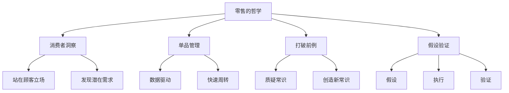

# 《零售的哲学》深度拆解

## 一、商业坐标定位（400字）

《零售的哲学》是7-Eleven便利店创始人铃木敏文的经营哲学总结。铃木敏文将7-Eleven从美国引入日本，并将其发展为全球最成功的便利店品牌，彻底改变了日本乃至全球的零售业态。

> [!abstract] 核心主题
> 本书的核心思想是：==零售的本质是应对变化==。消费者的需求永远在变化，零售商必须比消费者更早感知变化，并快速响应。

铃木敏文的经营哲学核心：
- **站在顾客的立场思考**，而非站在卖方立场
- **打破前例**，因为过去的经验可能是未来的障碍
- **假设-验证-调整**的科学方法

7-Eleven的创新包括：单品管理、密集开店策略、独特的供应链系统、便利店银行等，这些创新深刻影响了现代零售业。

---

## 二、商业逻辑地图（500字）

**核心框架：铃木敏文零售三原则**

| 原则 | 内涵 | 实践方法 |
|------|------|----------|
| 顾客至上 | 一切从顾客需求出发 | 田野调查、数据分析 |
| 应对变化 | 零售的唯一不变是变化 | 持续创新、快速迭代 |
| 假设验证 | 用科学方法做决策 | 数据收集、A/B测试 |

---

## 三、逐章深度拆解（5000字）

### 主题1：「消费者心理学——理解顾客的真正需求」

**【第一性原理拆解】**

铃木敏文的核心洞见：

> [!tip] 卖方思维vs买方思维
> - **卖方思维**：我们有什么，就卖什么
> - **买方思维**：顾客需要什么，我们就提供什么

**【DIKW四层提炼】**

| 层级 | 内容 |
|------|------|
| Data | 便利店开始卖饭团时，很多人认为"便利店卖米饭？谁会买？" |
| Information | 但实际上，上班族需要便捷的早餐和午餐 |
| Knowledge | 消费者有时候自己都不知道自己需要什么 |
| Wisdom | ==不是给顾客他们想要的，而是给顾客他们需要但还没意识到的== |

**【案例审查】**

7-Eleven饭团的创新：
- 传统观念：饭团是家里做的，谁会买？
- 铃木的洞察：现代人忙碌，需要便捷美味的食物
- 创新：开发便利店专用饭团，包装创新（海苔分离保持脆度）
- 结果：饭团成为便利店最畅销的商品之一

---

### 主题2：「单品管理——零售的精细化革命」

**【第一性原理拆解】**

==单品管理==是7-Eleven的核心竞争力：

> [!abstract] 单品管理
> 不是按品类管理，而是按每个SKU单独管理。每个商品都有自己的销售数据、库存数据和利润贡献。

**【DIKW四层提炼】**

| 层级 | 内容 |
|------|------|
| Data | 7-Eleven每家店约2500个SKU |
| Information | 每个SKU都有详细的销售记录 |
| Knowledge | 单品管理让每个商品都被"看见" |
| Wisdom | ==不是卖商品，而是管理商品组合== |

**【案例审查】**

单品管理的实践：
- **天气数据**：下雨天冷饮销量下降，热食销量上升
- **活动数据**：附近有活动时调整商品结构
- **时间数据**：早中晚的消费需求不同

---

### 主题3：「打破前例——质疑一切"常识"」

**【第一性原理拆解】**

铃木敏文最著名的理念：

> [!warning] 打破前例
> "过去的经验"往往是最大的障碍。消费者在变化，如果零售商固守过去的做法，就会被淘汰。

**【案例审查】**

7-Eleven打破的"常识"：

| "常识" | 7-Eleven的做法 | 结果 |
|--------|----------------|------|
| 便利店不能卖生鲜 | 开发便利店专用鲜食 | 鲜食成为核心品类 |
| 银行是专业机构才能做 | 创立便利店银行（Seven Bank） | 成为高利润业务 |
| 24小时营业太浪费 | 坚持24小时 | 成为便利店标配 |

**【苏格拉底追问】**

- Q：如何判断哪些常识应该打破？
- A：问"这个做法是为了谁的方便？"如果是为了卖方的方便而非顾客的方便，就应该质疑。

---

### 主题4：「密集开店策略——区域称霸理论」

**【第一性原理拆解】**

7-Eleven的扩张策略与众不同：

> [!tip] 密集开店
> 不是广撒网，而是在一个区域内密集开店，形成"统治"后再扩展到下一个区域。

**优势分析**：

| 优势 | 说明 |
|------|------|
| 物流效率 | 配送密度高，成本低 |
| 品牌认知 | 消费者反复看到，印象深刻 |
| 竞争壁垒 | 后来者难以进入 |
| 员工管理 | 督导可以高效巡店 |

---

### 主题5：「假设-验证循环——零售的科学方法」

**【第一性原理拆解】**

铃木敏文推崇科学的经营方法：

> [!abstract] 假设-验证循环
> 1. 观察数据和现象
> 2. 提出假设
> 3. 执行测试
> 4. 验证结果
> 5. 调整假设，重复循环

**【DIKW四层提炼】**

| 层级 | 内容 |
|------|------|
| Data | 某款饭团销量突然下降 |
| Information | 可能原因：天气、竞品、口味疲劳？ |
| Knowledge | 提出假设，设计实验验证 |
| Wisdom | ==不是凭感觉决策，而是用数据说话== |

---

### 主题6：「供应链创新——效率与品质的平衡」

**【第一性原理拆解】**

7-Eleven的供应链是其核心竞争力：

> [!note] 共同配送系统
> - 不同供应商的商品在配送中心集中
> - 按温度带分类配送（冷冻、冷藏、常温）
> - 一天多次配送，保证新鲜度

**【案例审查】**

| 传统模式 | 7-Eleven模式 |
|----------|--------------|
| 每个供应商单独配送 | 共同配送 |
| 一天一次配送 | 一天3-4次 |
| 大批量补货 | 小批量多频次 |
| 库存高、损耗大 | 库存低、新鲜度高 |

---

## 四、核心决策框架提炼（800字）

### 框架1：顾客需求分析法

> [!abstract] 三问检验法
> 1. 这个决策是为了谁的方便？（卖方还是买方）
> 2. 顾客的潜在需求是什么？（他们说出来的vs没说出来的）
> 3. 如果我是顾客，我会怎么想？

### 框架2：单品管理检查表

| 检查项 | 问题 |
|--------|------|
| 销售趋势 | 这个SKU销量是上升还是下降？ |
| 利润贡献 | 利润率如何？占用货架合理吗？ |
| 关联销售 | 与哪些商品有关联购买？ |
| 时间分布 | 什么时间段销量最高？ |
| 天气影响 | 销量与天气有什么关系？ |

---

## 五、费曼终极检验（400字）

**如果用一句话向朋友解释这本书的核心观点：**

> 零售的本质是应对变化——站在顾客立场思考，用假设-验证的方法不断创新，永远不要被过去的"成功经验"束缚。

**三个能立即应用的行动：**

1. **换位思考**：下次做决策时，问自己"这是为了我的方便还是用户的方便？"

2. **质疑常识**：列出你工作中3个"一直这么做"的惯例，问"为什么？还有没有更好的方法？"

3. **假设验证**：下次有想法时，不要直接全面推行，先小范围测试，收集数据，再决定是否扩大

**这本书改变了什么认知：**

从"卖方思维"转向"买方思维"。不是"我有什么卖什么"，而是"顾客需要什么，我就创造什么"。

---

## 延伸阅读路线图

| 书籍 | 关联 |
|------|------|
| [[《从0到1》]] | 关于创新和打破常规 |
| [[《定位》]] | 消费者心智的占领 |
| [[《精益创业》]] | 假设-验证的方法论 |
