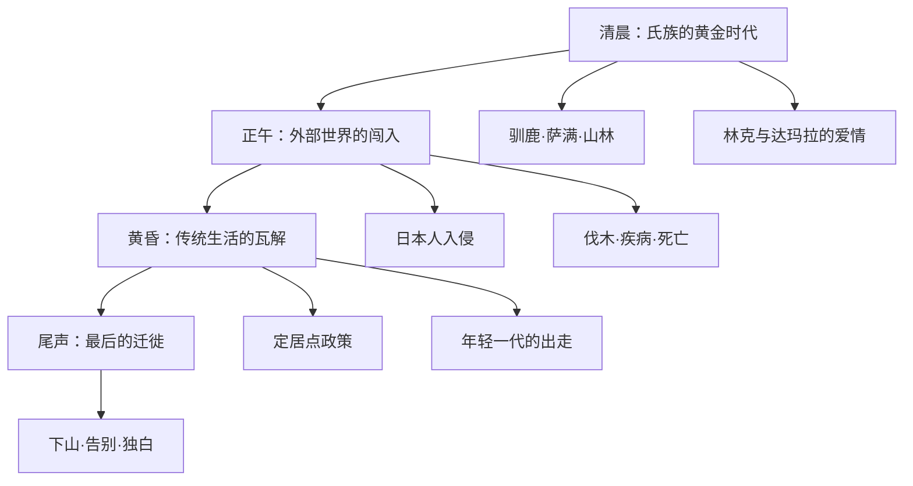
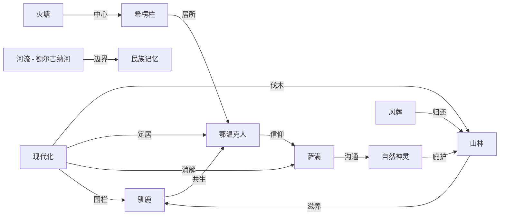
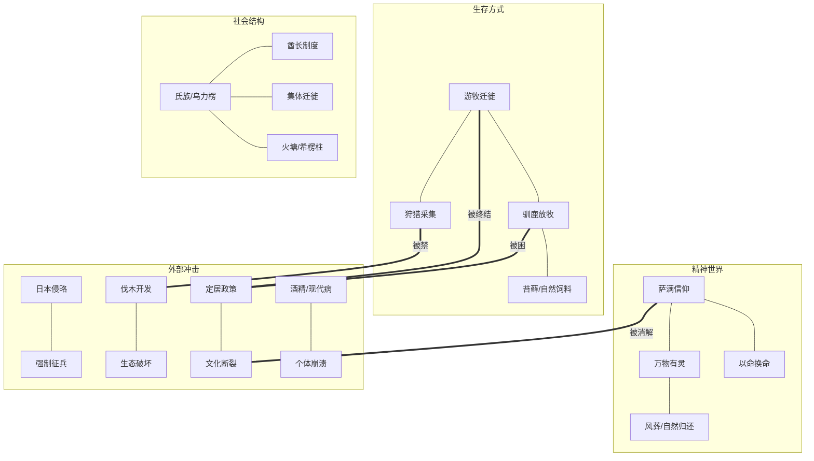

## 一、文学坐标定位

> [!abstract] 速览
> 《额尔古纳河右岸》是迟子建于2005年出版的长篇小说，2008年获第七届茅盾文学奖。小说以一位年近九旬的鄂温克族最后一位酋长的女人的口吻，讲述了这个东北大兴安岭游牧民族近百年的兴衰史——从清末到21世纪初，鄂温克族人与驯鹿相伴、与山林共生的生活方式如何在现代化进程中走向终结。

迟子建是中国当代文学中最具自然书写意识的作家之一。她出生于黑龙江漠河北极村，那片冰雪覆盖的土地赋予了她笔下独特的==地理诗学==。在中国当代文坛，迟子建的位置独特：她既不属于先锋派的形式实验，也不归入新写实的日常还原，而是走出了一条以==自然、死亡、灵性==为核心的叙事道路。

这部小说的写作缘起值得注意。迟子建在创作谈中提到，她在2003年读到一则新闻：鄂温克族最后的猎民部落被要求从山林搬迁到定居点。这则新闻触动了她，她随后深入大兴安岭采访鄂温克族老人，并在丈夫意外去世的巨大悲痛中完成了这部作品。==个人的丧失之痛与一个民族的消逝之悲==在这部小说中形成了深层共振。

在世界文学脉络中，《额尔古纳河右岸》可与加西亚·马尔克斯的[[《百年孤独》]]（家族史诗与文明消逝）、[[《德尔苏·乌扎拉》]]（西伯利亚猎人与自然的关系）、以及北美原住民文学中的部落叙事形成对话。但迟子建的独特之处在于：她不是以旁观者或人类学家的视角去「记录」一个民族，而是==让这个民族自己开口说话==。

---

## 二、叙事结构解析

> [!note] 第一人称独白体：最后的讲述者
> 小说采用一位年近九旬的鄂温克族老年女性的独白，以「我」的视角回顾整个氏族近百年的历史。全书分为四个部分：清晨、正午、黄昏、尾声——对应着这个民族从繁盛到衰落的生命周期。

这一结构设计至少有四重深意：

1. **时间的自然隐喻**：「清晨—正午—黄昏—尾声」不是线性历史的划分，而是一个==生命有机体的节律==。迟子建用一天的时间来隐喻一个民族的兴衰，暗示文明如同生命，有它自然的生长与凋零。这个结构本身就是一种世界观的表达：万物有时，盛极必衰。

2. **口述史的仪式感**：老人坐在火塘边讲述，这个场景本身就是鄂温克族文化传承的核心方式——没有文字的民族依靠口耳相传保存记忆。迟子建选择让「最后一个知道全部故事的人」来讲述，赋予了叙事一种==挽歌式的紧迫感==：如果她不说，就没有人说了。

3. **女性视角的选择**：为什么是「酋长的女人」而不是酋长本人？因为在鄂温克族的游牧生活中，女性是日常生活的维系者——她们负责搭建和拆卸希楞柱（帐篷）、照料驯鹿、制作食物、养育后代。男性狩猎归来又离去，而女性==始终在场==。选择女性视角，就是选择了一个更完整、更贴近生活肌理的叙事立场。

4. **叙事者的双重身份**：「我」既是故事的亲历者，又是故事的最后守护者。她的讲述既是回忆，也是告别。这种叙事位置使得文本弥漫着一种==明知终将失去却仍要讲述==的悲凉力量。

小说的时间跨度从20世纪初延伸到21世纪初，覆盖了==日本侵华、新中国成立、文化大革命、改革开放==等重大历史事件。但迟子建的处理方式与大多数「史诗性」小说截然不同——这些历史事件不是叙事的主轴，而是从大兴安岭深处一个游牧氏族的视角被==边缘性地感知到的回响==。日本人来了，他们知道山下在打仗；新中国成立了，有人上山来动员他们；文革来了，外面的世界很混乱——但对于以驯鹿为伴的鄂温克人来说，最重要的事情始终是迁徙、狩猎和生存。

> [!important] 为什么这样写？
> 迟子建刻意将「大历史」处理为背景噪音，是为了完成一个根本性的叙事立场转换：不是让少数民族成为主流历史的注脚，而是==让主流历史成为少数民族生活的注脚==。这是一种深刻的叙事伦理选择。

---

## 三、主题与意象网络

### 主题一：自然——万物有灵的世界观

> [!tip] 黄金圈拆解
> - **Why**：迟子建为什么要用整部小说来呈现鄂温克人与自然的关系？因为这种关系代表了一种正在消逝的人类生存方式——不是征服自然、利用自然，而是==作为自然的一部分而存在==。这种生存方式的消逝，不仅是一个民族的悲剧，也是全人类的损失。
> - **How**：通过大量的自然意象（驯鹿、河流、山林、风雪、极光）和萨满信仰的呈现，构建一个人与自然不可分割的生命共同体。
> - **What**：鄂温克人跟随驯鹿迁徙，与熊、狼、鹰共处，在雷电中感知神灵，在风雪中辨认命运。

**文本细读**：小说中的驯鹿是最核心的自然意象。鄂温克人不把驯鹿当作「牲畜」或「财产」，而是视为==共同生活的伙伴==。驯鹿有名字，有性格，有情感。「我」的讲述中反复出现驯鹿的出生、死亡、走失、回归，每一头驯鹿的命运都与某个家庭成员的命运相对应。驯鹿吃苔藓，人跟着驯鹿走——这种关系决定了鄂温克人的迁徙节奏，也决定了他们的世界观：==人不是自然的主人，人是自然循环中的一个环节==。

火是另一个关键意象。鄂温克人的希楞柱中央永远燃烧着火塘，火是温暖的来源、食物的媒介、聚会的中心、故事讲述的场所。火塘的熄灭意味着一个营地的放弃，而小说最终的意象正是——最后的火塘面临熄灭。

**概念网络**：自然在本书中不是「环境」或「背景」，而是一个==活的存在==。它与「萨满信仰」「生死观」「迁徙」三个主题构成紧密的网络：萨满通过与自然神灵沟通来治病救人；生死被视为自然循环的一部分（死去的人回归山林）；迁徙则是人对自然节律的顺应。

**苏格拉底追问**：迟子建是否在美化一种「原始」的生活方式？这个问题的答案是复杂的。小说并没有回避游牧生活的艰辛——严寒、疾病、婴儿的夭折、野兽的威胁——但它确实赋予了这种生活一种==尊严感和完整性==，而这种尊严感在现代化的定居生活中似乎被稀释了。迟子建不是在主张「回到过去」，而是在追问：==当我们获得现代生活的便利时，我们失去了什么？==

---

### 主题二：死亡——生命的另一种形式

> [!tip] 黄金圈拆解
> - **Why**：迟子建为什么在小说中安排了如此多的死亡？因为在鄂温克人的世界观中，死亡不是生命的终结，而是==生命的转化==。理解他们如何面对死亡，就理解了他们如何理解生命。
> - **How**：通过风葬（将死者放置在树上）、萨满以命换命的仪式、以及死者在后人记忆中的持续存在，呈现一种与现代社会截然不同的死亡观。
> - **What**：林克冻死在雪地、拉吉达被雷电击中、瓦罗加死于酗酒、妮浩为救他人而牺牲自己的孩子——每一次死亡都有其独特的形态和意义。

**文本细读**：小说中最震撼人心的死亡叙事与萨满妮浩有关。妮浩是氏族的女萨满，她拥有通灵和治病的能力，但==每一次她跳神救活别人，她自己的一个孩子就会死去==。这个设定不是迟子建的虚构——它来自鄂温克族萨满信仰中关于「代价」的观念：生命的守恒需要以生命来交换。

妮浩明知这个代价，却一次又一次选择跳神救人。当别人的孩子生病、当山火威胁氏族时，她站出来，跳起萨满鼓舞，用神歌呼唤神灵——然后她的孩子死去。这不是「牺牲」的简单叙事，而是呈现了一种==古老的生命伦理==：萨满的使命高于个人的幸福，氏族的存续高于个体的血脉。

风葬是另一个极具表现力的死亡意象。鄂温克人将死者的遗体放在树上，让风雪和时间将其归还给自然。这种丧葬方式本身就是一种世界观的表达：==人来自自然，回归自然==。没有坟墓、没有墓碑，大兴安岭的整片山林就是他们的墓园。

**概念网络**：死亡在本书中与「萨满信仰」「自然循环」「代际传承」三者紧密关联。萨满的存在本身就是生与死之间的桥梁；风葬将死亡纳入自然循环；而老人对逝者的讲述则完成了代际间的记忆传承——==只要被讲述，死者就没有真正消失==。

**苏格拉底追问**：妮浩的选择是伟大还是残忍？作为母亲，她「选择」（或被迫接受）让自己的孩子去死来救别人的孩子——这在现代伦理学中几乎是不可接受的。但迟子建没有用现代的伦理框架来审判妮浩。她呈现的是一种==前现代的生命观==：在这个世界观中，萨满不是一个「职业」，而是一种「命运」，妮浩的痛苦恰恰是她的神圣性的来源。

---

### 主题三：文明的消逝——挽歌与抵抗

> [!tip] 黄金圈拆解
> - **Why**：迟子建为什么要写一个文明消逝的故事？因为鄂温克族的命运折射出一个全球性的问题：在现代化的进程中，那些与主流文明不同的生活方式和世界观，是否注定要被淘汰？
> - **How**：通过「我」的讲述，展示外部世界对鄂温克族生活的层层侵蚀——日本人的入侵、伐木场的推进、定居政策的实施、年轻一代的离去。
> - **What**：从近百人的游牧氏族到最终只剩下几个不愿下山的老人，鄂温克族的森林生活在一个世纪内走向了终结。

**文本细读**：小说中有一个极具象征性的情节：政府为鄂温克人在山下建造了定居点，砖瓦房取代了希楞柱，自来水取代了山泉，电视取代了火塘边的故事。年轻一代被这种「更好的生活」吸引，纷纷下山。但「我」和少数老人选择留在山上——不是因为她不知道山下的生活更「舒适」，而是因为在她看来，==离开山林的鄂温克人就不再是鄂温克人了==。

驯鹿的命运是文明消逝的最直观体现。被带到定居点的驯鹿无法适应——它们需要吃苔藓，需要在山林中自由行走，定居点的围栏和人工饲料让它们生病、萎靡。驯鹿的水土不服，正是整个鄂温克文化在现代化环境中的隐喻。

**概念网络**：「文明的消逝」与「自然」「现代化」「记忆」三个主题密切交织。自然的被破坏（伐木、开矿）直接导致了游牧生活的不可持续；现代化以「进步」的名义推行一种标准化的生活方式；而「我」的讲述本身就是对文明消逝的最后抵抗——==在语言中保存即将失去的一切==。

> [!warning] 迟子建的叙事立场
> 迟子建没有将现代化简单地描绘为「恶」。她承认定居生活带来了医疗、教育和物质条件的改善。但她同时追问：一种生活方式的消亡是否是「进步」的必要代价？如果答案是「是」，那么我们至少应该知道我们失去了什么。

**苏格拉底追问**：鄂温克人的下山定居，是「解放」还是「消灭」？从物质生活的角度看，定居点的条件远优于山林中的帐篷。但从文化存续的角度看，当一个民族失去了与其世界观深度绑定的生活方式（游牧、萨满、驯鹿放牧），这个民族还在吗？迟子建的回答暗含在小说的结构中：「我」的讲述是在下山之前完成的，==当讲述结束，一切也就结束了==。

---

### 主题四：爱与命运——在无常中寻找恒常

> [!tip] 黄金圈拆解
> - **Why**：迟子建为什么在一部民族史诗中穿插了大量的爱情叙事？因为在她看来，爱情是人类面对命运无常时最本能的回应——在一切都可能失去的世界里，爱是唯一确定的东西。
> - **How**：通过三代人的爱情故事——「我」的父母林克与达玛拉、「我」与瓦罗加/拉吉达、以及下一代的情感纠葛——展示爱在不同历史境遇中的形态。
> - **What**：每一段爱情都带着命运的烙印：有的在严寒中相互取暖，有的被死亡骤然中断，有的在酒精和绝望中变质。

**文本细读**：「我」与第一任丈夫拉吉达的爱情是全书最温暖的段落之一。拉吉达是一个沉默寡言但内心柔软的猎人，他对「我」的爱体现在每一个日常细节中——帮她暖手、为她猎取最好的皮毛、在风雪夜守护她。他的死——被雷电击中——是突然的、不可解释的、带有某种自然神秘力量的终结。这种死法在现代人看来是「偶然事件」，但在鄂温克人的世界观中，雷电是天神的意志，拉吉达的死是天注定的。

「我」与第二任丈夫瓦罗加的关系则呈现了爱情的另一面。瓦罗加后来沉溺于酗酒，这个情节指向了一个更深层的问题：当一个民族的生活方式被侵蚀、存在意义被动摇时，==个体会以何种方式崩溃==。酗酒是许多原住民族在现代化冲击下的普遍困境，迟子建没有回避这个问题。

**概念网络**：爱情在本书中与「死亡」「自然」构成一个三角关系。爱在自然中生长（山林、河流、驯鹿是爱情的见证者和背景），又在死亡中被中断或升华。但与许多爱情叙事不同的是，迟子建笔下的爱不是两个人的私事——它总是嵌入在氏族生活的整体之中。

---

### 主题五：萨满——灵性世界的守护者与牺牲者

> [!tip] 黄金圈拆解
> - **Why**：迟子建为什么给予萨满信仰如此核心的位置？因为萨满不仅是鄂温克族的宗教实践者，更是他们==世界观的人格化体现==。萨满的存在意味着：在这个世界观中，可见的物质世界与不可见的精神世界是连通的。
> - **How**：通过两代萨满——尼都和妮浩——的命运，展示了萨满角色的神圣性、沉重性以及在现代世界中的不可持续性。
> - **What**：萨满跳神、通灵、治病、求雨、驱灾，但也为此付出了巨大的个人代价。

**文本细读**：尼都萨满是「我」小时候见到的老萨满，他身上还保留着萨满信仰最完整的力量。当他跳起神鼓、唱起神歌时，整个营地都沉浸在一种超越日常的==神圣时刻==之中。尼都代表的是萨满信仰尚未被质疑的时代。

妮浩萨满则是一个更复杂的角色。她不仅拥有萨满的能力，还承受着萨满的诅咒——每救一个人，自己就失去一个孩子。妮浩的悲剧性在于：她无法拒绝自己的使命。当有人求助时，她明知代价，依然穿上神裙、敲起神鼓。迟子建没有将妮浩塑造为一个「伟大的牺牲者」，而是让你看到她每一次失去孩子时的==撕心裂肺==。她的伟大恰恰在于：她在痛苦中依然选择承担使命。

**苏格拉底追问**：在一个不再相信萨满的世界里，妮浩的牺牲还有意义吗？迟子建的回答似乎是：意义不取决于信仰是否被「证实」，而取决于承担者是否真诚。妮浩的真诚是不容置疑的——她用自己孩子的生命为代价来实践她的信仰，这种代价本身就构成了意义。

---

## 四、核心意象图谱

> [!note] 意象的互文结构
> 注意迟子建如何构建一个==闭合的生态系统==：驯鹿吃苔藓、人跟随驯鹿、萨满与自然神灵沟通来保护人和驯鹿、死去的人通过风葬回归山林滋养苔藓。现代化的入侵打破的不是这个链条中的某一个环节，而是==整个循环系统==。

---

## 五、人物分析

### 「我」——最后的讲述者

「我」没有被赋予一个响亮的名字（文中她有名字，但叙事中更突出的是她作为「最后的讲述者」的身份）。她的一生横跨了鄂温克族近百年的历史，她是所有事件的见证者，也是最后一个完整记住这些事件的人。

她最显著的特质是==清醒的悲悯==。她既不美化过去（她知道游牧生活的艰辛），也不否定现在（她理解年轻人想下山的渴望），但她内心深处知道：==有些东西一旦失去就再也找不回来了==。她的讲述不是为了控诉谁，而是为了在语言中保存即将消逝的世界。

### 妮浩——萨满的十字架

妮浩是全书最令人心碎的角色。她不是一个符号或象征，而是一个活生生的女人——她会哭、会怕、会犹豫。但每当氏族需要她时，她就穿上那件神裙，跳起那段舞蹈，然后承受又一次丧子之痛。妮浩的悲剧性在于：==她的能力和她的诅咒是同一件事==。

### 林克与达玛拉

「我」的父母代表了鄂温克族黄金时代的缩影。林克是一个优秀的猎人和领袖，达玛拉是一个温暖的母亲和歌者。他们的爱情、他们的日常生活、他们与驯鹿和山林的关系，构成了小说「清晨」部分最温暖的底色。他们的存在让读者知道：==这个民族曾经拥有怎样的丰盛==。

### 依莲娜——断裂的一代

依莲娜是「我」的孙女，一个在外面的世界接受了教育的年轻画家。她试图用绘画来保存鄂温克族的文化记忆，但她自己已经无法完全回到那个世界。依莲娜代表了文化断裂中最痛苦的状态：==她知道自己失去了什么，却无力挽回==。她的最终命运（酗酒致死）暗示了这种断裂的毁灭性力量。

---

## 六、风格与语言

> [!note] 迟子建的语言特质
> 迟子建的语言兼具诗性与朴素，她的叙事声音像是一条大兴安岭的河流——表面平缓，底下暗流涌动。

迟子建在这部小说中的语言策略可以概括为：==用诗性的语言讲述粗粝的生活==。

鄂温克人的日常生活是粗粝的——宰杀猎物、处理兽皮、在零下四五十度的严寒中迁徙。但迟子建的语言赋予了这些劳作一种诗意的尊严。她不是在「美化」苦难，而是让你看到：==在这种生活方式内部，存在着一种自足的美感==。

小说的节奏也值得注意。「我」的讲述是缓慢的、绵延的、带有回忆特有的跳跃和重复。这种节奏模拟了口述传统的特质——不是现代小说那种精心设计的情节推进，而是一个老人坐在火塘边、想到哪里说到哪里的自然流淌。但在这种看似随意的讲述中，迟子建精心嵌入了==命运的伏笔和意象的呼应==。

在对话语言方面，迟子建为鄂温克人创造了一种独特的说话方式——简短、直接、带有自然意象。他们不说「我很难过」，他们说「我的心像被冰雪覆盖了」。这种语言不是刻意的诗化，而是来自一个与自然深度共生的民族的==自然表达方式==。

---

## 七、文学批评多视角

**生态批评视角**：《额尔古纳河右岸》是中国当代文学中最重要的生态叙事之一。它呈现了一种人与自然和谐共处的生存模式，以及这种模式被现代工业文明破坏的过程。从生态批评的角度看，鄂温克人的生活方式代表了一种==可持续的生态智慧==——他们从不过度猎杀、他们跟随驯鹿迁徙以避免对某一片草场的过度消耗、他们通过萨满信仰维持着对自然的敬畏。

**后殖民视角**：小说可以被读作一部少数民族在主流文明（汉族为主体的现代中国）压力下被边缘化、被同化的历史。「下山定居」的政策，无论其初衷多么善意，在客观效果上等同于==对一种文化的温和清除==。迟子建的叙事既没有简单地控诉政策，也没有天真地为其辩护，而是让读者看到：当「进步」成为唯一的价值标准时，那些不符合「进步」定义的生活方式就注定被淘汰。

**女性主义视角**：小说通过女性叙事者的选择，呈现了一种不同于主流女性主义叙事的女性力量。「我」和妮浩不是在争取「权利」或「平等」——这些概念在鄂温克族的传统生活中并不构成核心问题。她们的力量体现在==承担、忍耐、维系和传承==之中。这种女性力量不是对男性权力的反抗，而是一种独立于性别权力关系之外的生存力量。

**神话原型批评视角**：小说的叙事结构暗合了神话学中「失乐园」的原型。鄂温克人的山林生活是一个「伊甸园」式的存在——人与自然和谐、人与神灵相通、生死循环有序。而现代化的闯入就像是一次「逐出伊甸园」。但与《圣经》不同，这里没有「原罪」——被逐出的人没有犯错，错在「伊甸园」本身被推平了。

---

## 八、「为什么这样写」——迟子建的核心叙事选择

> [!important] 苏格拉底式追问

**问**：为什么选择一位将死的老人来讲述？
**答**：因为只有即将离开的人才有资格做最后的总结。老人的视角赋予叙事一种==回望的从容和告别的庄严==。一个年轻人不可能以这种方式讲述——他还在故事中间，无法看到全貌。

**问**：为什么不用第三人称或全知视角？
**答**：因为第三人称会将鄂温克人变成「被观察的对象」，而迟子建要的是==主体性==——这是「我们的故事」，不是「他们的故事」。

**问**：为什么不详细描写历史大事件（如抗日战争、文革）？
**答**：因为对鄂温克人来说，这些「大事件」远没有一场暴风雪或一头驯鹿的死亡来得切身。==将历史大事件边缘化，是对鄂温克人主体经验的尊重==。

**问**：为什么小说的结尾不是「大团圆」或「彻底毁灭」，而是一种含混的、未完成的告别？
**答**：因为现实本身就是如此。鄂温克人没有在某一天突然「消失」——他们在漫长的过程中被稀释、被同化、被遗忘。这种==缓慢的消逝比突然的毁灭更令人心痛==。

**问**：迟子建的丧夫之痛如何影响了这部小说？
**答**：迟子建曾坦言，丈夫的意外去世是她写作此书期间最大的个人打击。这种个人经验使得她对「失去」的书写具有了一种==来自骨髓的真实==。当「我」讲述失去拉吉达时的痛苦，那不仅是一个虚构角色的感受，也是作者本人在文字中安放的哀恸。

---

## 九、概念网络全景图

---

## 十、跨时空共鸣

《额尔古纳河右岸》的力量超越了鄂温克族的个体命运，指向了21世纪人类面临的核心问题之一：==在全球化和现代化的浪潮中，文化多样性如何存续？==

你不需要是鄂温克人才能感受到这种共鸣。每一个在城市化进程中失去故乡的人，每一个看到传统手艺和方言消失的人，每一个感到自己的生活越来越「标准化」的人，都能在这部小说中找到回响。

迟子建提供的不是答案，而是一面镜子。她让你看到：在我们习以为常的「进步」叙事之外，还存在着另一种衡量生活价值的方式——不是用GDP、不是用物质丰富程度、不是用寿命长短，而是用==人与自然的关系、人与信仰的关系、人与社群的关系==来衡量。

当「我」在小说结尾选择留在山上时，她的选择不是「反动」或「守旧」，而是一种==最后的尊严==：我知道这个世界正在改变，我知道我无法阻止，但我可以选择不参与这种改变——至少在我还活着的时候。

---

## 十一、费曼终极检验

> [!abstract] 用最简单的话概括
> 如果你要向一个没读过这本书的朋友解释《额尔古纳河右岸》，可以这样说：

在中国东北的大兴安岭里，有一个叫鄂温克的少数民族，他们世世代代跟着驯鹿在山林里迁徙，靠打猎和放牧驯鹿生活。他们相信万物有灵，有自己的萨满（巫师），死了的人被放在树上，回归自然。

这本书是一个九十岁的鄂温克老太太在讲她们家族的故事。她经历了日本人来、新中国成立、各种运动，最后政府让他们搬下山住楼房。年轻人都走了，驯鹿也养不成了，老太太不想走。

这本书最打动人的地方不是某一个情节，而是一种整体的感觉：你在读的时候会意识到，这个世界上曾经存在过一种完全不同的活法——人和驯鹿、和山林、和河流、和雪是一体的。这种活法正在消失，而且消失之后不会再有了。你会觉得难过，不是因为你特别在意鄂温克族，而是因为你隐约觉得：==我们每个人好像都在失去某种类似的东西==。

---

## 延伸阅读路线图

> [!note] 推荐阅读路径

- [[《百年孤独》]] — 加西亚·马尔克斯的家族史诗，同样以一个家族的兴衰折射文明的命运
- [[《活着》]] — 余华的个体命运叙事，与《额尔古纳河右岸》在「生存」主题上形成对话
- [[《尘埃落定》]] — 阿来写藏族土司家族的消亡，同为少数民族视角的文明挽歌
- [[《呼兰河传》]] — 萧红的东北叙事，与迟子建共享地理和精神上的亲缘
- [[《群山之巅》]] — 迟子建另一部长篇，继续探索东北大地上的人性与命运
- [[《德尔苏·乌扎拉》]] — 阿尔谢尼耶夫记录的西伯利亚猎人，与鄂温克人的生活方式遥相呼应
- [[《最后的莫希干人》]] — 库珀的经典，北美原住民文明消逝的叙事先驱
