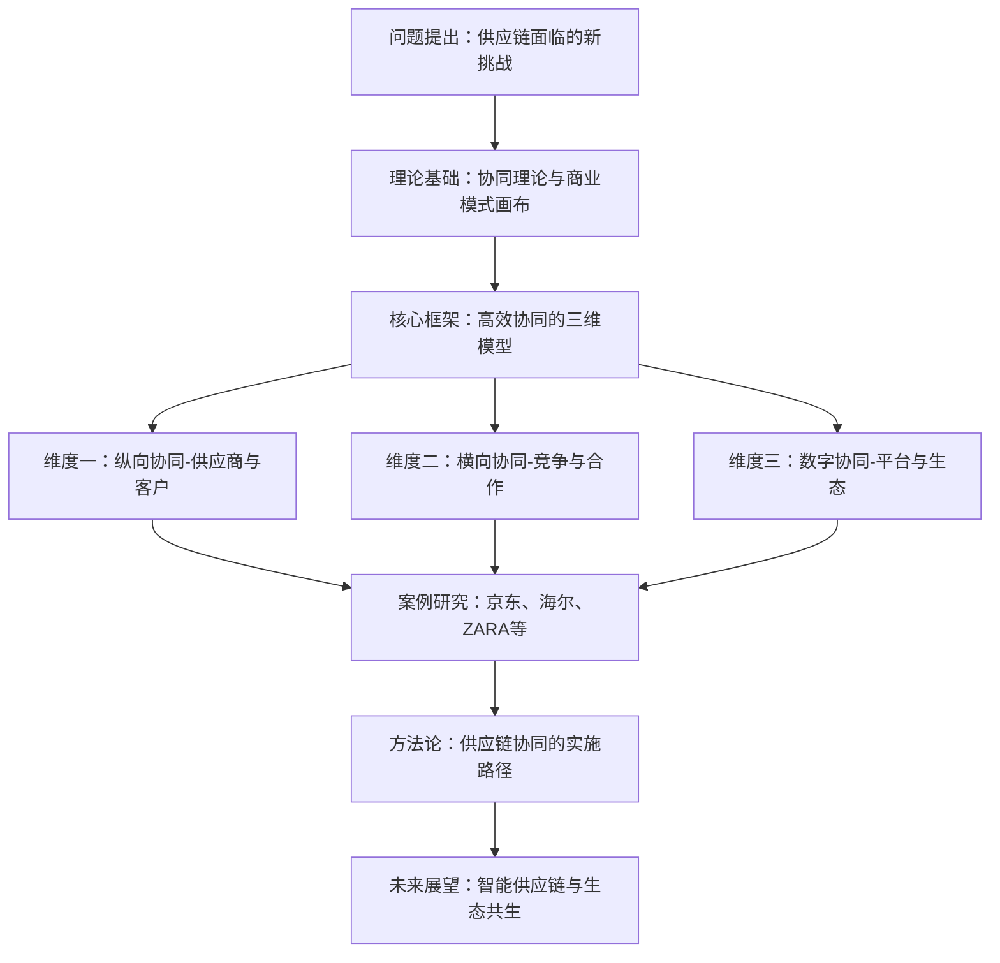
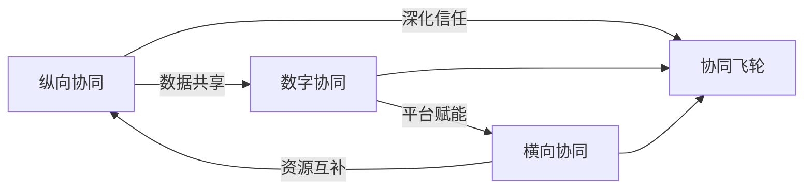
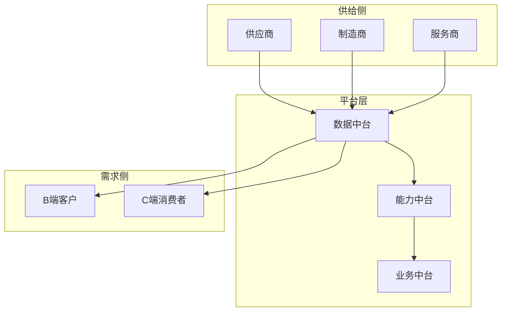
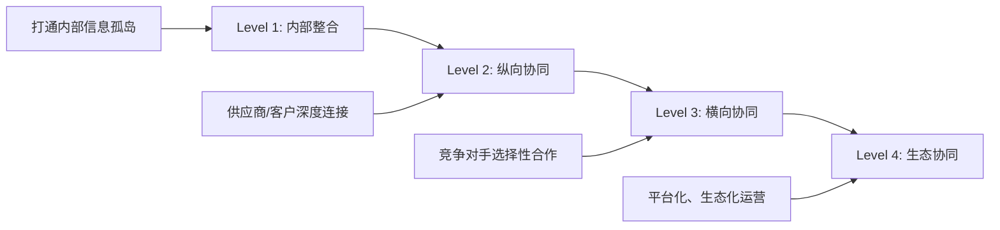

# 《高效协同：供应链与商业模式创新》深度读书笔记

## 一、元信息/坐标定位

### 作者背景
赵先德教授是中欧国际工商学院运营管理学教授，京东集团-中欧供应链管理学教席教授，长期深耕供应链管理与商业模式创新领域。其研究团队汇聚了学术界与产业界的双重视角，使本书兼具理论深度与实践价值。

### 写作背景与时代语境
本书诞生于==数字经济深度渗透实体产业==的关键时期。全球供应链面临前所未有的挑战：贸易摩擦加剧、疫情冲击、消费者需求碎片化、技术迭代加速。传统的"链式"供应链思维已无法应对VUCA时代的复杂性，企业亟需从"链"到"网"、从"竞争"到"协同"的范式转换。

### 学科定位
本书横跨==运营管理、战略管理、信息管理==三大学科领域，构建了"供应链管理×商业模式创新"的交叉研究框架。在供应链管理演进谱系中，它代表了从"效率优化"向"价值共创"的第三代供应链思想。

### 核心问题域
- 如何在不确定性环境中构建敏捷韧性的供应链体系？
- 数字技术如何重塑供应链的价值创造逻辑？
- 企业如何通过供应链协同实现商业模式的系统性创新？

> [!abstract] 一句话定位
> 这是一本将供应链管理从"成本中心"升维为"战略引擎"的实战指南，揭示了数字时代企业通过供应链协同实现商业模式创新的底层逻辑。

---

## 二、全书逻辑地图

**全书逻辑主线**：本书遵循"问题-理论-框架-案例-方法-展望"的递进结构。

**第一部分（第1-2章）**：诊断当前供应链面临的核心挑战——需求不确定性、供给脆弱性、信息不对称，提出"协同"作为破局关键。

**第二部分（第3-5章）**：构建理论基础，整合交易成本理论、资源基础观、网络理论，提出"高效协同"的三维分析框架。

**第三部分（第6-9章）**：深入探讨纵向协同（供应商管理、客户关系）、横向协同（竞合策略）、数字协同（平台化、生态化）的具体策略。

**第四部分（第10-12章）**：通过京东、海尔、ZARA等标杆案例，验证协同模式的有效性，提炼可复制的方法论。

**第五部分（第13章）**：展望AI、区块链等技术驱动下的未来供应链形态。

> [!tip] 阅读建议
> 建议先通读第3章的理论框架，建立整体认知后，再根据自身企业所处阶段选择性深读案例章节。

---

## 三、核心主题/逐章深度拆解

### 第一章：供应链管理的范式转换

#### 核心论点
传统供应链管理聚焦于==成本最小化和效率最大化==，但在VUCA时代，这种单一维度的优化已触及天花板。新范式要求从"链条思维"转向"网络思维"，从"零和博弈"转向"价值共创"。

#### DIKW四层提炼
| 层次 | 内容 |
|------|------|
| **Data** | 全球供应链中断事件年均增长6.4%；企业供应链成本占总成本15-25% |
| **Information** | 供应链脆弱性已成为企业最大的系统性风险之一 |
| **Knowledge** | 供应链韧性=冗余能力×响应速度×协同深度 |
| **Wisdom** | 供应链不再是成本中心，而是竞争优势的核心来源 |

#### 费曼式解读
> [!note] 用大白话解释
> 想象你经营一家奶茶店。过去你只关心"怎么让原料成本最低"——找最便宜的供应商、压缩库存。但现在问题变了：疫情来了供应商停工、网红爆款突然火了货跟不上、消费者要求今天下单明天到。你发现，==光省钱不够，还得"活得下来"和"跑得够快"==。这就是从"效率供应链"到"韧性供应链"的转变。

#### 关键概念
- **供应链韧性（Supply Chain Resilience）**：系统在遭受干扰后快速恢复的能力
- **VUCA环境**：易变性、不确定性、复杂性、模糊性的商业环境特征
- **牛鞭效应**：需求信息沿供应链向上游传递时逐级放大的现象

---

### 第二章：协同理论的演进与整合

#### 核心论点
协同（Synergy）不是简单的合作，而是==1+1>2的价值创造机制==。作者整合了三大理论视角来解释协同的本质：交易成本理论解释"为什么要协同"，资源基础观解释"协同什么"，网络理论解释"如何协同"。

#### DIKW四层提炼
| 层次 | 内容 |
|------|------|
| **Data** | 深度协同的供应链伙伴关系可降低交易成本30-40% |
| **Information** | 协同的本质是通过关系治理替代市场治理，降低不确定性 |
| **Knowledge** | 协同收益 = 资源互补性 × 治理匹配度 × 信任深度 |
| **Wisdom** | 最高效的协同是让合作伙伴的成功成为自己成功的前提条件 |

#### 费曼式解读
> [!note] 用大白话解释
> 为什么大公司要和供应商搞"战略合作"而不是每次都招标比价？因为==反复找新人的"相亲成本"太高了==。你得花时间了解对方、建立信任、磨合流程。交易成本理论说的就是这个。但仅仅降低成本还不够，资源基础观告诉你：好的伙伴能带来你没有的能力——比如小米没有工厂，但通过协同生态链企业，它能快速推出上千款产品。

#### 关键概念
- **交易成本**：搜寻成本、谈判成本、监督成本、违约成本的总和
- **资源互补性**：合作双方资源的异质性和协同价值潜力
- **关系治理**：基于信任、承诺、规范的非正式协调机制

---

### 第三章：高效协同的三维模型

#### 核心论点
作者提出==高效协同的三维模型==：纵向协同（与供应商、客户的垂直整合）、横向协同（与竞争对手的竞合关系）、数字协同（通过平台实现生态化连接）。三个维度相互强化，形成协同飞轮。

#### DIKW四层提炼
| 层次 | 内容 |
|------|------|
| **Data** | 三维协同企业的ROA比单维协同企业高出23% |
| **Information** | 协同不是单选题，而是组合拳 |
| **Knowledge** | 三维协同的关键是找到"协同锚点"——连接三个维度的核心能力 |
| **Wisdom** | 协同的终极目标是构建"你中有我、我中有你"的共生生态 |

#### 费曼式解读
> [!note] 用大白话解释
> 把企业想象成一个人。==纵向协同==是你和上下级的关系（供应商是你的"上级"提供资源，客户是你的"下级"接收服务）；==横向协同==是你和同事的关系（有时竞争同一个晋升机会，有时一起完成项目）；==数字协同==是你使用的协作工具（钉钉、飞书让大家高效连接）。一个人要发展好，这三层关系都得经营好，而且它们会相互影响。

#### 关键概念
- **协同锚点**：连接多维协同的核心能力或资源节点
- **竞合悖论**：同一关系中竞争与合作的张力与平衡
- **平台生态**：以平台为核心的多边市场协同网络

---

### 第四章：纵向协同——供应商关系深化

#### 核心论点
供应商关系从"交易型"向"战略型"升级是纵向协同的核心。作者提出==供应商关系金字塔模型==：底层是合格供应商（满足基本要求）、中层是优选供应商（具备差异化能力）、顶层是战略供应商（深度绑定、共同创新）。

#### DIKW四层提炼
| 层次 | 内容 |
|------|------|
| **Data** | 丰田的战略供应商数量仅占总供应商的5%，但贡献了60%的创新提案 |
| **Information** | 供应商分级管理是资源优化配置的前提 |
| **Knowledge** | 战略供应商选择标准 = 能力匹配度 × 战略契合度 × 关系投资意愿 |
| **Wisdom** | 对待战略供应商要像对待股东一样——分享信息、分享利益、分享风险 |

#### 费曼式解读
> [!note] 用大白话解释
> 你的朋友圈也有"金字塔"：==点赞之交==（只知道存在）、==普通朋友==（偶尔联系）、==铁哥们==（有事随叫随到）。供应商管理也一样。对"点赞之交"型供应商，比价选最便宜的就行；对"铁哥们"型供应商，你得像苹果对台积电那样——提前3年共同规划技术路线、投资建产线、签长期保量协议。

#### 关键概念
- **VMI（供应商管理库存）**：供应商根据客户实际消耗自动补货
- **JIT II**：供应商代表常驻客户现场，深度参与计划与采购
- **供应商早期介入（ESI）**：在产品设计阶段就让供应商参与

> [!warning] 实践陷阱
> 很多企业误将"战略供应商"理解为"给订单最多的供应商"。实际上，==战略性体现在能力互补和共同成长==，而非采购金额。

---

### 第五章：纵向协同——客户关系重构

#### 核心论点
数字时代的客户关系从"B2C"单向输出转向==C2B/C2M的双向共创==。客户不再是价值链的终点，而是价值创造的起点和全程参与者。

#### DIKW四层提炼
| 层次 | 内容 |
|------|------|
| **Data** | 参与共创的客户复购率提升47%，客单价提升35% |
| **Information** | 客户参与深度与忠诚度呈正相关 |
| **Knowledge** | 客户协同三层次：信息协同→设计协同→价值协同 |
| **Wisdom** | 最好的产品经理是你的客户，最好的销售是你的忠实用户 |

#### 费曼式解读
> [!note] 用大白话解释
> 过去企业和客户的关系是"==我做你买=="——像餐厅服务员送上固定菜单。现在变成"==你说我做=="——像日料店的omakase，厨师根据你的口味偏好定制。更高级的是"==一起做=="——像海底捞的DIY锅底，你参与创造，吃得更开心，下次还来。小米的"参与感"营销、SHEIN的"测款-追单"模式都是这个逻辑。

#### 关键概念
- **C2M（Customer to Manufacturer）**：消费者直连制造的定制模式
- **需求感知**：通过数据洞察捕捉客户未表达的潜在需求
- **客户终身价值（CLV）**：客户全生命周期贡献的总价值

---

### 第六章：横向协同——竞合战略

#### 核心论点
竞争对手可以成为合作伙伴。==竞合（Coopetition）==不是矛盾修辞，而是复杂商业环境中的理性选择。关键是识别"可协同区域"（双方都能受益）和"必争区域"（零和博弈），在前者合作、在后者竞争。

#### DIKW四层提炼
| 层次 | 内容 |
|------|------|
| **Data** | 航空联盟成员的单位运营成本比非联盟航空低18% |
| **Information** | 竞合可以做大蛋糕，而不仅仅是分蛋糕 |
| **Knowledge** | 竞合边界 = 价值创造环节合作 + 价值分配环节竞争 |
| **Wisdom** | 与其在红海中厮杀，不如联手开拓蓝海 |

#### 费曼式解读
> [!note] 用大白话解释
> 想象你和邻居都卖水果。你们是竞争对手对吧？但如果==一起去批发市场进货==，就能拿到更低的批发价，双方都受益——这是"合作"。回来后你卖你的、我卖我的，各凭本事吸引顾客——这是"竞争"。竞合就是把这两件事==分开在不同环节==做：在降低成本的环节合作，在争取客户的环节竞争。

#### 关键概念
- **竞合矩阵**：根据合作潜力和竞争强度划分四种关系类型
- **联合采购**：竞争对手共同采购以获取规模议价能力
- **标准联盟**：共同制定行业标准，做大整体市场

---

### 第七章：数字协同——平台化转型

#### 核心论点
数字平台是实现高效协同的==基础设施和放大器==。平台通过网络效应聚合供需两端，通过数据智能优化匹配效率，通过开放接口实现能力共享。

#### DIKW四层提炼
| 层次 | 内容 |
|------|------|
| **Data** | 接入京东物流开放平台的商家，履约成本平均下降25% |
| **Information** | 平台的本质是连接和匹配效率的极致化 |
| **Knowledge** | 平台价值 = 用户规模 × 交互频次 × 数据密度 |
| **Wisdom** | 未来的竞争不是企业之间的竞争，而是生态系统之间的竞争 |

#### 费曼式解读
> [!note] 用大白话解释
> 平台就像一个==超级大集市==。传统模式下，每个商家要自己建店铺、拉客户、搞物流，累死累活。有了平台，集市提供场地（基础设施）、帮你吆喝（流量）、统一送货（履约），你专心把东西做好就行。作为回报，集市抽成。这就是为什么京东要搞"物流开放"、菜鸟要做"数智供应链"——它们要成为供应链的"集市"。

#### 关键概念
- **网络效应**：用户越多，平台对每个用户的价值越大
- **中台架构**：数据中台、业务中台、技术中台的三层架构
- **API经济**：通过开放接口实现能力共享和生态连接

---

### 第八章：数字协同——智能供应链

#### 核心论点
AI、IoT、区块链等技术正在重塑供应链的每一个环节。==智能供应链==的核心是实现"感知-决策-执行"的自动化闭环，从"人驱动"走向"数据驱动"。

#### DIKW四层提炼
| 层次 | 内容 |
|------|------|
| **Data** | AI预测准确率可达95%以上，人工预测通常在60-70% |
| **Information** | 智能化的本质是用数据替代经验、用算法替代直觉 |
| **Knowledge** | 智能供应链 = 数字孪生 + 预测算法 + 自动决策 + 智能执行 |
| **Wisdom** | 未来的供应链将像自动驾驶汽车一样——感知环境、自主决策、自动执行 |

#### 费曼式解读
> [!note] 用大白话解释
> 想象你开车。现在是==手动挡==：看路况（感知）、想怎么开（决策）、踩油门打方向盘（执行），全靠你自己。智能供应链要做的是把它变成==自动驾驶==：传感器自动感知路况，AI自动规划路线，车子自动执行。京东的"智能补货"就是这个逻辑：系统自动预测销量、自动生成采购单、自动调度库存，人类只需要处理异常情况。

#### 关键概念
- **数字孪生**：物理供应链的数字镜像，用于模拟和优化
- **需求感知**：通过多源数据实时捕捉需求信号
- **自动决策**：基于规则和算法的无人化决策系统

> [!tip] 实践建议
> 智能化不是一步到位的。建议路径：==数据在线化→流程标准化→决策规则化→系统自动化==。很多企业在数据基础还没打好时就急于上AI，结果"垃圾进、垃圾出"。

---

### 第九章：案例深度解析——京东供应链

#### 核心论点
京东供应链的核心竞争力在于=="一体化供应链"==模式：自建物流网络、自营与平台并重、技术与运营深度融合。这种"重资产+重运营"模式在效率和体验上形成护城河。

#### DIKW四层提炼
| 层次 | 内容 |
|------|------|
| **Data** | 京东211时效覆盖90%以上订单，库存周转天数30天左右 |
| **Information** | 自建物流的"重"换来了体验的"快"和成本的"省" |
| **Knowledge** | 京东模式 = 自营效率 × 平台规模 × 开放赋能 |
| **Wisdom** | 供应链能力可以从成本中心转化为利润中心 |

#### 费曼式解读
> [!note] 用大白话解释
> 京东做了一件"傻事"：==自己建仓库、自己养快递员==。别人都说它太重了。但结果呢？你上午下单、下午到货，别人做不到。而且，因为仓库是自己的，可以把货提前放到离你最近的地方；因为快递员是自己的，服务标准可控。这种"重"变成了壁垒。更聪明的是，京东现在把这套能力==开放给其他商家==，自己变成了"供应链基础设施服务商"。

#### 关键概念
- **一体化供应链**：仓储、运输、配送、售后全链条自营
- **211限时达**：当日上午11点前下单，当日送达
- **供应链即服务（SCaaS）**：将供应链能力产品化对外输出

---

### 第十章：案例深度解析——海尔生态圈

#### 核心论点
海尔从传统制造企业转型为==平台型生态企业==，其"人单合一"模式和"创客平台"机制重新定义了供应链协同的边界和深度。

#### DIKW四层提炼
| 层次 | 内容 |
|------|------|
| **Data** | 海尔平台孵化了4000+小微企业，涌现出多个独角兽 |
| **Information** | 大企业可以通过平台化保持创业活力 |
| **Knowledge** | 海尔模式 = 用户直达 × 小微自驱 × 平台赋能 |
| **Wisdom** | 组织的边界不应该成为价值创造的边界 |

#### 费曼式解读
> [!note] 用大白话解释
> 海尔做了一个大胆实验：==把自己拆成几千个"小公司"==。每个小公司（小微）直接面对用户、自负盈亏，海尔总部变成"平台"提供资金、品牌、供应链等支持。这就像把一艘航空母舰改造成一个"快艇舰队"——每艘快艇灵活机动，舰队整体又有规模优势。供应链也随之从"大一统"变成"模块化"，各个小微可以根据需要灵活组合。

#### 关键概念
- **人单合一**：员工与用户需求直接对接，价值分享
- **小微企业**：海尔内部独立核算的创业单元
- **创客平台**：为小微提供资源和能力支持的平台

---

## 四、核心框架提炼

### 框架一：供应链协同成熟度模型

**应用场景**：评估企业供应链协同的当前水平，制定升级路径。

### 框架二：协同决策矩阵

| | 高战略价值 | 低战略价值 |
|---|---|---|
| **高协同难度** | ==战略投资区==（重点攻克） | 选择性放弃 |
| **低协同难度** | ==快速收益区==（优先推进） | 机会主义参与 |

**应用场景**：对协同项目进行优先级排序，聚焦资源。

### 框架三：数字协同能力栈

| 层级 | 能力 | 典型技术 |
|------|------|---------|
| 感知层 | 数据采集与整合 | IoT、EDI、API |
| 分析层 | 洞察与预测 | AI/ML、BI |
| 决策层 | 规划与优化 | 运筹优化、仿真 |
| 执行层 | 自动化与智能化 | RPA、智能硬件 |
| 协同层 | 跨组织连接 | 区块链、平台 |

**应用场景**：规划数字化供应链的技术架构和建设次序。

> [!abstract] 框架整合
> 三个框架形成"评估-决策-实施"的完整闭环：先用成熟度模型定位当前阶段，再用决策矩阵确定优先级，最后用能力栈指导具体建设。

---

## 五、批判性思考

### 理论贡献与局限

**贡献**：
1. 首次系统整合供应链协同的三个维度，提供了完整的分析框架
2. 大量中国本土案例（京东、海尔、ZARA中国实践），填补了本土研究空白
3. 兼顾学术严谨性和实践指导性，适合不同读者群体

**局限**：
1. ==案例偏向大型企业和头部平台==，对中小企业的适用性存疑
2. 对协同失败的案例分析不足，缺乏"负面清单"
3. 技术章节更新速度难以跟上实际发展，部分内容可能滞后

### 争议性观点

> [!warning] 值得警惕的假设
> 书中隐含的假设是"协同总是好的"，但实践中存在==过度协同的风险==：信息过度透明可能损害谈判地位，关系过度紧密可能丧失切换灵活性，能力过度开放可能培养竞争对手。

### 与其他思想的对话

| 本书观点 | 对立/补充观点 | 来源 |
|---------|--------------|------|
| 深度协同创造价值 | 保持战略模糊、避免锁定 | [[波特竞争战略]] |
| 平台化是趋势 | 垂直整合仍有价值 | [[钱德勒规模与范围]] |
| 技术是协同的放大器 | 关系和信任才是根本 | [[关系型合同理论]] |

### 个人批判性问题

1. 在逆全球化背景下，跨国供应链协同是否需要重新设计？
2. 数据协同带来的隐私和安全风险如何平衡？
3. 中小企业如何在不具备平台能力时实现协同？

---

## 六、行动清单

### 诊断阶段（第1-2周）
- [ ] 绘制企业供应链现状地图，识别关键节点和断点
- [ ] 用成熟度模型评估当前协同水平（1-4级）
- [ ] 列出前10大供应商和客户，评估关系深度

### 规划阶段（第3-4周）
- [ ] 识别3-5个高价值协同机会点
- [ ] 用决策矩阵进行优先级排序
- [ ] 制定1年协同升级路线图

### 试点阶段（第2-3月）
- [ ] 选择1个供应商启动战略合作试点
- [ ] 选择1个客户启动需求协同试点
- [ ] 搭建基础的数据共享机制

### 推广阶段（第4-6月）
- [ ] 总结试点经验，形成SOP
- [ ] 扩展到更多供应商和客户
- [ ] 评估平台化/生态化的可能性

> [!tip] 关键成功因素
> ==高层承诺==是第一位的。供应链协同往往需要跨部门协调、短期投入换长期收益，没有高层的战略定力很难持续。

---

## 七、延伸阅读路线图

### 基础夯实
- [[供应链管理：战略、规划与运营]] - Chopra：供应链管理的经典教材
- [[竞争优势]] - 波特：理解价值链和竞争战略的基础

### 深度延伸
- [[平台革命]] - 帕克等：深入理解平台经济的运作逻辑
- [[第四次工业革命]] - 施瓦布：技术驱动的产业变革全景图

### 实践参考
- [[京东技术解密]] - 京东技术团队：京东供应链技术实践详解
- [[海尔转型笔记]] - 张瑞敏：海尔平台化转型的一手思考

### 前沿探索
- [[重塑制造业]] - 麦肯锡：制造业数字化转型的最新趋势
- [[供应链金融]] - 宋华：供应链与金融结合的新模式

---

## 八、费曼终极检验

### 如果要用5分钟向一个完全不懂供应链的朋友解释这本书，我会这样说：

"你知道为什么疫情期间有的企业能快速恢复、有的却一蹶不振吗？关键在于==供应链的协同能力==。

过去，企业管供应链就像'自己开车'——只管自己这辆车跑得快、省油。但现在，商业环境变了，路况复杂多变，你得学会'车队协同'——和前后车保持联动、共享路况信息、甚至和'竞争对手'的车队在某些路段共用车道。

这本书告诉你三件事：

第一，==纵向要深挖==——和供应商、客户建立更紧密的关系，不是每次讨价还价，而是长期绑定、共同成长。

第二，==横向要开放==——竞争对手也可以合作，在降低成本的环节一起干，在争夺客户的环节各凭本事。

第三，==数字要打通==——用数据和平台把所有人连起来，让信息实时流动，让决策更智能。

最终目标是什么？是建立一个'你中有我、我中有你'的生态系统。在这个系统里，大家一起把蛋糕做大，而不是抢来抢去。这就是未来供应链竞争的核心——==不是企业打企业，是生态打生态==。"

---

> [!abstract] 全书一句话总结
> ==供应链的竞争已从单点效率之争升维为生态协同之争，数字时代的赢家是那些能够构建"纵向深、横向广、数字通"的协同网络的企业。==
