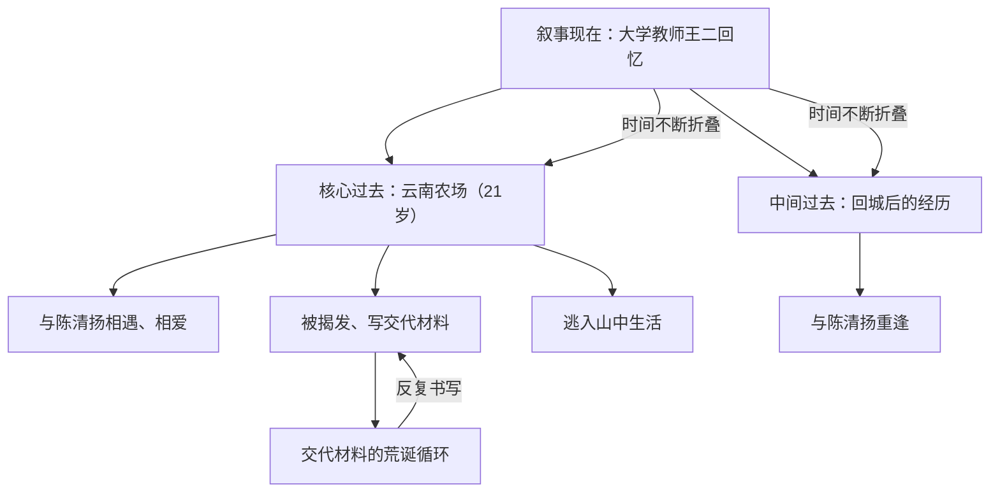
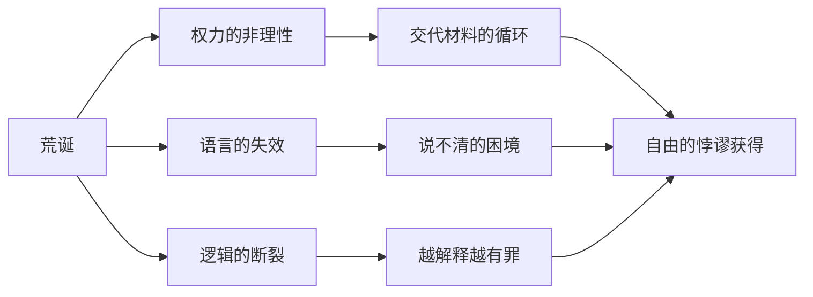

## 一、文学坐标定位

> [!abstract] 速览
> 《黄金时代》是王小波最重要的中篇小说，写作跨度从1982年至1994年最终定稿，1992年在台湾《联合报》文学奖获中篇小说大奖后引起关注，1997年收入"时代三部曲"之《黄金时代》卷出版。小说以知青王二在云南农场的经历为主线，讲述他与陈清扬之间的性爱关系、被迫写交代材料的荒诞经历，以及两人在政治高压下如何以身体和智识的双重自由对抗荒谬时代。

你拿起这本书，首先需要理解它在中国文学版图中的独特位置。王小波（1952-1997）是中国当代文学中最难归类的作家之一。他不属于伤痕文学（虽然写了文革）、不属于先锋派（虽然叙事高度实验化）、不属于寻根文学（虽然触及文化深层）、也不完全是自由主义知识分子写作（虽然他是中国最著名的自由主义作家之一）。他是一个==在所有流派之间滑行的异类==。

《黄金时代》的文学坐标可以从以下几个维度来定位：

**中国文学脉络中的位置**：当同时代的知青文学（如[[梁晓声]]、[[张承志]]）还在追忆理想主义的激情或控诉苦难的创伤时，王小波做了一件完全不同的事——他用一种==戏谑的、充满智性快感的方式==来处理那段历史。没有控诉，没有怀念，没有伤痕，有的只是一个聪明人在荒诞处境中如何保持自我的记录。这让他在整个知青文学谱系中显得格外特殊。

**世界文学的参照系**：你会在王小波身上看到多条清晰的精神血脉——[[乔治·奥威尔]]对极权的冷峻观察、[[卡尔维诺]]对叙事游戏的迷恋、[[卡夫卡]]的荒诞感、[[杜拉斯]]的情欲书写、[[马克·吐温]]的幽默传统，以及他极为推崇的[[罗素]]的理性精神。但他不是任何人的中国翻版——他将这些养分消化为独属于自己的声音。

**为什么它叫「黄金时代」**：这是理解全书的第一把钥匙。文革时期——政治高压、物质匮乏、精神钳制——在任何正常的评价体系中都是最糟糕的时代。但王小波偏偏将其称为"黄金时代"。这个命名是一个==巨大的反讽==，同时也是一个==真诚的陈述==：对王二和陈清扬而言，恰恰因为被剥夺了一切（前途、名誉、社会身份），他们反而获得了一种悖谬的自由——既然已经没有什么可以失去，那就没有什么需要恐惧。二十一岁的王二浑身精力旺盛，与陈清扬在山野间做爱、生活，这段时光在回忆中确实是"黄金的"。

---

## 二、叙事结构解析

> [!note] 时间的折叠术
> 《黄金时代》最显著的叙事特征是其==非线性的时间结构==。故事不断在"过去"（云南农场时期）与"现在"（王二成为大学讲师后的回忆）之间跳跃，有时还插入更遥远的过去或未来。王小波刻意打碎了线性叙事，制造出一种时间的回旋。

### 2.1 叙事时间的三重维度

你需要注意小说中至少存在三个时间层：

1. **叙事的现在**：王二已是大学教师，从成熟的视角回望过去。这提供了一种智性的距离感和反思的可能。
2. **核心过去**：云南插队时期，王二二十一岁，与陈清扬的关系构成故事主体。
3. **中间过去**：王二回城后、文革结束后的各种经历片段，包括与陈清扬的重逢。

**为什么这样写**：这种时间折叠不是炫技，而是服务于小说的核心主题。线性叙事暗含一种因果逻辑——事情一步步发展到某个结果。但王小波要表达的恰恰是：在荒诞的时代中，==因果逻辑是失效的==。你写了交代材料并不能让事情结束，事情的结束也不是因为交代材料写得好——一切都在一种无理由的循环中运转。时间的折叠完美地呈现了这种无因果的荒谬感。

### 2.2 交代材料：叙事中的叙事

> [!important] 元叙事结构
> 小说中最精妙的叙事装置是「交代材料」。王二和陈清扬被要求反复书写他们"搞破鞋"的经过，这些交代材料本身成为了一种文本内的文本——一种被权力要求生产的叙事。

这构成了一个极富文学自觉性的结构：王小波在写一部小说，小说里的人物在被迫写一份"小说"（交代材料），而这份交代材料的内容又构成了小说的情节。你会发现以下几层反讽：

- **权力要求"真实"**：组织要求他们如实交代。但"如实"在一个荒诞的权力结构中是一个不可能的任务——什么算"如实"？谁来判定？越是"如实"地写，越是显得不够"深刻"，于是要求重写。
- **写作变成反抗**：王二开始在交代材料中越写越详细、越写越生动，加入了大量文学性的描写。这一行为既是对权力要求的表面服从，又是对权力的深层嘲弄——你不是要我写吗？我就写得比你想要的还多。
- **交代材料成为情书**：到最后，这些交代材料已经不再是认罪书，而变成了王二对那段时光的文学化记忆，甚至是一种变形的情书。

**苏格拉底追问**：谁在控制叙事？表面上是组织（权力机构）在要求叙事的生产，但实际上，王二通过将交代材料写成文学作品，==夺回了叙事的主权==。这恰好呼应了王小波一生的核心关切：谁有权定义现实？谁有权讲述故事？

### 2.3 重复与变奏

你会注意到，小说中许多场景被反复叙述，但每次叙述都有微妙的差异。比如王二与陈清扬在章风山上的经历，在不同的叙述层次中被多次提及，每次的侧重点、语调和细节都略有不同。

**为什么这样写**：这种"重复与变奏"的手法至少有三重功能：
1. **模拟记忆的真实运作**：人的记忆不是录像带式的线性回放，而是围绕某些核心意象反复盘旋、每次呈现不同侧面。
2. **质疑叙事的可靠性**：当同一件事被讲述了多个版本，你作为读者不禁要问：到底哪个是真的？答案可能是：所有版本都是真的，也都不是——==真实本身是一个多面体==。
3. **营造音乐感**：这种结构类似音乐中的主题与变奏，赋予散文叙事一种节奏上的迷人品质。

---

## 三、主题与意象网络

### 主题一：自由——在不自由中的自由

> [!tip] 黄金圈拆解
> - **Why**：王小波为什么要在一个极不自由的时代背景中书写自由？因为自由的本质恰恰在极端不自由的环境中才最清晰地显现——当外在自由被完全剥夺时，什么是无法被剥夺的？身体的感受和独立思考的能力。
> - **How**：通过王二与陈清扬的性爱和智识活动，展示一种"最低限度的自由"——在政治高压的缝隙中，用身体和头脑占据一块权力无法完全渗透的领地。
> - **What**：两个被社会放逐的人，在荒野中发现了一种悖谬的自由状态。

**文本细读**：王二在云南农场的处境——被下放、被监督、被要求交代——看起来是极不自由的。但王小波笔下的王二从不表现出受害者的姿态。他不控诉、不哭泣、不自我怜悯。他用一种==轻盈的、几乎是快乐的语调==来讲述这一切。这种语调本身就是一种自由的宣示：你（权力）可以控制我的身体，但无法控制我讲述自己故事的方式。

**概念网络**：「自由」在《黄金时代》中与以下概念形成紧密的网络关系：

- **性**：性是自由最直接的身体表达。在一个试图管控一切的体制中，两个人在山野中做爱，是对控制最彻底的越界。
- **智识**：王二不是一个简单的反叛者，他是一个==思考着的反叛者==。他的自由不仅体现在身体层面，更体现在他始终保持独立思考的能力。
- **荒诞**：正是因为环境足够荒诞，自由才有了一个反衬的背景。自由与荒诞互为镜像。
- **孤独**：自由的代价是孤独。王二和陈清扬的自由恰恰建立在他们被社会放逐的基础之上。

**苏格拉底追问**：王二的自由是真正的自由还是一种自我安慰？如果他可以选择不被下放，他还会认为那是"黄金时代"吗？这个问题触及了自由的核心悖论——==被迫获得的自由还是不是自由==？王小波没有给出简单的答案，但他暗示：自由不是一种客观状态，而是一种主观姿态。即使在最不自由的环境中，你依然可以选择以自由的姿态存在。

---

### 主题二：性与身体——存在的确证

> [!tip] 黄金圈拆解
> - **Why**：为什么王小波要如此大量地书写性？不是为了感官刺激，而是因为在一个试图否定个体存在的时代，==身体是最后的实在==。当思想被审查、语言被扭曲、社会关系被政治化，身体的感受是唯一无法被篡改的证据。
> - **How**：通过一种坦然、明亮、毫不羞耻的性描写，将性从道德判断和政治话语中解放出来，还原为一种纯粹的生命体验。
> - **What**：王二和陈清扬在山野中做爱的场景，成为中国当代文学中最著名的性爱书写之一。

**文本细读**：王小波的性描写在中国当代文学中是独一无二的。它既不是[[贾平凹]]《废都》中那种传统文人的偷窥式书写（用"此处删去XX字"制造暧昧），也不是某些先锋作家的暴力化性描写，更不是言情小说的浪漫化处理。王小波笔下的性是==光明的、健康的、充满力量的==。王二和陈清扬在蓝天白云下的草地上做爱，没有任何阴暗感，反而有一种近乎希腊式的明朗。

"那一天我二十一岁，在我一生的黄金时代。我有好多奢望。我想爱，想吃，还想在一瞬间变成天上半明半暗的云。"

这段著名的文字之所以动人，是因为它将最基本的欲望（爱、吃）与最诗意的想象（变成云）并置在一起，没有任何等级之分。==欲望不低于诗意，身体不低于灵魂==。这是王小波最深层的人文主义立场。

**苏格拉底追问**：为什么陈清扬被叫做"破鞋"？"破鞋"这个标签本身就揭示了权力对身体的定义权——一个女性的性行为被权力命名为道德污点。王小波通过让陈清扬最终主动接受这个标签（"她说她就是要做我的破鞋"），完成了一次==对命名权的反夺==。被侮辱的名称被赋予了尊严。

---

### 主题三：荒诞——逻辑的失效

> [!tip] 黄金圈拆解
> - **Why**：为什么小说弥漫着一种荒诞感？因为王小波要揭示的核心真相是：文革时期的社会运作逻辑从根本上是==反逻辑的==。在一个反逻辑的世界里，逻辑清晰的人天然成为异类。
> - **How**：通过大量荒诞细节的累积——交代材料越写越多反而永远写不完、越认罪越有罪、越解释越说不清——来呈现一个卡夫卡式的逻辑陷阱。
> - **What**：整个"搞破鞋"事件从发生到处理的全过程，都充满了逻辑的断裂。

**关键意象：交代材料的无限循环**

交代材料是小说中最核心的荒诞意象。你可以将其理解为一个==文本的西西弗斯之石==——永远在写，永远写不完，不是因为事情太复杂，而是因为权力本身需要这个过程持续存在。权力的目的不是查清真相，而是==维持审查的状态本身==。

这与[[卡夫卡]]的[[《审判》]]有深刻的共鸣：K被审判，但永远不知道自己被指控了什么，审判永远不会结束——因为审判本身就是目的。王小波和卡夫卡都捕捉到了现代权力运作的核心机制：==过程即目的==。

**概念网络**：

---

### 主题四：存在主义——"成为你自己"

> [!tip] 黄金圈拆解
> - **Why**：为什么王二始终保持一种不合作的姿态？不是因为他有什么政治立场，而是因为他在本能层面拒绝==被定义==。他不接受别人为他设定的任何角色——无论是"坏分子"还是"好知青"。
> - **How**：通过一种消极抵抗——不是对抗，而是不配合。不是英雄式的反叛，而是一种懒洋洋的、幽默的不合作。
> - **What**：王二在任何处境中都保持了一种"我就是我"的底色。

**与萨特存在主义的对话**：萨特说"存在先于本质"——人不是先有一个固定的本质然后去存在，而是通过存在来创造自己的本质。王二正是这样一个"存在先于本质"的人物。他没有任何预设的身份认同——他不是"知识分子"（虽然他显然很聪明）、不是"革命者"（虽然他确实在反抗）、不是"受害者"（虽然他确实在受苦）。他只是==在那里，活着，感受着，思考着==。

但王小波与萨特的不同之处在于：萨特的存在主义往往带有沉重的焦虑感（自由是一种负担），而王小波笔下的存在==是轻盈的、甚至是愉悦的==。这种轻盈不是浅薄，而是一种深刻思考之后的通透。

---

### 核心意象网络

> [!example] 关键意象
> 以下意象构成了小说的象征体系，彼此呼应、互相映照。

1. **章风山/大山**：自然空间作为自由的领地。当王二和陈清扬逃入山中，大山成为了一个与政治空间对立的==自然乌托邦==。在山上，没有组织、没有交代材料、没有"破鞋"的标签，只有两个赤裸的人和无垠的天地。

2. **牛/水牛**：王二在农场放牛，牛成为一种镜像——牛是一种沉默的、不反抗的存在，它被驱使但不理解被驱使的原因。王二与牛的关系暗含了对人在体制中处境的隐喻。但与牛不同的是，王二在沉默中保留了思考的能力。

3. **半明半暗的云**："想在一瞬间变成天上半明半暗的云"——这个意象是全书最诗意的瞬间。云是自由的、无形的、不被固定的，"半明半暗"则暗示了存在的暧昧性——人既不完全光明也不完全黑暗，既不完全自由也不完全被束缚。

4. **阳光与汗水**：性爱场景中反复出现的阳光和汗水，将身体体验与自然体验融为一体。这不是密室中的偷情，而是天地间的大坦然。

---

## 四、人物分析

### 4.1 王二：自由人的原型

> [!quote] 人物定位
> 王二不仅是《黄金时代》的主人公，也是王小波多部作品中反复出现的人物（或人物原型）。他是王小波理想中的自由人——聪明、诚实、对权威保持本能的怀疑，同时拥有旺盛的生命力。

**身体维度**：小说开篇就强调王二二十一岁，"在我一生的黄金时代"。二十一岁的身体是充满能量的、饥渴的、渴望行动的。王小波刻意让王二的身体成为一种存在的象征——==充沛的身体能量对抗贫乏的精神环境==。王二的身体欲望不是堕落的标志，而是生命力的证明。

**智识维度**：王二是一个极其聪明的人，但他的聪明不是体制化的聪明（善于迎合、善于表演），而是一种==野生的、不驯服的聪明==。他看穿了交代材料的荒诞本质，但他不点破，而是用一种幽默的方式去"配合"——这种配合本身就是最高级的嘲讽。

**情感维度**：王二对陈清扬的感情是复杂的。它不是传统意义上的"爱情"——没有海誓山盟，没有浪漫仪式。但它比传统爱情更深刻，因为它建立在==两个自由个体的彼此确认==之上。他们确认的不是"你爱不爱我"，而是"你是不是一个真实的人"。

**苏格拉底追问**：王二是王小波的自我投射吗？在相当程度上是的——王小波也曾在云南插队，也拥有王二式的幽默和倔强。但王二不等于王小波。王二是一个被提纯的形象，他代表了王小波心目中的==理想人格状态==：一个在任何环境中都拒绝放弃独立思考和感官愉悦的人。

### 4.2 陈清扬：被命名与自我命名

> [!quote] 人物定位
> 陈清扬是小说中最具深度的女性人物。她是北京来的女医生，因丈夫入狱而独身，被当地人称为"破鞋"。她的人物弧光在于：从==被动接受命名==到==主动选择自我命名==。

**"破鞋"的政治学**：陈清扬一开始找王二，是要他"证明她不是破鞋"。这个请求本身就暴露了权力对个体的命名暴力——一个清白的女性，仅仅因为独身，就被社会赋予了"破鞋"的标签。她的痛苦不是来自标签本身，而是来自==她无力反驳这个标签==。

**身份的转变**：陈清扬的人物弧光可以分为三个阶段：
1. **拒绝标签**：她努力证明自己"不是破鞋"，但越努力越无效。
2. **接受标签**：她与王二发生了关系，从而在事实层面"成为"了"破鞋"。但这个"成为"是==主动选择==的，不是被迫的。
3. **超越标签**：当她主动接受这个身份时，标签的侮辱性被消解了——你不能用一个我自己选择的东西来侮辱我。

这个过程可以理解为一种==存在主义的自我实现==：通过主动选择自己的命运（即使这个命运在他人看来是堕落），陈清扬反而获得了主体性。

**陈清扬的"伟大友谊"说**：陈清扬后来告诉王二，她当时说他们之间是"伟大友谊"而非爱情。多年后她承认当时其实"爱上了"王二，但她用"伟大友谊"来命名，因为"爱情"这个词在那个语境中已经被污染了。这个细节极具深意：==当语言被权力污染后，真实的情感需要另找词汇来栖身==。

### 4.3 配角群像

**军代表**：权力的化身，但王小波没有将其写成脸谱化的恶人。军代表的荒诞不在于他的恶意，而在于他==真诚地相信自己在做正确的事==。这比单纯的恶意更加可怕——荒诞不是某个坏人造成的，而是一整套逻辑系统的必然产物。

**队长**：基层权力的执行者，处于被管理者和管理者之间。他对王二和陈清扬的"处理"更多出于维护自身权威的需要，而非真正的道德义愤。

---

## 五、风格与语言

### 5.1 王小波的语言质地

> [!info] 语言特征
> 王小波的语言在中国当代文学中是高度辨识性的：简洁、精确、幽默、带有一种理科生的逻辑感，同时不失诗意。

**简洁性**：你读王小波的句子，会发现他极少使用多余的修饰词。每个词都有其功能，没有任何"注水"。这种简洁来自两个传统——一是他推崇的英美散文传统（[[奥威尔]]的清晰文体）、二是理工科训练带来的逻辑习惯（王小波本科学化学，后来又学计算机）。

**幽默感**：王小波的幽默不是插科打诨式的搞笑，而是一种==基于逻辑推演的黑色幽默==。他经常用一种一本正经的语气说出荒谬的内容，或者用严密的逻辑推导出一个荒诞的结论。比如交代材料越写越长、越写越好，最终成为一部文学作品——这个过程本身就是一个绝妙的幽默。

**诗意**：在简洁和幽默的底色上，王小波偶尔会释放出令人惊艳的诗意。"想在一瞬间变成天上半明半暗的云"这样的句子，在通篇冷峻的叙述中突然出现，产生了极强的情感冲击力。==正是因为诗意来得节制，它才来得猛烈==。

### 5.2 叙事声音：不可靠的坦诚

王二作为叙事者有一种独特的品质：他极其坦诚，但你不能完全信任他。他坦诚地告诉你他做了什么、想了什么，但他讲述的方式——时间跳跃、细节变化、语调转换——暗示着叙述本身是一种==经过选择的建构==。

**为什么这样写**：这种"不可靠的坦诚"恰好呼应了小说的主题——在一个语言被权力扭曲的时代，==绝对的真实叙述是不可能的==。任何叙述都是一种选择，一种建构。王小波的诚实在于：他不假装自己的叙述是透明的、客观的，他让叙述的建构性暴露出来。

### 5.3 性描写的文体学

> [!warning] 重要区分
> 王小波的性描写在中国当代文学中引起过相当大的争议。但你需要区分"道德评价"和"文学分析"。从文学的角度看，王小波的性描写具有以下特征：

1. **去道德化**：性不被赋予任何道德含义（好或坏），它就是一种行为、一种体验。
2. **自然化**：性与自然景观（山野、阳光、风）融为一体，消除了密室感和罪恶感。
3. **平等化**：男女在性关系中是平等的参与者，没有征服与被征服的权力关系。
4. **生命力的象征**：性最终指向的不是情欲本身，而是==生命力的确认和宣示==。

---

## 六、文学批评多视角

### 6.1 女性主义视角

从女性主义的角度审视《黄金时代》，你会发现一些值得讨论的张力。一方面，陈清扬是一个有主体性的女性人物——她做出自己的选择，拒绝被标签定义，最终完成了自我赋权。另一方面，整个故事仍然是通过==男性叙事者（王二）的视角==来讲述的，陈清扬的内心世界在很大程度上是被王二"转述"的。

**苏格拉底追问**：如果这个故事由陈清扬来讲述，会是什么样的？她眼中的王二是什么样的？她的"黄金时代"与王二的"黄金时代"是同一个吗？王小波没有给出这些答案，但提出这些问题本身就是有价值的阅读。

值得注意的是，陈清扬后来关于"伟大友谊"和"爱"的那段告白，是全书中少有的直接呈现陈清扬主观视角的段落。在那一刻，你会感到她的情感深度甚至超过了王二——王二是一个善于思考的人，但陈清扬是一个善于==感受==的人。

### 6.2 后殖民/权力话语视角

[[福柯]]的权力话语理论为理解《黄金时代》提供了有效的分析框架。小说中的权力不是简单的自上而下的压迫，而是一种弥散性的、渗透到日常生活各个层面的控制机制：

- **话语控制**："破鞋"这个词本身就是权力话语的产物——它将一种性行为道德化、罪化。
- **自我审查**：写交代材料的过程实质上是一种==被迫的自我审查==。权力不仅要控制你的行为，还要控制你对自己行为的叙述。
- **规训与惩罚**：整个批斗过程是一种[[福柯]]意义上的"规训"——通过公开羞辱来将个体规训为符合社会规范的主体。

但王二对这种权力的回应——用充满文学性的交代材料来"配合"审查——恰好构成了一种==话语反抗==：在权力的话语体系内部，生产出颠覆权力的话语。

### 6.3 存在主义视角

如前所述，《黄金时代》与存在主义哲学有深刻的亲缘关系。但需要强调的是，王小波的存在主义是==中国式的、经验性的==存在主义——它不是从哲学概念出发，而是从具体的生命体验出发。

加缪的[[《局外人》]]中的默尔索与王二有某种相似性：两人都对社会规则保持冷淡的距离，都拒绝虚伪的情感表演，都在某种程度上被社会视为异类。但不同之处在于：默尔索的冷淡带有一种存在的虚无感，而王二的冷淡背后是==旺盛的生命力==。默尔索对世界漠然，王二对世界好奇。默尔索的故事以死刑告终，王二的故事以回忆告终——这个差异本身就说明了两种存在主义的不同底色。

### 6.4 精神分析视角

从精神分析的角度看，《黄金时代》中的性不仅仅是身体行为，也是一种==心理补偿机制==。在一个个体被极度压抑的环境中，性成为释放被压抑能量的通道。但王小波的高明之处在于：他不把性写成一种病理性的症状（如弗洛伊德可能会做的那样），而是写成一种==健康的、积极的生命表达==。

王二和陈清扬的关系也可以用[[温尼科特]]的"过渡空间"概念来理解：两人之间的性和交流创造了一个介于内在世界和外在世界之间的空间，在这个空间中，自我可以暂时不受外在现实的压迫，获得喘息和重建。

### 6.5 新历史主义视角

《黄金时代》是一部关于文革的小说，但它处理历史的方式与"伤痕文学"截然不同。它不把文革呈现为一个需要反思的历史事件，而是呈现为==一种被生活于其中的日常经验==。这种处理方式暗示了一种新历史主义的立场：历史不是大写的、统一的叙事，而是由无数个体的具体经验编织而成的==多声部织体==。

王二的叙述从来不试图"总结"那个时代或"评价"那段历史。他只是讲述自己经历的片段。但恰恰是这种个体性的、片段性的叙述，比任何宏大叙事都更有力地传达了那个时代的荒诞本质。

---

## 七、跨时空共鸣

### 7.1 与其他文学作品的共鸣

| 作品 | 共鸣点 | 差异点 |
|------|--------|--------|
| [[《审判》]] 卡夫卡 | 荒诞的权力逻辑，个体被不明原因地审判 | 卡夫卡的主人公焦虑绝望，王二幽默自若 |
| [[《局外人》]] 加缪 | 拒绝社会表演，保持真实 | 默尔索漠然，王二热烈 |
| [[《1984》]] 奥威尔 | 极权对个体性与性的管控 | 奥威尔是预言式的恐惧，王小波是回忆式的从容 |
| [[《情人》]] 杜拉斯 | 情欲与记忆的交织叙事 | 杜拉斯忧伤，王小波明朗 |
| [[《活着》]] 余华 | 极端环境中的生存 | 余华的人物忍耐，王小波的人物享受 |
| [[《洛丽塔》]] 纳博科夫 | 叙事的语言魅力与不可靠叙述 | 纳博科夫的叙事者自欺，王小波的叙事者自知 |

### 7.2 与当代现实的共鸣

你可能会觉得《黄金时代》写的是一个遥远的年代——1970年代的云南农场，距今已超过半个世纪。但这本书的生命力恰恰在于它的==超时代性==。它触及的核心问题——个体自由与社会控制的张力、语言与权力的关系、身体作为最后堡垒的意义——在任何时代都有其回响。

每当你感到自己被某种外在的标准或话语所定义、所束缚，被要求按照某种模板来生活和表达时，王小波的声音就会从书页中传出来：==你可以选择做自己==。不是通过英雄式的对抗，而是通过一种轻盈的、幽默的、拒绝配合的姿态。

### 7.3 与中国思想传统的对话

王小波常被视为一个"西化"的作家，但你可以在《黄金时代》中读到与中国传统思想的对话：

- **庄子的逍遥**：王二那种在困境中保持自由自在的姿态，与庄子"逍遥游"的精神有深层的共鸣。庄子说"至人无己"，王二虽然有强烈的"己"，但他不被"己"所困。
- **魏晋风度**：王二身上有一种魏晋名士的放达——不拘礼法、率性而为、以真性情面对虚伪世界。嵇康抚琴东市的从容，与王二写交代材料的戏谑，有着某种跨越千年的精神相通。
- **禅宗的直接**：王小波的语言有一种禅宗式的直接——不绕弯子、不做修饰、==直指事物本身==。

---

## 八、费曼终极检验

> [!success] 用最简单的话说清楚
> 如果你要向一个完全没读过这本书的人解释《黄金时代》，你可以这样说：

**一句话版本**：一个聪明的年轻人在一个荒唐的时代里，用做爱和思考来证明自己还活着。

**一分钟版本**：1970年代的中国，一个叫王二的年轻人被下放到云南农场。他和一个被当地人叫做"破鞋"的女医生陈清扬产生了关系。他们被要求写交代材料来交代自己的"罪行"，结果交代材料越写越长、越写越像一部小说。整个故事就在荒诞的政治环境、自由的性爱、和无尽的交代材料之间循环。王小波把这一切写得既好笑又动人，语言干净利落，像手术刀一样精准。他想说的是：==即使在最糟糕的时代，你的身体和思想依然属于你自己==。

**费曼检验——你真的理解了吗**：

1. **你能解释为什么它叫"黄金时代"吗？** 因为恰恰在最不自由的环境中，主人公体验到了最纯粹的自由——失去一切可以失去的，反而没有了恐惧。二十一岁的身体和不羁的灵魂，在蓝天白云下——那确实是黄金。
2. **你能解释交代材料的意义吗？** 交代材料是权力要求个体进行自我审查的工具，但主人公通过将其变成文学创作来夺回叙事主权。同时，它也是小说的一个元叙事装置——写作者在写一个关于写作的故事。
3. **你能解释王小波与其他知青文学作家的不同吗？** 其他作家控诉或怀念那个时代，王小波==既不控诉也不怀念==——他用幽默和智慧把那个时代变成了一面镜子，让你看到的不是"那个时代有多糟"，而是"人在任何时代中都可以如何活"。

---

## 延伸阅读

> [!book] 推荐阅读路径

**王小波的其他作品**：
- [[《革命时期的爱情》]]——"时代三部曲"之一，延续了王二的故事与风格
- [[《万寿寺》]]——叙事实验最激进的一部，将历史与虚构彻底打通
- [[《沉默的大多数》]]——杂文集，直接呈现王小波的思想立场
- [[《我的精神家园》]]——杂文集，理解王小波知识分子身份的入口

**理解王小波的思想来源**：
- [[《西方哲学史》]] 罗素——王小波最推崇的思想家
- [[《一九八四》]] 乔治·奥威尔——理解王小波对极权的思考
- [[《看不见的城市》]] 卡尔维诺——理解王小波叙事技巧的来源之一
- [[《情人》]] 杜拉斯——理解王小波性爱书写的参照

**同时代的中国文学参照**：
- [[《活着》]] 余华——另一种处理苦难的方式
- [[《废都》]] 贾平凹——另一种书写性的方式（形成鲜明对比）
- [[《棋王》]] 阿城——另一种知青叙事，与王小波有某种精神相通

**批评与研究**：
- 《王小波传》 房伟——了解王小波的生平与创作历程
- 《浪漫骑士：记忆王小波》 李银河编——从亲人和友人的角度认识王小波

---

> [!abstract] 终极总结
> 《黄金时代》是一部关于==自由、身体、语言与权力==的小说。它以一种独特的幽默和诗意，讲述了一个年轻人如何在荒诞的时代中守住了自己最核心的东西——感受的能力和思考的能力。王小波用这本书证明了：文学不必沉重才深刻，反叛不必悲壮才有力，自由不必宏大才真实。在所有关于那个时代的书写中，《黄金时代》也许是最轻盈的一部——而恰恰因为这份轻盈，它飞得比任何沉重的作品都更高、更远。
