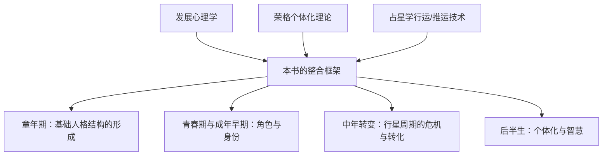
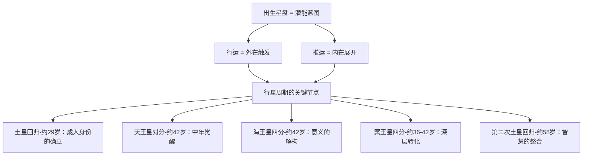

# 《人格的发展》读书笔记

> [!info] 基本信息
> - 作者：丽兹·格林（Liz Greene）& 霍华德·乔基斯（Howard Sasportas）
> - 系列：伦敦心理占星学中心（CPA）研讨会系列
> - 主题：占星学视角下的人格发展理论
> - 方法论框架：[[费曼学习法]] + [[DIKW金字塔]] + [[反脆弱方法论]]

---

## 一、学科坐标定位（400字）

本书是CPA研讨会系列的又一部力作，聚焦于一个在心理学和占星学中都极为核心的主题：==人格如何随时间发展和变化==。它将发展心理学的生命周期理论与占星学的行运（transit）和推运（progression）技术整合在一起。

> [!important] 学科定位
> 与《内行星》侧重于"心理功能的原型分析"不同，本书关注的是==时间维度==——人格不是静态的，而是在生命的不同阶段经历着不同的发展主题和挑战。占星学在这里提供了一个独特的工具：通过行星的运行周期（尤其是土星、天王星、海王星、冥王星的行运周期），可以描绘出人格发展的==节奏和关键转折点==。

本书在心理占星学文献中的独特贡献在于：它不仅仅是"用占星学解释发展心理学"，而是提出了一种==占星学自身的发展理论==——基于行星周期的生命阶段模型。这个模型与埃里克森（Erik Erikson）的心理社会发展阶段、荣格的个体化理论有呼应，但也有自己的独特结构。

---

## 二、理论框架地图（500字）

> [!abstract] 核心理论框架
> 1. 出生星盘是一份==潜能蓝图==——它描述了你可以成为什么，但不决定你一定会成为什么
> 2. ==行运==（当前天空中行星经过出生盘的位置）是外在世界"激活"潜能蓝图的方式——它带来挑战、机遇和转变的时机
> 3. ==推运==（出生盘通过特定数学方法"前进"）反映内在心理发展的自然节奏
> 4. 某些行星周期具有==普遍性==——所有人在大致相同的年龄经历相同的外行星行运节点（如29岁的土星回归、42岁的天王星对分）
> 5. 人格发展不是线性上升的，而是遵循==螺旋式==的模式——同样的主题在不同阶段以不同深度反复出现

格林和乔基斯的互补性在本书中体现得尤为明显。格林从==荣格个体化==的视角出发，将人格发展视为一个朝向"自性"（Self）实现的终身过程，每个发展阶段都有其对应的==原型挑战==。乔基斯则更多地借鉴==发展心理学==的实证传统，关注具体发展阶段的心理任务（如分离-个体化、身份形成、亲密关系的建立等）。

两者的整合产生了一个丰富的框架：占星学的行星周期提供了==时间骨架==，荣格心理学提供了==深度叙事==，发展心理学提供了==可操作的阶段描述==。

---

## 三、逐章深度拆解（5000字）

### 第一部分：童年与早期发展

> [!note] DIKW四层提炼

**Data（数据层）：**
乔基斯从发展心理学的视角出发，讨论了人格形成的早期阶段。他引用了温尼科特（Winnicott）的"足够好的母亲"概念、鲍尔比（Bowlby）的依恋理论、以及马勒（Mahler）的分离-个体化理论，将这些与出生星盘中的月亮、第四宫、第十宫的配置联系起来。

**Information（信息层）：**
乔基斯提出了一个关键的对应关系：
- ==月亮==及其星座、宫位、相位：映射早期与母亲（或主要照顾者）的关系体验，以及由此形成的==情感安全基础==
- ==第四宫==（包括宫头星座和其中的行星）：映射家庭环境的心理氛围和==内在安全感的根基==
- ==第十宫==：虽然通常与事业和公共角色联系，但在早期发展中代表==父母的期望和权威形象==
- ==土星==：映射个体在成长中遇到的==限制、纪律和恐惧==，以及这些如何塑造了人格的防御结构

**Knowledge（知识层）：**
格林从荣格的视角补充了一个更深层的维度：出生星盘不仅映射了实际发生的童年经历，更映射了个体==对这些经历的原型性体验==。换句话说，同样的"客观"童年事件，不同的孩子可能有完全不同的心理体验——而这种差异部分地反映在星盘配置中。

例如，月亮与冥王星形成困难相位的孩子，可能将与母亲的关系体验为一种==强烈的、涉及权力和控制的情感纠葛==——即使母亲在客观上并非特别控制型。这不是说孩子"想象"了问题，而是说孩子的心理结构使他们对关系中的权力动态特别敏感。

格林还引入了"==家族神话=="（family myth）的概念：每个家庭都有不被明说的叙事和信念体系，孩子在其中被无意识地分配了角色。星盘可能映射了孩子在家族神话中的"角色"——比如，太阳在第十二宫的孩子可能被家庭无意识地"选中"来承载家族中未表达的灵性需求或被压抑的痛苦。

**Wisdom（智慧层）：**
童年发展章节的深层智慧在于：==星盘不是"导致"童年经历的原因，而是映射了个体对经历的特定感受方式==。这意味着两件事：（1）理解你的星盘可以帮助你理解为什么你对童年有特定的感受——即使你的兄弟姐妹经历了"同样的"环境却有不同的感受；（2）改变不需要改变过去——它需要改变你与过去的==关系==。

> [!tip] 费曼式解读
> 想象每个孩子出生时都戴着一副独特的"有色眼镜"（这就是出生星盘）。通过红色镜片看世界的孩子会特别注意到红色的事物——也就是说，他会对某些类型的经历特别敏感。两个孩子在同一个家庭长大，但因为"眼镜"不同，他们"看到"的家庭是不同的。理解自己的眼镜，不是为了摘掉它（你摘不掉），而是为了知道：你对世界的感受部分地取决于你的"镜片颜色"，这帮助你区分"世界真的是这样"和"我倾向于这样看世界"。

> [!warning] 反脆弱验证
> 将星盘与童年发展联系的做法需要极其谨慎。存在一个危险：用星盘来"解释"童年创伤可能导致过度的宿命感——"我的月亮与冥王星四分，所以我注定有一个控制型的母亲"。格林和乔基斯都强调这不是他们的意思，但读者容易滑向这种理解。此外，温尼科特和鲍尔比的理论在发展心理学中虽然重要，但也经历了大量修正和批评——乔基斯的引用有时过于简化了这些理论的复杂性。

---

### 第二部分：土星回归——成人的诞生

> [!note] DIKW四层提炼

**Data（数据层）：**
土星绕黄道一圈约需29.5年。因此，每个人大约在29-30岁时经历第一次==土星回归==（transiting Saturn返回出生盘中的位置），在58-59岁时经历第二次土星回归。

**Information（信息层）：**
格林和乔基斯将第一次土星回归描述为==成人身份确立==的关键时期。在此之前，个体在很大程度上生活在父母和社会期望的框架中。土星回归带来的是一次"现实核查"——你是否在过你真正想过的生活？你为自己建立的结构是否坚固？还是你只是在扮演别人期望的角色？

土星回归常伴随着外在生活的==重大变化==：职业转换、关系的结束或深化、价值观的重新评估。这些变化的深层意义是：==从由外部定义的自我转向由内部定义的自我==。

**Knowledge（知识层）：**
格林引入了土星的==双面性==来理解这一过程：
- 土星作为"伟大的限制者"：指出你生活中不真实的、不可持续的结构，迫使你面对现实
- 土星作为"伟大的建筑师"：帮助你在面对现实之后，建立更坚固、更真实的人生结构

土星回归不一定是"危机"——如果一个人在29岁之前已经在建设一种与内在真实相符的生活，土星回归可能是一次==确认和巩固==。但如果一个人一直在回避真实的自我（活在父母的期望中、从事不喜欢的工作、维持不真实的关系），土星回归就可能带来==痛苦的拆除和重建==。

乔基斯补充了发展心理学的视角：土星回归期大致对应列文森（Daniel Levinson）的"三十岁过渡期"和埃里克森的"亲密vs.孤立"阶段后期。这不是巧合——占星学的行星周期和心理学的发展阶段理论在这里出现了有意义的对应。

**Wisdom（智慧层）：**
土星回归的深层教导是：==成长需要放弃==。成为真正的成人意味着放弃一些童年的幻想、父母的保护、以及那些"有一天一切都会自动变好"的期待。这个放弃是痛苦的，但也是解放的——它为你自己选择的生活腾出了空间。

> [!tip] 费曼式解读
> 想象你29岁时收到了一张"人生审计报告"。审计师（土星）非常严格但公正。他会指出："你这部分的人生是建在沙子上的，迟早会塌；这部分是真实的，可以继续建。"你可能不喜欢听这些，但如果你认真对待这份报告并做出调整，你的30岁会比20岁过得更真实、更扎实。

---

### 第三部分：中年转变——外行星的危机

> [!note] DIKW四层提炼

**Data（数据层）：**
大约在36-45岁之间，每个人都会经历一系列外行星的重要行运：
- ==冥王星四分==本命冥王星（约36-42岁，因冥王星轨道偏心率而有较大变化）
- ==海王星四分==本命海王星（约41-42岁）
- ==天王星对分==本命天王星（约42岁）
这三个行运在中年前后密集出现，构成了所谓的"==中年危机=="的占星学基础。

**Information（信息层）：**
格林将这三个行运描述为三种不同性质的==存在性挑战==：
- 冥王星四分冥王星：面对==死亡与转化==——对自身凡人性的觉醒，对生命有限性的深层接触，可能涉及重大的失去或对旧身份的死亡
- 海王星四分海王星：面对==意义的解构==——之前支撑生活的信念和理想可能开始瓦解，"这一切到底有什么意义？"这个问题变得迫切
- 天王星对分天王星：面对==自由与真实的渴望==——对尚未活出的自我部分的强烈召唤，可能表现为突然的职业转变、离婚、或激进的生活方式改变

**Knowledge（知识层）：**
格林指出，中年危机在荣格心理学中对应的是==个体化过程==的真正开始。荣格认为，人生前半段的任务是建立自我（ego）——在世界中获得位置、建立关系、承担责任。人生后半段的任务则是==超越自我==——与更深层的自性（Self）建立联系，整合被忽视的心灵面向，发展更完整的人格。

中年的三个外行星行运恰好标志了这个转折点：冥王星迫使你面对无法控制的力量，海王星溶解你精心构建的意义框架，天王星催促你打破已成惯性的生活模式。这三者==联合作用==，创造了一个巨大的心理"清场"——为后半生的个体化腾出空间。

乔基斯从更实际的角度描述了中年转变的常见表现：
- 职业重新评估：=="我真的想做这份工作到退休吗？"==
- 关系的深化或结束：=="我们的关系还有生命力吗？"==
- 身体的变化：开始感受到衰老的信号，迫使重新定义与身体的关系
- 灵性觉醒：之前不关心的"大问题"变得紧迫

**Wisdom（智慧层）：**
中年转变的智慧在于：==你生命中最有价值的部分可能恰恰是那些让你感到不舒服的部分==。冥王星的痛苦打开了深度，海王星的迷失指向了超越，天王星的破坏释放了真实。试图"安全地"度过中年——不做任何改变、压抑一切不适——会付出更大的代价：一种越来越深的==枯竭感和无意义感==。

> [!tip] 费曼式解读
> 想象你在40岁左右同时收到了三封信。第一封来自"死亡使者"（冥王星）："你的时间是有限的，哪些你还在等以后再做？"第二封来自"迷雾制造者"（海王星）："你以为自己知道人生的意义？让我来模糊一切，看看模糊之后还剩下什么是真实的。"第三封来自"叛逆者"（天王星）："你有多久没做一件真正出乎意料的事了？你的生活什么时候开始变成了一个重复的公式？"这三封信一起读是非常令人不安的——但它们的目的不是毁掉你的生活，而是让你有机会活出一个更真实、更完整的人生。

> [!warning] 反脆弱验证
> "中年危机"是一个在流行心理学中被广泛讨论的概念，但其普遍性和必然性在学术界是有争议的。并非所有人都会经历剧烈的中年转变——有些人的中年相对平稳。将外行星行运与中年危机等同可能过度戏剧化了一个并不适用于所有人的现象。此外，冥王星行运的时间因出生年代不同而有很大差异，这削弱了"普遍性"的叙述。

---

### 第四部分：后半生与第二次土星回归

> [!note] DIKW四层提炼

**Data：** 第二次土星回归约发生在58-59岁。

**Information：** 如果第一次土星回归是"成为一个成人"，第二次土星回归的主题是"==成为一个长者=="。格林描述这个阶段为：从"做"（doing）转向"是"（being）——不再主要通过成就来定义自己，而是通过存在的质量来定义自己。

**Knowledge：** 第二次土星回归期的心理任务包括：
- 面对==身体的衰退==并重新定义与身体的关系
- 评估人生的==遗产==——不是物质意义上的遗产，而是"我活过的这一生有什么意义？"
- 发展==智慧==——将一生的经验转化为可以传递给后来者的洞见
- 与==死亡的有限性==建立更成熟的关系

**Wisdom：** 格林引用荣格的观点指出：==没有人应该在没有准备好面对死亡的情况下度过下半生==。第二次土星回归是生命给予的一次机会——停下来，评估什么是真正重要的，放下不再需要的，将精力集中在最有意义的事情上。

---

## 四、认知偏差/效应清单（800字）

> [!caution] 阅读本书时需要警惕的认知陷阱

1. **宿命论陷阱**
   本书讨论的行星周期（如土星回归、天王星对分）具有==时间上的确定性==——每个人在大致相同的年龄经历它们。这可能强化一种"命运注定"的感觉："我42岁一定会经历中年危机。"但格林和乔基斯都强调：行星行运描述的是==主题和时机==，不是具体事件。如何经历这些主题，个体有很大的选择空间。

2. **归因偏差**
   在经历重大行运期间，你可能倾向于将所有好的或坏的事件都归因于行运——而忽略了经济环境、人际关系动态、个人选择等其他因素的作用。

3. **后见之明偏差**
   回顾性地用行运来"解释"已经发生的生活事件，总是比前瞻性地预测更容易。这会产生"占星学真准"的错觉。

4. **发展阶段的过度普遍化**
   并非所有人都按照书中描述的模式经历发展——文化、经济状况、个人特质都会显著影响发展的时间和方式。

5. **理想化偏差**
   格林对荣格"个体化"的描述具有理想化色彩——仿佛人生的目标就是朝向越来越高的意识和整合。但许多人的生活经验是==非线性的、充满退步和停滞的==，这些经验同样是合理的人类体验。

6. **年龄歧视偏差**
   将"青年=建立自我""中年=面对危机""老年=获得智慧"的框架可能过度简化了不同年龄阶段的丰富性和多样性。

---

## 五、自我诊断工具（500字）

> [!question] 基于本书的发展阶段自检

**你现在处于哪个发展阶段？**

**如果你在25-32岁（土星回归期附近）：**
- 我是否在过自己选择的生活，还是在实现他人的期望？
- 我的职业和关系是否建立在真实的基础上？
- 我能否诚实地面对自己的局限性，而不是假装自己什么都行？

**如果你在36-45岁（中年外行星行运期）：**
- 我的生活中是否有一种"该来的终于来了"的感觉？
- 我是否开始质疑之前认为理所当然的信念？
- 我是否感到有一种内在的力量在推动我做出改变——即使我不确定改变的方向？
- 我是否能允许自己不确定、不知道答案？

**如果你在55-62岁（第二次土星回归期附近）：**
- 如果回顾我的一生，什么是我最引以为傲的？什么是我最遗憾的？
- 我想留下什么样的遗产？
- 我与衰老和死亡的关系是什么？恐惧？回避？接受？

> [!tip] 使用建议
> 这些问题不需要"正确答案"。它们的价值在于帮助你觉察自己在当前发展阶段的==核心议题==。如果某个问题让你感到特别强烈的情绪反应（无论是焦虑、悲伤还是兴奋），那可能正是你当前需要关注的主题。

---

## 六、批判性审视（600字）

> [!danger] 本书的局限与不足

**方法论层面：**
1. 行星周期与心理发展阶段的对应是==相关性==而非==因果性==——即使29岁确实是许多人经历重大人生转变的时期，这并不能证明是土星回归"导致"了这些转变。社会文化因素（如现代社会中30岁前后的社会期望转变）可能是更直接的原因。

2. 外行星行运的时间范围相当宽泛（冥王星四分本命冥王星可以发生在36-42岁之间的任何时候），这种模糊性降低了理论的精确度和可检验性。

**理论层面：**
3. 本书==过度依赖荣格==的发展观。荣格对人生前半段和后半段的区分，以及"个体化"的概念，虽然具有启发性，但并非心理学中的共识观点。其他发展理论（如成人依恋理论、后皮亚杰理论）提供了不同的视角。

4. 对==创伤==的处理较为薄弱。本书主要关注"正常"的发展轨迹和"可预期"的危机，但许多人的发展被创伤事件（如虐待、丧亲、战争）深刻打断——这些不在行星周期的"预定时间表"上。

**文化层面：**
5. 发展阶段的描述带有强烈的==西方中产阶级视角==。"29岁面对职业选择""42岁中年危机""58岁思考遗产"——这些议题假设了一定的经济和社会条件，对于生活在不同文化和经济环境中的人可能并不适用。

> [!success] 本书的持久价值
> 尽管存在上述局限，本书的核心洞见——==人格是一个终身发展的过程，不同阶段有不同的主题和挑战==——在心理学中是广泛接受的。占星学的行星周期提供了一种独特的"时间地图"，即使我们不接受其因果性解释，这些周期作为==反思和对话的框架==仍然具有实用价值。

---

## 七、行动改变指南（500字）

> [!example] 基于本书的实践行动方案

**第一阶段：定位你的发展阶段（立即）**
1. 确定你当前年龄对应的主要行星行运
2. 阅读本书中相关发展阶段的描述
3. 诚实反思：书中描述的发展主题是否与你当前的生活体验产生共鸣？

**第二阶段：回顾过去的发展节点（1-2周）**
1. 回忆你29-30岁前后的生活——发生了什么？你做了什么选择？现在如何评价这些选择？
2. 如果你已过42岁，回忆那个时期——是否有"中年觉醒"的体验？
3. 将这些回忆与星盘行运进行对照——==不是为了证明占星学的正确性，而是作为一种深化回忆和理解的工具==

**第三阶段：面向未来的准备（持续）**
1. 如果你即将进入某个重大行运期（如土星回归），提前开始相关的心理准备——不是带着恐惧，而是带着开放和好奇
2. 为下一个发展阶段的核心主题留出空间——例如，如果你接近中年，开始允许自己质疑以前的确定性
3. 记住：==发展不是被动经历的，而是可以主动参与的==。了解可能的主题，可以帮助你更有意识地回应

> [!important] 关键原则
> 行星周期是==邀请==，不是命令。它们提供了一个反思的框架——"这个年龄段的人通常面对什么议题？"——但你的具体经历可能与书中的描述不完全一致。尊重你自己的节奏和经验，不要让任何理论框架替代你对自身生活的直接感知。

---

## 八、费曼终极检验（400字）

> [!abstract] 用最简单的语言概括本书的核心

你的人格不是在出生时就"完成"了——它在一生中不断发展、变化、深化。

这本书说，每个人的发展都有一些==可预期的关键节点==：

大约==29岁==，你面对一次"成人考试"——你是在过自己的生活，还是在过别人期望的生活？如果答案不够真实，这个时期会推动你做出调整。

大约==42岁==，你面对一次"中年觉醒"——你的生命有限，有些东西你以为重要的其实不是，有些你一直回避的其实很重要。这个时期让人不舒服，但它的目的是让你活出一个更真实的后半生。

大约==58岁==，你面对另一次"成熟考试"——你如何评价自己的一生？你想留下什么？你如何面对衰老和死亡？

这些节点不是"命运"——它们更像是==季节==。冬天来的时候，你不能假装还是夏天；但冬天怎么过，你有选择。知道"冬天要来了"，你可以提前准备，而不是在毫无准备的情况下被冻僵。

本书的价值就在于此：它帮助你知道人生旅程中有哪些"季节"，这样你可以更有意识地应对每一个阶段。

---

> [!quote] 相关阅读
> - [[《内行星》 - 丽兹·格林 & 霍华德·乔基斯]]
> - [[《内在的天空》 - 史蒂芬·弗里斯特]]
> - [[《人际关系占星学》 - 丽兹·格林]]
> - [[《逆行行星》 - 艾琳·乔莉文]]
