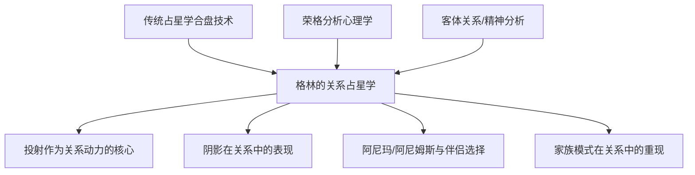
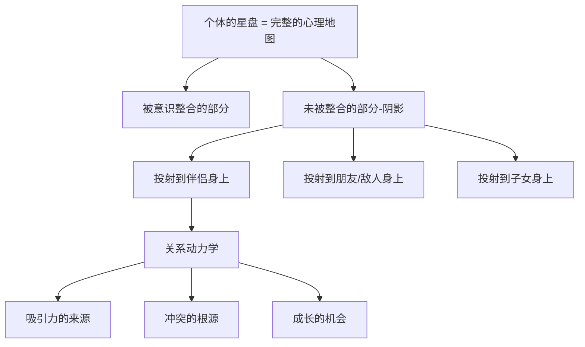

# 《人际关系占星学》读书笔记

> [!info] 基本信息
> - 作者：丽兹·格林（Liz Greene）
> - 主题：用占星学框架分析人际关系的心理动力学
> - 方法论框架：[[费曼学习法]] + [[DIKW金字塔]] + [[反脆弱方法论]]

---

## 一、学科坐标定位（400字）

本书是丽兹·格林将==深度心理学==（主要是荣格分析心理学和精神分析传统）与占星学关系分析技术（合盘、组合盘等）进行深度整合的代表作。在占星学的关系分析领域，大多数文本停留在"A的金星与B的火星合相意味着强烈的吸引力"这种层面。格林则深入到关系的==无意识动力==——为什么我们会被特定类型的人吸引？为什么关系中反复出现同样的模式？投射、阴影和未整合的心理内容如何在关系中运作？

> [!important] 学科定位
> 本书的核心立场是：==关系不仅仅发生在两个人之间，更发生在两个人的无意识之间==。你选择的伴侣、你在关系中扮演的角色、你反复遭遇的关系困境——这些都不是"偶然"或"命运"，而是你内在心理结构的外在映射。占星学的合盘技术在这里成为一种映射和理解这些无意识动力的工具。

本书在心理占星学关系文献中的地位类似于"理论深度的天花板"——它不是最易读的关系占星书，但可能是最深刻的。适合已经有一定占星学基础和心理学素养的读者。

---

## 二、理论框架地图（500字）

> [!abstract] 核心理论框架
> 1. 每个人的星盘中都有==被意识整合==的部分和==未被意识整合==的部分（阴影）
> 2. 未被整合的部分不会消失——它们通过==投射==在关系中呈现。你最被吸引的人，往往携带着你自己未活出的品质
> 3. ==合盘==（synastry，两个人的星盘叠加比较）揭示的不仅是"兼容性"，更是两个无意识之间的==互锁模式==
> 4. 关系中的持续冲突往往指向==双方共同的未整合议题==——冲突不是某一方的"问题"，而是关系系统的表达
> 5. 关系的最高潜能是成为==相互的镜子和催化剂==——通过关系认识自己那些独自无法看到的面向

格林的理论根基有几个关键的荣格概念：

- ==阿尼玛/阿尼姆斯==（Anima/Animus）：荣格认为每个人心中都有一个"内在异性"形象。男性的阿尼玛是他内心的女性面向，女性的阿尼姆斯是她内心的男性面向。我们倾向于被那些与我们的阿尼玛/阿尼姆斯形象相符的人吸引——这就解释了为什么"坠入爱河"往往带有强烈的、不完全理性的品质。
- ==阴影==（Shadow）：那些我们否认、压抑、不愿意认为是自己一部分的品质。阴影在关系中以两种方式呈现：我们被那些活出了我们阴影的人吸引（"他身上有我缺少的东西"），或者我们被那些人激怒（"我受不了她这种品质"——而那恰恰是我们自己身上被压抑的品质）。
- ==投射==（Projection）：将自己的内在内容"放到"另一个人身上来体验。投射不是"错误"——它是一种正常的心理机制，也是关系的起点。问题在于是否能在投射之后==收回投射==，认识到"我在你身上看到的，部分是我自己的"。

---

## 三、逐章深度拆解（5000字）

### 第一部分：投射——关系的无意识基础

> [!note] DIKW四层提炼

**Data（数据层）：**
格林以临床案例和星盘分析为基础，详细阐述了投射在关系中的运作机制。她引用了荣格的原始论述以及后荣格学派对投射的发展性理解。

**Information（信息层）：**
格林对投射的分析分为几个层次：

第一层：==阿尼玛/阿尼姆斯投射==。这是浪漫爱情中最强烈的投射形式。当你"坠入爱河"时，你体验到的强烈吸引力很大程度上不是对真实对方的反应，而是对方激活了你内在的阿尼玛/阿尼姆斯形象。格林指出，在星盘中，==月亮==（对男性而言代表阿尼玛的一部分）和==太阳==（对女性而言代表阿尼姆斯的一部分）以及==金星和火星==的配置，映射了这些内在形象的特征。

坦诚说明：格林在此处的论述沿用了荣格理论中的性别二元框架，这在当代性别研究的视角下需要批判性审视。阿尼玛/阿尼姆斯的概念不必局限于异性恋框架——它更根本地描述的是"内在他者"的形象。

第二层：==阴影投射==。我们将自己否认的品质投射到他人身上。这在关系中产生两种现象：一是对某些人的==不合理的强烈厌恶==（"我受不了自私的人"——而你自己可能正在压抑自己的自私需求）；二是对某些人的==理想化==（"他什么都好"——你可能将自己未发展的积极品质投射到了对方身上）。

第三层：==父母情结投射==。格林引入精神分析传统的观点：我们在亲密关系中会无意识地重现早期与父母的关系模式。星盘中的==土星==、==月亮==以及第四宫和第十宫的配置，映射了这些早期模式。当你发现自己在关系中反复扮演"被控制的孩子"或"拯救者"的角色时，父母情结投射可能正在运作。

**Knowledge（知识层）：**
格林通过合盘分析展示了投射如何在两个人之间具体运作。关键的合盘要素：

- 一方的==太阳/月亮==落在另一方的第七宫（关系宫）或第四宫（家庭宫）：强烈的投射"钩子"——对方激活了你关于关系或家庭的核心模式
- 一方的==土星==与另一方的个人行星形成困难相位：权威-服从动力学的激活，可能重现父母-孩子的模式
- 一方的==冥王星==与另一方的金星或月亮形成相位：深层的、涉及权力和控制的情感纠葛
- 一方的==海王星==与另一方的个人行星形成相位：理想化-幻灭的周期

格林特别强调：==合盘中的困难相位不一定意味着"不兼容"==。它们指向的是关系中需要有意识地面对的主题。有时候，最具转化潜力的关系恰恰是那些有大量困难相位的关系——前提是双方都愿意面对投射并为自己的心理内容负责。

**Wisdom（智慧层）：**
投射章节的深层智慧：==你在关系中遇到的，很大程度上就是你在自己内心中遇到的==。关系是一面镜子——它不是完美的镜子（对方毕竟是一个独立的人），但它揭示了你内心的形状。当你说"我的伴侣总是..."的时候，值得问的问题是："我身上的什么吸引了这种模式？我从这个模式中获得了什么（即使是痛苦的'获得'）？"

> [!tip] 费曼式解读
> 想象你心中有一个"内在电影院"。你的无意识是导演，它制作了一些关于"理想伴侣""完美关系""可怕的敌人"的电影。当你遇到一个真实的人时，你的无意识导演会说："太好了，这个人非常适合演我电影里的某个角色！"然后你就开始把对方当作你电影中的角色来对待——而不是他们真实的自己。这就是投射。最开始，你"爱上"的其实是你自己的电影；真正的爱，开始于你逐渐把投影仪关掉，开始看到银幕后面的那个真实的人。

---

### 第二部分：星盘中的关系指示器

> [!note] DIKW四层提炼

**Data（数据层）：**
格林系统地讨论了出生星盘中与关系相关的关键要素：第七宫（一对一关系）、第八宫（深层情感纠缠和共享资源）、第五宫（恋爱和创造性表达）、金星（价值观和吸引力）、火星（欲望和主张）、月亮（情感需求）、以及下降点（第七宫宫头）的星座。

**Information（信息层）：**
格林对==第七宫==的分析特别有深度。传统占星学将第七宫简单地视为"婚姻宫"，但格林指出，第七宫更根本地代表的是==你通过关系来认识的自我面向==。

第七宫宫头的星座和其中的行星描述的不是"你的伴侣是什么样的"，而是==你将什么品质投射到伴侣身上==。例如，第七宫在天蝎座的人不是"注定嫁给一个天蝎座的人"，而是倾向于在亲密关系中寻求（和投射）深度、强度、控制和转化的主题。

==下降点==（Descendant）与上升点形成对轴：上升点代表你展示给世界的"面具"，下降点代表你在关系中寻求的互补。如果你的上升点在白羊座（独立、主动、竞争），你的下降点在天秤座（合作、和谐、关系），你可能在关系中寻找能平衡你独立性的和谐与合作品质——但这些品质其实也存在于你自己内心，只是你不太认同它们。

**Knowledge（知识层）：**
格林对==第八宫==的分析揭示了关系中更深层的动力学。第八宫涉及共享资源（不仅是金钱，也包括情感、性和权力的交换），以及关系中的==控制与被控制==动力。

第八宫中的行星配置映射了你在亲密关系中如何处理==脆弱性==。例如：
- 第八宫中有==土星==：可能在亲密关系中有很强的自我保护，难以在情感上完全敞开
- 第八宫中有==冥王星==：与亲密关系中的权力动力学有深层的纠缠——可能既恐惧被控制又无意识地试图控制
- 第八宫中有==海王星==：在亲密关系中可能有融合和失去自我边界的倾向

格林还讨论了==金星-火星的关系动力==。金星代表你被什么吸引以及你如何吸引他人；火星代表你如何追求所欲和表达欲望。两者之间的相位关系揭示了你的"吸引模式"和"追求模式"是否协调。

**Wisdom（智慧层）：**
第七宫和第八宫分析的深层教导是：==你在关系中寻找的，正是你尚未在自己身上充分发展的==。这不是说你不应该进入关系——而是说关系的一个深层功能是帮助你认识并整合自己尚未认识的面向。

> [!tip] 费曼式解读
> 你的星盘就像一个硬币——上升点是正面（你展示给世界的），下降点是反面（你在关系中寻找的）。你习惯了看正面，觉得正面就是"你"。但硬币是完整的——反面也是你的一部分，只是你不太熟悉。你在关系中被吸引的品质，很多时候就是你硬币反面的品质。关系的深层作用，就是帮你翻转硬币，认识你的另一面。

---

### 第三部分：关系中的冲突与成长

> [!note] DIKW四层提炼

**Data（数据层）：**
格林以多个案例分析为基础，讨论了关系中重复出现的冲突模式、三角关系的动力学、以及关系的终结与哀悼。

**Information（信息层）：**
格林对==重复性关系模式==的分析是本书最具临床价值的部分。她指出，许多人在一段关系结束后进入"全新"的关系，却发现自己遇到了"同样"的问题——只是换了一个人。这是因为吸引模式来自你的==内在结构==（星盘），而不是来自特定的外在对象。只要内在模式不改变，你会持续吸引激活同一模式的人。

她对==三角关系==的分析格外深刻。格林认为三角关系（无论是婚外情、情敌、还是"第三者"形式的朋友或事业）映射的是个体内部的==内在三角==——通常是一种在两种相互矛盾的需求之间的撕扯。例如，一个人同时需要安全感（现有伴侣）和激情（第三者），但无法在一个关系中整合这两种需求——于是通过外在的三角关系来"管理"这个内在冲突。

**Knowledge（知识层）：**
格林将关系冲突与具体的占星配置联系起来：

- ==金星-土星==困难相位：在关系中同时渴望爱又恐惧亲密，可能表现为选择不可得的对象或在关系中设置距离
- ==月亮-冥王星==困难相位：在关系中的控制-依赖动力，对被遗弃的深层恐惧可能导致窒息性的亲密或先发制人的疏远
- ==金星-天王星==困难相位：在关系中同时需要亲密和自由，可能在承诺和逃离之间摇摆
- ==火星-海王星==困难相位：在关系中可能有拯救者-被拯救者的动力学，或在欲望和灵性之间的冲突

格林反复强调：==这些模式不是"坏运气"，而是未整合的心理内容在关系场域中的表达==。觉察到模式是改变的第一步。

**Wisdom（智慧层）：**
关系冲突章节的核心智慧是：==你最大的关系挑战往往也是你最大的成长机会==。如果你总是在关系中遇到"控制型"的伴侣，这不是因为你"命不好"——这可能意味着你自身与权力和控制的关系需要被审视。关系冲突是==双人的==——它要求你在指责对方之前先问自己："我在这个动力中扮演了什么角色？我从中获得了什么？"

> [!warning] 反脆弱验证
> 格林对关系动力学的分析在临床心理学（尤其是精神分析和系统治疗传统）中有广泛的理论支持。投射、重复性关系模式、内在客体关系在关系中的重现——这些都是有临床证据支持的概念。然而，将这些概念与星盘配置一一对应时，其精确性大幅降低。金星-土星四分相的人确实"可能"在关系中有恐惧亲密的倾向，但也有很多金星-土星四分相的人建立了深度亲密的关系。星盘描述的是**倾向**，不是**确定性**。

---

### 第四部分：关系的转化潜能

> [!note] DIKW四层提炼

**Data：** 格林在最后部分讨论了关系如何成为个体化（individuation）的工具——关系不仅仅是"在一起"，更是一种相互镜映和催化的心理过程。

**Information：** 格林区分了几种不同层次的关系：
- ==投射性关系==：双方主要生活在对彼此的投射中，很少接触到真实的对方。这种关系可能很"热烈"但不太"真实"
- ==互补性关系==：双方在某种分工中运作（如一方负责理性一方负责情感），这种分工一开始有效但长期可能导致双方都停止成长
- ==个体化关系==：双方在关系中逐渐收回投射、面对阴影、发展自己未整合的面向。这种关系不一定是"最舒服的"，但是最有成长潜力的

**Knowledge：** 从投射性关系走向个体化关系需要几个关键的心理能力：
- ==觉察投射==的能力："我对你的这种感受/看法，有多少是关于真实的你，有多少是关于我自己？"
- ==容纳矛盾==的能力：接受同一个人既有你喜欢的品质也有你讨厌的品质，而不是将其分裂为"全好"或"全坏"
- ==为自己的情绪负责==的能力："你让我愤怒"变为"我在与你的互动中体验到了愤怒，这个愤怒告诉我关于我自己的什么？"
- ==哀悼==的能力：放下对"完美伴侣"和"完美关系"的幻想，接受真实的、不完美的关系

**Wisdom：** 格林暗示，关系的终极功能不是"让你幸福"——而是==帮助你成为更完整的人==。这不是说关系应该是痛苦的——而是说关系的价值不能仅仅用"幸福指数"来衡量。一段让你深刻地认识了自己的关系，即使最终结束了，也是有价值的。

> [!tip] 费曼式解读
> 关系就像一面会说话的镜子。一开始，你在镜子里看到的是你的"内在电影"——你心中的理想伴侣形象。这很美好也很迷醉，但这不是真正的看见。真正的关系开始于你逐渐透过投射的薄膜，开始看到镜子本身——一个真实的、不完美的、独立的人。而在看到真实的对方的过程中，你也开始看到真实的自己——包括那些你一直不愿面对的部分。这个过程不总是舒服的，但这就是关系的深层作用。

---

## 四、认知偏差/效应清单（800字）

> [!caution] 阅读本书时需要警惕的认知陷阱

1. **基本归因错误的反转**
   格林的分析强烈倾向于将关系问题归因于==内在心理动力==而非外在情境。虽然这是心理学深度分析的应有之义，但也可能走向另一个极端——忽略了社会经济条件、文化规范、权力不平等等外在因素对关系的实质性影响。不是所有关系问题都是"投射"——有些关系问题就是因为一方在客观上做了有害的行为。

2. **过度内归因偏差**
   "你在关系中遇到的就是你内心中的"这个框架虽然有深度，但如果不加限制地应用，可能导致==受害者自责==。在虐待性关系中告诉受害者"你吸引了这个模式"是有害的。格林本人在某些地方对此有所觉察，但读者需要自行注意这个界限。

3. **确认偏差**
   一旦你接受了"投射"的框架，你可能开始在所有关系体验中寻找投射——甚至在不存在投射的地方也"发现"投射。有时候你不喜欢一个人就是因为这个人的行为确实让人不舒服，而不是因为"阴影投射"。

4. **回溯偏差**
   在关系结束后回顾性地分析"原来合盘中的土星-月亮四分相就预示了这个结果"——这种后见之明式的分析很有说服力但可能缺乏预测效力。

5. **忽视基率谬误**
   占星学关系分析中常见的问题：只关注"有问题的"关系中出现了什么合盘相位，而不关注同样的相位在"没问题的"关系中出现的频率。

6. **叙事偏差**
   格林的荣格式叙事非常有吸引力——"你爱上的是你的阿尼玛投射"听起来很深刻很有诗意。但叙事的魅力不等于解释的准确性。

7. **专家偏差**
   格林在精神分析和荣格心理学方面的权威可能让读者不加批判地接受她的所有分析，包括那些更具争议性的论断。

---

## 五、自我诊断工具（500字）

> [!question] 基于本书的关系模式自检

**投射自检：**
- 我的伴侣身上最吸引我的品质是什么？这些品质是否是我自己不太发展的面向？
- 我对伴侣最不满的是什么？这些品质是否是我自己否认或压抑的面向？
- 在我的关系历史中，是否有重复出现的模式？（总是遇到同类型的人、总是在同一阶段出问题等）

**阴影自检：**
- 什么类型的人最让我感到不舒服或愤怒？他们身上的什么品质让我反应如此强烈？
- 我是否在关系中有"全好/全坏"的倾向——将伴侣理想化或妖魔化？
- 我在关系中最害怕暴露的自己的面向是什么？

**家庭模式自检：**
- 我的亲密关系模式与父母之间的关系模式有什么相似之处？
- 我在关系中是否无意识地扮演了父亲或母亲的角色？
- 我选择的伴侣与我的父母有什么相似之处？（不仅是外在特征，更是心理动力上的相似）

**关系功能自检：**
- 我希望从关系中获得什么？（安全感、激情、认同、成长、疗愈、地位）
- 这些需求是否都是合理的？是否有些需求实际上应该由我自己来满足而不是依赖伴侣？
- 我的关系是在帮助我成长还是在帮助我逃避？

> [!tip] 使用建议
> 这些问题可能会触发强烈的情绪——这恰恰说明它们触及了重要的心理内容。建议在一个安全的、不赶时间的环境中书写回答。如果某些问题引发了你难以独自处理的情绪，考虑寻求专业心理咨询的支持。

---

## 六、批判性审视（600字）

> [!danger] 本书的局限与不足

**理论层面：**
1. 格林对==阿尼玛/阿尼姆斯==的使用沿袭了荣格理论的==性别二元框架==。虽然她偶尔有所觉察，但整体上仍然将"内在异性"与生理性别紧密联系。在当代性别研究和酷儿理论的视角下，这个框架需要根本性的修订。同性恋关系、跨性别关系中的投射动力学在本书中几乎未被讨论。

2. 格林对关系动力学的分析==过度偏重无意识和投射==。虽然投射确实是关系中的重要机制，但关系也包含大量有意识的选择、理性的评估、以及基于共同价值观和目标的合作。将一切简化为"无意识动力"可能低估了人们在关系中的理性能动性。

3. ==客体关系理论==的引用虽然丰富了分析，但也继承了该理论的母亲中心主义倾向——仿佛所有的关系模式都可以追溯到与母亲的早期关系。父亲、同胞、同伴等其他关系的影响被相对低估。

**方法论层面：**
4. 合盘分析的==复杂性==意味着几乎任何关系都可以被"解读"为具有深层意义——因为任何两个星盘之间都会有多种相位连接。这种灵活性使得理论难以被证伪。

5. 本书基于格林的临床经验，但==样本的代表性==未知。来咨询的客户通常是在关系中有困扰的人，这可能使分析偏向于"问题模式"而非"健康模式"。

**伦理层面：**
6. 在缺乏充分训练的情况下，将本书的框架应用于实际关系分析可能造成==伤害==——例如告诉某人"你的合盘显示你在向伴侣投射阴影"可能被用作控制或操纵的工具。

> [!success] 本书的持久价值
> 尽管有上述局限，格林对关系中无意识动力学的分析依然是心理占星学文献中==最具深度和洞察力==的工作之一。投射、重复性模式、阴影在关系中的表现——这些概念即使脱离占星学框架，也是理解人际关系的有力工具。对于任何想要深入理解"为什么我总是在关系中遇到同样的问题"的人，本书提供了一个极具价值的反思框架。

---

## 七、行动改变指南（500字）

> [!example] 基于本书的关系实践方案

**第一阶段：觉察投射（2-4周）**
1. 开始一本"关系日记"。每天简短记录：今天在与伴侣/重要他人的互动中，有哪些强烈的情绪反应？
2. 对每个强烈反应自问：==这完全是关于对方的，还是部分是关于我自己的？==
3. 不需要立即找到答案——觉察本身就是开始

**第二阶段：识别模式（4-8周）**
1. 回顾你的关系历史，寻找重复的主题和模式
2. 查看自己的星盘中第七宫、第八宫、金星、火星的配置，以及它们与合盘的对应
3. 将你的模式与你的星盘描述进行对照——==不是为了接受"命运"，而是为了获得一种语言来描述你的体验==

**第三阶段：收回投射（持续）**
1. 当你在关系中有强烈的不满时，练习这个思维实验："如果我对伴侣的这个不满，实际上反映了我对自己的某个方面的不满，那会是什么？"
2. 当你在关系中有强烈的理想化时，问自己："我在对方身上看到的这个美好品质，我自己是否也可以发展？"
3. 这不是要否认对方的真实品质——而是在承认真实的同时，==也为自己的投射承担责任==

**第四阶段：走向个体化关系（持续）**
1. 与伴侣分享你对自己模式的觉察——如果关系足够安全的话
2. 共同探讨你们的关系中可能存在的互锁模式
3. 如果某些模式根深蒂固难以自行突破，考虑寻求伴侣咨询的专业支持

> [!important] 关键原则
> ==关系中的成长不是单方面的==。如果只有一方在"收回投射"和"面对阴影"，而另一方不做任何改变，关系可能会变得更加不平衡。健康的关系成长是双人的、相互的。

---

## 八、费曼终极检验（400字）

> [!abstract] 用最简单的语言概括本书的核心

你心里有一个"理想伴侣"的模板，这个模板来自你的早期经历、你的心理结构、和你自己未发展的面向。当你遇到一个与这个模板匹配的人时，你就"坠入爱河"了——但你最初爱上的，很大程度上是你自己的模板，而不是真实的对方。

同样，你在关系中最受不了的对方的品质，常常是你自己身上被你否认的品质。你把自己不接受的部分"放"到了对方身上，然后对着对方生气——实际上你生气的部分是自己。

这就是为什么很多人换了伴侣但遇到同样的问题——因为==问题的根源不完全在对方身上，部分在你自己的内在结构中==。

关系的深层价值不只是"在一起开心"——而是通过另一个人，看到你独自看不到的自己。这个过程不总是舒服的，但它能让你成为一个更完整的人。

本书用占星学的语言（合盘、第七宫、阴影投射等）来描述这些心理动力。即使你不接受占星学，这些关于==投射、重复模式和关系中的成长==的洞见仍然是有价值的。

---

> [!quote] 相关阅读
> - [[《内行星》 - 丽兹·格林 & 霍华德·乔基斯]]
> - [[《人格的发展》 - 丽兹·格林 & 霍华德·乔基斯]]
> - [[《内在的天空》 - 史蒂芬·弗里斯特]]
> - [[《逆行行星》 - 艾琳·乔莉文]]
