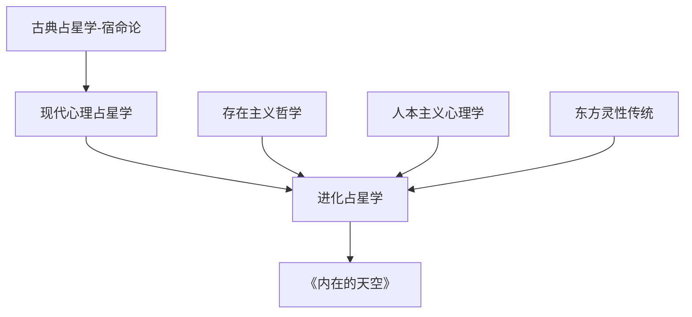
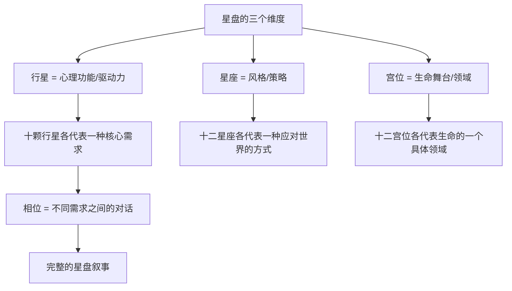

# 《内在的天空》读书笔记

> [!info] 基本信息
> - 作者：史蒂芬·弗里斯特（Steven Forrest）
> - 定位：现代占星学入门经典
> - 视角：进化占星学（Evolutionary Astrology）
> - 方法论框架：[[费曼学习法]] + [[DIKW金字塔]] + [[反脆弱方法论]]

---

## 一、学科坐标定位（400字）

《内在的天空》是==进化占星学==的奠基性入门著作，首版出版于1984年。弗里斯特在本书中系统地提出了一种与传统占星学和宿命论占星学截然不同的解读范式：星盘不是命运的蓝图，而是==灵魂进化的地图==。

> [!important] 学科定位
> 弗里斯特的进化占星学与格林的心理占星学有交集但侧重不同。格林偏重**荣格深度心理学**，关注无意识动力和原型；弗里斯特偏重**存在主义**和**人本主义**，关注自由意志、选择和个体成长。两者都反对宿命论，但弗里斯特更明确地将占星学定位为一种==赋能工具==（empowerment tool）而非分析工具。

本书在占星学教学中的地位类似于"第一本应该读的占星书"——它不仅教授星座、行星、宫位、相位的基本知识，更重要的是从一开始就建立了==以人为中心==（而非以星星为中心）的解读态度。弗里斯特反复强调：占星学的目的不是预测事件，而是帮助个体认识自己的潜能并做出更有意识的选择。

这一立场使本书成为心理占星学与灵性占星学之间的重要桥梁，也使它特别适合那些对占星学感兴趣但对"命中注定"这一概念持保留态度的现代读者。

---

## 二、理论框架地图（500字）

弗里斯特的理论框架可以概括为"三维星盘解读模型"：

> [!abstract] 核心理论框架
> 弗里斯特的方法论建立在三个哲学前提之上：
> 1. ==自由意志==是真实的——星盘描述的是倾向和潜能，不是注定的命运
> 2. 每个星盘配置都有==高阶表达==和==低阶表达==——同样的能量可以被建设性地使用，也可以被破坏性地表达
> 3. 个体的核心任务是朝向每个配置的==最高潜能==进化——这就是"进化"的含义

这个框架的实践意义在于：当解读一个星盘配置（比如"月亮在天蝎座在第八宫"）时，占星师不应该说"你注定情感深沉、易受伤害"，而应该探讨这个配置的==全频谱==——从最具挑战性的表现（情感操控、执念、恐惧亲密）到最具成长性的表现（情感深度、转化能力、心理洞察力），并帮助个体找到朝向高阶表达的路径。

弗里斯特还引入了一个关键的叙事工具：他将星盘解读比喻为==写一个句子==——行星是动词（做什么），星座是副词（怎么做），宫位是名词（在哪个领域做）。这个简单的语法类比成为他教学体系的基石，帮助初学者将零散的占星知识整合为连贯的叙事。

---

## 三、逐章深度拆解（5000字）

### 第一部分：占星学的哲学基础

> [!note] DIKW四层提炼

**Data（数据层）：**
弗里斯特在开篇用相当的篇幅讨论占星学的哲学定位。他明确拒绝两种极端：一是占星学是"科学"的声称，二是占星学"纯属迷信"的否定。他将占星学定位为一种==象征性语言==（symbolic language），类似于诗歌或梦的语言。

**Information（信息层）：**
弗里斯特提出的核心哲学立场是：==星盘是一面镜子，不是一份判决书==。天空中的行星配置不是"导致"我们成为什么样的人的原因，而是"映射"了我们内在状态的一套符号。这是一种类似于荣格"共时性"（synchronicity）概念的立场——外在事件与内在状态之间存在有意义的对应，但不存在因果关系。

他对宿命论的批判非常尖锐：传统占星学中"土星在第七宫意味着婚姻不幸"这类判断，不仅不准确，而且具有==心理伤害性==——它们可能成为自我实现的预言，剥夺个体的能动感。

**Knowledge（知识层）：**
弗里斯特的"高阶/低阶"模型是理解全书的关键。每个星盘配置都是一种==能量==，能量本身无好坏，关键在于个体如何使用它。例如：
- 太阳在天蝎座的低阶表达：控制、执念、报复
- 太阳在天蝎座的高阶表达：深度洞察、转化、心理勇气
- 两者使用的是==同一种能量==——强烈的情感和对表面之下事物的关注

**Wisdom（智慧层）：**
弗里斯特隐含的哲学智慧在于：==认识自己的模式不是为了接受它们，而是为了超越它们==。星盘告诉你"你倾向于什么"，但你不必被倾向所定义。自由意志不是对星盘的否定，而是对星盘的==有意识回应==。

> [!tip] 费曼式解读
> 想象你收到一封信，信上写着你的"心灵配方"——你天生擅长什么、容易在哪里跌倒、什么让你感到活着。传统占星学把这封信当成判决书："你命中注定如此。"弗里斯特说不对——这封信是一份地图，上面标注了路况信息："这条路有个弯道要小心，那条路上有美丽的风景别错过。"你拿着地图，但你决定怎么走。

> [!warning] 反脆弱验证
> 弗里斯特的"高阶/低阶"模型虽然赋能感很强，但也存在理论上的模糊性——如何客观地定义什么是"高阶表达"？这个标准往往隐含了特定的价值判断（如成长比稳定更好、意识比本能更高等）。此外，自由意志的程度在心理学和神经科学中仍是高度争议的话题，弗里斯特对自由意志的乐观立场更像是一种哲学信念而非可验证的事实。

---

### 第二部分：行星——心灵的驱动力

> [!note] DIKW四层提炼

**Data（数据层）：**
弗里斯特逐一介绍十颗行星（含太阳和月亮，占星学传统上称为"发光体"），将每颗行星定义为一种基本心理需求或驱动力。

**Information（信息层）：**
弗里斯特的行星描述具有强烈的==动态性==——他不是在描述静态特质，而是在描述活的需求。核心行星含义：
- ==太阳==：成为自己的需求——核心身份、生命目标、创造性表达
- ==月亮==：安全感和归属感的需求——情感基调、本能反应、内在小孩
- ==水星==：理解和沟通的需求——认知风格、学习方式、信息处理
- ==金星==：爱与被爱的需求——价值观、关系模式、审美
- ==火星==：自我主张和行动的需求——勇气、欲望、竞争
- ==木星==：扩展和意义的需求——信仰、乐观、成长方向
- ==土星==：结构和纪律的需求——责任、限制、成熟
- ==天王星==：自由和独特的需求——叛逆、创新、突破
- ==海王星==：超越和融合的需求——灵性、幻想、同理心
- ==冥王星==：转化和深度的需求——死亡与重生、心理洞察、权力

**Knowledge（知识层）：**
弗里斯特对太阳和月亮的区分特别有教学价值。他指出，太阳是你正在==成为==的人（进化的方向），月亮是你==已经是==的人（情感基底和本能模式）。很多人的内在冲突来源于太阳和月亮的张力——你想成为的人和你习惯性的感受模式之间的差距。

对外行星的处理也很有特色。弗里斯特承认外行星（天王星、海王星、冥王星）代表的力量==超出个体控制==，它们更像是"来自宇宙的邀请"——邀请你打破旧模式（天王星）、放下自我边界（海王星）、经历深层转化（冥王星）。你可以抵抗这些邀请，但抵抗本身会带来更大的痛苦。

**Wisdom（智慧层）：**
行星作为"需求"而非"特质"的定义方式，蕴含着深刻的人本主义哲学：==每个人的需求都是合理的==，没有"坏"的行星。土星不是"坏运气"，而是对结构的需求；冥王星不是"毁灭"，而是对深层真实的渴望。问题不在于需求本身，而在于需求是否被意识到、是否找到了健康的满足方式。

> [!tip] 费曼式解读
> 你的心灵就像一个会议室，里面坐着十个代表。每个代表都有自己的诉求——有人要安全感（月亮），有人要冒险（火星），有人要深度（冥王星），有人要自由（天王星）。好的生活不是让某一个代表独裁，而是让所有代表都有发言的机会，并找到一个大家都能接受的方案。星盘就是这个会议室的座位图——告诉你每个代表的性格（星座）和关心的领域（宫位）。

---

### 第三部分：星座——行为策略

> [!note] DIKW四层提炼

**Data（数据层）：**
弗里斯特将十二星座定义为十二种不同的==行为策略==或"应对世界的方式"。他特别强调星座不是性格类型，而是能量的表达风格。

**Information（信息层）：**
弗里斯特对星座的描述避免了常见的刻板印象。他不说"白羊座冲动"，而是说白羊座的策略是==直接行动、率先出击、以勇气回应挑战==。这种描述方式将"特质"转化为"策略"，暗示个体对策略的使用具有选择性。

每个星座都有其==核心恐惧==和==核心天赋==：
- 白羊：恐惧被忽视 / 天赋是勇气和开创
- 金牛：恐惧不稳定 / 天赋是坚持和享受当下
- 双子：恐惧无聊和单一 / 天赋是好奇和适应
- 巨蟹：恐惧被遗弃 / 天赋是关怀和情感智慧
- 狮子：恐惧不被认可 / 天赋是创造力和领导
- 处女：恐惧混乱 / 天赋是分析和服务
- 天秤：恐惧冲突和孤立 / 天赋是和谐和公正
- 天蝎：恐惧表面和虚假 / 天赋是洞察和转化
- 射手：恐惧被限制和无意义 / 天赋是远见和信仰
- 摩羯：恐惧失败和失控 / 天赋是纪律和建构
- 水瓶：恐惧平庸和从众 / 天赋是创新和人道主义
- 双鱼：恐惧与灵性断裂 / 天赋是同理心和超越

**Knowledge（知识层）：**
弗里斯特强调一个常被忽视的要点：每个人的星盘中==十二个星座都存在==。即使你没有任何行星在天蝎座，天蝎座的能量依然在你星盘的某个宫位运作。因此，没有人是"纯白羊"或"纯处女"——每个人都是十二种策略的独特组合。

**Wisdom（智慧层）：**
星座作为"策略"而非"性格"的视角，蕴含着一种深刻的==解放力量==：你不是被困在某种性格中，你拥有多种策略可以调用。智慧在于知道什么情境需要什么策略——有时需要白羊的勇气，有时需要巨蟹的退守，有时需要天秤的妥协。

> [!warning] 反脆弱验证
> 弗里斯特的星座描述虽然比传统占星学更细腻，但"核心恐惧/核心天赋"的框架仍然是一种理论建构，而非经过实证验证的心理学分类。此外，他对星座的描述主要基于太阳星座的传统意义，不同占星学传统（如印度占星学）对同一星座的理解可能有显著差异。

---

### 第四部分：宫位——生命的舞台

> [!note] DIKW四层提炼

**Data（数据层）：**
十二个宫位代表生命的十二个领域，从自我身份（第一宫）到集体无意识（第十二宫），形成一个完整的生命循环。

**Information（信息层）：**
弗里斯特对宫位的解读采用了==体验性==的语言。他不说"第七宫是婚姻宫"，而说第七宫是"你通过与他人的深度一对一互动来认识自己的地方"。这种解读将宫位从"事件预测"转化为"体验领域"。

核心宫位含义：
- 第一宫：自我呈现、身份认同——"我是谁"
- 第四宫：根基、家庭、内在安全感——"我从哪里来"
- 第七宫：亲密关系、合作伙伴——"我通过你认识自己"
- 第十宫：公共角色、事业、社会成就——"我在世界中的位置"

这四个角宫构成了星盘的==基本骨架==，弗里斯特建议初学者从这四个宫位入手。

**Knowledge（知识层）：**
弗里斯特特别强调第十二宫的复杂性。传统占星学将第十二宫视为"不幸之宫"，与疾病、监禁、敌人联系在一起。弗里斯特重新定义它为==灵魂的内在圣所==——冥想、梦境、灵性体验的领域。第十二宫中有行星的人不是"命苦"，而是有着强烈的内在生活需求。

**Wisdom（智慧层）：**
宫位系统的深层智慧在于：==生命的完整性需要所有十二个领域的参与==。过度聚焦于某些领域（如只关注事业的第十宫）而忽视其他领域（如内在生活的第十二宫或身体健康的第六宫），会导致生命的失衡。

---

### 第五部分：相位——内在对话

> [!note] DIKW四层提炼

**Data（数据层）：**
相位是行星之间形成的角度关系。主要相位包括合相（0度）、六分相（60度）、四分相（90度）、三分相（120度）、对分相（180度）。

**Information（信息层）：**
弗里斯特对相位的核心洞见是：相位代表的不是好运或坏运，而是不同心理需求之间的==对话质量==。四分相（90度）不是"困难相位"，而是两种需求之间的==创造性张力==——它要求你发展出新的能力来同时满足看似矛盾的需求。三分相（120度）不是"好运相位"，而是两种需求之间的==自然协调==——它提供天赋但可能因太容易而被忽视。

**Knowledge（知识层）：**
弗里斯特指出一个关键观点：==最有成长潜力的星盘往往有大量四分相和对分相==，因为张力是进化的驱动力。一个"容易"的星盘（以三分相和六分相为主）可能意味着较少的内在冲突，但也可能意味着较少的成长动力。这与反脆弱理论高度一致——适度的压力促进成长。

**Wisdom（智慧层）：**
相位的智慧在于：==内在冲突不是需要消除的问题，而是需要倾听的信息==。当你的太阳和月亮形成四分相时，你内在有一个持续的对话——你想成为的人和你的情感需求之间的拉扯。这个对话是痛苦的，但也是你独特创造力的源泉。

> [!tip] 费曼式解读
> 相位就像你心灵会议室里不同代表之间的关系。有些代表是好朋友（三分相），他们自然合作，不需要努力。有些代表互相看不顺眼（四分相），他们总在争吵，但争吵有时能催生最好的方案。有些代表面对面坐着、观点完全对立（对分相），他们需要学会妥协和整合。最有意思的会议室不是那个人人和睦的——而是那个有激烈讨论但最终能达成共识的。

> [!warning] 反脆弱验证
> 弗里斯特对"困难相位"的重新定义具有明显的积极心理学色彩。这种重构虽然对咨询实践有益（帮助来访者不把自己的星盘视为"坏运气"），但也可能低估了某些配置带来的真实痛苦。不是所有的张力都能被"转化为成长"——有些痛苦就是痛苦，过度强调"一切都是进化的机会"可能变成一种灵性绕道（spiritual bypassing）。

---

### 第六部分：综合解读

弗里斯特在最后几章展示了如何将所有元素整合为一个连贯的星盘叙事。他的方法论核心是：

1. 从==上升点==（第一宫宫头）开始——这是你与世界相遇的方式
2. 找到==太阳==——你的核心身份和进化方向
3. 找到==月亮==——你的情感基底和安全需求
4. 分析太阳和月亮的==关系==（相位）——你的核心内在对话
5. 逐步加入其他行星和要素

> [!tip] 费曼式解读
> 读星盘就像读一个人的故事。上升点是故事的开头——你如何登场。太阳是故事的主题——你这一生在探索什么。月亮是故事的情感基调——什么让你感到安全或不安。其他行星是故事中的各种情节线。好的占星师不是一个一个读孤立的符号，而是把它们编织成一个有意义的叙事——你的叙事。

---

## 四、认知偏差/效应清单（800字）

> [!caution] 阅读本书时需要警惕的认知陷阱

1. **乐观偏差（Optimism Bias）**
   弗里斯特的进化占星学有强烈的乐观基调——"一切都有高阶表达""每个困难都是成长机会"。这种积极框架虽然赋能，但可能导致读者低估某些心理困难的严重性，或以"进化"的名义回避必要的专业心理援助。

2. **巴纳姆效应**
   与所有占星学文本一样，弗里斯特的描述需要接受区分度检验。"射手座追求自由和意义"——这难道不是大多数人的追求吗？

3. **自我服务偏差（Self-Serving Bias）**
   弗里斯特对每个配置都提供"高阶"和"低阶"两种描述。读者自然倾向于将自己认同为"高阶表达"，将他人（尤其是冲突对象）归入"低阶表达"。

4. **光环效应（Halo Effect）**
   弗里斯特的写作风格温暖、富有魅力，容易让读者对他的所有论断产生好感。需要将内容的吸引力与论证的严密性区分开来。

5. **框架效应（Framing Effect）**
   同一个配置被描述为"创造性张力"还是"内在冲突"，会显著影响读者的自我感受。弗里斯特始终选择积极框架，这本身就是一种修辞策略，而非中性的描述。

6. **选择性注意（Selective Attention）**
   读者往往只关注自己太阳星座的描述，而忽略其他同样重要甚至更重要的配置。弗里斯特本人反复强调不要只看太阳星座，但读者的行为常常违背这一建议。

7. **控制幻觉（Illusion of Control）**
   弗里斯特强调自由意志和选择，这可能强化"一切都在我的掌控中"的幻觉。实际上，外行星的力量、集体性的历史事件、以及许多无意识的心理动力，都在个体意识控制之外运作。

---

## 五、自我诊断工具（500字）

> [!question] 基于本书框架的自我反思

**核心身份检视（太阳）：**
- 如果用一句话描述"我正在成为什么样的人"，这句话是什么？
- 我的日常生活是否在朝这个方向行进，还是偏离了？
- 什么活动让我感到"这就是我"——一种最深层的活着的感觉？

**情感基底检视（月亮）：**
- 当我感到不安全时，我的本能反应是什么？（退缩 / 控制 / 讨好 / 愤怒 / 麻木）
- 我需要什么才能感到"安全"？这些需求是否被我承认和尊重？
- 我的情绪模式中哪些来自童年，哪些是成年后发展出来的？

**内在张力检视（困难相位）：**
- 我生命中反复出现的核心冲突是什么？（如自由vs.安全、理想vs.现实、个人需求vs.他人期望）
- 我通常如何处理这种冲突？（压抑一方、在两极之间摇摆、寻找创造性整合）
- 这种冲突是否也是我创造力或独特性的来源？

**进化方向检视：**
- 过去十年中，我在哪些方面有了明显的心理成长？
- 哪些模式是我尚未面对的？
- 如果弗里斯特的"高阶/低阶"框架有道理，我目前处于自己潜能的哪个位置？

> [!tip] 使用建议
> 这些问题最好以书写方式回答（而非只在脑海中想），因为书写过程本身具有整合和觉察的功能。可以每月重做一次，追踪自己的变化。

---

## 六、批判性审视（600字）

> [!danger] 本书的局限与不足

**哲学层面：**
1. 弗里斯特对==自由意志==的立场更接近一种信念声明而非论证结果。他没有认真处理决定论的挑战——基因、神经化学、社会结构等因素对个体选择的限制，在书中几乎未被讨论。

2. "高阶/低阶"的二元框架虽然实用，但可能过度简化了人类体验的复杂性。一些心理学家会认为，所谓"低阶表达"可能是对创伤的适应性反应，用"进化不够"来描述它们可能带有隐蔽的==评判性==。

**方法论层面：**
3. 本书几乎没有引用任何经验研究或统计数据。弗里斯特的论述完全基于个人经验和理论推演。这在占星学社区内是常态，但从更广泛的知识标准来看，是一个显著的局限。

4. 弗里斯特将占星学定位为"象征性语言"来回避科学可检验性的问题，但这个定位本身是模糊的——如果占星学只是象征，为什么需要精确的行星位置计算？

**教学层面：**
5. 作为入门书，本书有时在==深度与可及性==之间难以平衡。某些概念（如外行星的超个人意义）需要更多篇幅来展开，但被简化为适合初学者的版本。

6. 本书对==南北交点==（lunar nodes）的讨论相对简略，而在弗里斯特后来的著作（如《Yesterday's Sky》）中，南北交点成为他进化占星学的核心——这意味着本书的理论框架实际上是不完整的。

> [!success] 本书的持久价值
> 《内在的天空》最大的贡献不在于提供了多少新的占星学知识，而在于它==重塑了占星学的态度==。它教会读者以一种尊重个体自主性、关注心灵成长的方式来使用占星学，这种态度本身比任何具体的技术知识都更有价值。

---

## 七、行动改变指南（500字）

> [!example] 基于本书的实践行动方案

**第一阶段：建立你的星盘地图（1周）**
1. 获取自己的准确出生星盘（需要精确出生时间）
2. 用弗里斯特的"句子法"写出你的核心配置：太阳（动词）在某星座（副词）在某宫位（名词），月亮同理
3. 为每个配置写下你能想到的"高阶表达"和"低阶表达"——不要看书，先用自己的理解

**第二阶段：自我叙事（2周）**
1. 用弗里斯特的方法为自己写一个"星盘故事"：你带着什么能量来到这个世界？你的核心需求是什么？你的内在张力在哪里？你的进化方向是什么？
2. 将这个故事分享给一个你信任的人，听听他们的反馈——你的自我叙事与别人眼中的你一致吗？

**第三阶段：有意识的选择（持续）**
1. 在面临重大选择时，问自己："这个选择在服务于我的高阶表达还是低阶表达？"
2. 注意你生活中==缺失的宫位==——那些没有行星落入的生命领域，是否被你忽视了？
3. 把困难相位视为"训练邀请"而非"坏运气"——它要求你发展什么新能力？

> [!important] 重要提醒
> 弗里斯特本人会强调：==不要让占星学成为新的笼子==。它是帮助你认识自己的工具，而不是定义你的框架。当占星学开始限制你的自我认知（"我不能做这个因为我的星盘..."）而非扩展它时，是时候放下地图、抬头看路了。

---

## 八、费曼终极检验（400字）

> [!abstract] 用最简单的语言概括本书的核心

你的出生星盘就像一张个人地图。地图上标注了你的各种心理"配置"——你如何思考、感受、行动、建立关系、追求目标。

这张地图有三层信息：==行星==告诉你"你有哪些核心需求"，==星座==告诉你"你习惯用什么方式满足这些需求"，==宫位==告诉你"这些需求在生活的哪个领域最活跃"。行星之间的==相位==（角度关系）则揭示了你不同需求之间是和谐还是紧张。

弗里斯特最重要的一个观点是：每种配置都有"好的用法"和"坏的用法"——同样的能量可以被建设性地使用，也可以被浪费或误用。你有选择的自由。

这本书不是要告诉你"你是什么星座所以你会怎样"。它是要告诉你：==你有一整套独特的心理资源和挑战，认识它们，你就能更有意识地过你的生活==。

地图不是领土。星盘不是命运。你比你的星盘更大。

---

> [!quote] 相关阅读
> - [[《内行星》 - 丽兹·格林 & 霍华德·乔基斯]]
> - [[《人格的发展》 - 丽兹·格林 & 霍华德·乔基斯]]
> - [[《逆行行星》 - 艾琳·乔莉文]]
> - [[《人际关系占星学》 - 丽兹·格林]]
