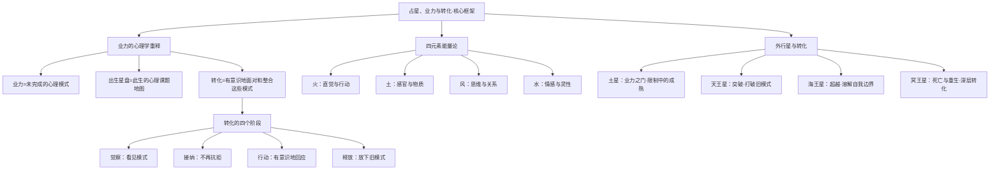

# 《占星、业力与转化》 - 史蒂芬·阿若优

## 一、学科坐标定位（400字）

本书是心理占星学领域的里程碑之作，首版于1978年出版。史蒂芬·阿若优是美国心理占星学运动的核心人物之一，拥有心理学硕士学位，他的独特贡献在于将占星学与==业力（karma）概念和心理转化过程==有机地结合起来。

> [!info] 学科关系网
> 本书处于三个传统的交汇处：
> - 心理占星学（行星作为心理原型）
> - 东方灵性传统（业力、轮回、因果法则）
> - 人本主义/超个人心理学（自我实现、意识进化）

阿若优在书中重新定义了"业力"的概念——他不把业力理解为神秘的惩罚/奖赏机制，而是将其视为==未完成的心理模式==。出生星盘揭示的不是前世的"债"，而是此生需要面对和转化的深层心理课题。这个重新定义使得业力概念从宗教信仰的领域进入了心理学可以操作的领域。

与[[《心理占星学入门》 - 克莱尔·马丁]]相比，阿若优的理论深度更高，尤其在外行星（土星、天王星、海王星、冥王星）的心理意义方面有系统而深刻的论述。与[[《宇宙与心灵》 - 理查德·塔纳斯]]的宏大文化哲学视角不同，阿若优始终扎根在==个体心理转化的实践层面==。他关心的不是行星周期与文明史的对应，而是一个具体的人如何通过理解自己的星盘来推动内在成长。

本书的独特价值在于它为心理占星学提供了一个==灵性维度==，但同时保持了心理学的理性框架——这种平衡在同类著作中相当罕见。

---

## 二、理论框架地图（500字）

> [!abstract] 框架核心逻辑
> 阿若优的核心论证链：（1）每个人出生时带着一组"未完成的课题"（业力模式），它们铭刻在出生星盘中；（2）这些课题通过生命事件反复呈现，直到被有意识地面对；（3）外行星的过境和相位是这些课题被"激活"的时间窗口；（4）转化不是逃避这些课题，而是==在压力中觉醒==——学会以更高的意识水平回应原本无意识的反应模式。

==费曼式一句话概括==：你的出生星盘不是前世的判决书，而是此生的课程表——每个"困难配置"都是一门你注定要修的课，而外行星的过境就是考试时间。

阿若优最原创的贡献之一是将==四元素（火、土、风、水）==发展为一个完整的能量心理学框架。在他的体系中，元素不只是星座的分类标签，而是描述心理能量如何在个体内部流动和表达的核心维度。元素的平衡与失衡直接关系到一个人的心理健康和灵性发展。

---

## 三、逐章深度拆解（5000字）

### 第一部分：业力与出生星盘

> [!note] DIKW四层提炼
> - **Data**：阿若优将"业力"定义为"过去行动的后果在当下的延续"，并将其与出生星盘关联——星盘中的每个配置都反映了某种需要被面对的心理模式
> - **Information**：传统的业力观（善有善报、恶有恶报）被重新解释为心理学意义上的"未完成情结"——不是宇宙在惩罚你，而是你内在的某些模式在反复重演直到被意识化
> - **Knowledge**：出生星盘中的"困难配置"（如土星的位置、四分相、十二宫行星等）不是不幸的标记，而是此生最重要的成长机会——恰恰是在这些领域，你有最大的转化潜力
> - **Wisdom**：业力不是命运，而是倾向性。星盘揭示的是你的起点和你面对的课题，但你如何回应这些课题——是无意识地重复旧模式，还是有意识地选择新的回应方式——这取决于你的觉察水平

**费曼式解读**

想象你在一条河里游泳。河水的流向和速度是"业力"——它来自上游（过去），它是你当下处境的既定条件。传统的宿命论说"你只能顺流而下"。阿若优说的是：==你没法改变河流的方向，但你可以学会在河中游泳==。

更具体地说：你星盘中的土星在第七宫（关系宫），不意味着"你注定关系不好"。它意味着关系领域是你此生的核心课题。你可能在关系中反复遇到相似的困境（控制、回避、恐惧亲密），这些困境会持续出现直到你看清了自己在其中的无意识模式。==看清本身就是转化的开始==。

阿若优特别强调，业力的心理学解读使它从一个宗教概念变成了一个==可操作的自我觉察工具==。你不需要相信前世今生才能从这个框架中受益——你只需要承认，你确实带着某些深层的心理模式来到这个世界，而这些模式正在影响你的人生。

**反脆弱验证**

阿若优的"业力心理化"策略是否完全合理？需要注意的是，他把一个原本属于宗教信仰的概念（业力/轮回）==选择性地保留了一部分==（模式的重复性），放弃了另一部分（前世的具体记忆和道德因果）。这种重新解释在实用主义层面是有效的，但在哲学层面可能两头不讨好——传统灵性人士可能觉得它太心理学化，心理学家可能觉得它保留了不必要的灵性包装。

**类比迁移**

业力的心理学解读之于传统业力观，就像认知疗法之于道德说教——==不是告诉你"你应该改"，而是帮你看清"你为什么重复"==。

---

### 第二部分：四元素——能量的语言

> [!note] DIKW四层提炼
> - **Data**：四元素（火、土、风、水）是占星学最古老的分类框架，阿若优将其发展为一个完整的能量心理学体系
> - **Information**：每种元素代表一种基本的心理能量模式——火是自发的直觉和行动力，土是通过感官体验建立物质现实的能力，风是通过思维和沟通建立联系的能力，水是情感深度和直觉感知的能力
> - **Knowledge**：个体星盘中元素的分布揭示了能量的基本格局——强调某些元素意味着那些能量领域是你的天然资源，缺乏某些元素则意味着那些领域需要有意识的发展。元素的失衡是许多心理困难的深层根源
> - **Wisdom**：真正的心理整合不是强化你已有的优势，而是发展你最薄弱的元素——==最大的成长空间恰在你最不舒适的领域==

**费曼式解读**

把四元素想象成四种"操作系统"。火元素的人运行的是"==行动优先=="系统——直觉来了就干，不犹豫。土元素的人运行的是"==实证优先=="系统——要看到摸到才相信。风元素的人运行的是"==信息优先=="系统——先分析再决定。水元素的人运行的是"==感受优先=="系统——先感知情感氛围再做反应。

大多数人的星盘不是均匀分布在四种元素上的。你可能火土很强但风水很弱，这意味着你善于行动和执行，但在情感表达和理性分析方面可能遇到挑战。

阿若优的关键洞见是：==你最缺乏的元素往往是你最大的成长机会==。一个缺水的人可能一生都在回避情感，但恰恰是学会感受情感——而非逃避它——才能带来真正的心理整合。

**反脆弱验证**

四元素框架的脆弱点在于它的==简化性==。将无限丰富的心理现实压缩为四种基本类型，必然会损失大量细节。阿若优意识到了这一点，他强调四元素是一个起点而非终点——它提供的是一个基本的能量格局，具体的心理动力需要结合行星、星座、宫位和相位来细化。

**类比迁移**

四元素之于心理能量，就像四种基本味道之于美食——==酸甜苦辣不是对菜肴的完整描述，但它确实捕捉了最基本的味觉维度==。好的心理"料理"需要四味平衡。

---

### 第三部分：土星——业力之门

> [!note] DIKW四层提炼
> - **Data**：土星在传统占星学中被视为"大凶星"，代表限制、延迟、困难和恐惧
> - **Information**：阿若优对土星的重新解读是全书最具影响力的部分——他将土星从"惩罚者"转化为"教师"。土星代表的不是外部的坏运气，而是==内在的成熟压力==
> - **Knowledge**：土星在星盘中的位置（星座、宫位、相位）揭示了你此生最深的恐惧，也恰恰是你最需要发展出真正能力的领域。土星的课题无法被回避——你越回避，它带来的压力就越大；你越正面面对，它给你的回报就越扎实
> - **Wisdom**：土星是将潜力转化为真实能力的熔炉——没有经过土星考验的才华只是未实现的可能性，经过土星锤炼的才华才成为可靠的实力

**费曼式解读**

把土星想象成一个==极其严格但真正关心你的老教授==。他不会给你及格分只因为你出了努力。他不会降低标准来让你感觉好受。他会反复把你的论文打回来，指出每一个漏洞，直到你真正掌握了那个领域。这个过程很痛苦，但最终你发现——==他教的那门课恰恰成了你最扎实的专长==。

土星在第十宫的人可能终其一生都感到事业上的压力和不安，但恰恰是这种压力推动他们发展出真正的职业能力。土星在第四宫的人可能在家庭领域经历更多的限制和责任，但也因此发展出深刻的情感根基和内在安全感。

**反脆弱验证**

阿若优对土星的解读完美地体现了反脆弱原理：==压力使你变强==。但需要注意一个边界条件——这在适度的压力下成立，过度的压力可能导致崩溃而非成长。并非所有的"土星经历"都能成功转化为成长，有些人确实被压力压垮了。阿若优在这一点上不够充分地讨论了转化可能==失败==的情况。

**类比迁移**

土星之于心灵成长，就像重力训练之于肌肉——==没有阻力就没有力量==。但训练需要循序渐进，直接举起超出能力的重量只会受伤。

---

### 第四部分：外行星——超个人的转化力量

> [!note] DIKW四层提炼
> - **Data**：天王星、海王星、冥王星作为外行星，运行速度极慢，在每个星座停留数年至数十年，因此它们的星座位置是整代人共享的，其更个人化的意义主要通过宫位和相位来体现
> - **Information**：天王星代表突然的突破和觉醒——打破旧模式的电击；海王星代表边界的溶解和灵性的渴望——超越自我的渴望；冥王星代表深层的死亡与重生——强迫性的转化力量
> - **Knowledge**：外行星的过境是个人转化的关键时刻。当外行星与出生星盘中的个人行星形成相位时，往往带来强烈的心理体验——天王星过境带来突然的改变和自由的渴望，海王星过境带来困惑、理想化和灵性体验，冥王星过境带来深层的心理清理和权力动力的激活
> - **Wisdom**：外行星的力量超越个人意志的控制。面对它们的过境，最有效的策略不是抵抗（那只会增加痛苦），也不是被动接受（那会失去觉察），而是==有意识地臣服并保持觉察==——在无法控制的变化中找到有意识回应的空间

**费曼式解读**

如果土星是严格的教授，那外行星就是==自然灾害、灵性体验和深层地震==。

天王星像闪电——==突如其来，打碎一切已知==。天王星过境你的金星？你可能突然对一段稳定但乏味的关系感到窒息，渴望彻底的改变。这不是"坏运气"，而是你内在对真实和自由的需求在雷鸣般地苏醒。

海王星像大雾——==边界消失，一切变得模糊==。海王星过境你的太阳？你可能感到自我认同变得模糊，过去确定的身份开始溶解。这可以是灵性觉醒的开始，也可以是迷失方向的开始——区别在于你能否在放下旧身份的同时，不急于抓住一个新的幻觉。

冥王星像地震——==地面裂开，表层之下的东西被迫浮出水面==。冥王星过境带来的是你无法回避的深层心理清理。那些你压抑了多年的情感、权力议题、控制需求，都会在冥王星过境时以不可忽视的力量涌现。

**反脆弱验证**

阿若优对外行星的描述倾向于将所有困难体验都赋予"转化意义"。这在心理治疗的语境中是有建设性的（将痛苦重新框架为成长机会），但在极端情况下，==并非所有痛苦都有积极意义==。将创伤浪漫化是心灵成长文献中常见的陷阱。

**类比迁移**

外行星过境之于人生，就像季节变换之于自然——==你无法阻止冬天的到来，但你可以选择如何度过冬天==。有人在冬天中冬眠等待，有人在冬天中深耕内在。

---

### 第五部分：相位与转化过程

> [!note] DIKW四层提炼
> - **Data**：阿若优将相位（尤其是困难相位）理解为心灵内部不同需求之间的对话
> - **Information**：四分相代表"被迫行动的压力"——两种需求的冲突达到了必须做出选择的临界点；对分相代表"在两极之间寻找平衡"——两种对立的需求要求你发展出更高层次的整合能力
> - **Knowledge**：转化的过程不是线性的，而是螺旋上升的——同样的课题会在不同的生命阶段以不同的形式重新出现，每次都要求更深层次的觉察和整合
> - **Wisdom**：困难相位不是需要"修复"的缺陷，而是==灵魂选择的功课==——正是因为它困难，它才具有最大的转化潜力

**费曼式解读**

想象你的内在有两个声音。一个说"我要安全"（月亮），另一个说"我要自由"（天王星）。如果它们形成四分相，你的一生都会在这两种需求之间拉扯。但这种拉扯不是诅咒——==正是这种张力迫使你发展出一种更高层次的能力==：在自由中找到安全感，或在安全中保持自由。

阿若优的贡献在于他把相位理解为==动态的转化过程==而非静态的性格描述。一个月亮四分天王星的人在20岁时可能体验为"我在亲密关系中感到窒息"，在40岁时可能转化为"我学会了在亲密中保持独立性"——同样的相位，不同的意识水平带来不同的体验。

**反脆弱验证**

这种"一切困难都有意义"的框架在实际应用中需要把握分寸。对某些人来说，将困难重新框架为"灵魂的功课"是有治愈力的；但对另一些人来说，这可能变成==对实际问题的灵性回避==。阿若优自己也承认，心理占星学不能替代必要时的专业心理治疗。

**类比迁移**

相位之于心理发展，就像交叉训练之于运动员——==单一方向的训练会导致失衡，正是不同方向的拉力才塑造出全面的能力==。

---

## 四、认知偏差/效应清单（800字）

> [!warning] 阅读本书时需要警惕的认知偏差

1. **积极再框架陷阱（Positive Reframing Trap）**
   - 表现：阿若优的框架倾向于将所有困难赋予积极意义（"这是你灵魂选择的功课"）。这在适度使用时是有治愈力的，但过度使用时可能变成==对痛苦的否认==
   - 自检：你是在真正理解并转化这份困难，还是只是给它贴上了一个"灵性成长"的标签就绕过了？

2. **因果过度归因（Over-Attribution of Causality）**
   - 表现：将生活中的每件事都归因于星盘配置或行星过境
   - 自检：提醒自己，星盘是一个理解工具，不是一个==因果解释框架==。"我的土星在第七宫"可以帮你理解关系中的模式，但不能成为不做改变的借口

3. **灵性绕道（Spiritual Bypassing）**
   - 表现：用灵性概念（"这是我的业力""宇宙自有安排"）来回避实际的情感痛苦和人际冲突
   - 自检：你是否在用"灵性理解"来==替代==面对痛苦、寻求帮助、做出改变的实际行动？

4. **选择性认同（Selective Identification）**
   - 表现：只认同星盘描述中你喜欢的部分（"我的木星很强所以我很幸运"），回避你不喜欢的部分（"我不想看我的冥王星课题"）
   - 自检：恰恰是你==最不想看==的星盘部分，可能才是阿若优所说的核心"转化功课"

5. **前世叙事的滥用**
   - 表现：虽然阿若优本人相当审慎，但业力概念很容易被误用为编造详细的"前世故事"来解释当下困境
   - 自检：前世故事是否==可以被验证==？如果不能，它是否帮助你更好地理解和面对当下？

---

## 五、自我诊断工具（500字）

> [!tip] 基于本书的自我觉察练习

**练习一：元素能量盘点**

计算你星盘中行星在四种元素中的分布。然后问自己：
- 我最强的元素在日常生活中如何表现？它是否有时变成了我的盲点（过度使用）？
- 我最弱的元素在生活中造成了哪些具体的困难？
- 我有什么具体的方式可以在日常生活中发展我最弱的元素能量？

**练习二：土星课题识别**

找到你星盘中土星的位置（星座、宫位和主要相位）。然后写下：
- 在土星所在的生命领域，我最深的恐惧是什么？
- 在这个领域，我曾经历过哪些反复出现的困难或限制？
- 回顾过去，==那些最困难的经历教会了我什么==？我是否因为那些考验而发展出了某种真实的能力？

**练习三：外行星过境日记**

查找当前外行星与你出生星盘的关系。如果有紧密的过境，每天记录：
- 今天我经历了什么与这个过境主题相关的事件或情绪？
- 我的第一反应是什么？（通常是无意识的旧模式）
- 如果我用更高的觉察来回应，我会怎么做？

---

## 六、批判性审视（600字）

> [!question] 本书的局限与需要补充的视角

**优势**

1. ==对业力概念的心理学重释==具有开创性意义，使灵性概念变得可操作
2. 对土星和外行星的心理学解读深刻而有实践指导价值
3. 四元素能量论提供了一个直觉而实用的心理能量评估框架
4. 写作风格兼具深度和可读性，案例丰富

**局限**

1. **灵性假设的边界**：阿若优的框架隐含了一些无法被验证的假设——比如"灵魂选择了自己的课题""困难配置有转化目的"。这些假设对某些读者有启发价值，但对另一些读者来说可能构成一种==无法证伪的信仰体系==
2. **积极偏向**：全书倾向于将困难赋予积极意义，对于真正被创伤压垮的人来说，这种"一切都是功课"的框架可能显得==缺乏同理心==
3. **文化特异性**：阿若优融合东西方传统的做法，在某些地方可能对东方传统（如佛教的业力观）做了==过度简化==的处理
4. **科学立场**：本书写于1978年，当时的心理学与今天的心理学在方法论严谨性上有显著差异。阿若优引用的一些心理学概念可能不完全符合当代标准

**需要交叉验证的领域**

- 对土星的深入理解可以参考利兹·格林的《土星：老恶魔的新面貌》
- 对四元素的理解可以与阿若优自己的另一本书《占星与四元素能量》对照
- 对业力概念的哲学反思可以参考佛教原始文献对业力的更精确定义

---

## 七、行动改变指南（500字）

> [!success] 读完本书后的具体行动步骤

**第一步：绘制你的"业力地图"**
- 在出生星盘中标注：土星的位置、外行星与个人行星的相位、十二宫的行星
- 这些配置勾勒出你此生的==核心课题领域==

**第二步：元素再平衡计划**
- 识别你最弱的元素
- 每周安排至少两个活动来有意识地发展该元素的能量
- 缺火：参加运动或即兴表演；缺土：园艺或手工制作；缺风：加入读书会或学习新技能；缺水：冥想、写日记或欣赏音乐

**第三步：土星练习**
- 选择一件你一直在回避但知道自己需要面对的事情（通常与土星的宫位有关）
- ==从最小的一步开始==——不需要一步到位，但需要开始
- 每周记录你在这个领域的进展和阻力

**第四步：过境觉察日记**
- 查看当前的主要外行星过境
- 每天花5分钟写下与过境主题相关的观察
- 特别留意你的==自动反应模式==——那些无需思考就做出的反应，往往是最需要觉察的

**第五步：从觉察到选择**
- 当你发现自己又一次重复某个旧模式时，暂停
- 问自己：==如果我不自动执行这个模式，我有什么其他选择？==
- 即使只是意识到了模式但暂时无法改变，这个觉察本身就已经是转化的开始

---

## 八、费曼终极检验（400字）

> [!example] 如果我要向一个完全没读过这本书的朋友解释

"你有没有发现自己在生活中总是==重复某些模式==？比如总是被同一类人吸引，或者在同一种情境中犯同一个错误？

阿若优说，这些重复的模式不是坏运气，而是你还没有完成的'课题'。你的出生星盘就像一份==课程表==，上面写着你这辈子需要修的'课程'。有些课很轻松（和谐相位），有些课很难（困难相位），但正是那些最难的课能让你成长最多。

比如土星——占星学里最让人头疼的那颗行星——阿若优说它其实是你最好的老师。它在你星盘中的位置，指向你最深的恐惧和最大的成长空间。你在那个领域可能总是遇到挫折和限制，但==正是通过面对这些挫折，你才发展出真正的实力==。

最关键的一句话是：==觉察就是转化的开始==。你不需要立刻改变什么。当你看清了一个无意识的模式——'哦，我又在重复这个了'——这个'看清'本身就改变了你和这个模式的关系。你从被模式控制，变成了观察模式的人。

所以这本书不是告诉你命运已注定，恰恰相反——它说你的星盘是一份成长指南，而成长的关键不是逃避困难，而是==在困难中醒来==。"
