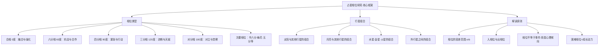

# 《占星相位研究》 - 苏·汤普金斯

## 一、学科坐标定位（400字）

苏·汤普金斯（Sue Tompkins）是伦敦占星学院的资深讲师和前院长，也是一位顺势疗法执业者。本书（Aspects in Astrology）是关于==占星学行星相位的最系统化、最权威的参考书==之一，被广泛用作教学和实践的核心文本。

> [!info] 学科关系网
> 本书的理论定位：
> - 心理占星学传统（行星作为心理原型的互动关系）
> - 伦敦占星学院教学体系
> - 实践导向（大量案例和关键词组合）

相位是占星学中==最精微、最动态的维度==。如果行星代表"谁"（心灵中的角色），星座代表"怎样"（角色的风格），宫位代表"在哪里"（角色活跃的领域），那么相位代表的就是"==角色之间的关系=="——它们如何互动、支持、冲突或融合。

在心理占星学的知识谱系中，本书与[[《占星十二宫位》 - 霍华德·乔基斯]]形成互补关系：乔基斯关注的是行星在==空间==维度上的分布（宫位），汤普金斯关注的是行星在==关系==维度上的互动（相位）。与[[《心理占星学入门》 - 克莱尔·马丁]]的概览式介绍不同，汤普金斯对每一对行星组合的相位都做了详细的心理学描述，使本书成为一部==实用的参考工具书==。

本书的特色在于汤普金斯极为清晰的写作风格和丰富的临床经验。她不追求理论的宏大，而是致力于为每个具体的行星相位提供==精确、多层次的心理描述==，使读者能够将抽象的象征转化为对实际生活的理解。

---

## 二、理论框架地图（500字）

> [!abstract] 框架核心逻辑
> 汤普金斯的方法论可以概括为"==行星A + 行星B + 相位类型 = 心理动力模式=="。她的核心贡献是为每一对行星组合提供了详尽的心理描述，同时在每种相位类型中区分了建设性表达和破坏性表达。她始终强调：相位描述的是心灵内部不同力量之间的==关系模式==，而非外部事件的预测。

==费曼式一句话概括==：相位就像心灵中不同角色之间的对话方式——有的角色和和气气地聊天（三分相），有的角色在激烈争论（四分相），有的角色声音融为一体（合相），有的角色站在房间两端对峙（对分相）。每种对话方式都有其价值。

汤普金斯在理论上最重要的贡献之一是她对==所谓"困难相位"的重新评价==。她指出，四分相和对分相虽然制造了内在紧张，但恰恰是这种紧张提供了行动和成长的动力。而三分相虽然舒适流畅，但如果缺乏张力，其能量可能永远不会被充分意识化和利用。==舒适不等于成长，张力不等于问题==。

---

## 三、逐章深度拆解（5000字）

### 第一部分：相位的基本原理

> [!note] DIKW四层提炼
> - **Data**：相位是星盘中两颗行星之间形成的特定角度关系。主要相位包括合相（0度）、六分相（60度）、四分相（90度）、三分相（120度）和对分相（180度）
> - **Information**：每种角度关系对应一种特定的心理动力模式。合相是力量的融合与强化；六分相是机会和温和的合作；四分相是紧张、冲突和被迫行动；三分相是自然流动和内在天赋；对分相是两极对立和寻求平衡的压力
> - **Knowledge**：相位的"软硬"之分（和谐相位 vs 困难相位）是一个有用但==过度简化的框架==。汤普金斯强调，"和谐"不等于"好"，"困难"不等于"坏"——一个只有和谐相位的星盘可能缺乏驱动力，一个充满困难相位的星盘反而可能产生巨大的成就
> - **Wisdom**：==真正重要的不是相位的"好坏"，而是个体如何有意识地使用相位的能量==。一个四分相可以表现为破坏性的内在冲突，也可以表现为强大的行动力和创造力——区别在于觉察和整合的水平

**费曼式解读**

想象你有一个乐队。每颗行星是一个乐手。相位描述的是乐手之间的互动关系。

==合相==：两个乐手合奏同一段旋律——声音强大但可能分不清谁是谁。太阳合月亮的人，自我意志（太阳）和情感需求（月亮）融为一体，这让他们非常一致但也可能缺乏内在张力。

==三分相==：两个乐手自然地和谐配合，不需要排练。金星三分木星的人天生乐观、慷慨、有审美天赋——但正因为太容易了，这种天赋可能被浪费。

==四分相==：两个乐手在节奏和旋律上冲突。这听起来刺耳，但==正是这种冲突迫使他们寻找新的音乐解决方案==。月亮四分土星的人在情感安全和自律责任之间拉扯，但这种拉扯可以产生深刻的情感成熟度。

==对分相==：两个乐手站在舞台两端演奏完全不同的旋律。他们需要找到一种方式让两段旋律形成对位法——这是最难的，但也能产生最丰富的音乐。

==六分相==：两个乐手互相给眼色，配合默契，但需要主动利用这种默契才能真正发挥作用。六分相提供的是==机会而非保证==。

**反脆弱验证**

汤普金斯对相位的评价体系具有明确的反脆弱特征：==张力产生力量==。但这个原则有一个重要的边界条件：过多的困难相位可能导致个体被内在冲突压垮而非激励。汤普金斯意识到了这一点，她在实际解读中总是考虑==整张星盘的平衡==，而非孤立地评价单个相位。

**类比迁移**

相位之于星盘，就像人际关系之于团队——==一个完全和谐的团队可能缺乏创新，一个完全冲突的团队可能无法运作。最佳团队在和谐与张力之间找到动态平衡==。

---

### 第二部分：太阳的相位

> [!note] DIKW四层提炼
> - **Data**：太阳代表核心自我认同、意志力和生命目标。太阳与其他行星的相位揭示了自我认同如何与其他心理功能互动
> - **Information**：太阳-月亮相位揭示意志与情感的关系；太阳-水星相位揭示自我与思维的关系；太阳-土星相位揭示自我认同与权威/限制的关系；太阳-冥王星相位揭示自我与深层权力的关系
> - **Knowledge**：太阳的相位中，太阳-土星系列和太阳-冥王星系列通常被认为是最具挑战性的——因为它们直接冲击自我认同的核心。但汤普金斯指出，这些也恰恰是==最能锻造出强大自我==的配置
> - **Wisdom**：一个未经检验的自我认同（太阳没有困难相位）可能表面上很自信，但缺乏真正的深度和韧性。==真正的自信来自于经历过挑战后仍然完整的自我==

**费曼式解读**

太阳是你心灵公司的CEO。太阳的相位描述的是CEO和其他高管的关系。

==太阳合月亮==（新月出生）：CEO和人力资源总监完全一致——高效但可能忽略内部矛盾。太阳对分月亮（满月出生）：CEO和人力资源总监观点对立——需要不断协调，但正因如此，决策更加全面。

==太阳四分土星==：CEO受到合规部的严厉约束。年轻时感觉被束缚、自信心不足，但经过长期的"合规训练"，反而发展出最扎实的领导力。汤普金斯特别指出，==太阳-土星的困难相位往往在中年以后迎来"反转"==——年轻时的限制感逐渐转化为成熟和权威。

==太阳四分或对分冥王星==：CEO面临来自幕后力量的持续挑战。这可能表现为权力斗争、强迫性地需要控制、或被迫经历自我的彻底转化。极具挑战但也极具转化潜力。

**反脆弱验证**

汤普金斯对太阳相位的描述整体上非常平衡。但需要注意的是，她的描述主要基于==临床观察和占星传统==，而非系统的实证研究。每一段描述都应被视为一种"可能性的地图"而非确定性的判断。

**类比迁移**

太阳的相位之于自我发展，就像企业领导者面对的各种利益相关方——==你不是在真空中领导，而是在复杂的关系网络中定义自己==。

---

### 第三部分：月亮的相位

> [!note] DIKW四层提炼
> - **Data**：月亮代表情感需求、安全感模式、对母亲/被照顾的体验、本能反应
> - **Information**：月亮与金星的相位揭示情感表达与价值观的关系；月亮与土星的相位揭示情感需求与责任/限制的关系（常被视为心理占星学中==最重要的"困难配置"之一==）；月亮与海王星的相位揭示情感与灵性/幻想的关系
> - **Knowledge**：月亮-土星的困难相位是汤普金斯着墨最多的配置之一。她将其描述为"==情感的冬天=="——一种感觉自己的情感需求不被看见、不被满足的深层经验。这往往与早年被照顾的经验（尤其是与母亲的关系）有关
> - **Wisdom**：月亮-土星的困难相位不是"永远不快乐"的判决。它的礼物是==情感的成熟和自给自足==。一个经历过"情感冬天"的人，如果有意识地面对了这个课题，最终会发展出一种不依赖外部持续供给的内在安全感

**费曼式解读**

月亮是你内在的小孩——它需要安全感、温暖和被接纳。月亮的相位描述的是这个内在小孩与其他心理力量的关系。

==月亮三分金星==：内在小孩被温柔地呵护——情感表达自然、和谐，容易在关系中感到舒适。但可能因为太舒适而不愿面对更深层的情感挑战。

==月亮四分土星==：内在小孩被要求"长大"——情感需求被认为不重要或不合适。这种人从小就学会了压抑情感需求，表面上很"坚强"，内在却渴望被照顾。汤普金斯的洞见是：==这个配置的终极礼物是，当你不再期待外部来满足你的情感需求时，你会发现自己内在有一口永不枯竭的井==。

==月亮对分海王星==：内在小孩渴望与万物融合——极度敏感、同情心强、但边界模糊。可能通过理想化关系、逃避现实或灵性追求来满足深层的归属渴望。

**反脆弱验证**

月亮-土星的解读再次体现了反脆弱原理。但汤普金斯需要被补充的一点是：==并非所有经历"情感冬天"的人都能成功转化==。有些人可能发展出长期的抑郁或情感回避模式，需要专业心理治疗的支持。占星学的"礼物"叙事不应替代对实际心理困难的严肃对待。

**类比迁移**

月亮的相位之于情感发展，就像不同的生长环境之于植物——==温室里的花朵美丽但脆弱，风雪中的松树粗糙但坚韧==。两者都有其价值，关键是理解你的"生长条件"并学会利用它。

---

### 第四部分：内行星相位（水星、金星、火星）

> [!note] DIKW四层提炼
> - **Data**：水星代表思维和沟通，金星代表价值观和关系，火星代表行动力和欲望。这三颗内行星之间以及它们与外行星的相位，构成了日常心理体验的核心织理
> - **Information**：水星-火星相位影响思维的速度和攻击性；金星-火星相位影响爱与欲望的关系；金星-土星相位影响爱与承诺的关系；火星-土星相位影响行动力与限制的关系
> - **Knowledge**：汤普金斯对==金星-火星相位==的分析特别有价值。她指出，金星（吸引力、接受性）和火星（追求、主动性）的关系，本质上描述了一个人如何处理==爱的被动面和主动面==。和谐相位使两者自然配合，困难相位则可能导致"想要的"和"追求的"之间出现分裂
> - **Wisdom**：内行星相位最接近日常体验，因此也最容易被改变和发展。==外行星相位像地质结构，改变缓慢但影响深远；内行星相位像天气，变化频繁且更容易被有意识地调整==

**费曼式解读**

内行星相位是你日常心理生活的"操作系统设置"。

==水星四分火星==：思考和行动之间有冲突——你的脑子可能比嘴巴还快，容易说出尖锐的话。但这也给了你辩论的天赋和思维的锐利。

==金星对分土星==：你在爱与承诺之间感到撕扯——你既渴望亲密又害怕失去自由（或被拒绝）。汤普金斯指出，==这个配置往往在成年后变得更好==，因为你学会了什么是真正值得承诺的关系。

==火星合冥王星==：行动力与深层权力欲融合——极端强大但也极端危险。这个配置可以产生伟大的变革者，也可以产生控制狂。区别在于意识水平。

**反脆弱验证**

内行星相位描述的脆弱点在于==容差范围==的影响更大。因为内行星运行快，容差范围的微小变化可能意味着某个相位是否"存在"。汤普金斯建议初学者使用较严格的容差范围。

**类比迁移**

内行星相位之于外行星相位，就像肌肉训练之于骨骼结构——==你更容易改变肌肉（内行星），但骨骼（外行星）决定了基本框架==。

---

### 第五部分：外行星相位与整合

> [!note] DIKW四层提炼
> - **Data**：外行星（木星至冥王星）之间的相位由于运行缓慢，是整代人共享的配置。它们与个人行星的相位则是高度个体化的
> - **Information**：外行星与个人行星的相位往往带来==最深刻和最难以控制的心理体验==。土星与个人行星的相位带来限制和成熟的压力；天王星与个人行星的相位带来突然的改变和解放的冲动；海王星与个人行星的相位带来理想化和边界溶解；冥王星与个人行星的相位带来深层的权力动力和强迫性的转化
> - **Knowledge**：汤普金斯在整合章节中强调了一个关键原则：==不要孤立地解读单个相位==。一个月亮四分土星的人如果同时有月亮三分木星，那么土星的限制性会被木星的乐观和扩展所部分缓解。星盘是一个整体系统，每个相位的含义都在与其他相位的互动中被修正
> - **Wisdom**：最终，相位解读不是机械地组合关键词，而是一种==在多层信息中感知整体模式==的直觉艺术。汤普金斯的这本书提供的不是最终答案，而是一个起点——真正的理解来自将这些描述与真实的人生经验反复比对

**费曼式解读**

外行星相位像是==命运的底色==。你不太能改变它，但你可以选择如何在这个底色上绑画。

==冥王星四分太阳==：你的一生都会面对权力的主题——控制与被控制、摧毁与重建。这可能让你成为一个深刻的变革者，也可能让你陷入无尽的权力斗争。关键是：==你能否将冥王星的力量用于自我转化而非控制他人？==

汤普金斯在整合章节做了一件非常重要的事：她提醒读者，==真实的人不是一堆相位的机械叠加==。一个人的星盘中可能同时有多个看似矛盾的描述——这不是矛盾，这正是人性的复杂性。好的相位解读需要同时持有这些看似矛盾的面向，感受它们如何在一个具体的人身上形成独特的整合。

**反脆弱验证**

汤普金斯最大的方法论诚实在于她反复承认：==这些描述是可能性而非确定性==。同一个相位在不同的人身上可以有非常不同的表达。她提供的是一个认知地图，而非精确的GPS导航。

**类比迁移**

整合星盘中的所有相位，就像指挥一个交响乐团——==每个乐手的演奏都是真实的，但只有在指挥的整合下，所有声部才能形成一首完整的音乐==。

---

## 四、认知偏差/效应清单（800字）

> [!warning] 阅读本书时需要警惕的认知偏差

1. **关键词机械组合（Keyword Mechanicism）**
   - 表现：把相位解读变成"行星A关键词 + 行星B关键词 + 相位类型 = 结论"的公式化操作
   - 汤普金斯的对策：她在每个相位描述中都提供了==多层次的表达可能==，从最低（无意识/破坏性）到最高（有意识/建设性），提醒读者不要只取一层
   - 自检：你是否在用星盘给人"下定义"而非开启对话？

2. **好/坏二分法（Good/Bad Dichotomy）**
   - 表现：简单地将三分相和六分相归为"好"，四分相和对分相归为"坏"
   - 汤普金斯明确反对这种分法：==三分相可能带来懒惰，四分相可能带来成就==
   - 自检：你对困难相位是否只看到了破坏面？你对和谐相位是否只看到了舒适面？

3. **单一相位过度解读（Over-Reading Single Aspects）**
   - 表现：因为看到某人有"冥王星四分太阳"就得出极端结论
   - 汤普金斯强调：==任何单个相位的含义都会被其他相位所修正==。星盘是一个整体
   - 自检：你是否在孤立地看一个相位，而忽略了整张星盘的语境？

4. **容差范围偏差（Orb Bias）**
   - 表现：使用过宽的容差范围，导致"看到"了很多实际上很微弱的相位
   - 汤普金斯的建议：==主要相位使用6-8度容差，次要相位使用更严格的1-2度==
   - 自检：你是否在勉强地把两颗行星"凑成"一个相位？

5. **预测陷阱（Predictive Trap）**
   - 表现：将相位描述当作具体事件的预测（"你有火星四分冥王星，所以你会遭遇暴力"）
   - 汤普金斯始终将相位理解为==心理倾向而非事件预告==
   - 自检：你是否在用相位吓唬自己或别人？

---

## 五、自我诊断工具（500字）

> [!tip] 基于本书的自我觉察练习

**练习一：相位能量图谱**

列出你星盘中所有的主要相位。将它们分为三类：
- 合相（融合的力量）
- 和谐相位（三分相、六分相——流畅的能量）
- 张力相位（四分相、对分相——挑战的能量）

观察整体比例。你的星盘是偏向流畅还是偏向张力？这与你对生活的整体感受是否对应？

**练习二：最紧密相位深潜**

找出你星盘中==容差范围最小的那个相位==（即两颗行星之间角度最精确的那个）。这通常是你体验最强烈的相位。
- 用汤普金斯的描述对照你的实际经验
- 这个相位的能量在你的生活中主要表现在哪里？
- 你是在建设性地还是破坏性地使用这个能量？

**练习三：困难相位的礼物**

选择你星盘中让你最不舒服的一个相位。问自己：
- 这个相位给你带来了哪些实际的困难？
- 但它是否==同时==也给了你某种独特的力量或敏感度？
- 如果没有这个相位，你的人格会失去什么？

---

## 六、批判性审视（600字）

> [!question] 本书的局限与需要补充的视角

**优势**

1. ==系统性无与伦比==。几乎涵盖了所有主要行星组合的所有主要相位，是最完整的相位参考书之一
2. 每个相位都提供了从低表达到高表达的==多层次描述==，避免了简单化
3. 写作极为清晰，适合作为教学和实践的参考工具
4. 始终保持心理学的框架，不滑入宿命论

**局限**

1. **深度与广度的取舍**：正因为要覆盖所有行星组合，每个具体相位的讨论深度有限。对于某些复杂的相位（如冥王星-月亮），读者可能需要==更多的临床案例和更深入的心理学分析==
2. **静态描述的局限**：本书以"出生星盘的固定相位"为主要对象，对==行星过境形成的动态相位==着墨不多。而实际生活中，过境相位的影响往往更为直接和紧迫
3. **文化假设**：汤普金斯的描述基于==西方中产阶级的生活经验==，某些关于关系、家庭和事业的假设可能不适用于所有文化背景
4. **实证基础**：和所有占星学著作一样，这些描述基于==临床经验和传统知识==，而非系统的实证研究。读者应将其视为有价值的假设而非科学结论

**需要交叉验证的领域**

- 将相位理解放入宫位语境，需要结合[[《占星十二宫位》 - 霍华德·乔基斯]]
- 将相位理解放入转化语境，需要结合[[《占星、业力与转化》 - 史蒂芬·阿若优]]
- 对外行星相位的历史维度理解，需要参考[[《宇宙与心灵》 - 理查德·塔纳斯]]

---

## 七、行动改变指南（500字）

> [!success] 读完本书后的具体行动步骤

**第一步：建立你的相位档案**
- 列出星盘中所有主要相位，标注容差范围
- 按容差从紧到松排序——==最紧的相位是你最核心的心理动力==
- 为每个相位写一段简短的个人注释：这在我的生活中如何表现？

**第二步：困难相位的重新框架**
- 选择你最"害怕"的相位
- 阅读汤普金斯对该相位==建设性表达==的描述
- 找出你生活中已经在建设性地使用这个相位的证据

**第三步：和谐相位的激活**
- 找出你的三分相和六分相
- 问自己：这些天赋我是否在充分利用？还是因为太容易而被忽略了？
- ==和谐相位需要主动激活才能发挥最大价值==

**第四步：相位对话日记**
- 每天选择一个相位，有意识地观察它在日常生活中的表现
- 记录具体事件、情绪反应和你的应对方式
- 一个月后回顾，看看你是否对这些能量有了更深的理解

**第五步：比较与对话**
- 与亲近的人比较相位
- 你们之间是否存在相互呼应的相位（如你的太阳四分他的月亮）？
- 这种跨星盘的相位互动如何影响你们的关系？

---

## 八、费曼终极检验（400字）

> [!example] 如果我要向一个完全没读过这本书的朋友解释

"你知道每个人内在都有很多不同的需求和力量对吧？比如你既想冒险又想安全，既想独立又想亲密。==相位描述的就是这些不同力量之间的关系==。

有些力量之间天然配合（三分相）——比如你的幽默感和你的社交能力自然地互相加强。有些力量之间激烈冲突（四分相）——比如你的职业野心和你对家庭的承诺总在互相拉扯。

汤普金斯这本书最有价值的洞见是：==那些内在冲突不是你的缺陷，而是你的动力==。完全没有冲突的人可能过得舒服，但也缺乏驱动力。正是因为你的野心和家庭承诺在互相较劲，你才被迫找到一种创造性的方式来同时满足两者——这个找到的方式，就是你独特的人生智慧。

所以别害怕你星盘中的四分相和对分相。它们确实让你不舒服，但它们也是你最强大的引擎。三分相给你天赋，四分相给你力量。==最丰富的人生同时需要两者==。

这本书就像一份关于你内在所有力量之间关系的详细说明书——读懂它不是为了认命，而是为了更好地==指挥你内在的交响乐团==。"
