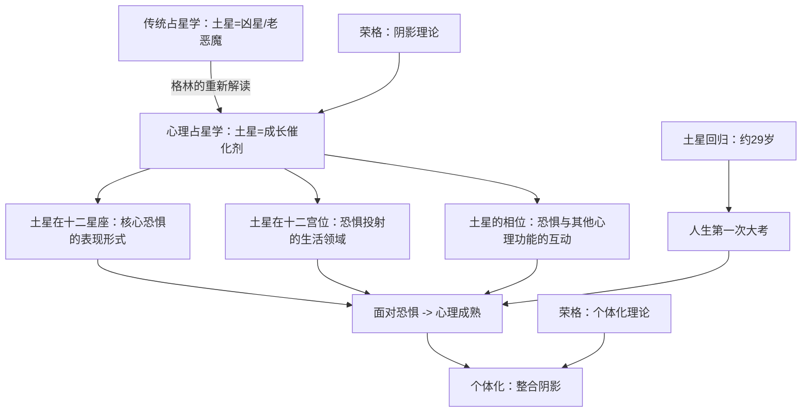

## 一、学科坐标定位

> [!info] 学科交叉位置
> 本书是==心理占星学==的奠基之作之一，位于==荣格分析心理学==与==占星学行星象征==的深度交汇处。

丽兹·格林是心理占星学领域最重要的理论家之一，同时也是受过正式训练的荣格分析心理学家。这种双重身份使她的占星著作具有其他占星作者难以匹敌的心理学深度。本书出版于1976年，至今仍被视为心理占星学的里程碑。

本书的核心革命性在于：将传统占星学中被视为"凶星"（Greater Malefic）的土星，重新解读为==心理成长的催化剂==。在传统占星学中，土星代表限制、延迟、困难、冷酷、甚至不幸。格林则论证：土星象征的限制和困难，恰恰是个体心理成熟和==个体化==（Individuation）过程的必要条件。没有土星的"压力"，人格的深层整合无法发生。

在学科谱系中，本书直接源于荣格关于==阴影==（Shadow）和个体化的理论，并将其与占星学中土星的十二宫位和相位含义进行了系统性的对接。它影响了后来的几乎所有心理占星学著作，包括[[霍华德·萨司波塔斯]]的行星系列和[[史蒂芬·弗里斯特]]的进化占星学。

## 二、理论框架地图

格林的理论框架可以凝练为一个核心命题和三个操作维度：

**核心命题：** 土星在你星盘中的位置，指出你==最深的恐惧==所在。而你最深的恐惧所在，恰恰也是你==最大的成长潜力==所在。面对和整合土星所指出的恐惧，是个体化过程的核心任务。

**三个操作维度：**
- ==土星所在星座==：恐惧的心理质地（你用什么方式害怕？）
- ==土星所在宫位==：恐惧投射的生活领域（你在哪个领域感到最不安全？）
- ==土星的相位==：恐惧与其他心理功能的互动模式（你的恐惧如何影响你的爱、思考、行动？）

## 三、逐章深度拆解

### 第一部分：土星的传统形象与心理学重读

> [!note] DIKW四层提炼
> - **Data**：在传统占星学中，土星被称为"大凶星"，与限制、延迟、失败、疾病、衰老和死亡相关联；在希腊神话中，克洛诺斯（土星）吞噬了自己的孩子
> - **Information**：格林指出，这些"凶"的象征本质上都是关于==限制==的——而限制不等于惩罚
> - **Knowledge**：从心理学角度看，限制是结构的基础。没有限制，就没有形状；没有形状，就没有身份。土星的"凶"是一种必要的"凶"——它通过施加限制来促使你定义自己是谁
> - **Wisdom**：最深的心理成熟往往不发生在自由和成功中，而发生在限制和失败中。这不是受虐的美化，而是对人类心理发展规律的观察

**费曼式解读：** 想象你在做陶器。泥土（你的心灵原材料）可以变成任何形状——但它必须被手（土星）施加压力和限制，才能变成一个具体的容器。没有压力，泥土只是一团无形的泥。土星就是那双塑形的手。它的压力让你不舒服，但正是这种不舒服赋予了你"形状"——也就是你的人格、你的身份、你对"我是谁"的回答。

格林的革命性在于：她把土星从"要避免的坏运气"变成了"要面对的成长邀请"。传统占星师看到土星在第七宫会说"婚姻会有困难"。格林说"你在关系领域有深层恐惧需要面对，而面对这种恐惧的过程将使你在关系中达到别人无法达到的成熟深度"。

**反脆弱验证：** 格林的重读在心理学逻辑上是站得住脚的——限制促进成长的观点在发展心理学和压力研究中都有支持。但需注意，格林有时可能过度美化了土星的困难，忽略了某些限制确实是纯粹的损害而非"成长机会"。不是所有的苦难都有意义，这是"苦难美化"倾向的潜在风险。

**类比迁移：** 格林对土星的重读与尼采的"受苦的价值"有直接共鸣——"那不能杀死我的，使我更强大"。也与纳西姆·塔勒布的==反脆弱==概念呼应——系统在适度压力下变得更强壮，而非更脆弱。

### 第二部分：土星在十二星座

> [!note] DIKW四层提炼
> - **Data**：格林逐一分析了土星在十二个星座中的表现，每个位置对应一种独特的恐惧质地
> - **Information**：土星在白羊座：恐惧自我主张；土星在金牛座：恐惧物质不安全；土星在双子座：恐惧沟通和表达不被理解；以此类推
> - **Knowledge**：土星所在的星座不是你"做不好"的领域，而是你因为恐惧而==过度补偿==或==完全回避==的领域。两种反应都是恐惧的表现
> - **Wisdom**：认识恐惧的第一步是命名它。土星的星座位置给了你一个名字来称呼你最深的不安全感

**费曼式解读：** 以土星在狮子座为例。狮子座的核心需求是被看见、被认可、自由地表达自我。当土星在这个位置时，这个核心需求被一层==恐惧==包裹着——"如果我真的展现自己，会被嘲笑/拒绝/忽视"。这种恐惧的表现可以是两个极端：要么过度补偿（变得极其张扬、不断寻求关注，实际上是用过度表演来掩盖深层不自信），要么完全回避（变得极度低调、拒绝任何聚光灯，实际上是因为太害怕被拒绝而根本不敢尝试）。

格林的洞见是：这两种极端反应——==过度补偿和完全回避==——都是同一种恐惧的不同面具。真正的成长不是在两个极端之间来回摇摆，而是直面底层的恐惧本身。

**反脆弱验证：** 格林对每个星座位置的分析非常具体且具有临床共鸣，但也需注意这是一种"理想类型"式的描述——现实中的人远比任何单一星座位置的描述更复杂。土星的宫位、相位以及整个星盘的配置都会修正星座层面的描述。格林本人在书中也反复强调这一点。

**类比迁移：** 格林关于"过度补偿/回避"两极的分析，与心理防御机制理论高度吻合——过度补偿对应弗洛伊德的"反向形成"（Reaction Formation），回避对应"压抑"（Repression）。格林的贡献是将这些心理防御机制与具体的占星配置做了系统的对应。

### 第三部分：土星在十二宫位

> [!note] DIKW四层提炼
> - **Data**：格林分析了土星在十二个宫位中的表现，每个宫位代表一个具体的生活领域
> - **Information**：土星在第一宫：自我形象的恐惧；土星在第四宫：家庭和根基的恐惧；土星在第七宫：亲密关系的恐惧；土星在第十宫：公众角色和成就的恐惧
> - **Knowledge**：土星所在的宫位是你感到最"沉重"的生活领域——你在这个领域投入最多的控制努力，但也获得最多的深度智慧
> - **Wisdom**：你最抗拒的生活领域，往往是你最终能够达到最深理解的领域

**费曼式解读：** 以土星在第七宫（关系宫）为例。这个人在关系中有一种深层的恐惧——可能是害怕被抛弃、害怕失去自我、或害怕承诺。这种恐惧不会消失，但它可以被==转化==。

格林指出一个关键的心理动力：==土星第七宫的人倾向于在关系中"遇到"自己的土星==。他们可能反复被严厉、冷漠或控制型的伴侣吸引——不是因为"命运"，而是因为他们内在的"严厉法官"（土星的内在面）被投射到了外在伴侣身上。只有当他们收回这种投射，认识到"严厉法官"实际上住在自己心里而非伴侣身上，关系困境才能真正转化。

这是格林整本书中最深刻的洞见之一：==你在土星宫位所遇到的外在困难，往往是你内在恐惧的镜像投射==。改变外在处境之前，需要先改变内在关系。

**反脆弱验证：** 格林关于"投射"的分析直接借用了荣格的阴影投射理论，这在分析心理学的临床实践中有大量支持。但需注意，并非所有关系困难都可以归因于"投射"——有时候一个控制型伴侣就是一个控制型伴侣，将所有外在困难都归因于内在投射，可能导致一种不健康的"自我归罪"倾向。

**类比迁移：** 格林的土星投射理论与精神分析中的"移情"（Transference）概念有直接对应——你在关系中重复早年模式，不是因为"命运"，而是因为未被意识到的内在模式在驱动你的选择。

### 第四部分：土星的相位

> [!note] DIKW四层提炼
> - **Data**：格林分析了土星与其他行星（太阳、月亮、水星、金星、火星等）形成的主要相位（合相、对冲、四分相等）
> - **Information**：土星-太阳相位：父亲原型的恐惧/与权威的关系；土星-月亮相位：母亲原型的恐惧/情感安全的匮乏感；土星-金星相位：爱与被爱的恐惧/价值感的缺失
> - **Knowledge**：土星的相位揭示的是恐惧如何"渗透"到你其他的心理功能中——当土星触碰金星，恐惧渗入你的爱情；当土星触碰月亮，恐惧渗入你的情感安全感
> - **Wisdom**：土星不会毁掉它所触碰的任何行星的功能——它只是增加了一层"必须通过努力才能获得"的要求。土星-金星不是"没有爱"，而是"爱需要被努力赢得"

**费曼式解读：** 以==土星-月亮==相位为例。月亮代表你的情感安全感、归属需求和内在小孩。当土星（严厉的老师）与月亮（脆弱的内在小孩）形成紧张相位时，这个人从很小的时候就感到"我的情感需求不会被满足"——可能是因为实际的情感忽视，也可能是因为他对情感支持的内在标准异常高。

格林观察到，土星-月亮相位的人往往有一种"情感上的老成"——他们很早就学会了不依赖他人的情感支持，发展出了强大的内在独立性。这种独立性是真实的力量，但它也可能成为一种防御——一种"我不需要任何人"的盔甲，阻止了真正的情感亲密。

**反脆弱验证：** 格林对土星相位的分析在临床观察中具有强烈的共鸣感，但和所有占星解读一样，存在事后解释的风险。更重要的是，格林自己也承认：同一个土星-月亮相位可以有截然不同的表现——有人变得极度独立，有人变得极度依赖（通过反向形成来补偿匮乏感）。这种双向可能性增加了理论的解释力但降低了预测力。

**类比迁移：** 土星-月亮相位的描述与依恋理论中的"回避型依恋"（Avoidant Attachment）有显著对应——两者都描述了一种在情感关系中的距离感和自给自足的防御模式，两者都追溯到早年的情感体验。

### 第五部分：土星回归与人生周期

> [!note] DIKW四层提炼
> - **Data**：土星的公转周期约29.5年，因此约每29.5年回到出生时的位置（土星回归），一生中会经历两到三次
> - **Information**：第一次土星回归（约29岁）是从青年到成年的过渡；第二次土星回归（约59岁）是从中年到老年的过渡
> - **Knowledge**：土星回归是人生的"结构性审查"——你之前建立的生活结构（职业、关系、价值观）是否真正属于你？如果不是，土星回归期间这些结构会面临压力甚至坍塌
> - **Wisdom**：土星回归不是命运的惩罚，而是真实性的检验——它拆掉的是不属于你的东西，保留的是真正属于你的东西

**费曼式解读：** 想象你花了29年建了一座房子。土星回归就是一场"质量检查"。检查官（土星）来了，他会测试每一面墙、每一根柱子。如果你的房子是用"别人的期望""社会的标准""恐惧的驱动"建造的，这些部分在检查中会出现裂缝。如果你的房子是用"真实的自我认知""诚实的选择""负责任的承诺"建造的，这些部分会在检查中被确认。

格林强调：土星回归期间崩塌的东西，往往是==本来就需要更新==的东西。这个过程痛苦，但必要。29岁左右的人经常经历职业转变、关系重组、或深层价值观的重新审视——这些都是土星回归的典型表现。

**反脆弱验证：** 29岁前后确实是许多文化中公认的人生转折期，发展心理学研究也支持这一观察。但将这种转变归因于土星的天文周期，还是归因于生物发展、社会角色转变和心理成熟的综合作用，是一个因果归因问题。格林的解释不能排除后者。

**类比迁移：** 土星回归与塔勒布的==反脆弱==概念高度契合——系统在压力下被测试，脆弱的部分崩塌，留下的部分变得更强壮。这不是破坏，而是一种"通过破坏实现的优化"。

## 四、认知偏差/效应清单

> [!warning] 阅读本书时需警惕的认知偏差

1. **苦难浪漫化偏误**：格林对土星困难的积极解读可能导致读者美化苦难本身。不是所有的限制都促进成长，某些极端的创伤和压迫纯粹是破坏性的。

2. **确认偏误**：知道自己土星位置后，容易只注意生活中与之吻合的困难，忽略不吻合的。

3. **自我归罪偏误**：格林强调土星困难的"内在根源"（投射），这可能导致读者将所有外在困难都归因于自身心理问题，忽略真实的外在因素。

4. **权威效应**：格林作为心理占星学权威，她对土星的积极重读可能被不加批判地接受。

5. **后见之明偏误**：回顾性地将过去的困难与土星位置"对号入座"非常容易。

6. **幸存者偏差**：格林引用的案例多为"最终成长"的案例，那些在土星压力下没有"成长"而是被击垮的人较少出现。

7. **框架效应**：将所有困难框架为"成长邀请"可能降低对真实不公正的敏感度。

8. **基本归因错误**：将关系困难全部归因于个人投射，可能忽略伴侣的实际行为问题。

## 五、自我诊断工具

> [!tip] 你对土星心理学的理解深度

- [ ] 你能否用自己的话解释格林将土星从"凶星"重读为"成长催化剂"的核心逻辑？
- [ ] 你能否描述你自己的土星（星座/宫位/相位）并识别其对应的核心恐惧？
- [ ] 你能否区分"过度补偿"和"完全回避"这两种土星恐惧的表现模式？
- [ ] 你能否解释"投射"概念在土星宫位解读中的运作方式？
- [ ] 你能否对格林的"苦难促进成长"命题提出至少一个反例或批判？

**深度自检：** 阅读本书后，你对自己人生中的"土星经验"（限制、挫折、恐惧）的态度是否有所改变？如果只是从"这是坏运气"变成了"这是成长机会"，你可能只完成了表层的转变。更深的转变是：你是否能够==同时==承认困难的真实痛苦，又看到它可能包含的成长种子？

## 六、批判性审视

> [!danger] 本书的局限与可商榷之处

**优势：**
- 开创性地将荣格心理学系统性地应用于占星行星象征
- 对土星的心理学重读深刻、优美且具有极强的临床启发性
- 改变了几代占星学者对土星的理解

**局限：**

1. **苦难美化的风险。** 格林的框架倾向于将所有土星困难视为"有意义的成长"，但某些极端的压迫、暴力或创伤可能没有这种"成长"功能——它们只是纯粹的破坏。将所有苦难都赋予正面意义可能是一种隐性的受害者指责。

2. **投射理论的过度使用。** "你在外界遇到的困难是你内在恐惧的投射"这一命题在某些情况下是有洞察力的，但在另一些情况下可能导致对真实外在压迫的忽视。

3. **个体化叙事的阶级偏见。** 格林的"面对恐惧、实现成长"的叙事隐含地假设个体有足够的物质和心理资源来进行这种内在工作。对于生活在极端贫困或压迫中的人来说，"面对内在恐惧"可能是一种奢侈。

4. **缺乏系统的实证支持。** 格林的分析基于临床观察和理论推演，缺乏对照研究或量化数据的支持。

5. **对土星积极面的过度强调可能矫枉过正。** 在纠正传统占星学对土星的过度妖魔化的过程中，格林可能走向了另一个极端——过度理想化了土星的困难。

## 七、行动改变指南

> [!success] 基于本书的实践建议

1. **土星自画像：** 查看你的土星星座、宫位和主要相位。写下你在土星所在领域最深的恐惧。注意：如果你写下的是"我害怕失败"这样的笼统说法，继续深挖——"失败"下面的具体恐惧是什么？是"不被认可"？"失去控制"？"被抛弃"？

2. **过度补偿/回避检测：** 在土星所在的领域，你是倾向于过度补偿（过度努力、过度控制）还是完全回避（逃避、否认）？两者都是恐惧的面具。

3. **投射清单：** 列出你在土星宫位领域中反复遇到的"困难人物"类型。他们身上让你最受不了的特质是什么？这些特质是否可能是你内在土星的外在镜像？

4. **土星回归反思：** 如果你已经历过第一次土星回归（约29岁），回顾那段时期：什么崩塌了？什么被保留了？崩塌的东西是否确实是不再适合你的？

5. **搭配阅读：** 与[[生命四元素]]形成互补——阿若优提供横向的元素分析，格林提供纵向的深度分析。与[[无意识的动力]]搭配，后者进一步发展了格林在本书中的理论。

## 八、费曼终极检验

> [!abstract] 如果只用三段话向外行解释这本书

**第一段（是什么）：** 在占星学传统中，土星一直是"坏消息"的代表——它与限制、延迟、困难和恐惧相关联。丽兹·格林这本书做了一件革命性的事：她说，土星不是来惩罚你的，而是来帮你"塑形"的。就像陶器需要被手施加压力才能从一团泥变成有形的容器，你的人格也需要土星的"压力"才能从模糊的可能性变成确定的"我是谁"。

**第二段（核心论点）：** 格林认为，土星在你星盘中的位置指出了你最深的恐惧——在哪个生活领域、以什么方式、你最容易感到不安全。但关键转折是：你最深的恐惧所在，也是你最大的成长潜力所在。一个在关系中有深层恐惧的人（土星在第七宫），如果愿意面对这种恐惧而非逃避，最终可以在关系中达到别人无法企及的成熟深度。这就是土星的"礼物"——它不白白给你，它要求你先付出"面对恐惧"的代价。

**第三段（为什么重要）：** 这本书改变了几代占星学者对土星的理解，也为非占星学读者提供了一种有价值的心理学视角：你人生中反复出现的困难和限制，可能不是随机的坏运气，而是指向某个你需要面对但一直在回避的内在课题。当然，格林的框架也有盲点——不是所有苦难都有"成长"的意义，有时候困难就只是困难。但作为一种自我理解的工具，"土星指出的不仅是你的恐惧，也是你的潜力"这个洞见，无论你是否相信占星学，都值得认真思考。
