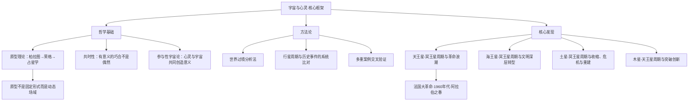

# 《宇宙与心灵》 - 理查德·塔纳斯

## 一、学科坐标定位（400字）

《宇宙与心灵》（Cosmos and Psyche: Intimations of a New World View）是一部融合==哲学史、文化史与原型占星学==的巨著，出版于2006年。作者理查德·塔纳斯是美国哲学家和文化史学家，曾任加州整合学院（CIIS）教授，其前作《西方心灵的激情》（The Passion of the Western Mind）已是西方思想史的经典教材。

> [!info] 学科关系网
> 本书处于多个学科的交叉点：
> - 西方哲学史（从古希腊到后现代）
> - 荣格分析心理学（原型理论、集体无意识）
> - 原型占星学（行星过境与文化事件的对应关系）
> - 科学哲学（范式转移、世界观变革）

塔纳斯的核心论证是：==外行星之间的相位周期与人类文明史上的重大文化转折存在系统性的对应关系==。这不是传统意义上的占星预测，而是一种对"宇宙与人类心灵之间存在深层秩序"的哲学论证。

本书在心理占星学谱系中占据独特位置。如果说[[《心理占星学入门》 - 克莱尔·马丁]]关注的是个体星盘的心理解读，那么塔纳斯关注的是==集体层面的原型动力==——行星周期如何与整个文明的精神变迁同步。与[[《占星、业力与转化》 - 史蒂芬·阿若优]]的灵性取向不同，塔纳斯走的是严格的学术路线，用大量历史证据来支撑他的原型宇宙论。

这部著作的学术抱负远超一般的占星学著作——它试图回应的是现代性的核心困境：==一个祛魅的宇宙中，人类如何重新找到与万物的联结？==

---

## 二、理论框架地图（500字）

> [!abstract] 框架核心逻辑
> 塔纳斯的论证路径是：（1）西方思想史经历了从"有灵魂的宇宙"到"机械的宇宙"的祛魅过程；（2）这个祛魅过程带来了巨大的智识成就，但也导致了意义的丧失和人与宇宙的疏离；（3）原型占星学提供了一条"再魅"的路径——不是退回前现代的迷信，而是在后现代的框架中重新发现==宇宙与心灵的深层关联==。

==费曼式一句话概括==：塔纳斯发现，每当天空中的外行星形成特定的几何关系时，人类文明总是在同步经历具有相同"原型味道"的重大变革——这种对应太系统、太反复，不太可能是纯粹的巧合。

本书的方法论创新在于"==世界过境=="（world transit）概念：不只看个人星盘的行星过境，而是研究外行星之间形成相位时，全人类集体层面呈现出的原型主题。这种方法将占星学从个人咨询工具提升为文化分析工具。

---

## 三、逐章深度拆解（5000字）

### 第一部分：现代世界观的危机

> [!note] DIKW四层提炼
> - **Data**：西方文明从古希腊的有灵宇宙观，经中世纪基督教宇宙观，到启蒙运动后的机械宇宙观，经历了根本性的世界观转变
> - **Information**：这个转变的核心是"祛魅"（disenchantment）——宇宙从一个有意义的、与人类心灵相呼应的有机体，变成了一部冷漠的机器
> - **Knowledge**：祛魅带来了科学革命的辉煌成就，但也产生了深刻的存在危机——如果宇宙只是无意义的物质运动，人类的意义、价值和目的从何而来？
> - **Wisdom**：解决这个危机不能靠退回前现代世界观，而需要一种"参与性认识论"——承认人类心灵不是宇宙的旁观者，而是宇宙自我认识的参与者

**费曼式解读**

想象你住在一座古老的宅子里。最初，你相信宅子里住着精灵和守护神——墙壁会呼吸，地板有脉搏，一切都充满意义。后来你长大了，学了物理学，发现宅子不过是砖头和水泥——没有精灵，没有守护神，只有原子和空洞。你变得更聪明了，但你也更==孤独==了。

塔纳斯说，这就是西方文明的故事。从柏拉图到牛顿，从"宇宙有灵魂"到"宇宙是机器"，人类获得了前所未有的控制力，但也丧失了与万物联结的感觉。他的整本书试图回答一个问题：==有没有一种方式，既保留科学的严谨，又恢复宇宙的意义==？

**反脆弱验证**

塔纳斯对"祛魅"的诊断基本上是西方哲学界的共识（韦伯、海德格尔、泰勒等人都有类似论述）。但他给出的"药方"——原型占星学——在主流学术界并未被广泛接受。读者需要区分他的诊断（扎实）和他的处方（仍有争议）。

**类比迁移**

祛魅之于文明，就像过度理性化之于个人——==你可以把一切都分析清楚，但如果只剩分析，生活就失去了质感和热度==。塔纳斯试图做的，是在分析和感知之间找到新的平衡。

---

### 第二部分：原型占星学的方法论

> [!note] DIKW四层提炼
> - **Data**：原型占星学研究外行星之间形成相位（合相、对分相、四分相等）时，人类集体层面呈现出的主题和事件
> - **Information**：每一对外行星组合都对应特定的原型主题——天王星-冥王星对应革命性的解放和颠覆，土星-冥王星对应收缩、危机和深层重建，海王星-冥王星对应文明深层的精神转型
> - **Knowledge**：这些对应关系不是一次性的巧合，而是在数百年的历史中反复出现——每当同一对行星再次形成紧密相位，同一种原型主题就会以新的形式在人类文化中重新涌现
> - **Wisdom**：原型不是命运的剧本，而是一个"意义场域"——它不决定具体发生什么，而是赋予一段时期特定的心理质感和发展方向

**费曼式解读**

想象你有一台宇宙级别的收音机。每一对外行星就是一个频段。当两颗外行星靠近（形成紧密相位）时，那个频段的信号就会变强。天王星-冥王星频段播放的是"革命与解放"；土星-冥王星频段播放的是"考验与重建"；木星-天王星频段播放的是"突破与创新"。

塔纳斯没有说收音机==导致了==节目内容（这是因果论的传统占星学），他说的是==收音机的频率与节目内容之间存在一种神秘的对应==（这是共时性的原型占星学）。

他的方法是：回溯几百年的历史，检查每当某对行星形成紧密相位时，人类文化中是否系统性地出现了对应的原型主题。如果这种对应只出现一两次，可以归结为巧合；但如果它在每一次行星周期中都反复出现，就需要认真对待了。

**反脆弱验证**

这种方法的最大脆弱点是==选择性举证==。如果你只挑选符合理论的历史事件，忽略不符合的，那任何理论看起来都很"准"。塔纳斯意识到了这个问题，他的应对策略是：（1）尽可能覆盖完整的历史时期，而非只挑选有利的案例；（2）展示同一对行星在不同历史时期如何以不同形式但相同原型主题反复出现；（3）承认原型的表达是多义的，同一个行星周期在不同文化和个体中可能有非常不同的具体表现。尽管如此，==从严格的科学标准来看，这种方法仍难以被证伪==，这是读者需要保持审慎的地方。

**类比迁移**

世界过境分析法之于历史学，类似于气候模式之于天气预报——==它不预测具体哪天下雨，但指出某个季节更可能潮湿==。原型占星学描述的是"时代的气候"而非"具体的事件"。

---

### 第三部分：天王星-冥王星周期与革命

> [!note] DIKW四层提炼
> - **Data**：天王星-冥王星的合相和硬相位（四分相、对分相）周期大约为130-140年一个完整循环
> - **Information**：塔纳斯追踪了从法国大革命（1780年代末-1790年代，天冥合相期间）到1960年代反文化运动（天冥合相期间）再到2010年代社会动荡（天冥四分相期间）的对应关系
> - **Knowledge**：天王星-冥王星的原型组合可以描述为"创造性毁灭"或"革命性解放"——天王星带来突破、自由和叛逆的冲动，冥王星带来深层的、不可逆转的转化力量，两者结合产生**改变游戏规则的剧烈变革**
> - **Wisdom**：这些变革不是纯粹的破坏或纯粹的进步——它们同时释放出巨大的创造力和巨大的混乱，关键在于人类能否有意识地引导这种原型能量

**费曼式解读**

把天王星想象成闪电，冥王星想象成火山。平时它们各自活动——偶尔一道闪电，偶尔一次地震。但当它们在天空中"对齐"时，就好像闪电直接劈入火山口——==爆发的能量足以重塑地貌==。

法国大革命时期（1787-1798），天王星和冥王星形成合相。整个欧洲的政治秩序被连根拔起。1960年代（1960-1972），天冥再次合相。从民权运动到反战运动，从女权主义到性革命，从摇滚乐到迷幻文化——一切既有秩序都在被质疑和颠覆。2010年代初（2007-2020），天冥形成四分相。阿拉伯之春、占领华尔街运动、全球民粹主义兴起——又一波深层的社会动荡。

==每次具体事件完全不同，但原型主题惊人地一致==：权力结构的颠覆、被压抑力量的爆发、自由与混乱的并存。

**反脆弱验证**

批评者可能指出，人类历史上任何时期都能找到"革命"和"动荡"的例子。塔纳斯的回应是：他关注的不是革命本身的存在，而是革命的==强度、广度和文化渗透深度==在行星紧密相位期间是否系统性地更高。这是一个可以被检验的主张，但检验方法本身充满方法论上的挑战。

**类比迁移**

天王星-冥王星周期之于文明，就像青春期之于个人——==一段不可避免的剧烈重组期，痛苦但必要，混乱但充满可能性==。

---

### 第四部分：土星-冥王星周期与收缩

> [!note] DIKW四层提炼
> - **Data**：土星-冥王星的合相和硬相位周期约为33-38年
> - **Information**：塔纳斯将第一次世界大战爆发（1914年，土冥合相）、大萧条和法西斯兴起（1930年代，土冥四分相）、冷战开始（1947年，土冥合相）、911事件（2001年，土冥对分相）等系统性地与土冥周期对应
> - **Knowledge**：土星-冥王星的原型组合可以描述为"深层的收缩和考验"——土星带来限制、结构和现实的压力，冥王星带来不可回避的深层力量，两者结合产生==严峻的历史转折点==，通常伴随危机、损失和深刻的重建
> - **Wisdom**：土冥周期揭示了人类文明的一个基本节律——定期的收缩和危机不是异常，而是系统更新自身的必经过程

**费曼式解读**

如果天冥是闪电劈入火山，那土冥就像==地壳板块碰撞==——缓慢、沉重、不可阻挡。它带来的不是自由和解放，而是限制和考验。每到土冥相位期间，人类都被迫面对某种深层的现实：一战的屠杀粉碎了"进步必然带来和平"的幻觉；911粉碎了"历史已经终结"的幻觉。

但塔纳斯也指出，土冥周期不只是破坏。它迫使文明直面被忽略的问题，拆除脆弱的结构，在废墟上重建更坚固的东西。==这与反脆弱理论的核心洞见完全吻合：真正坚固的系统需要经受压力的考验才能进化==。

**反脆弱验证**

土冥周期的论证在塔纳斯所有行星周期分析中可能是最具说服力的，因为==历史记录相对清晰，重大危机事件的日期明确==。但同样需要注意：历史从不缺少危机，关键在于能否证明危机在土冥紧密相位期间系统性地更严重、更具转折意义。

**类比迁移**

土冥周期之于文明，就像冬天之于生态系统——==表面上一切都在收缩和死亡，但地下正在积蓄新一轮生长的力量==。

---

### 第五部分：其他行星周期与参与性宇宙论

> [!note] DIKW四层提炼
> - **Data**：塔纳斯还系统分析了木星-天王星（创造性突破）、海王星-冥王星（文明精神的深层转型）等多对行星组合的历史对应
> - **Information**：木天周期与科学发现、技术革新和思想突破高度对应；海冥周期跨度极长（约500年），对应整个文明时代的精神底色变化
> - **Knowledge**：所有这些行星周期研究指向同一个结论——宇宙不是一部冷漠的机器，而是一个有意义的、与人类心灵深层共振的参与性场域
> - **Wisdom**：参与性宇宙论不要求你相信"行星导致事件"，而是邀请你考虑一种可能性——人类心灵和宇宙节律共享同一套原型语法，这种对应关系的确切机制我们尚未理解，但其存在的证据值得认真对待

**费曼式解读**

塔纳斯在书的最后提出了一个关键概念：==参与性宇宙论==。他没有说"行星控制人类"（那是宿命论），也没有说"人类心灵创造宇宙"（那是唯心论）。他说的是：宇宙和心灵==共同参与==了意义的创造。行星不是原因，人类不是结果——它们是同一首交响曲中的不同声部。

这有点像量子物理学中观察者与被观察系统的关系——==测量行为本身改变了被测量的对象==。塔纳斯认为，人类与宇宙的关系也具有这种参与性质——我们不是在旁观一个客观的宇宙，我们是宇宙认识自身的器官。

**反脆弱验证**

参与性宇宙论是一个==哲学立场而非科学假设==，因此无法被传统科学方法证实或证伪。塔纳斯对此是清楚的。读者需要判断的不是"这是否被证明了"，而是"这个框架是否为理解人类经验提供了有价值的视角"。

**类比迁移**

参与性宇宙论之于世界观，就像从第三人称叙事到第一人称叙事的转换——==你不再只是在读关于宇宙的故事，你意识到你就是故事的一部分==。

---

## 四、认知偏差/效应清单（800字）

> [!warning] 阅读本书时需要警惕的认知偏差

1. **叙事偏差（Narrative Bias）**
   - 表现：塔纳斯是一位极其出色的叙事者。他选择和组织历史材料的方式本身就构成了一种有说服力的"故事"。但==好听的故事不等于准确的解释==
   - 自检：每当你被某段论证深深说服时，问自己——如果我是一个持怀疑立场的历史学家，我会怎么评价这些证据？

2. **确认偏差（Confirmation Bias）**
   - 表现：当你开始"看见"行星周期与历史事件的对应后，你可能会不自觉地只注意符合的案例，忽略不符合的
   - 自检：积极寻找==反例==——在行星紧密相位期间没有发生预期主题的时期，以及在非相位期间发生了该主题的时期

3. **权威效应（Authority Bias）**
   - 表现：塔纳斯的学术背景（哈佛博士、著名哲学史著作作者）可能让读者不自觉地降低批判门槛
   - 自检：一个人在哲学史领域的权威不能自动迁移到占星学研究领域。==尊重作者，但独立判断==

4. **模式识别过度（Apophenia）**
   - 表现：人类天生善于在随机数据中"发现"模式。数百年的历史中，几乎总能找到某些事件与某些行星位置"对应"
   - 自检：这些对应关系的==统计显著性==如何？塔纳斯没有做（也很难做到）严格的统计检验

5. **宏大叙事的诱惑**
   - 表现：本书提供了一种将全部人类历史纳入单一解释框架的可能性，这种"终极解释"的诱惑力极大
   - 自检：==警惕任何宣称能解释一切的理论==。最深刻的真理通常也有最清楚的边界

---

## 五、自我诊断工具（500字）

> [!tip] 基于本书的反思练习

**练习一：个人历史与行星周期**

回顾你自己生命中的重大转折时刻。查看当时天空中外行星之间的相位关系，以及外行星与你出生星盘的关系。注意：==不要急于"确认"对应关系==，而是保持好奇和开放。如果发现有趣的对应，记录下来；如果没有发现，同样记录下来。

**练习二：时代气候感知**

思考你所生活的这个时代。当前天空中外行星之间的主要相位是什么？你能否在集体文化氛围中感受到对应的原型主题？这个练习的目的不是"验证"占星学，而是==培养对集体心理动力的敏感度==。

**练习三：哲学立场自检**

读完本书后，问自己：
- 我对"宇宙有意义"这个命题的立场是什么？
- 我是否需要科学证明才能接受某种体验的价值？
- 我能否在不确定的情况下保持开放？

---

## 六、批判性审视（600字）

> [!question] 本书的局限与需要补充的视角

**优势**

1. ==学术深度无与伦比==。塔纳斯的哲学史素养使他能够将占星学置于西方文明最深层的思想脉络中
2. 论证风格极为诚实——他没有宣称"证明了"占星学，而是说"这些证据邀请我们认真考虑"
3. 对行星周期与历史事件的比对工作量巨大，覆盖时间跨度达数百年

**局限**

1. **可证伪性问题**：原型的多义性使得几乎任何历史事件都可以被"解读"为某种原型表达。这种理论的灵活性本身就是一个==认识论上的弱点==——如果一个理论无法被任何证据否定，那它的解释力就值得质疑
2. **文化偏向**：全书的历史案例几乎完全取自西方文明。中国、印度、伊斯兰世界的历史在同一行星周期中是否呈现相同的原型主题？塔纳斯没有系统地讨论这个问题
3. **因果机制缺失**：塔纳斯坦率承认他不知道这种对应关系的"机制"是什么。==没有机制的相关性在科学方法论中始终是可疑的==
4. **篇幅和可读性**：原书超过600页，部分章节的历史分析极为详尽，可能超出一般读者的耐心

**需要交叉验证的领域**

- 如果你想从个体层面理解原型占星学，建议结合[[《心理占星学入门》 - 克莱尔·马丁]]
- 如果你想从灵性转化的角度理解占星学，建议阅读[[《占星、业力与转化》 - 史蒂芬·阿若优]]
- 如果你想从科学哲学的角度进一步评估塔纳斯的方法论，建议阅读托马斯·库恩的《科学革命的结构》

---

## 七、行动改变指南（500字）

> [!success] 读完本书后的具体行动步骤

**第一步：重新审视"祛魅"**
- 回顾你自己的世界观形成过程。你在哪些时刻感到"宇宙失去了意义"？在哪些时刻又重新感到了联结？
- 这不是一个需要"解决"的问题，而是一个值得==持续探索==的问题

**第二步：学习基本的行星周期**
- 了解当前天空中的主要外行星相位
- 阅读塔纳斯对该行星组合的原型描述
- 观察当前世界事件中是否有对应的主题

**第三步：建立历史-行星对照笔记**
- 选择一对你最感兴趣的行星组合
- 追踪它在过去200年中的主要相位时期
- 记录对应时期的重大历史事件
- ==同时记录不对应的案例==

**第四步：哲学对话**
- 找一个你信任的、具有批判性思维能力的朋友，讨论本书的核心论证
- 目的不是说服对方，而是通过对话==澄清你自己的立场==

**第五步：从世界过境到个人星盘**
- 将世界过境的原型主题与你个人星盘的行星位置联系起来
- 当前的世界过境如何"激活"了你星盘中的特定配置？

---

## 八、费曼终极检验（400字）

> [!example] 如果我要向一个完全没读过这本书的朋友解释

"你知道我们通常觉得宇宙就是一堆无意义的物质在运动对吧？这个哲学家塔纳斯花了几十年研究了一件奇怪的事：==天空中几颗大行星的位置变化，和人类历史上的重大事件之间，存在一种系统性的对应关系==。

比如每当天王星和冥王星在天空中'对齐'的时候——这大概每140年发生一次——人类社会就会经历一波巨大的革命浪潮。法国大革命、1960年代的反文化运动，都发生在这个'对齐'期间。

他不是说行星'导致了'这些事件。他说的是，行星和人类社会==好像在跳同一支舞==——它们同步，但谁也不是谁的原因。就像你的心情和天气有时候惊人地同步——不是天气控制了你，但两者之间似乎有某种说不清的呼应。

他在问一个很大的问题：==宇宙是不是真的像我们以为的那样冷漠无意义？还是说，我们和宇宙之间存在某种我们还没理解的深层联系？==

他没有给出确定的答案。他给出的是大量的证据，然后说：'这些证据至少值得我们认真想想。'"
