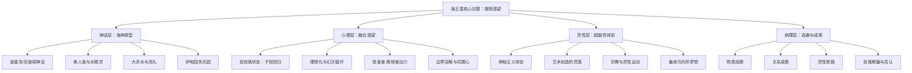

# 《海王星：生命是一场追寻救赎的旅程》 - 丽兹·格林

> [!info] 书籍信息
> **原书名**：The Astrological Neptune and the Quest for Redemption
> **作者**：Liz Greene
> **出版**：1996年（Samuel Weiser）
> **主题**：海王星的神话原型、心理动力与在星盘中的多维度表现

---

## 一、学科坐标定位（400字）

本书是心理占星学领域的里程碑式著作，被广泛认为是关于海王星最深刻、最全面的专著。作者[[丽兹·格林]]是CPA（伦敦心理占星学中心）联合创始人，同时拥有荣格分析心理学博士学位，这种双重身份使她能在==占星象征与深度心理学==之间建立独特的桥梁。

在学科谱系中，本书的位置极为特殊：

> [!note] 学科交叉位置
> - **上游学科**：荣格分析心理学（集体无意识、原型理论）、比较神话学（坎贝尔、伊利亚德）、宗教心理学（鲁道夫·奥托的"神圣"概念）、精神分析（弗洛伊德的"海洋感"概念）
> - **本学科**：心理占星学——将海王星从传统占星的"吉凶"判断中解放出来，重新定位为描述人类对超越性体验之渴望的心理符号
> - **下游应用**：成瘾心理学、灵性危机干预、艺术创造力分析、宗教心理分析

格林在本书中的野心远超一般占星教材。她实际上写了一部==关于人类救赎渴望的心理学史==，海王星只是她用来组织这一宏大叙事的占星符号。书中涉及的领域从古希腊神话到中世纪炼金术，从浪漫主义诗歌到现代成瘾现象，从早期基督教神秘主义到新时代运动。

这使得本书不仅是占星学读物，更是一部跨学科的==文化心理学著作==。即便读者完全不懂占星学，仍然可以从中获得关于人类灵性渴望的深刻洞见。

---

## 二、理论框架地图（500字）

> [!abstract] 核心理论支柱
> 1. **救赎渴望是人类的基本驱力**：海王星在心理层面代表一种比个人自我更深层的渴望——回到一种"一切合一"的原初状态。这种渴望既是灵性成长的源泉，也是成瘾与自我欺骗的根源
> 2. **理想化-幻灭循环**：海王星的核心动力是一个反复出现的循环——将某个人、事物、理想或体验理想化，然后不可避免地经历幻灭，再将理想化投射到下一个对象上。==成熟不是消除这种渴望，而是学会不将它具体化到任何单一对象上==
> 3. **受害者-救赎者共生**：海王星创造的最典型关系动力是"我来拯救你"/"请你拯救我"的共依存模式。双方都在对方身上寻找自己缺失的完整性
> 4. **艺术作为健康通道**：格林认为，艺术创造是海王星能量最健康的表达通道之一——它允许人们进入"融合状态"（创作时自我边界的溶解），同时又通过形式和结构将体验带回人间
> 5. **海王星的世代维度**：作为外行星，海王星不仅影响个人心理，还描述整个世代的集体梦想与集体幻象——每一代人都有自己的"乌托邦"和随之而来的"幻灭"

---

## 三、逐章深度拆解（5000字）

### 第一部分：海王星的神话根源

#### 海神原型与水的象征

> [!tip] DIKW四层提炼
> - **Data**：海王星于1846年被发现，天文学上是太阳系第八颗行星，在占星学中被赋予与海洋、迷雾、幻象相关的象征意义
> - **Information**：格林追溯了海王星命名来源——罗马海神尼普顿（对应希腊波塞冬），并深入分析了水在人类心理中的原型意义：子宫内的羊水、洗礼的净化之水、大洪水的毁灭与重生之水
> - **Knowledge**：海王星在心理层面代表的不是某种具体情绪，而是一种==前自我状态==——在"我"形成之前的那种无边界、无分别的存在体验。这种体验在成人生活中以各种方式被追寻：恋爱的"合二为一"感、宗教的"与神合一"体验、醉酒或致幻剂带来的边界溶解
> - **Wisdom**：所有这些追寻的根源是同一个——==对分离之苦的本能抗拒==。个体化的代价是孤独，海王星是灵魂对这种孤独的永恒抗议

**费曼式解读**：想象你在母亲肚子里的状态——温暖、安全、不需要呼吸、不需要自己吃东西、与母亲完全融为一体。然后你出生了——冰冷的空气、刺眼的灯光、脐带被剪断。从那一刻起，你就成了一个"独立"的人，也从那一刻起，你的某个部分就一直在试图回到那种"合一"的感觉。==海王星就是你内心那个永远在寻找"回家路"的部分==。

**反脆弱验证**：格林将海王星体验与弗洛伊德的"海洋感"（oceanic feeling）概念联系起来，后者是弗洛伊德在与罗曼·罗兰的通信中讨论的。虽然弗洛伊德将其还原为婴儿期的自恋记忆，格林更倾向于荣格的立场——这是一种真实的心理体验，不能仅仅被还原为发展退行。

**类比迁移**：这种"融合渴望"与[[温尼科特]]所说的"过渡性客体"（如安慰毯）有类似的功能——它是无限与有限之间的桥梁，是灵性体验在日常生活中的落脚点。

---

#### 伊甸园与失乐园

> [!tip] DIKW四层提炼
> - **Data**：格林分析了多种文化中的"失乐园"神话——伊甸园、黄金时代、香巴拉
> - **Information**：这些神话都包含同一个核心结构：曾经存在一种完美状态，后来因某种"堕落"而失去，未来有望通过某种方式"回归"
> - **Knowledge**：格林认为，这些神话不是对历史事实的记录，而是对==心理事实==的象征——它们描述的是每个人从出生前的融合状态到出生后的分离状态的转变，以及由此产生的永恒乡愁
> - **Wisdom**：问题不在于渴望本身，而在于==将渴望具体化==。当你把"失乐园"投射到某个具体的人、地方或信仰上时，幻灭就成为必然。真正的灵性成熟是学会==持守渴望而不抓取任何具体对象==

**费曼式解读**：你有没有过这样的感觉——觉得"如果我能得到那个东西（那个人/那份工作/那种生活），一切就完美了"？然后当你真的得到了，短暂的满足之后又觉得"还是缺了点什么"？格林说，这就是海王星在运作。它不是在欺骗你——你渴望的那种完美确实存在，只是==它不在任何具体的东西里面==。它是一种指向超越的方向感，而不是一个可以到达的目的地。

---

### 第二部分：海王星的心理动力

#### 理想化与幻灭的循环

> [!tip] DIKW四层提炼
> - **Data**：海王星在星盘中与个人行星形成相位时，该行星所代表的生命领域容易出现理想化-幻灭模式
> - **Information**：海王星-金星相位的人容易在爱情中理想化伴侣；海王星-太阳相位的人容易理想化父亲或权威人物；海王星-月亮相位的人容易理想化母亲或家庭
> - **Knowledge**：格林指出，理想化不是"错误"——它是海王星的自然功能。==问题在于将理想化当作现实==。当我们将某个凡人当作"灵魂伴侣"来崇拜时，我们实际上是在将一种原型投射到一个具体的人身上。这个人不可避免地会"让我们失望"，因为没有凡人能承载神性的重量
> - **Wisdom**：成熟的海王星表达是学会==在看到现实的同时保持对美好的感受力==。不是变得愤世嫉俗（那只是幻灭的另一面），而是发展出一种"带着清醒的眼睛做梦"的能力

**费曼式解读**：海王星的理想化就像Instagram滤镜。你给现实加了一个美化滤镜，看起来确实很美——但那不是现实。问题不在于你喜欢美好的东西，而在于你忘了自己开着滤镜。当滤镜掉了（幻灭），你不是"发现了真相"——你只是从一个极端跳到了另一个极端。==真正的智慧是知道滤镜存在，欣赏它的美，同时也接受原图==。

**反脆弱验证**：这一循环模型在临床心理学中有广泛的对应物。科胡特的自体心理学中的"理想化移情"（idealizing transference）描述了几乎相同的动力；克莱因学派的"偏执-分裂位"到"抑郁位"的转变也与此呼应。格林的贡献在于将这些临床概念放入占星学的更宏大叙事中。

#### 受害者-救赎者动力

> [!tip] DIKW四层提炼
> - **Data**：海王星强调的星盘经常出现在帮助性职业（护理、社工、心理咨询）和"被拯救"/"拯救他人"的人际模式中
> - **Information**：格林借用卡普曼戏剧三角（受害者-迫害者-拯救者）来分析海王星的关系动力
> - **Knowledge**：海王星式的"拯救"往往暗含一种隐秘的权力动力——拯救者通过帮助他人来回避自己的脆弱；受害者通过无助来操控他人的关注和牺牲。==两者都在回避真正的亲密，因为真正的亲密需要两个完整的人，而非一个"破碎者"和一个"修复者"==
> - **Wisdom**：从受害者-救赎者动力中解脱，需要的不是"不再帮助他人"，而是==诚实地审视帮助行为背后的动机==——我是出于真正的慈悲，还是出于被需要的需要？

**费曼式解读**：你有没有认识这样的人——他们总是在帮助别人，但自己的生活一团糟？或者总是遇到"需要被拯救"的伴侣？格林说这就是海王星的圈套。拯救者和被拯救者其实在跳同一支舞——==一个人通过"你需要我"来逃避自己的空虚，另一个人通过"我需要你"来逃避自己的责任==。看起来像爱，实际上是两个人的逃避计划。

**类比迁移**：这与共依存（codependency）理论高度重合，尤其是Melody Beattie在《不再共依存》中描述的模式。格林的贡献是将这种动力追溯到更深的原型层面。

---

#### 成瘾作为灵性替代品

> [!tip] DIKW四层提炼
> - **Data**：海王星在传统占星中与酒精、药物、逃避主义相关联
> - **Information**：格林重新框架化了成瘾——==成瘾不是道德缺陷，而是对灵性饥渴的错误满足方式==。每种成瘾物质或行为都模拟了某种"超越性"体验：酒精溶解了自我边界，致幻剂打开了"另一个世界"的门，浪漫爱情提供了"合二为一"的高峰体验
> - **Knowledge**：格林引用了荣格写给AA创始人比尔·W的著名信件，其中荣格说："对酒精的渴望在低层面上等同于我们的存在对整体性的灵性渴望。"（spiritus contra spiritum——"酒精对抗灵性"的拉丁语双关）
> - **Wisdom**：治疗成瘾不能只靠戒除物质或行为，还需要提供==替代性的灵性通道==——让那种对超越的渴望有合法的表达途径，无论是创造性活动、冥想实践还是有意义的服务

**费曼式解读**：想象你的灵魂极度口渴——它渴望的是一种"回到源头"的感觉。如果你找不到干净的水（健康的灵性实践），你就可能去喝脏水（酒精、药物、病态关系）。脏水暂时解渴，但长期会让你更渴更病。==成瘾的问题不在于"渴"本身——渴是正当的、是人类的基本需求。问题在于你用什么来满足这种渴==。

**反脆弱验证**：这一观点得到了当代成瘾研究的部分支持。Gabor Mate医生的《执迷的领域》（In the Realm of Hungry Ghosts）也持类似立场，将成瘾理解为对早期创伤和灵性空虚的自我药疗。但需要注意，成瘾也有显著的遗传和神经生物学因素，纯心理-灵性解释有过度简化之嫌。

---

### 第三部分：海王星在星盘中的表现

#### 海王星与个人行星的相位

> [!tip] DIKW四层提炼
> - **Data**：海王星与太阳、月亮、水星、金星、火星各自形成相位时的表现
> - **Information**：海王星-金星：浪漫理想化与爱情幻象；海王星-火星：行动力的雾化与灵感式行动；海王星-水星：思维的诗意化与自欺倾向；海王星-太阳：身份的模糊与灵性认同；海王星-月亮：情感边界的溶解与深度同理心
> - **Knowledge**：格林强调，每种海王星相位都是==一把双刃剑==。海王星-金星可以是伟大的艺术灵感来源，也可以是反复在爱情中上当受骗的根源。区别不在于相位本身，而在于当事人的意识水平和自我觉察程度
> - **Wisdom**：与海王星相位共处的关键是==发展出内在的"现实检测器"==，同时不扼杀海王星的想象力和灵感。这需要一种精微的平衡——既不天真也不愤世嫉俗

**费曼式解读**：海王星和其他行星的相位就像给你的某种能力加了一个"梦幻滤镜"。金星是你爱的方式——加了海王星滤镜后，你的爱情会特别浪漫、特别有灵感，但也特别容易看不清对方的真实面目。火星是你行动的方式——加了海王星滤镜后，你可能是天才般的即兴表演者，但也可能是"三天打鱼两天晒网"的拖延症患者。==关键不是拆掉滤镜，而是知道它在那里==。

#### 海王星与宫位

> [!tip] DIKW四层提炼
> - **Data**：海王星落在不同宫位，标志着该生命领域容易出现海王星主题
> - **Information**：第七宫海王星：在伴侣关系中寻找救赎者或成为救赎者；第十宫海王星：在职业中寻找使命感或迷失方向；第四宫海王星：家庭中有秘密或理想化的家庭形象
> - **Knowledge**：格林特别深入地讨论了海王星在第十二宫（它的"自然宫位"）的表现——==在这里海王星最为强大也最难被意识化==。它可能表现为深刻的灵性敏感性，也可能表现为莫名的焦虑、上瘾倾向或"不知道自己是谁"的身份模糊感
> - **Wisdom**：海王星所在宫位是你最需要学会==区分灵感与幻想==的领域

#### 海王星的世代影响与集体维度

> [!tip] DIKW四层提炼
> - **Data**：海王星绕黄道一圈约165年，在每个星座停留约14年
> - **Information**：海王星在不同星座标志着不同世代的集体梦想：海王星在天秤座（1942-1957）一代渴望理想化的关系与和平；海王星在射手座（1970-1984）一代渴望信仰和意义的扩展
> - **Knowledge**：格林指出，每个海王星世代都有自己的"集体迷雾"和"集体觉醒"。==新时代运动的兴起与海王星在射手座一代成年完全同步==，这不是巧合而是同一种心理能量的集体表达
> - **Wisdom**：理解海王星的世代维度有助于区分"属于我个人的灵性渴望"和"属于我这一代人的集体幻象"。这种区分是避免被集体思潮裹挟的关键

**反脆弱验证**：海王星世代理论的一个方法论弱点是：14年一个星座的周期意味着每个"世代"包含数十亿人，用同一个象征描述如此庞大群体的局限性是显而易见的。格林本人也承认这一点，强调世代特征需要与个人星盘中海王星的具体宫位和相位结合才有意义。

---

## 四、认知偏差/效应清单（800字）

### 1. 理想化偏差（Idealization Bias）
本书的核心主题之一。人类倾向于在"未知"上投射完美形象——不了解的人比了解的人更容易被理想化。海王星放大了这种倾向。格林的建议是：==当你觉得某人或某事"太好了不像真的"时，它很可能确实不是真的==。

### 2. 光环效应（Halo Effect）
与理想化相关。一旦我们将某人定位为"灵性导师"或"灵魂伴侣"，我们就倾向于忽略他们的所有缺点。本书中大量讨论了这一效应在宗教/灵性领域的危险表现。

### 3. 虚假共识效应（False Consensus Effect）
海王星式的"我们都是一体的"感觉可能导致错误地假设他人与自己有相同的感受和价值观。格林提醒：==真正的同理心需要承认他人的独立性，而非将自己的感受投射为"宇宙真理"==。

### 4. 模糊性容忍度偏差
海王星可以让人过度容忍模糊——"也许事情会自己变好"、"也许那不是他的本意"。这种对清晰度的回避可能导致长期待在不健康的关系或环境中。

### 5. 受害者身份偏差
将自己持续定位为"受害者"可以回避责任并获取他人同情，但代价是丧失主动性。格林在讨论海王星的受害者动力时反复指出这一陷阱。

### 6. 灵性旁路（Spiritual Bypassing）
约翰·韦尔伍德提出的概念，格林虽未使用这一术语但深入讨论了相同现象——==用灵性概念（"一切都是注定的""这是我的业力"）来回避面对现实中的痛苦和冲突==。这是海王星最隐蔽也最危险的陷阱之一。

### 7. 沉没成本谬误（应用于关系）
在海王星式的关系中尤为常见——因为已经在一段不健康的关系中投入了大量情感，所以继续留下来"等待奇迹发生"。

---

## 五、自我诊断工具（500字）

> [!question] 海王星模式自评
> 回答以下问题（1-5分，1=完全不是，5=非常是）：
>
> **理想化倾向**
> 1. 我经常在恋爱初期感觉"这个人就是我一直在等的"
> 2. 我倾向于在回忆中美化过去（"那段时光多么美好"）
> 3. 我对某些灵性导师/理念/修行方法有不容质疑的信仰
>
> **边界模糊**
> 4. 我很难说"不"，尤其当别人表现出需要帮助时
> 5. 在人群中我经常被他人的情绪影响，回家后感到疲惫
> 6. 我有时不确定某个感受是"我自己的"还是"吸收了别人的"
>
> **逃避倾向**
> 7. 面对冲突时我倾向于回避、幻想或"等它自己过去"
> 8. 我使用某种物质或活动来"忘记烦恼"的频率较高
> 9. 我经常觉得"现实世界不适合我"
>
> **总分解读**：
> - **15分以下**：海王星模式不太突出，或者你有较好的现实检测能力
> - **15-30分**：海王星模式中等活跃，某些领域需要发展觉察力
> - **30-45分**：海王星模式较为突出，建议认真阅读本书中关于"健康的海王星通道"的章节

---

## 六、批判性审视（600字）

### 本书的优势

1. **学术深度罕见**：格林动用了神话学、宗教学、文学批评、精神分析等多学科资源，使这不仅仅是一本占星书，而是一部严肃的文化心理学著作
2. **去道德化**：将成瘾、自欺、理想化等"负面"现象去道德化，放入更深的心理-灵性语境中理解
3. **双刃剑视角**：始终坚持海王星的双面性——每种"问题"都是某种"天赋"的变形，反之亦然
4. **文笔出色**：格林的写作本身就带有海王星的诗意品质，同时不牺牲分析的精确性

### 本书的局限

1. **过度文学化**：书的篇幅极长（近500页），有时对神话和文学的引用过于详尽，导致核心心理学论点被淹没在大量引述中
2. **可操作性不足**：相比"理解"海王星，本书在"如何具体应对"方面的指导较为薄弱。格林更擅长描述问题而非提供解决方案——这可能也是她写作风格中海王星特质的体现
3. **阶层与文化盲区**：书中讨论的灵性追求和审美体验带有明显的西方知识阶层视角。对于在生存线上挣扎的人来说，"救赎渴望"可能以非常不同的方式表现
4. **科学边界问题**：尽管格林的心理学分析深刻，但占星学的前提——天体位置与人类心理之间存在对应关系——本身缺乏科学实证支持

### 我不确定的部分

格林在书中是否讨论了海王星发现时的星盘（发现图）作为理解海王星象征意义的工具，我记忆不完全确定。这是心理占星学中常见的做法，但我不确定格林在本书中是否专门用了较长篇幅处理此话题。

> [!warning] 使用边界
> 本书的海王星分析可能引发读者对自身成瘾模式或关系模式的深层觉察。如果这种觉察带来了强烈的情绪反应，请考虑寻求专业心理咨询支持，而非仅依赖自我分析。

---

## 七、行动改变指南（500字）

### 建立"现实检测"习惯

- 当你对某人/某事感到"这太完美了"时，有意识地列出三个可能的缺点或风险
- 不是为了变得悲观，而是为了==平衡海王星的美化滤镜==

### 健康的海王星通道

- **创造性活动**：绘画、音乐、写作、舞蹈——任何允许你"进入心流"的活动都是海王星能量的健康出口
- **有界限的助人**：如果你有帮助他人的冲动，确保设定明确的时间和情感边界
- **灵性实践（有锚点的）**：冥想、瑜伽、祈祷——但始终保持批判性思维，不将任何导师或体系绝对化

### 边界练习

- 每天结束时做一次"情感清点"：今天的情绪中，哪些是我自己的？哪些可能是我从别人那里"吸收"的？
- 练习对不合理的请求说"不"——==每说一次"不"，你的海王星边界就清晰一分==

### 幻灭处理策略

- 当经历幻灭时，不急于跳到下一个理想化对象
- 允许自己在"不再相信"和"还没找到新信仰"之间停留
- ==空白期不是失败，而是海王星的"退潮"时刻——为下一次更成熟的"涨潮"做准备==

---

## 八、费曼终极检验（400字）

> [!success] 用最简单的话解释这本书
> **如果我要向一个12岁的孩子解释这本书，我会这样说：**
>
> 你知道那种感觉吗——有时候你觉得这个世界"缺了点什么"？好像有一个更美好的地方，但你不知道在哪里？或者你遇到一个人，觉得"就是他/她了，一切都完美了"——然后过了一段时间又失望了？
>
> 这本书说的就是这种感觉。它说==每个人心里都有一种渴望，渴望回到一种"一切都很好"的感觉==。这种渴望不是坏事——它是你灵魂中最美丽的部分。它让你能欣赏音乐、被美景感动、能感受到其他人的痛苦。
>
> 但这种渴望如果用错了地方，就会变成问题。比如你觉得"只要我有了那个东西就幸福了"——可是得到了之后还是不够。或者你觉得"这个人是完美的"——后来发现不是，就特别失望。
>
> 这本书教你的是：==那种渴望是真实的，但它指向的不是任何具体的东西或人==。它更像是一个方向——提醒你生命中还有比看得见摸得着的东西更深的层次。你不需要"找到"它，你只需要知道它在那里，然后在画画、听音乐、帮助别人、看星空的时候，让自己感受到它就好了。
>
> 简单说：==别把天上的月亮和池塘里的月亮倒影搞混了==。倒影很美，但你抓不住它。真正的月亮一直在天上照着你。
