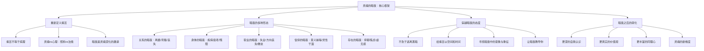

# 《灵魂的暗夜》 - 托马斯·摩尔

> [!info] 书籍信息
> **原书名**：Dark Nights of the Soul: A Guide to Finding Your Way Through Life's Ordeals
> **作者**：Thomas Moore
> **出版**：2004年（Gotham Books）
> **主题**：人生低谷与灵魂转化——将苦难重新理解为灵魂深化的过程

---

## 一、学科坐标定位（400字）

本书位于==深度心理学、灵性传统与生活哲学==的交汇处。托马斯·摩尔曾受过天主教修道士训练（在修道院度过12年），后获得宗教学博士学位，并接受了荣格分析心理学与[[詹姆斯·希尔曼]]原型心理学的训练。这种独特的知识背景使他能将基督教神秘主义、古希腊哲学与现代心理学编织在一起。

> [!note] 学科交叉位置
> - **上游学科**：十字架的圣约翰（"灵魂暗夜"概念的原创者）、基督教神秘主义、荣格分析心理学、希尔曼的原型心理学（"灵魂制造"概念）、存在主义哲学
> - **本学科**：灵魂心理学（Care of the Soul）——摩尔自创的领域，将"灵魂"从纯宗教语境中解放出来，作为心理深度的隐喻
> - **下游应用**：抑郁症的非病理化理解、生命危机咨询、灵性指导、存在主义心理治疗

"灵魂的暗夜"这一概念源自16世纪西班牙神秘主义者十字架的圣约翰（San Juan de la Cruz）。在原始语境中，它描述的是灵修者在通向与神合一的道路上经历的极度黑暗与干涸期。摩尔将这一概念==从修道院带入日常生活==，认为每个人在生命中都会经历自己的"暗夜"——离婚、丧亲、失业、疾病、信仰崩溃——而这些暗夜不是需要被"治愈"的疾病，而是灵魂自我深化的必经之路。

本书最重要的学术贡献是：==它挑战了现代心理学将一切痛苦都病理化的倾向==，提出了一种"照料灵魂"而非"修复心理"的替代范式。

---

## 二、理论框架地图（500字）

> [!abstract] 核心理论支柱
> 1. **灵魂vs心理（Soul vs Psyche）**：摩尔区分了"照料灵魂"（care of the soul）与"治疗心理"（cure of the psyche）。现代心理学倾向于将所有痛苦视为需要被消除的症状，而摩尔认为==某些痛苦是灵魂的自然过程，需要的不是消除而是陪伴和尊重==
> 2. **暗夜不是障碍而是通道**：暗夜体验不是生命出了"故障"，而是灵魂在邀请我们进入更深的层次。就像种子必须在黑暗的土壤中才能发芽，灵魂的某些品质只能在暗夜中生长
> 3. **慢下来的智慧**：现代文化崇尚"快速修复"——吃药、做疗法、"走出来"。摩尔建议相反的态度：==让暗夜按自己的节奏展开==，不急于"变好"，不急于找到"意义"
> 4. **意象思维**：受希尔曼原型心理学影响，摩尔鼓励人们关注暗夜中出现的梦境、意象和象征，将它们视为灵魂的语言，而非需要被"解读"的密码
> 5. **暗夜的集体维度**：不仅个人会经历暗夜，社会和文化也会。战争、瘟疫、社会危机都可以被理解为集体灵魂的暗夜时刻

---

## 三、逐章深度拆解（5000字）

### 第一部分：什么是灵魂的暗夜

#### 重新定义痛苦

> [!tip] DIKW四层提炼
> - **Data**：摩尔引用了十字架的圣约翰的原始文本、古希腊悲剧、浪漫主义诗歌等多种关于人类苦难的经典表达
> - **Information**：现代西方文化对痛苦的默认回应是"消除它"——药物、疗法、自助书籍、正面思维。摩尔认为这种回应虽然有时必要，但如果成为唯一回应，就会切断我们与痛苦所承载的深层信息之间的联系
> - **Knowledge**：摩尔区分了两种痛苦：一种是==需要被治疗的病理性痛苦==（严重抑郁症、创伤后应激障碍等），另一种是==灵魂的自然过程==（生命转折期的困惑、丧失后的悲伤、意义感的重新寻找）。问题是现代文化倾向于将后者也归入前者
> - **Wisdom**：==并非所有的黑暗都是疾病。有些黑暗是深度。==就像海洋的深处没有阳光但有自己的生态系统一样，灵魂的暗夜中有独特的智慧在生长

**费曼式解读**：想象你走进一个很深的山洞。外面阳光明媚，但洞里一片漆黑。你的第一反应是"赶紧打开手电筒！赶紧出去！"但摩尔说：等等。==你的眼睛需要时间适应黑暗。一旦适应了，你会发现洞里有只有在黑暗中才能看到的水晶和萤火虫==。如果你一直开着手电筒或者马上跑出去，你就永远看不到它们。

**反脆弱验证**：这一立场得到了存在主义心理学的支持。维克多·弗兰克尔认为意义往往在苦难中被发现（而非尽管苦难仍被发现）。欧文·亚隆也认为对死亡和有限性的面对是存在性成长的催化剂。但==摩尔的立场需要一个重要的限定：他本人在书中也承认，严重的精神疾病需要专业医疗干预，灵魂的暗夜理论不应该被用来反对必要的治疗==。

**类比迁移**：这与[[侘寂]]（wabi-sabi）美学有内在关联——日本传统美学中对不完美、短暂和残缺之美的欣赏。暗夜不需要被"修复"为光明，它本身就有自己的美学和价值。

---

#### 灵魂vs心理

> [!tip] DIKW四层提炼
> - **Data**：摩尔追溯了"灵魂"（soul）这个词从古希腊（psyche）到基督教中世纪再到现代心理学的演变
> - **Information**：在现代用法中，"心理"（psychology）已经脱离了"灵魂的学问"（psyche-logos）的原始含义，变成了一门以测量和治疗为主的科学。摩尔认为这一转变虽然带来了医疗进步，但也失去了某些东西
> - **Knowledge**：==摩尔所说的"灵魂"不是宗教意义上的不朽实体，而是指人类经验中的深度维度==——那些不能被量化、不能被快速修复、需要时间和空间来展开的内在过程。梦境、想象、感受、直觉、与美和意义的连接——这些都属于"灵魂"的领域
> - **Wisdom**：照料灵魂不是"治愈"——==它是学会与自己的全部经验共存，包括那些不舒服的部分==。这不是消极的接受，而是一种更深层的接纳，允许生命体验在其完整性中展开

**费曼式解读**：假设你的心就像一座花园。心理治疗就像除草——把有害的杂草拔掉。这很有用，有些杂草确实需要拔。但摩尔说的"照料灵魂"更像是==理解你的花园为什么长成这个样子==——为什么这里有阴影、为什么那里有石头——然后学会欣赏整座花园的独特样貌，而不是试图把它改造成杂志封面上的标准花园。

---

### 第二部分：暗夜的多种形态

#### 关系的暗夜

> [!tip] DIKW四层提炼
> - **Data**：摩尔讨论了离婚、背叛、丧亲、友谊破裂等关系丧失的体验
> - **Information**：关系的丧失不仅是失去一个人，更是失去==一种自我定义==。"妻子"不再是妻子，"最好的朋友"不再是最好的朋友——身份的一部分随关系而去
> - **Knowledge**：摩尔认为，关系暗夜的痛苦往往比人们愿意承认的要深。现代文化鼓励"快速走出来"、"他不值得"、"你会遇到更好的"——但==灵魂需要的是充分的哀悼，而不是提前的安慰==
> - **Wisdom**：关系暗夜的礼物是：当旧的身份定义崩塌后，==有空间让一个更真实、更完整的自我浮现==。但这个"浮现"不能被催促——它需要自己的时间

**费曼式解读**：想象你住的房子着火了。你首先需要的不是有人告诉你"没关系，你可以建一座更好的房子"。你首先需要的是==有人允许你站在废墟前哭泣，哀悼你失去的一切==。等你哭够了，悼完了，你自然会开始想"接下来怎么办"。摩尔说的就是这个——不要跳过废墟前哭泣的阶段。

#### 身体的暗夜

> [!tip] DIKW四层提炼
> - **Data**：摩尔讨论了疾病、衰老、身体残障带来的暗夜体验
> - **Information**：身体的暗夜迫使人面对==有限性和死亡性==——这是现代文化最努力回避的主题
> - **Knowledge**：摩尔借鉴了苏珊·桑塔格的《疾病的隐喻》，同时超越了它。他认为疾病不应该被过度象征化（"你的癌症是因为你压抑了愤怒"——这是一种残忍的简化），但身体的暗夜确实邀请人重新审视与身体、与有限性的关系
> - **Wisdom**：==疾病不是惩罚，也不一定是"功课"。但它确实改变了时间的质地==——突然之间，日常生活中被忽视的细节变得珍贵，优先级被重新排列

**反脆弱验证**：关于疾病与心理成长的关系，需要非常谨慎。研究表明确实有所谓的"创伤后成长"（post-traumatic growth），但这不是普遍现象，也不应该被用来美化疾病的残酷。==摩尔的立场是"尊重暗夜"，而非"感谢暗夜"——这是一个重要的区别==。

#### 信仰的暗夜

> [!tip] DIKW四层提炼
> - **Data**：摩尔以十字架的圣约翰的原始灵修经验为起点，扩展到所有形式的信仰危机
> - **Information**：信仰的暗夜不仅发生在宗教信徒身上——任何深层信念的崩塌（对爱情的信念、对公正的信念、对某种意识形态的信念）都可以构成信仰的暗夜
> - **Knowledge**：摩尔区分了两种信仰危机：一种是==浅层信仰的必要崩塌==（像蛇蜕皮一样需要脱掉已经太小的信仰外衣），另一种是==深层存在性的"干涸"==（不是不相信某个具体信条，而是丧失了与生命意义的整体连接感）
> - **Wisdom**：信仰暗夜的悖论是：==正是在信仰似乎完全崩塌的时刻，一种更成熟、更经得起考验的信仰才有可能诞生==。但新信仰不会在旧信仰的废墟上马上生长——中间有一段可能很长的"荒漠期"

**费曼式解读**：想象你一直相信圣诞老人——他给你带来礼物，让你感到世界是安全的。然后有一天你发现圣诞老人不存在。这个打击很大。但==在"没有圣诞老人"和"理解父母的爱是真正的礼物"之间，有一段你什么都不信的空白期==。摩尔说，这段空白期不是敌人——它是你的灵魂在准备接收更深层真相之前的必要空旷。

---

### 第三部分：如何与暗夜相处

#### 不急于逃离

> [!tip] DIKW四层提炼
> - **Data**：摩尔引用了炼金术中的"黑化"（nigredo）阶段——原材料必须先被分解和黑化，才能被转化为金子
> - **Information**：现代文化的"快速修复"倾向使人们在暗夜中几乎立即开始寻找"出路"——自助方法、新的关系、工作变动、药物
> - **Knowledge**：摩尔的核心建议是==给暗夜以空间和时间==。不是被动地"忍受"，而是主动地"栖居"（inhabit）——以好奇而非恐惧的态度探索黑暗中有什么
> - **Wisdom**：==急于从暗夜中"走出来"可能只是将自己推入了一个更浅的光明==。真正穿越暗夜的人不是逃离了黑暗，而是在黑暗中发现了一种新的"看见"能力

**费曼式解读**：你有没有在完全漆黑的房间里待过？刚进去的时候你什么都看不见，很害怕。但如果你安静地待着，不乱动，==大约20分钟后你的眼睛会适应——你开始看到轮廓、影子、微弱的光==。摩尔说暗夜也是这样。如果你一直急着找灯开关，你永远不会发展出在黑暗中看见的能力。

#### 意象与象征

> [!tip] DIKW四层提炼
> - **Data**：摩尔引用了大量文学、艺术和梦境中的暗夜意象——洞穴、海底、冬天、新月
> - **Information**：受希尔曼原型心理学影响，摩尔认为==暗夜中的意象不是需要被"翻译"成理性语言的密码，而是灵魂自身的表达方式==
> - **Knowledge**：关注暗夜中的意象意味着：留意你的梦境、你被什么样的音乐/电影/故事吸引、你的身体在告诉你什么。==这些都是灵魂在用自己的语言与你对话==
> - **Wisdom**：意象思维是与暗夜相处的关键工具——它允许你与痛苦建立一种非对抗性的关系。你不是在"对抗"黑暗，而是在"聆听"黑暗

**反脆弱验证**：意象工作在心理治疗中有充分的理论和临床支持——荣格的积极想象、完形治疗的意象对话、EMDR中的意象处理等都是例证。但需要注意，对于严重创伤后应激的个体，无引导的意象探索可能导致再创伤化，因此==应在专业支持下进行==。

---

### 第四部分：暗夜之后

#### 转化而非恢复

> [!tip] DIKW四层提炼
> - **Data**：摩尔讨论了穿越暗夜后的人们的共同特征
> - **Information**：穿越暗夜的人往往不是"恢复原状"，而是==变成了另一种版本的自己==。他们往往更安静、更深沉、不再那么需要证明什么、对他人的痛苦更有耐心
> - **Knowledge**：摩尔特别强调，暗夜的转化不是一个"升级"——它不是让你变得"更好"，而是让你变得==更完整==。完整包含了光明也包含了黑暗、包含了力量也包含了脆弱
> - **Wisdom**：==暗夜不会让你变得无坚不摧，它会让你变得更深。==深度不是硬度——一个深的人可以同时是柔软的和坚韧的

**费曼式解读**：一棵树经历了暴风雨之后，不会"恢复原状"。它的根会扎得更深，它的树干会有风暴留下的痕迹。它不是"和以前一样好"——==它是一棵不同的树了，一棵经历过风暴的树，一棵知道什么是风暴的树==。

---

## 四、认知偏差/效应清单（800字）

### 1. 积极性偏差（Positivity Bias）
现代文化对积极情绪的过度推崇使人们难以允许自己"不好"。本书直接挑战了这一偏差——==暗夜是正常的、有价值的，你不需要24小时保持积极==。

### 2. 快速修复偏差（Quick-Fix Bias）
期望所有问题都有快速解决方案。摩尔的核心主张就是对抗这一偏差——有些生命过程需要==自己的时间节奏==，催促只会带来更浅的结果。

### 3. 病理化偏差
将所有痛苦体验都归类为"需要治疗的症状"。摩尔区分了病理性痛苦与灵魂的自然过程，提醒我们==不是每一滴眼泪都是疾病的标志==。

### 4. 控制幻觉（Illusion of Control）
认为"如果我做对了所有事情，就不会有暗夜"。摩尔的立场是：暗夜是人类生存的内在组成部分，没有人可以通过"正确的生活方式"完全避免它。

### 5. 灵性旁路（Spiritual Bypassing）
用灵性概念（"这是我灵魂的功课"）来回避真正面对痛苦。摩尔虽然使用灵性语言，但他强调的是==面对==暗夜而非==解释==暗夜。

### 6. 比较偏差
"别人的痛苦比我的更大，我没资格难过"。摩尔认为==每个灵魂的暗夜都有其独特的深度和意义==，不存在痛苦的等级比较。

### 7. 意义强制偏差
过早地为痛苦赋予"意义"——"这发生是为了教会我某某"。==有时候痛苦的意义需要很长时间才会显现，有时候它可能永远不会显现==。强制赋予意义本身就是一种逃避。

---

## 五、自我诊断工具（500字）

> [!question] 暗夜体验自评
> 回答以下问题来评估你当前的体验：
>
> **暗夜识别**
> 1. 我目前是否正在经历一种深层的、不容易用具体原因解释的痛苦或空虚感？
> 2. 我以前有效的应对方式（忙碌、社交、购物、理性分析等）是否不再管用？
> 3. 我是否感觉自己的某种旧身份正在崩塌，但新身份尚未形成？
>
> **回应方式检查**
> 4. 面对这种体验，我是否在急于"修复"而非允许它存在？
> 5. 我是否有足够的空间（时间、安静、支持）来与这种体验共处？
> 6. 我是否能区分"需要专业帮助的症状"和"灵魂自然过程中的痛苦"？
>
> **重要区分**：
> - 如果你有自伤/自杀的想法、严重的功能受损（无法工作/照顾自己）、或长期（超过两周）的极度低落，==请首先寻求专业心理健康帮助==
> - 灵魂的暗夜理论不是拒绝治疗的理由

---

## 六、批判性审视（600字）

### 本书的优势

1. **去病理化的勇气**：在药物化和诊断化日益盛行的时代，摩尔为痛苦体验提供了一种非病理性的理解框架，这对很多人是一种深刻的解放
2. **文化深度**：摩尔的写作融合了西方文学、神话、宗教和心理学的丰富传统，每一章都像一篇精致的人文学科散文
3. **态度示范**：本书本身就示范了它所倡导的态度——不急不躁、尊重深度、允许模糊
4. **可读性**：尽管内容深刻，但摩尔的文笔温暖亲切，不居高临下

### 本书的局限

1. **与临床抑郁的界限模糊**：尽管摩尔做了区分的尝试，但==灵魂的暗夜与临床抑郁症之间的界限在实践中很难清晰划定==。对于某些读者来说，这本书可能成为推迟就医的借口
2. **阶层特权**："给暗夜以时间和空间"的建议假设读者有时间和空间——有余暇来冥想和反思。对于经济压力巨大、没有支持系统的人来说，这种建议的可行性大打折扣
3. **过度文学化**：有时摩尔对文学和神话的引用过多，使核心观点被稀释
4. **缺乏具体方法**：相比于"如何理解暗夜"，"如何具体应对暗夜"的指导较少。这可能是有意为之（因为摩尔反对"快速修复"），但对于正处于痛苦中的读者可能不够

### 我不确定的部分

关于摩尔在本书中是否系统性地讨论了特蕾莎修女晚年的信仰暗夜（特蕾莎修女的私人信件在2007年出版后引起轰动，揭示了她长达数十年的灵性干涸期），我不确定。本书出版于2004年，而特蕾莎修女信件的公开出版在2007年，因此摩尔可能在其他著作或后续版本中讨论了这一案例，但在本书初版中可能未涉及。

> [!warning] 使用边界
> 本书不能替代对严重心理疾病的专业治疗。如果你正在经历严重抑郁、焦虑或有自伤倾向，请首先寻求精神科医生或心理治疗师的帮助。==灵魂的暗夜理论适用于生命转折期的正常性困境，而非精神疾病的诊断和治疗==。

---

## 七、行动改变指南（500字）

### 如果你正在暗夜中

1. **暂停"修复"冲动**：注意自己是否在急于"做点什么"来消除不适。尝试每天留出30分钟，什么都不做，只是与当下的感受共处
2. **创建暗夜日记**：不是为了分析或寻找意义，而是为了==记录暗夜中的意象、梦境、直觉==。让它们存在于纸上，不需要理解
3. **寻找你的"洞穴"**：一个物理上安全、安静、不被打扰的空间。暗夜需要一个容器
4. **区分需要帮助与需要空间的时刻**：如果痛苦严重影响了日常功能，寻求专业帮助。如果是可承受的但深层的不安，给自己更多空间

### 如果你在陪伴暗夜中的他人

1. **不要急于安慰**："一切都会好起来的"有时是我们自己对他人痛苦感到不适时的自我安慰
2. **陪伴而非建议**：==有时候最有力量的话是"我在这里"，而非"你应该怎么做"==
3. **尊重他人的节奏**：不要以你的标准来判断他人"应该"多快走出暗夜

### 长期的灵魂照料习惯

- 每天留出安静的"灵魂时间"——不是冥想练习，不是自我改善项目，只是==与自己的深处共处的时间==
- 培养与美、自然、音乐、文学的日常接触——这些是灵魂的食物
- 接受"不知道答案"的状态——==不确定性不是问题，它是灵魂的栖居之地==

---

## 八、费曼终极检验（400字）

> [!success] 用最简单的话解释这本书
> **如果我要向一个12岁的孩子解释这本书，我会这样说：**
>
> 你知道有时候人会很难过吗？不是因为某件具体的坏事，而是一种深深的、说不清楚的难过？大人通常会告诉你"别想太多"、"出去玩玩就好了"、"吃点好的"。
>
> 这本书说的是：==有些难过不需要被"治好"==。它不是病。它更像是冬天——树叶掉了，外面很冷，看起来什么都"死"了。但在土壤下面，种子正在准备发芽。如果你试图跳过冬天，直接进入春天，种子就不会有足够的时间准备。
>
> 所以这本书的建议很简单：==当你遇到人生中的"冬天"时，不要急着跑。==允许自己在冬天里待一会儿。找一个温暖的地方，喝杯热水，安静地等待。注意你做的梦，注意什么东西让你有感觉。
>
> 当春天来的时候——它会来的——你不会只是"恢复正常"。你会发现自己变了：更安静了，更深了，更能理解别人的难过了。
>
> 但这里有一个很重要的事情：==如果你的"冬天"太冷了——冷到你想伤害自己或者完全无法正常生活——那就需要去找大人帮忙==。灵魂的冬天和生病是不一样的，生了病要看医生。
>
> 这本书教你的就是：==学会区分"灵魂的冬天"和"生病"，然后以不同的方式对待它们==。
