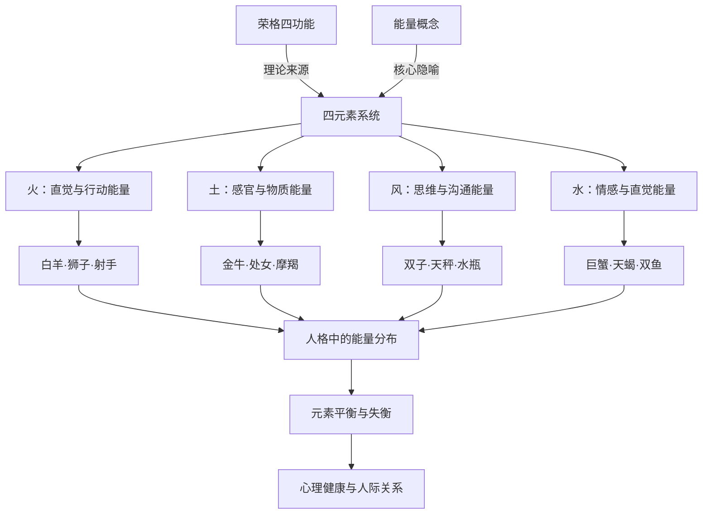

## 一、学科坐标定位

> [!info] 学科交叉位置
> 本书位于==传统占星学元素理论==与==当代人格心理学==的交叉地带，是将占星学的四元素（火、土、风、水）系统化为一套人格心理学语言的经典之作。

史蒂芬·阿若优是美国占星学家和心理咨询师，他的独特贡献在于将占星学中最古老的分类系统——四元素——从神秘学传统中提取出来，赋予其现代心理学的解释。本书的核心论点是：四元素不仅仅是占星学的分类工具，它们描述的是四种基本的==心理能量模式==，这些模式决定了一个人感知世界、处理信息和应对生活的基本方式。

在学科谱系中，阿若优承接了荣格对四种心理功能（思维、情感、感觉、直觉）的分类——荣格本人就曾将这四种功能与四元素做过类比。阿若优将这一类比发展为一套完整的人格分析系统。与[[丽兹·格林]]的深度心理学取向不同，阿若优的方法更接近人本主义心理学——他更关注的是如何帮助个体理解和整合自己的元素平衡，而非深挖无意识的创伤根源。

本书不需要太多占星学前置知识，但需要读者愿意接受"能量"这个在科学语境下含义模糊的概念作为阿若优理论框架的核心隐喻。

## 二、理论框架地图

阿若优的理论框架可以概括为：

**核心主张：** 每个人出生星盘中行星在四元素星座的分布，揭示了其心理能量的基本配比。某些元素可能"过多"（overemphasis），某些可能"缺乏"（lack），这种不平衡塑造了个体的核心心理挑战。

**四元素对应关系：**
- ==火元素==（白羊、狮子、射手）：对应荣格的"直觉功能"——行动冲动、热情、信念、未来导向
- ==土元素==（金牛、处女、摩羯）：对应荣格的"感觉功能"——务实、身体感知、物质安全、现实导向
- ==风元素==（双子、天秤、水瓶）：对应荣格的"思维功能"——概念、沟通、社交、理念导向
- ==水元素==（巨蟹、天蝎、双鱼）：对应荣格的"情感功能"——感受、共情、想象、情感导向

**关键操作：** 分析一个人星盘中行星的元素分布（特别是太阳、月亮、上升、水星、金星、火星这些个人行星），确定元素的"强项"和"弱项"，进而理解这个人的心理优势和盲区。

## 三、逐章深度拆解

### 第一部分：能量的概念与四元素哲学

> [!note] DIKW四层提炼
> - **Data**：四元素理论可追溯至古希腊（恩培多克勒），经由中世纪占星学传入现代，在印度阿育吠陀和中国五行理论中也有平行版本
> - **Information**：阿若优将四元素重新定义为"能量模式"而非"物质元素"——火不是火焰本身，而是"点燃、推动、激发"的心理能量
> - **Knowledge**：这种从物质到能量的转换，使四元素理论从古代自然哲学变成了一种心理类型学工具
> - **Wisdom**：所有伟大的人格类型学（无论是荣格类型、MBTI、还是四元素）都是对人类多样性的有限逼近——它们的价值在于提供地图，而地图永远不等于领土

**费曼式解读：** 想象你在观察四个人面对同一个问题——比如"搬家"。火元素主导的人立刻行动："走，周末就搬！"土元素主导的人关注实际："预算多少？新房子面积够吗？"风元素主导的人思考分析："让我研究一下各个社区的优劣，做个对比表"。水元素主导的人关注感受："离开这个住了五年的地方，我会不会很伤感？"

这四个人面对同一个问题，但他们"看到"的问题完全不同——因为他们的心理能量配比不同。阿若优的核心洞见就是：四元素不是在描述你是谁，而是在描述你==通过什么方式==与世界互动。

**反脆弱验证：** 阿若优使用"能量"一词来描述四元素，这个选择既是他的理论优势也是弱点。优势在于它避免了将四元素物质化；弱点在于"能量"在心理学语境中缺乏精确定义。阿若优显然意识到了这一点，他在书中多次强调这是一种"隐喻性的能量"而非物理学意义上的能量，但并非所有读者都会注意到这一重要区分。

**类比迁移：** 阿若优的四元素系统与MBTI的四维度（外倾/内倾、感觉/直觉、思维/情感、判断/知觉）有结构相似性——两者都将人格多样性简化为有限维度的组合。区别在于MBTI有（尽管争议性的）心理测量学支撑，而四元素系统的分类依据是出生星盘。

### 第二部分：火元素——直觉与行动

> [!note] DIKW四层提炼
> - **Data**：火元素星座为白羊座、狮子座、射手座；分别代表开创之火、固定之火、变动之火
> - **Information**：火元素主导的人以行动、热情、信念和身份认同为核心驱动力，他们通过"做"来理解世界
> - **Knowledge**：火元素过多导致冲动、自我中心、缺乏耐心和对他人感受的忽视；火元素缺乏导致缺乏动力、自信低下、难以发起行动
> - **Wisdom**：火的本质是转化——它将可能性变为现实，将想法变为行动，但不加约束的火会烧毁它所触及的一切

**费曼式解读：** 火是所有元素中最不愿等待的。火元素强的人有一种内在的"必须行动"的冲动——他们相信自己，相信未来，相信"先做了再说"。白羊座的火是==点火器的火==——瞬间点燃，开创新局面。狮子座的火是==壁炉的火==——持续燃烧，需要被看见和欣赏。射手座的火是==篝火的火==——照亮远方，追寻意义和真理。

阿若优特别指出：火元素缺乏的人（星盘中很少行星在火象星座）往往在自信和主动性方面挣扎。他们可能需要通过有意识地培养"行动的勇气"来补偿这种缺失——而非仅仅依赖他们强势的元素。

**反脆弱验证：** 阿若优对火元素的描述生动且具有直觉认同感，但需警惕巴纳姆效应——"热情""冲动""自信"这些描述足够宽泛，以至于几乎任何活跃的人都可能觉得适用。更严格的检验应该是：火元素主导和非火元素主导的人在行为上是否存在==系统性==差异？阿若优没有提供这类实证数据。

**类比迁移：** 火元素的描述与心理学中的"趋近动机系统"（Approach Motivation System）有对应——该系统驱动个体主动接近目标、奖赏和新体验，与多巴胺系统的活跃度相关。

### 第三部分：土元素——感官与物质

> [!note] DIKW四层提炼
> - **Data**：土元素星座为金牛座、处女座、摩羯座
> - **Information**：土元素主导的人以物质现实、身体感知和实际成果为核心关注，他们通过"五感"来理解世界
> - **Knowledge**：土元素过多导致过度物质化、僵化、恐惧变化、过分关注安全；土元素缺乏导致与身体脱节、不切实际、难以完成任务和维持日常结构
> - **Wisdom**：土教会我们尊重限制——不是所有限制都是枷锁，有些限制是容器，正是它们赋予生命以形状

**费曼式解读：** 如果火元素问的是"可能性在哪里？"，土元素问的是"现实是什么？"土元素强的人有一种与物质世界的天然亲和力——他们信任可以触摸、测量、证实的东西。金牛座的土是==花园的土==——肥沃、感性、追求美和舒适。处女座的土是==工匠的土==——精细、有序、追求完善。摩羯座的土是==基岩==——坚固、持久、追求结构和成就。

阿若优做了一个重要的观察：==土元素缺乏的人往往有一种"不接地"的感觉==——他们可能才华横溢但总是难以将想法落地，可能有很多计划但缺乏执行的耐心和纪律。这类人需要有意识地发展与身体和物质世界的关系。

**反脆弱验证：** 阿若优对土元素缺乏的描述与临床心理学中的某些观察有交叉——比如解离症状（与身体脱节）、注意力问题（难以完成任务）。但这种交叉是否证明四元素分类的有效性，还是仅仅说明不同框架可以描述相似的现象，是需要区分的。

**类比迁移：** 土元素的心理学含义与正念心理学中的"具身认知"（Embodied Cognition）有共鸣——两者都强调身体感知不是心理生活的附属品，而是认知和情感的基础。

### 第四部分：风元素——思维与沟通

> [!note] DIKW四层提炼
> - **Data**：风元素星座为双子座、天秤座、水瓶座
> - **Information**：风元素主导的人以概念、关系和沟通为核心关注，他们通过"思考"来理解世界
> - **Knowledge**：风元素过多导致过度理智化、情感疏离、焦虑（因为头脑永远不会停止分析）；风元素缺乏导致沟通困难、社交适应问题、难以客观看待自己的处境
> - **Wisdom**：风的本质是连接——思想连接概念，语言连接人，但风也可以成为一种逃避——用头脑替代心灵，用理论替代体验

**费曼式解读：** 风是唯一"看不见"的元素。你能看见火焰，能触摸土地，能感受水流，但风只能通过它的效果被感知——树叶在动，所以你知道风在吹。风元素强的人也有类似的特质：他们的力量在于连接、传递、分析，但他们本身有时显得"不在那里"——他们更多地活在头脑的世界里，而非身体或情感的世界里。

双子座的风是==蜻蜓的飞行==——快速、多变、好奇。天秤座的风是==天平的支点==——平衡、关系、美学。水瓶座的风是==高空的风==——超越个人视角，关注集体和未来。

阿若优特别强调：==风元素过多的人最常见的心理困扰是焦虑==。因为他们的头脑不断分析、比较、预测，很难真正"停下来"，这导致一种持续的内在紧张。

**反脆弱验证：** 阿若优将焦虑与风元素过多联系起来，这个观察有一定的临床共鸣（过度思考确实是焦虑的核心特征），但作为一个因果性主张，它需要比个案观察更强的证据支持。

**类比迁移：** 风元素与认知心理学中的"执行功能"概念有对应——包括工作记忆、认知灵活性、抽象思维等。"风元素过多"类似于认知心理学中所说的"过度认知控制"——用理性分析替代直觉和情感的倾向。

### 第五部分：水元素——情感与直觉

> [!note] DIKW四层提炼
> - **Data**：水元素星座为巨蟹座、天蝎座、双鱼座
> - **Information**：水元素主导的人以情感、直觉和人际连接为核心关注，他们通过"感受"来理解世界
> - **Knowledge**：水元素过多导致情绪被淹没、边界模糊、过度依赖他人、容易受他人情绪影响；水元素缺乏导致情感表达困难、共情能力弱、内在世界贫乏
> - **Wisdom**：水教会我们"接纳"——不是所有问题都需要解决，有些痛苦只需要被感受，有些经历只需要被允许流过你

**费曼式解读：** 水是所有元素中最难"看清"的——因为水没有自己的形状，它适应容器的形状。水元素强的人有一种天然的"渗透力"——他们能感受到房间里的情绪氛围，能直觉地知道他人没有说出口的感受。

巨蟹座的水是==泉水==——温暖、滋养、保护性的。天蝎座的水是==深海==——幽暗、强烈、探索隐藏的真相。双鱼座的水是==海洋==——无边、融合、模糊一切边界。

阿若优做了一个对咨询实践极具价值的观察：==水元素缺乏的人往往不知道自己"感觉如何"==。他们可能非常聪明（风强）或非常务实（土强）或非常活跃（火强），但当被问到"你现在感受是什么？"时，他们真的不知道。这不是因为他们没有情感，而是因为他们缺乏感知和命名自己情感的"内在器官"。阿若优建议这类人通过冥想、音乐、接触水（游泳、泡澡）等方式来有意识地激活水元素。

**反脆弱验证：** 阿若优对水元素缺乏的描述与心理学中的"述情障碍"（Alexithymia）概念高度吻合——述情障碍指的正是无法识别和描述自身情绪状态的困难。但两者的因果解释完全不同：心理学将述情障碍归因于早期依恋模式和神经发育因素，阿若优归因于出生星盘的元素分布。两种解释是否互补还是互斥，是一个有趣的开放问题。

**类比迁移：** 水元素的心理功能与心理学中的"情绪智力"（Emotional Intelligence）概念有直接对应——两者都涉及感知、理解和管理情绪的能力。丹尼尔·戈尔曼的情商理论可以被视为水元素心理学意义的现代实证版本。

### 第六部分：元素的整合与平衡

> [!note] DIKW四层提炼
> - **Data**：大多数人的星盘不是四元素均匀分布的，通常有一到两个元素偏强，一到两个偏弱
> - **Information**：元素的失衡不是"缺陷"，而是"倾向"——它指出你最自然的能量模式以及最需要有意识发展的领域
> - **Knowledge**：真正的心理成长不是将弱势元素变成强势元素（这通常不现实），而是学会在需要时有意识地"借用"弱势元素的能量
> - **Wisdom**：完整的人不是四元素均匀的人，而是能够灵活运用所有元素的人——即使某些元素对他来说不那么自然

**费曼式解读：** 想象你有四种颜料——红、黄、蓝、绿。大多数人天生擅长用其中一两种颜料画画。你可能是一个"红色（火）和蓝色（水）画家"——你画出的作品充满热情和情感，但缺少细节（土）和思辨深度（风）。阿若优的建议不是"变成一个四色均匀的画家"——这既不现实也不必要。他的建议是：知道自己的调色板倾向什么，在需要时有意识地拿起不常用的颜料。

**反脆弱验证：** 阿若优的"整合"建议在咨询实践中直觉上说得通，但缺乏系统的效果验证。一个弱火元素的人通过有意识的练习（比如体育运动、主动表达）是否真的能改善其"缺火"的心理特征？阿若优基于临床经验给出了肯定的回答，但这仍属于个案级别的证据。

**类比迁移：** 阿若优的元素整合理论与荣格的"个体化"（Individuation）过程有直接关联——荣格认为心理成长的核心是整合被忽视的心理功能（inferior function）。阿若优的"发展弱势元素"本质上是荣格个体化理论的占星学版本。

## 四、认知偏差/效应清单

> [!warning] 阅读本书时需警惕的认知偏差

1. **巴纳姆效应**：四元素的描述足够宽泛，以至于大多数人都能在每个元素中找到自己。关键检验是：你是否在你的==强势元素==而非在所有元素中看到了更多的自己？

2. **确认偏误**：如果你已经知道自己的星盘元素分布，你会倾向于只注意生活中与之吻合的证据。

3. **本质主义偏误（Essentialism Bias）**：将元素特质视为人的"本质"而非"倾向"，导致固化的自我认知（"我就是一个缺土的人，所以我永远做不好实际的事"）。

4. **二元对立陷阱**：将元素分为"好的"和"坏的"——比如认为火和风比土和水更"高级"。阿若优明确反对这种等级化。

5. **归因错误（Attribution Error）**：将所有行为都归因于元素分布，而忽略情境、教育、文化等其他重要因素。

6. **忽视基准率（Base Rate Neglect）**：仅凭一个人的元素分布就对其人格做出判断，而忽略星盘中的其他重要因素（相位、宫位等）。

7. **光环效应**：如果阿若优对你的强势元素的描述让你觉得"非常准确"，你可能会不加审查地接受他对弱势元素的所有说法。

8. **可得性启发**：阿若优生动的案例描述可能让读者高估四元素分类在日常生活中的预测精度。

## 五、自我诊断工具

> [!tip] 你对四元素理论的理解深度

- [ ] 你能否不依赖星盘，仅凭与一个人的互动来初步判断其主导元素？
- [ ] 你能否描述每个元素"过多"和"缺乏"时各自的心理表现？
- [ ] 你能否解释为什么阿若优不建议追求四元素的"绝对平衡"？
- [ ] 你能否区分四元素理论与荣格四功能理论之间的对应和差异？
- [ ] 你能否对阿若优的"能量"概念提出至少一个认识论层面的质疑？

**评分标准：**
- 5个全能：你已内化了四元素框架并具备批判视角
- 3-4个：框架掌握良好，可在实践中应用
- 1-2个：建议重读元素失衡章节
- 0个：建议从基础占星学星座分类开始学习

## 六、批判性审视

> [!danger] 本书的局限与可商榷之处

**优势：**
- 将古老的四元素理论转化为实用的心理分析工具
- 文字平实、案例丰富、可操作性强
- 对元素失衡的描述在咨询实践中有直观价值

**局限：**

1. **"能量"概念的认识论地位。** 阿若优的整个理论建立在"心理能量"这个概念之上，但他从未严格定义什么是"心理能量"，也没有说明它与物理学中的能量概念有何关系（或无关系）。这使得整个理论框架的科学地位模糊。

2. **缺乏实证验证。** 四元素分类的心理学有效性从未经过严格的心理测量学检验。虽然个案报告和临床印象支持其有用性，但这不足以构成科学证据。

3. **过度简化的风险。** 将人格简化为四种能量的配比，可能遗漏了人格的许多重要维度——比如依恋模式、创伤历史、文化背景等。

4. **与荣格四功能理论的对应关系有争议。** 阿若优将四元素直接对应荣格的四种心理功能，但这种对应是否精确，荣格学者之间存在不同意见。

5. **忽略了元素间的互动效应。** 一个火和水都很强的人的心理状态，不能简单地通过"加法"来理解——火和水的共存会产生独特的张力（蒸汽），这种互动效应在阿若优的框架中讨论不够充分。

## 七、行动改变指南

> [!success] 基于本书的实践建议

1. **元素审计：** 查看你的星盘，统计太阳、月亮、上升、水星、金星、火星在四元素中的分布。确定你的"强势元素"和"弱势元素"。

2. **元素日志：** 每天记录你最自然运用的元素能量（今天我主要在"思考"还是"感受"？在"行动"还是"计划"？），一周后检查模式。

3. **弱势元素的刻意练习：**
   - 缺火：每天做一件"不思考就行动"的小事
   - 缺土：建立一个简单的身体感知练习（散步时专注于脚底触地的感觉）
   - 缺风：每天尝试从对立面思考一个你坚信的观点
   - 缺水：每天花五分钟闭眼，问自己"我现在感觉如何？"并尝试命名这种感觉

4. **人际关系元素分析：** 观察你与亲密伙伴的元素互补或冲突模式，理解你们之间的某些紧张可能源于元素差异而非个人过错。

5. **搭配阅读：** 将本书与[[土星：从新观点看老恶魔]]搭配，前者提供横向的元素分析，后者提供纵向的土星深度分析。

## 八、费曼终极检验

> [!abstract] 如果只用三段话向外行解释这本书

**第一段（是什么）：** 占星学把十二个星座分成四组，每组三个：火象（白羊、狮子、射手）、土象（金牛、处女、摩羯）、风象（双子、天秤、水瓶）、水象（巨蟹、天蝎、双鱼）。阿若优这本书的核心观点是：这四种分类不仅仅是天文学的分类，它们描述了四种基本的心理能量模式——火是行动和热情，土是务实和踏实，风是思考和沟通，水是感受和共情。

**第二段（核心论点）：** 每个人的出生星盘中，行星在这四种元素中的分布不同。有人火特别多、水特别少，有人正好相反。阿若优认为这种分布揭示了你最自然的心理运作方式和最需要发展的领域。比如一个"缺水"的人可能很聪明很务实，但很难理解自己的感受和共情他人的情绪。理解自己的元素配比，就像理解自己的手习惯（左手还是右手）——它不决定你能做什么，但它决定了什么对你来说更自然。

**第三段（为什么重要）：** 这本书的价值在于它提供了一种非常直觉、易于理解的人格自我认知工具。四元素比十二星座更简单也更深刻——它直接指向人与世界互动的最基本方式。当然，像所有类型学一样，它也是一种简化。真正的人比任何四元素配比都要复杂。阿若优自己也清楚这一点，所以他在书中强调：元素分析是理解自己的起点，而非终点。
