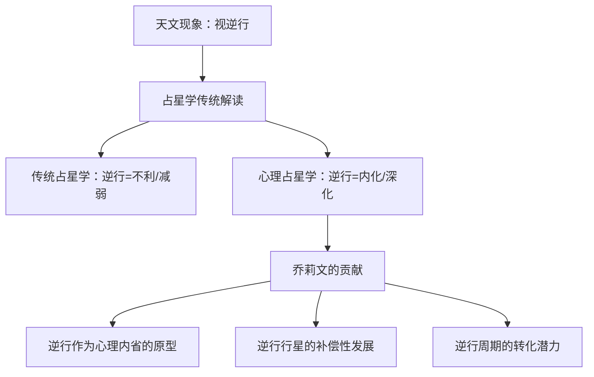
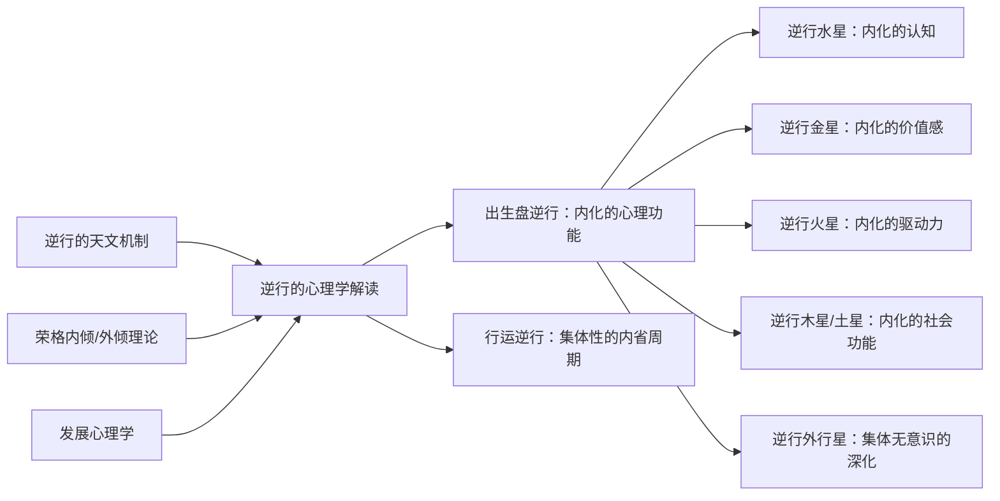

# 《逆行行星》读书笔记

> [!info] 基本信息
> - 作者：艾琳·乔莉文（Erin Sullivan）
> - 主题：行星逆行的占星学意义，心理层面的内省与转化
> - 方法论框架：[[费曼学习法]] + [[DIKW金字塔]] + [[反脆弱方法论]]

---

## 一、学科坐标定位（400字）

本书是占星学中==行星逆行==（Planetary Retrograde）主题的权威专著。行星逆行是一种视觉现象——从地球观察，行星在某些时期看起来在黄道上向后移动。这不是真实的天文运动，而是轨道几何造成的视觉效果。然而，在占星学传统中，逆行被赋予了重要的象征意义。

> [!important] 学科定位
> 乔莉文的工作在逆行研究中具有开创性地位。在她之前，大多数占星学文本对逆行的处理较为简略，通常仅限于"逆行行星力量减弱"或"逆行期间不宜签合同"这类实用建议。乔莉文将逆行提升为一个==完整的心理学主题==，将其与荣格心理学中的内倾（introversion）、阴影工作（shadow work）和个体化过程（individuation）联系起来。

本书的独特价值在于：它是少数从==心理深度==而非仅从预测角度讨论逆行的著作。乔莉文认为，出生星盘中的逆行行星代表着心理功能的==内化==——该功能不是向外运作的，而是首先向内运作，这既是挑战（不符合外部世界的期待），也是天赋（深度的内在加工能力）。

---

## 二、理论框架地图（500字）

> [!abstract] 核心理论假设
> 1. 逆行行星代表的心理功能并非"减弱"，而是==方向改变==——从外向变为内向
> 2. 出生盘中的逆行行星暗示该功能在早期发展中经历了某种==延迟或内化==，需要通过内在加工才能成熟
> 3. 逆行行星的表达往往是==非常规的==——它不按照社会期待的方式运作，因此可能在早期被误解或低估
> 4. 行运逆行（transit retrograde）代表集体层面的==反思与修正==周期
> 5. 逆行行星有时展现出一种==补偿性的深度==——因为向内运作，它可能发展出比顺行行星更深刻的洞察力

乔莉文的方法论融合了三种传统：==天文学观测==（精确描述逆行的天文机制和时间周期）、==荣格分析心理学==（内倾、阴影、个体化等概念）、以及==临床案例观察==（来自她多年的占星咨询实践）。

她特别强调一个关键区分：==出生盘逆行==与==行运逆行==具有不同的心理意义。出生盘中的逆行行星是个体心理结构的一部分——一种终身性的内在加工倾向；而行运逆行是一种阶段性的集体节奏——邀请所有人在特定领域进行反思和调整。

---

## 三、逐章深度拆解（5000字）

### 第一部分：逆行的天文学基础与哲学框架

> [!note] DIKW四层提炼

**Data（数据层）：**
行星逆行的天文学机制：内行星（水星、金星）在其轨道上超过地球时会出现逆行现象，类似于两列同向列车中较快的一列从较慢的一列旁边经过时，较慢的列车看起来在"后退"。外行星（火星及以远）则是在地球"超过"它们时出现逆行。每颗行星都有其固定的逆行周期和频率——水星每年逆行约三次，每次约三周；而冥王星每年逆行约五个月。

**Information（信息层）：**
乔莉文将逆行的天文学特征转化为心理学隐喻：逆行期间，行星与地球之间的关系发生了==视角反转==。她将此类比为心理学中的"退行"（regression）概念——不是退步，而是==回到更早的发展阶段以重新加工未完成的议题==。

逆行行星在黄道上"重走"一段已经走过的路。乔莉文认为这映射了心理过程中的==反刍与深化==——我们回到已经经历过的主题，但带着新的视角和更深的理解。

**Knowledge（知识层）：**
乔莉文建立了一个重要的区分框架：

- ==顺行==（Direct）：心理功能向外表达，与环境互动，追求外在目标
- ==逆行前减速==（Stationary Retrograde）：功能开始"刹车"，外在效率降低，内在觉察升高
- ==逆行==（Retrograde）：功能转向内在，反思、重新评估、修正
- ==逆行后减速==（Stationary Direct）：内在加工完成，准备重新外化
- ==恢复顺行==（Direct）：带着内省的收获重新向外表达

这个五阶段模型不仅适用于理解行运逆行的心理节奏，也适用于理解任何心理功能的==内省-外化循环==。

**Wisdom（智慧层）：**
逆行的深层智慧在于：==不是所有有价值的运动都是向前的==。在一个崇尚进步、效率和外向性的文化中，逆行提醒我们：退后、反思、重新审视是同样必要的心理功能。试图永远"向前"而不回头，会导致未经加工的经验累积成心理负担。

> [!tip] 费曼式解读
> 想象你在一条路上往前走，突然你停下来，转身回走了一段。旁边的人可能会说"你在浪费时间"或"你走错方向了"。但实际上你是回去捡一样之前掉落的重要东西——也许是一把钥匙，没有它你无法打开前方的门。行星逆行就是这样：它看起来是"后退"，实际上是回去处理之前忽略的重要事项。出生盘中有逆行行星的人，天生就有一种"先向内走再向外走"的心理模式——这不是缺陷，而是一种不同的加工方式。

---

### 第二部分：出生盘中的逆行内行星

> [!note] DIKW四层提炼

**水星逆行（出生盘）：**

**Data：** 约有19%的人出生时水星处于逆行状态。

**Information：** 出生盘水星逆行的人，其认知和沟通功能==首先向内运作==。乔莉文描述这类人常有的体验：想法需要在内心"消化"很久才能清晰表达；可能在即兴表达中显得笨拙，但在书面表达或经过深思熟虑后却格外深刻。童年时期可能被标记为"反应慢"或"不够机灵"，但这种"慢"实际上是==深度加工==的表现。

**Knowledge：** 水星逆行的人往往发展出一种==非线性的思维方式==——他们可能不按照标准的逻辑顺序思考，而是在不同的思维层面之间跳跃和连接。这种思维方式在创造性领域和深度研究中可能是极大的优势，但在要求快速响应和标准化表达的环境中可能被视为不足。

乔莉文还指出，水星逆行的人可能对==语言的深层含义==特别敏感——他们不仅听到别人说了什么，还能感知到言外之意和未说出口的东西。

**Wisdom：** 水星逆行的教导是：==深度理解比快速反应更有价值==。在一个奖赏即时回应的文化中，水星逆行的人需要学会信任自己的节奏，而不是试图模仿顺行水星的速度。

---

**金星逆行（出生盘）：**

**Data：** 金星大约每18个月逆行一次，每次约40天。出生盘中金星逆行相对少见。

**Information：** 金星逆行指向==内化的价值感和情感需求==。乔莉文认为，金星逆行的人在关系和自我价值方面有一种"先向内寻找"的倾向。他们可能不太容易直接表达情感需求，也不太容易在传统的关系模式中感到满足。

**Knowledge：** 金星逆行在早期表现中常见的模式：
- 对==自我价值==的深度质疑——不是表面的不自信，而是一种存在层面的追问："我真的值得被爱吗？"
- 关系模式中的==非常规性==——可能被非主流的关系形式或审美所吸引
- 一种==延迟绽放==的倾向——在价值感和关系领域，可能比同龄人晚成熟，但一旦成熟，可能达到异常的深度

**Wisdom：** 金星逆行的深层教导与《内行星》中金星的主题呼应但更进一步：==不仅真正的价值感不能从外部获取，金星逆行的人被特别要求首先在内心建立与自身价值的关系==，然后才能真正地与他人建立有意义的联系。

---

**火星逆行（出生盘）：**

**Data：** 火星大约每两年逆行一次，每次约70天。

**Information：** 火星逆行指向==内化的驱动力和攻击性==。乔莉文描述火星逆行的人往往不是那种直接、冲锋式的行动者，而是在内心深处蓄积能量，然后以一种经过深思的方式行动。

**Knowledge：** 火星逆行的心理动力学：
- ==延迟行动==的倾向——不是因为缺乏能量，而是因为能量需要先在内部"成形"
- 对==直接对抗==的不适——可能发展出间接但有效的方式来达成目标
- ==内在强度==的积累——表面上可能看起来被动，但内在可能有着强烈的决心和持久力
- 愤怒的==内转==风险——如果不能健康地外化，火星能量可能转化为对自己的攻击（自我批评、身体症状）

**Wisdom：** 火星逆行提醒我们：==力量不必总是直接和外显的==。太极拳的哲学——借力打力、以柔克刚——是火星逆行的高阶表达的完美比喻。

> [!warning] 反脆弱验证
> 乔莉文对逆行内行星的心理描述具有临床观察的基础，但缺乏系统的实证研究支持。19%的人口水星逆行——如果我们在这19%的人中确实能观察到显著不同的认知风格，这将是有意义的发现。但目前缺乏这样的对照研究。她的描述可能受到**确认偏差**的影响——在咨询实践中，她可能更容易注意到与理论一致的案例。

---

### 第三部分：出生盘中的逆行外行星

> [!note] DIKW四层提炼

**Data：** 外行星（木星到冥王星）逆行的时间更长，因此出生盘中有外行星逆行是非常普遍的。每年冥王星逆行约五个月，因此约有41%的人出生时冥王星逆行。

**Information：** 乔莉文对外行星逆行的处理更加审慎。由于外行星逆行的普遍性，她认为其心理效应更为==微妙==和==集体性==。外行星本身就代表超个人的力量，当它们逆行时，这些力量被进一步==内化和个人化==。

**Knowledge：**
- ==木星逆行==：对意义和信仰的追求转向内在。可能不太认同主流的信仰体系或乐观主义，而是发展出一种==个人化的意义感==。外在扩展的驱动力减弱，内在丰富的发展增强
- ==土星逆行==：对权威和结构的关系变得复杂。可能难以接受外部权威，但发展出一种==内在的自律和标准==。可能对自己比对他人更严格
- ==天王星逆行==：革新的能量内化。不太倾向于外在的叛逆和颠覆，而是在==内在思想层面==进行革命性的变革
- ==海王星逆行==：灵性和想象力的内转。可能不太容易被外在的灵性潮流所吸引，而是发展出一种==深层的内在灵性体验==
- ==冥王星逆行==：转化的力量内化。心理洞察力可能格外敏锐，但==自我转化的过程==可能特别深沉和隐秘

**Wisdom：** 外行星逆行的集体面向提出了一个重要问题：==在多大程度上，这些描述反映的是真实的心理差异，而不仅仅是理论上的区分？==乔莉文对此保持了可贵的诚实——她承认外行星逆行的效应难以在个体层面清晰辨认，需要结合整体星盘来理解。

---

### 第四部分：行运逆行

> [!note] DIKW四层提炼

**Data：** 行运逆行（transit retrograde）是指当前天空中行星的逆行，影响所有人。最广为人知的是"水星逆行"。

**Information：** 乔莉文对行运水星逆行的讨论既尊重传统（承认通讯和交通确实可能出现更多问题）又超越传统（将其框定为一个==集体性的反思周期==）。她认为水星逆行期间，集体的认知节奏"变慢"，这不是坏事——它是一个重新审视计划、修正沟通误解、完成未竟之事的自然窗口。

**Knowledge：** 乔莉文的行运逆行实践建议：
- 水星逆行：适合==重新审视==而非启动新项目；适合修改文稿而非首次发表；适合重新联系旧友而非开拓新社交
- 金星逆行：适合==重新评估==关系和价值观；可能旧爱重现或对关系的根本性反思
- 火星逆行：适合==重新调整==行动方向和能量管理；不宜强行推进阻力很大的项目

**Wisdom：** 行运逆行的深层教导是：==自然界有自己的节奏，这个节奏包含前进与后退、外化与内化的交替==。试图在自然的"内省周期"中强行外推，就像在冬天强迫种子发芽——不是不可能，但需要付出不必要的额外能量。

> [!tip] 费曼式解读
> 想象一年有四季。春天播种，夏天生长，秋天收获，冬天休养。如果你在冬天拼命播种，效率很低而且种子可能冻死。逆行就像心理世界的"冬天"——不是什么都不做的时间，而是做不同事情的时间：整理、反思、修复、准备。当逆行结束（春天来了），你带着冬天的积蓄重新出发，反而更有效率。最著名的"水星逆行"就是认知和沟通领域的"小冬天"——每年三次，每次三周，提醒你：停下来，检查一下，有没有什么遗漏的、误解的、需要重新沟通的。

> [!warning] 反脆弱验证
> 行运逆行的效应是占星学中最受争议的话题之一。"水星逆行导致通讯问题"这一说法尚未得到严格的统计学验证。乔莉文本人也承认，逆行效应不是机械的因果关系，而是一种==倾向性==。从反脆弱的角度看，将逆行期间视为"反思窗口"而非"灾难期"，本身就是一种更有建设性的框架——它将可能的混乱转化为有目的的内省，这种心态转换可能才是逆行"管用"的真正原因。

---

## 四、认知偏差/效应清单（800字）

> [!caution] 阅读本书时需要警惕的认知陷阱

1. **归因偏差（Attribution Bias）**
   逆行期间发生的任何不顺利都可能被归因于逆行——"难怪今天这么倒霉，水星逆行嘛"。这是一种==选择性归因==，忽略了生活中始终存在的随机不确定性。

2. **确认偏差**
   逆行期间注意到的通讯问题会被记住和报告，而逆行期间顺利的沟通则被忽略。同样，顺行期间的通讯问题不会被记录为"反例"。

3. **自证预言（Self-Fulfilling Prophecy）**
   如果你相信水星逆行期间不宜签合同，你在签合同时可能格外紧张和犹豫，这种心理状态本身就可能导致问题——然后你会说"看，水星逆行果然有影响"。

4. **锚定效应（Anchoring Effect）**
   乔莉文对出生盘逆行行星的描述可能成为一种"锚"——一旦你知道自己有水星逆行，你可能开始用"内化认知"的框架来解释所有的认知体验，忽略其他可能的解释。

5. **幸存者偏差（Survivorship Bias）**
   乔莉文的案例主要来自前来咨询的客户——这些人本身就更可能对自己的心理运作有疑问或困扰。拥有逆行行星但运作良好、没有来咨询的人不会出现在她的案例库中。

6. **模式识别偏差（Pattern Recognition Bias）**
   人类天生倾向于在随机事件中寻找模式。逆行作为一个周期性现象，特别容易成为人们投射模式的对象。

7. **反事实思维缺失**
   读者很少会问："如果我的水星不是逆行的，我的认知方式会有什么不同？"这种反事实检验的缺失使得逆行的"效应"难以被证伪。

---

## 五、自我诊断工具（500字）

> [!question] 基于本书的逆行行星自检

**基础步骤：** 首先查看自己的出生星盘，确认哪些行星处于逆行状态（通常在星盘上用"R"或"Rx"标记）。

**逆行水星自检：**
- 我是否倾向于在说话之前需要很长时间在心里"排练"？
- 我的最好想法是在独处时而非讨论中产生的吗？
- 我是否经常感到"我知道但说不出来"？
- 我的书面表达是否明显优于口头表达？

**逆行金星自检：**
- 我对自己的价值感是否经历过长期的深度质疑？
- 我在关系中是否倾向于先"内部处理"再向对方表达需求？
- 我的审美偏好是否与主流有明显差异？
- 我是否在关系领域比同龄人晚熟？

**逆行火星自检：**
- 我是否很少冲动行事，更倾向于长期酝酿后再行动？
- 我是否不太擅长"直接对抗"，但有自己独特的达成目标的方式？
- 当我愤怒时，我是先对内消化还是直接向外表达？
- 我是否有将不满转化为身体症状的倾向？

> [!tip] 使用建议
> 这些自检问题不是为了给你贴标签。即使你的水星确实是逆行的，也不意味着所有"内化认知"的特征都适用于你——星盘是一个==整体系统==，单个要素需要在整体语境中理解。这些问题的价值在于引发对自己心理加工方式的觉察。

---

## 六、批判性审视（600字）

> [!danger] 本书的局限与不足

**实证层面：**
1. 本书的核心问题是==缺乏实证支持==。逆行行星的心理效应从未经过对照研究的检验。乔莉文的论述主要基于临床观察和理论推演——这在心理学的发展初期是常见的方法，但在当代知识标准下是不充分的。

2. 外行星逆行的普遍性（例如41%的人冥王星逆行）严重削弱了其区分效力。如果近半数人口共享某种"心理特征"，这种特征的解释价值极为有限。

**理论层面：**
3. 将天文学上的"视觉错觉"（逆行并非真实的后退运动）赋予深层心理学意义，这个类比的基础是==脆弱的==。为什么一种视角效应应该对应真实的心理差异？乔莉文承认逆行是视觉现象，但仍然赋予其实质性的心理含义——这之间的逻辑跳跃没有被充分论证。

4. "内化"作为一种统一的解释框架，有时显得==过于万能==。几乎任何心理特征都可以被框定为某种功能的"内化"——这种理论的灵活性本身就是一个警告信号。

**实践层面：**
5. 行运逆行的实用建议（"不宜签合同""适合反思"）虽然被包装为"心理学建议"，但在实际效果上与传统占星学的==趋避建议==没有本质区别。

6. 乔莉文的写作有时过于密集和抽象，对初学者不够友好。

> [!success] 本书的持久价值
> 尽管存在实证基础的薄弱，本书的核心洞见——==并非所有心理功能都应该以外向、直接、高效的方式运作==——具有独立于占星学的普遍价值。"内化的认知""延迟的行动""向内的价值探索"这些概念，即使剥离占星学框架，仍然是有意义的心理学描述。对于内向型、深度加工型的个体，本书提供了一种==肯定性的叙事==——你的方式不是"不够好"，而是"不同"。

---

## 七、行动改变指南（500字）

> [!example] 基于本书的实践行动方案

**第一阶段：识别你的逆行行星（立即）**
1. 查看出生星盘，记录所有逆行行星
2. 阅读乔莉文对每颗逆行行星的描述，注意哪些引起共鸣
3. 特别关注逆行的内行星（水星、金星、火星），因为它们的效应更具个体性

**第二阶段：觉察内化模式（2-4周）**
1. 对于你的逆行行星所代表的功能，开始有意识地观察它的运作方式
2. 用日记记录：这个功能在什么情况下运作最好？（很可能是在独处、不赶时间、内在从容的情况下）
3. 记录这个功能在什么情况下受到压力？（很可能是在被要求即时反应、在众人面前表现的情况下）

**第三阶段：尊重你的节奏（持续）**
1. 为逆行行星代表的功能==创造适合的环境==——如果水星逆行，给自己更多独处思考的时间
2. 停止用顺行标准评判自己——"我反应慢"不等于"我不够好"
3. 在行运逆行期间，有意识地放慢节奏，利用这段时间进行反思和修正

**第四阶段：行运逆行实验（下一个水星逆行周期）**
1. 记录下一个水星逆行期间你的体验——==不带预设地观察==
2. 同时记录逆行结束后的一段时间作为对照
3. 诚实评估：你观察到的"逆行效应"有多少是真实的模式，有多少是选择性注意的结果？

> [!important] 关键原则
> 逆行不是缺陷，内化不是不足。但认识你的模式是为了==更有意识地选择==——有时你需要顺应内化的节奏，有时你也需要挑战自己走出舒适区。

---

## 八、费曼终极检验（400字）

> [!abstract] 用最简单的语言概括本书的核心

有时候行星看起来在天空中"后退"——这是因为地球和其他行星的轨道速度不同造成的视觉效果。在占星学中，这种"后退"被认为有心理意义。

本书的核心观点是：如果你出生时某颗行星正在"后退"，那颗行星代表的心理功能会有一种==向内运作==的倾向。比如水星逆行的人，思考可能更深但表达更慢；金星逆行的人，价值感的建立需要更多的内在探索；火星逆行的人，行动力的发动需要更长的内部酝酿。

这不是缺陷，而是一种==不同的加工方式==。问题在于：外部世界通常奖赏快速、外向、直接的表达，所以内化型的人在成长过程中可能被低估或误解。

本书的价值在于：它为那些"节奏与主流不同"的人提供了一种==肯定性的理解框架==。它说：你不需要模仿外向型的标准，你有自己的节奏，而这个节奏有其独特的深度和价值。

但要记住：这仍然是一种==理论假设==，而非经过严格验证的事实。它的价值更多在于提供自我反思的视角，而非确定性的心理诊断。

---

> [!quote] 相关阅读
> - [[《内行星》 - 丽兹·格林 & 霍华德·乔基斯]]
> - [[《内在的天空》 - 史蒂芬·弗里斯特]]
> - [[《人格的发展》 - 丽兹·格林 & 霍华德·乔基斯]]
> - [[《人际关系占星学》 - 丽兹·格林]]
