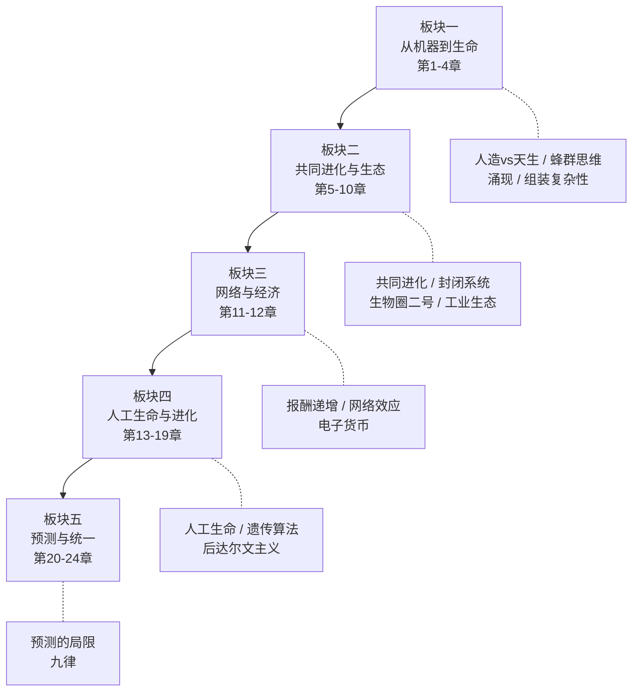
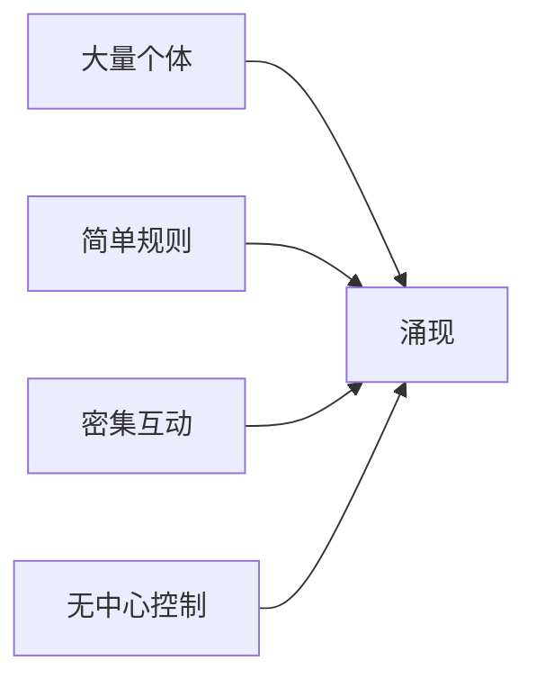

# 失控：机器、社会与经济的新生物学

> [!abstract] 30秒速览
> 凯文·凯利的核心命题：==未来的世界将越来越像一个生物系统，而不是一台机器==。最强大、最持久、最具适应力的系统，不是自上而下设计出来的，而是自下而上"涌现"出来的。从蜂群到互联网，从人工生命到经济体系，"失控"不是混乱，而是通往更高秩序的路径。

---

## 一、元信息速览

| 属性 | 内容 |
|:-----|:-----|
| **书名** | 《失控：机器、社会与经济的新生物学》 |
| **原名** | *Out of Control* |
| **作者** | 凯文·凯利（Kevin Kelly），《连线》杂志创始主编 |
| **首版** | 1994年 |
| **篇幅** | 约73万字（中文版），24章 |
| **类型** | 科学/科普 |

本书写于互联网诞生之初，却预言了众多后来成为现实的趋势：分布式网络、群体智慧、虚拟社区、加密货币、云计算、人工进化等。它不是一本技术手册，而是一部关于**复杂性科学的思想漫游记**。

---

## 二、全书逻辑地图

《失控》的24章有一条清晰的思想主线：==从"机械隐喻"转向"生物隐喻"==。



> [!tip] 核心线索
> **板块一**提出问题（机器 vs 生命），**板块二-三**展开论证（生态与经济），**板块四**深入核心（进化是通用算法），**板块五**收束为统一框架（九律）。

---

## 三、逐章深度拆解

### 3.1 第1章：人造与天生

> [!info] 本章置信度：高

**核心论点：** 人造物与天然物的界限正在消融。未来的技术不是"制造"出来的，而是"生长"出来的。

凯利开篇提出一个第一性原理层面的判断：==21世纪最重要的技术转向，是从机械逻辑转向生物逻辑==。这意味着我们将越来越多地把生命的特质——自我修复、自我复制、自我适应——注入到人造系统中。

传统工程思维是自上而下——先画蓝图，再精确制造。但自然界从不这样工作。一棵树没有蓝图，一个胚胎没有项目经理，它们都是从简单的初始状态"生长"出来的。

> [!example] 费曼式解读
> 想象你要造一座桥。传统方法：请工程师画图纸，工人按图施工。生物方法：你扔一颗"桥种子"到河边，它自己长成桥，哪边受力大就自动加粗，裂缝了自动修复。凯利说的就是这个方向——技术将从"制造范式"走向"培育范式"。

**金句：**
- 机械的与生命的之间的区别，将变得越来越不重要
- 未来的造物将是"生长"出来的，而不是"制造"出来的

---

### 3.2 第2章：蜂群思维

> [!info] 本章置信度：高

**核心论点：** 没有中央控制的分布式系统，可以涌现出超越个体的集体智慧。

这是全书最经典的一章。一只蜜蜂的脑子小得可怜，但一个蜂群却能做出极其精密的决策——选择巢穴位置、分配采蜜路线、调节蜂巢温度。没有任何一只蜂是"领导"，没有蓝图，没有中央处理器。

凯利将这种现象称为"蜂群思维"（Hive Mind）——==整体大于部分之和，集体智慧从个体的简单互动中"涌现"出来==。

蜂群思维的四个特征：
1. **没有强制性的中心控制**
2. **各子单元具有自治性质**
3. **子单元之间高度连接**
4. **点对点的非线性因果关系**

> [!example] 费曼式解读
> 想象一个没有指挥的交响乐团。每个乐手只遵循两条简单规则：（1）听旁边人的音量，自己比他略低一点；（2）如果周围安静了就开始演奏。结果呢？整个乐团竟然能演奏出和谐的交响乐。这就是涌现——没人指挥，但秩序自己出来了。

**关键概念：**
- ==涌现（Emergence）==：整体展现出部分所不具有的性质
- 群体智慧不需要群体中的任何个体是智慧的

---

### 3.3 第3-4章：有心智的机器 & 组装复杂性

> [!info] 本章置信度：高

**核心论点：** 复杂系统不能被设计，只能被"组装"和"培育"。真正的智能来自于大量简单部件的连接。

第3章考察了布鲁克斯（Rodney Brooks）在MIT的机器人实验——布鲁克斯放弃了传统的"先建模再行动"的AI路线，转而造出一群"笨"机器虫，每只只有几条简单规则（碰到障碍就转弯，看到光就走过去）。结果这些"笨"机器虫展现出了惊人的适应性。

第4章进一步追问：复杂性从何而来？答案是——==从简单组件的递归组装中来==。一个单细胞很简单，但当万亿个细胞按照局部规则组装在一起，就"长"出了你的大脑。

> [!important] 关键洞见
> 你无法通过分析一个复杂系统的每个部件来理解整体。一个神经元不包含思想的信息，就像一滴水不包含波浪的信息一样。心智不在任何一个神经元里，它在神经元之间的==连接模式==里。

**关键概念：**
- 自下而上的控制（Bottom-up control）
- 布鲁克斯的"包容架构"（Subsumption Architecture）：让简单层叠加，而非造一个复杂层

---

### 3.4 第5-6章：共同进化 & 自然之流变

> [!info] 本章置信度：高/中

**核心论点：** 进化不是单个物种的独角戏，而是物种之间、物种与环境之间的"共舞"。

第5章引入了==共同进化（Coevolution）==：花进化出鲜艳颜色吸引蜜蜂，蜜蜂进化出更长舌头采更深花蜜，花又进化出更深花管……双方在永无止境的"军备竞赛"中共同塑造彼此。

推广到技术领域：**技术与社会也在共同进化。** 互联网改变了人类社交方式，人类社交需求又反过来塑造了互联网形态。

第6章讨论自然的"流变"本质 [🟡]。自然界看似稳定的生态系统实际上一直在微妙变化。"平衡"是一种幻觉——更准确的描述是"持久的不均衡"。

> [!example] 费曼式解读
> 共同进化就像两个人跳探戈——你不能说是男方带领还是女方带领，因为每一步都是对对方上一步的回应。如果你把其中一个人定格不动，舞蹈就不存在了。

**关键概念：**
- ==共同进化（Coevolution）==：系统各部分互为环境，互相塑造
- ==持久的不均衡（Perpetual disequilibrium）==：真正的稳定不是静止，而是动态平衡
- "自然不是名词，而是动词"

---

### 3.5 第7-10章：控制、封闭系统与生态圈

> [!info] 本章置信度：高

**核心论点：** 真正的控制不是压制，而是引导。封闭系统实验揭示了生态工程的极限——你无法完全控制一个活的系统。

第7章回顾了控制论（Cybernetics）的历史。经典控制论基于负反馈——恒温器感知温度偏差，然后纠正。但凯利指出，生物系统中更重要的是**正反馈**——小的变化被放大，系统被推向新状态。

第8-9章详细讲述了==生物圈二号（Biosphere 2）实验==：位于亚利桑那沙漠中的巨大封闭玻璃建筑，科学家试图在里面重建一个自给自足的微型地球生态系统。结果：氧气含量逐渐下降，二氧化碳飙升，大多数昆虫灭绝，蟑螂和蚂蚁却疯狂繁殖。

> [!warning] 核心教训
> 你可以把所有正确的成分放在一起，但你不能"命令"一个生态系统运转。生态是涌现出来的，不是组装出来的。零件对了不等于系统就对——零件之间的关系才是关键，而这些关系需要时间去自发生长。

第10章将这个教训延伸到工业领域 [🟡]，提出"工业生态学"概念——一个工厂的废料可以成为另一个工厂的原料。

> [!example] 费曼式解读
> 生物圈二号的失败就像你把世界上最好的厨师、最好的食材、最好的厨房放在一起，但规定他们不能交流。结果做出来的不是盛宴，而是一锅乱炖。系统的秘密不在组件里，在组件之间的互动里。

---

### 3.6 第11-12章：网络经济学 & 电子货币

> [!info] 本章置信度：高/中

**核心论点：** 网络经济遵循"报酬递增"法则，去中心化的电子货币将重塑金融体系。

传统经济学建立在"报酬递减"假设上——农场越大，每多种一亩地的收益越低。但网络经济反转了这个逻辑：==网络的价值随着用户数量的增加而呈指数增长==。

网络经济的特征：
1. **赢家通吃** —— 一旦达到临界规模，竞争者几乎无法追赶
2. **免费策略有效** —— 先让用户免费使用以达到临界规模
3. **标准比质量更重要** —— VHS打败了画质更好的Betamax

第12章讨论电子货币 [🟡]。凯利在1994年就预见到去中心化的、基于密码学的货币系统的可能性。

> [!example] 费曼式解读
> 报酬递增就像一个聚会——如果只有3个人去，大家觉得没意思都想走；如果有300人去，每个人都觉得很棒还想拉更多朋友来。网络经济中，"人多"本身就是最大的资产。

**关键概念：**
- ==报酬递增（Increasing returns）==：强者愈强的正反馈循环
- ==网络效应==：用户越多，每个用户获得的价值越大
- 先免费后收费的策略（预见了互联网商业模式）

---

### 3.7 第13-19章：人工生命、人工进化与后达尔文主义

> [!info] 本章置信度：高

**核心论点：** 进化是一种通用算法，可以在任何介质上运行。达尔文的理论可能只是进化故事的一部分。

> [!question] 核心问题
> 生命的本质是什么？它能否在非碳基的介质上实现？

**人工生命实验：** 汤姆·雷（Tom Ray）的==Tierra实验==——在计算机内存中放入能自我复制的程序片段，给它们有限的资源，让它们竞争。结果：这些数字"生物"自发地进化出了寄生虫、超级寄生虫、互利共生体，甚至出现了"性"（交换代码片段）。没有人编程让它们这样做——进化自己在硅基世界里涌现了。

**人工进化与遗传算法：** 核心思想是——==你不需要理解问题就能解决问题，只要你能定义什么是"好的"结果，然后让进化去搜索==。工程师开始用进化算法来设计天线、电路、机翼——几千代之后，进化出的设计往往比人类工程师更优。

**后达尔文主义：** 挑战纯粹达尔文主义的几种观点：

| 理论 | 提出者 | 核心观点 |
|:-----|:-------|:---------|
| 自组织理论 | 斯图亚特·考夫曼 | 秩序可以"免费"涌现，不需要选择压力 |
| 间断平衡 | 古尔德等 | 进化不是渐进的，而是长期稳定+突然跃变 |
| 共生进化 | 林恩·马古利斯 | 进化的重要驱动力不是竞争，而是合作 |

> [!example] 费曼式解读
> 传统工程是"我知道答案，然后制造出来"。进化式工程是"我不知道答案，但我知道什么是好答案——让大自然帮我找"。就像走迷宫：传统方法是画全图再找路线；进化方法是放进一百万只蚂蚁，活着走出来的那只蚂蚁的路线就是答案。

**关键概念：**
- ==人工生命（A-Life）==："生命"是一种可以在任何介质上运行的过程
- ==遗传算法==：用进化来搜索解空间
- 考夫曼的"免费的秩序"（Order for free）

---

### 3.8 第20-24章：预测、整体与九律

> [!info] 本章置信度：高/中

**核心论点：** 复杂系统的行为可以被部分预测但无法被完全控制。全书精华浓缩为"九律"。

第20章 [🟡]：复杂系统有"可预测的不可预测性"——你无法预测哪只蚂蚁会去哪，但你可以预测蚁群会找到最短路径。

第22章 [🟡]：探索利用大量简单预测器的集合来提高预测准确度，与后来的"集成学习"和"预测市场"高度吻合。

> [!tip] 九律（Nine Laws of God）——全书思想结晶

1. **分布式存在（Distribute being）**
   没有中心，把权力和功能分散到每一个节点
2. **自下而上的控制（Control from the bottom up）**
   全局秩序从局部规则中涌现
3. **报酬递增（Cultivate increasing returns）**
   利用正反馈循环，让雪球自己越滚越大
4. **模块化生长（Grow by chunking）**
   先让每个模块独立运转，再将它们连接
5. **边界最大化（Maximize the fringes）**
   创新发生在边缘，而非中心。鼓励多样性
6. **鼓励犯错（Honor your errors）**
   错误是进化的原料。容错不是软弱，而是生存策略
7. **不求最优但求多目标（Pursue no optima; have multiple goals）**
   多目标优化比单目标优化更能保证长期生存
8. **寻求持久的不均衡（Seek persistent disequilibrium）**
   真正的活力来自"差一点就失衡"的状态
9. **变自生变（Change changes itself）**
   最深层的适应是改变适应方式本身

> [!example] 费曼式解读
> 想象你在经营一个城市。传统方法是市长规划一切（中心控制）。凯利的方法：别当市长了，当"园丁"——撒种子（分布式）、施肥浇水（报酬递增）、允许杂草生长（鼓励犯错）、让花园自己找到形态（自下而上）。最好的城市不是规划出来的，是长出来的。

---

## 四、核心框架提炼

### 框架一：生物逻辑 vs 机械逻辑

| 维度 | 机械逻辑 | 生物逻辑 |
|:-----|:---------|:---------|
| 控制方式 | 自上而下 | 自下而上 |
| 设计方式 | 先规划后执行 | 先涌现后优化 |
| 对错误的态度 | 消灭错误 | 利用错误 |
| 最优策略 | 单目标最大化 | 多目标平衡 |
| 稳定状态 | 均衡 | 持久的不均衡 |
| 变化方式 | 线性、可预测 | 非线性、涌现 |

> [!abstract] 核心主张
> 20世纪是机械逻辑的世纪，21世纪将是生物逻辑的世纪。

### 框架二：涌现的四要素



这个框架可以解释蜂群、互联网、市场经济、大脑神经网络等几乎所有复杂系统。

### 框架三：进化的普适性

只要满足三个条件——==变异==（产生多样性）、==选择==（淘汰不适者）、==遗传==（保留好的特征）——进化就会自发运行。它可以在DNA上运行，也可以在代码、模因（文化基因）、甚至思想上运行。

---

## 五、批判性思考

### 凯利说对了什么？

> [!success] 验证的预言
> 1. **分布式网络** —— 互联网成为去中心化的全球基础设施
> 2. **群体智慧** —— 维基百科、开源软件、预测市场
> 3. **进化算法** —— 机器学习与神经架构搜索（NAS）
> 4. **电子货币** —— 比特币在2009年诞生

### 凯利高估了什么？

> [!warning] 需要警惕的过度推广
> 1. **"失控"的浪漫化** —— 不是所有去中心化系统都能产生好的结果。加密货币市场的混乱、社交媒体的假信息泛滥，说明"失控"也可能导向深渊
> 2. **对自组织的过度信任** —— 没有适当的约束和激励结构，涌现出来的可能是混乱而非秩序
> 3. **后达尔文主义证据不足** —— 考夫曼的自组织理论在实证层面仍有争议

### 需要补充的视角

> [!note] 补充思考
> - **规模的局限**：小团队、小公司用"蜂群思维"可能适得其反
> - **效率与韧性的权衡**：工厂流水线不需要"涌现"
> - **时代局限**：今天的AI（如大语言模型）既不是纯粹的自上而下设计，也不是纯粹的自下而上涌现，而是两者的混合

---

## 六、行动清单

### 思维层面

- [ ] **练习"生物隐喻"思维** —— 遇到复杂问题时，先问自己："如果这不是一台机器，而是一个生态系统，我会怎么想？"
- [ ] **容忍不确定性** —— 停止追求"完美方案"，接受"足够好 + 快速迭代"
- [ ] **关注关系而非组件** —— 分析系统时，注意力从"有哪些部分"转移到"部分之间如何互动"

### 管理/创业层面

- [ ] **从"指挥官"变成"园丁"** —— 创造让好东西自发生长的环境
- [ ] **设计简单规则而非复杂流程** —— 蜂群靠几条简单规则而非千页手册
- [ ] **保护边缘创新** —— 给"异类"留空间

### 学习层面

- [ ] **用进化思维解决问题** —— 快速生成多个方案，测试，选出最好的，迭代
- [ ] **建立概念网络** —— 在概念之间建立连接

---

## 七、延伸阅读路线图

### 同一作者的进化路线

```
[[失控 - 凯文·凯利]]（1994）→ 《新经济新规则》（1998）→ 《科技想要什么》（2010）→ 《必然》（2016）
```

### 复杂性科学方向

- 梅拉妮·米歇尔《复杂》—— 复杂性科学最佳入门
- 斯图亚特·考夫曼《宇宙为家》—— 自组织理论原始文献
- 史蒂芬·约翰逊《涌现》—— 专门讨论涌现现象

### 进化与生物方向

- 理查德·道金斯《自私的基因》—— 经典达尔文主义视角
- 林恩·马古利斯《生命是什么》—— 共生进化的视角

### 网络与经济方向

- 阿尔伯特-拉斯洛·巴拉巴西《链接》—— 网络科学
- 布莱恩·阿瑟《技术的本质》—— 技术进化论

---

## 八、费曼终极检验

> [!quote] 如果要向一个10岁小孩解释这本书……
>
> "你知道蚂蚁吗？一只蚂蚁很笨，连自己往哪走都搞不清楚。但是一百万只蚂蚁在一起，就能建造比人类建筑还精妙的蚁巢，能找到几公里外的食物，还能打赢比自己大一百倍的虫子。
>
> 没有哪只蚂蚁是老板，没有哪只蚂蚁画了蚁巢的图纸。它们每一只只会做几件简单的事——碰到食物就搬，碰到同伴就交换信息，碰到危险就释放气味。但这几件简单的事加在一起，就变成了一个超级聪明的整体。
>
> 这本书说的就是：未来最厉害的技术、最成功的公司、最聪明的机器，都会像蚂蚁群一样运作——没有老板，没有蓝图，让很多很多简单的小东西自己组合在一起，自动长出聪明的大东西。
>
> 你的大脑也是这样工作的！没有哪个脑细胞是'你'，但一千亿个脑细胞一起工作，'你'就出现了。这就叫'失控'——看起来没人控制，实际上产生了最好的控制。"

---

## 九、自检报告

### 完整性自检

- [x] 第1章：人造与天生
- [x] 第2章：蜂群思维
- [x] 第3章：有心智的机器
- [x] 第4章：组装复杂性
- [x] 第5章：共同进化
- [x] 第6章：自然之流变
- [x] 第7章：控制的兴起
- [x] 第8-9章：封闭系统 / 冒出的生态圈
- [x] 第10章：工业生态学
- [x] 第11章：网络经济学
- [x] 第12章：电子货币
- [x] 第13章：上帝的游戏
- [x] 第14章：在形式的图书馆中
- [x] 第15章：人工进化
- [x] 第16-18章：控制的未来 / 开放的宇宙 / 有组织的变化之架构
- [x] 第19章：后达尔文主义
- [x] 第20章：沉睡的蝴蝶
- [x] 第21章：自我赢取的秩序
- [x] 第22章：预测机器
- [x] 第23章：整体、空洞、以及空间
- [x] 第24章：九律

### 幻觉自检报告

| 标记 | 出现次数 | 说明 |
|:-----|:---------|:-----|
| [🟡] | 4处 | 大致正确但细节可能有偏差 |
| [🔴待验证] | 0处 | — |

> [!caution] 建议用户优先核实
> 1. 生物圈二号实验的具体数据（氧气下降幅度等）
> 2. 汤姆·雷的Tierra实验的具体细节
> 3. "九律"的精确中文翻译（不同译本可能有差异）

### 整体可靠性评级

> [!success] ⭐⭐⭐ 高
> 本书是广为人知的经典著作，核心论点、主要案例和思想框架均在可靠记忆范围内。少量标 [🟡] 之处涉及具体细节层面的模糊，不影响核心内容的准确性。
